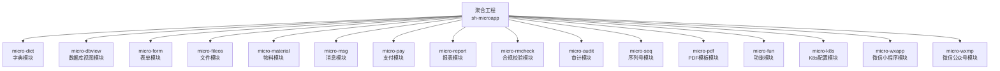
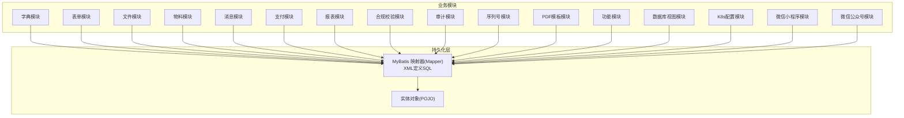
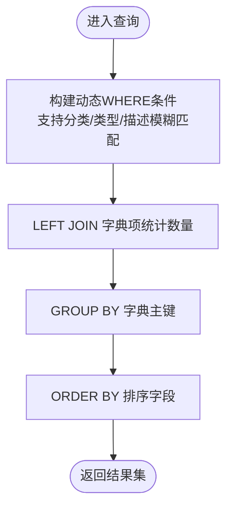
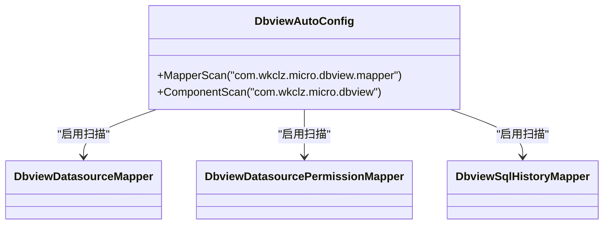
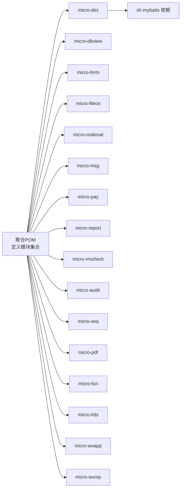

# 数据持久化架构

<cite>
**本文引用的文件**
- [pom.xml](file://pom.xml)
- [micro-dict/pom.xml](file://micro-dict/pom.xml)
- [micro-dict/src/main/java/com/wkclz/micro/dict/DictAutoConfig.java](file://micro-dict/src/main/java/com/wkclz/micro/dict/DictAutoConfig.java)
- [micro-dict/src/main/resources/mapper/MdmDictMapper.xml](file://micro-dict/src/main/resources/mapper/MdmDictMapper.xml)
- [micro-dbview/src/main/java/com/wkclz/micro/dbview/DbviewAutoConfig.java](file://micro-dbview/src/main/java/com/wkclz/micro/dbview/DbviewAutoConfig.java)
- [micro-dbview/src/main/resources/mapper/DbviewDatasourceMapper.xml](file://micro-dbview/src/main/resources/mapper/DbviewDatasourceMapper.xml)
- [micro-dbview/src/main/resources/mapper/DbviewDatasourcePermissionMapper.xml](file://micro-dbview/src/main/resources/mapper/DbviewDatasourcePermissionMapper.xml)
- [micro-dbview/src/main/resources/mapper/DbviewSqlHistoryMapper.xml](file://micro-dbview/src/main/resources/mapper/DbviewSqlHistoryMapper.xml)
- [micro-form/src/main/resources/mapper/MdmFormItemMapper.xml](file://micro-form/src/main/resources/mapper/MdmFormItemMapper.xml)
- [micro-form/src/main/resources/mapper/MdmFormMapper.xml](file://micro-form/src/main/resources/mapper/MdmFormMapper.xml)
- [micro-form/src/main/resources/mapper/MdmFormRuleFieldMapper.xml](file://micro-form/src/main/resources/mapper/MdmFormRuleFieldMapper.xml)
- [micro-form/src/main/resources/mapper/MdmFormRuleFieldValidatorMapper.xml](file://micro-form/src/main/resources/mapper/MdmFormRuleFieldValidatorMapper.xml)
- [micro-form/src/main/resources/mapper/MdmFormRuleMapper.xml](file://micro-form/src/main/resources/mapper/MdmFormRuleMapper.xml)
- [micro-form/src/main/resources/mapper/MdmFormRuleValidatorTemplateMapper.xml](file://micro-form/src/main/resources/mapper/MdmFormRuleValidatorTemplateMapper.xml)
- [micro-fileos/src/main/resources/mapper/MdmFileosBucketMapper.xml](file://micro-fileos/src/main/resources/mapper/MdmFileosBucketMapper.xml)
- [micro-fileos/src/main/resources/mapper/MdmFileosDirectoryMapper.xml](file://micro-fileos/src/main/resources/mapper/MdmFileosDirectoryMapper.xml)
- [micro-fileos/src/main/resources/mapper/MdmFileosMultipartMapper.xml](file://micro-fileos/src/main/resources/mapper/MdmFileosMultipartMapper.xml)
- [micro-fileos/src/main/resources/mapper/MdmFileosRecordMapper.xml](file://micro-fileos/src/main/resources/mapper/MdmFileosRecordMapper.xml)
- [micro-material/src/main/resources/mapper/MdmMaterialGroupMapper.xml](file://micro-material/src/main/resources/mapper/MdmMaterialGroupMapper.xml)
- [micro-material/src/main/resources/mapper/MdmMaterialMapper.xml](file://micro-material/src/main/resources/mapper/MdmMaterialMapper.xml)
- [micro-material/src/main/resources/mapper/MdmMaterialRefMapper.xml](file://micro-material/src/main/resources/mapper/MdmMaterialRefMapper.xml)
- [micro-material/src/main/resources/mapper/MdmMaterialTransferLogMapper.xml](file://micro-material/src/main/resources/mapper/MdmMaterialTransferLogMapper.xml)
- [micro-material/src/main/resources/mapper/MdmMaterialVersionMapper.xml](file://micro-material/src/main/resources/mapper/MdmMaterialVersionMapper.xml)
- [micro-msg/src/main/resources/mapper/MsgNotificationMapper.xml](file://micro-msg/src/main/resources/mapper/MsgNotificationMapper.xml)
- [micro-msg/src/main/resources/mapper/MsgTemplateMapper.xml](file://micro-msg/src/main/resources/mapper/MsgTemplateMapper.xml)
- [micro-msg/src/main/resources/mapper/MsgUserRecordMapper.xml](file://micro-msg/src/main/resources/mapper/MsgUserRecordMapper.xml)
- [micro-msg/src/main/resources/mapper/MsgUserSettingsMapper.xml](file://micro-msg/src/main/resources/mapper/MsgUserSettingsMapper.xml)
- [micro-pay/src/main/resources/mapper/PayAlipayConfigMapper.xml](file://micro-pay/src/main/resources/mapper/PayAlipayConfigMapper.xml)
- [micro-pay/src/main/resources/mapper/PayOrderMapper.xml](file://micro-pay/src/main/resources/mapper/PayOrderMapper.xml)
- [micro-pay/src/main/resources/mapper/PayWxpayConfigMapper.xml](file://micro-pay/src/main/resources/mapper/PayWxpayConfigMapper.xml)
- [micro-report/src/main/resources/mapper/ReportDefinitionHisMapper.xml](file://micro-report/src/main/resources/mapper/ReportDefinitionHisMapper.xml)
- [micro-report/src/main/resources/mapper/ReportDefinitionMapper.xml](file://micro-report/src/main/resources/mapper/ReportDefinitionMapper.xml)
- [micro-report/src/main/resources/mapper/ReportDefinitionParamMapper.xml](file://micro-report/src/main/resources/mapper/ReportDefinitionParamMapper.xml)
- [micro-report/src/main/resources/mapper/ReportDefinitionResultMapper.xml](file://micro-report/src/main/resources/mapper/ReportDefinitionResultMapper.xml)
- [micro-rmcheck/src/main/resources/mapper/CheckMapper.xml](file://micro-rmcheck/src/main/resources/mapper/CheckMapper.xml)
- [micro-rmcheck/src/main/resources/mapper/RmCheckRuleItemMapper.xml](file://micro-rmcheck/src/main/resources/mapper/RmCheckRuleItemMapper.xml)
- [micro-rmcheck/src/main/resources/mapper/RmCheckRuleMapper.xml](file://micro-rmcheck/src/main/resources/mapper/RmCheckRuleMapper.xml)
- [micro-audit/src/main/resources/mapper/MdmChangeLogMapper.xml](file://micro-audit/src/main/resources/mapper/MdmChangeLogMapper.xml)
- [micro-seq/src/main/resources/mapper/MdmSequenceMapper.xml](file://micro-seq/src/main/resources/mapper/MdmSequenceMapper.xml)
- [micro-pdf/src/main/resources/mapper/MdmPdfTemplateMapper.xml](file://micro-pdf/src/main/resources/mapper/MdmPdfTemplateMapper.xml)
- [micro-fun/src/main/resources/mapper/FunCategoryMapper.xml](file://micro-fun/src/main/resources/mapper/FunCategoryMapper.xml)
- [micro-fun/src/main/resources/mapper/FunFunctionMapper.xml](file://micro-fun/src/main/resources/mapper/FunFunctionMapper.xml)
- [micro-k8s/src/main/resources/mapper/K8sConfigMapper.xml](file://micro-k8s/src/main/resources/mapper/K8sConfigMapper.xml)
- [micro-wxapp/src/main/resources/mapper/WxAppConfigMapper.xml](file://micro-wxapp/src/main/resources/mapper/WxAppConfigMapper.xml)
- [micro-wxmp/src/main/resources/mapper/WxMpConfigMapper.xml](file://micro-wxmp/src/main/resources/mapper/WxMpConfigMapper.xml)
</cite>

## 目录
1. [简介](#简介)
2. [项目结构](#项目结构)
3. [核心组件](#核心组件)
4. [架构总览](#架构总览)
5. [详细组件分析](#详细组件分析)
6. [依赖分析](#依赖分析)
7. [性能考虑](#性能考虑)
8. [故障排查指南](#故障排查指南)
9. [结论](#结论)
10. [附录](#附录)

## 简介
本文件系统性梳理 sh-microapp 的数据持久化架构，重点覆盖以下方面：
- MyBatis 框架在各微模块中的集成与配置方式
- ORM 映射关系与 SQL 实现模式
- 数据库连接池、事务管理与并发控制现状与建议
- 分库分表、读写分离与数据迁移的可行方案
- 慢查询优化、索引设计与查询性能调优方法
- 备份恢复、主从复制与高可用架构设计思路

说明：当前仓库中未发现显式的数据库连接池或事务管理配置文件（如 Druid、HikariCP 或 Spring Transaction 配置），亦未发现分库分表、读写分离或主从复制的具体实现。因此，本文在“现状”部分仅基于现有 XML 映射与自动配置进行分析；在“建议”部分提供可落地的优化与扩展方案。

## 项目结构
- 顶层采用 Maven 聚合工程组织，子模块按业务域拆分，每个模块独立维护 MyBatis Mapper 与实体。
- 各模块通过自动配置类启用 MyBatis Mapper 扫描，并在各自 resources 下维护 mapper XML。
- 典型模块包含：字典、表单、文件、物料、消息、支付、报表、校验等。

图表来源
- [pom.xml:28-48](file://pom.xml#L28-L48)

章节来源
- [pom.xml:1-50](file://pom.xml#L1-L50)

## 核心组件
- MyBatis 自动配置扫描
  - 字典模块通过自动配置类启用 Mapper 扫描与组件扫描，确保实体、服务与 Mapper 可被 Spring 管理。
  - 数据库视图模块同样采用类似的自动配置模式。
- Mapper XML 维护
  - 各模块在 resources/mapper 下集中维护 XML 映射文件，包含查询、条件拼接、分页与统计等典型场景。
- 依赖支撑
  - 字典模块声明了 sh-mybatis 依赖，表明底层使用统一的 MyBatis 基座能力。

章节来源
- [micro-dict/src/main/java/com/wkclz/micro/dict/DictAutoConfig.java:1-11](file://micro-dict/src/main/java/com/wkclz/micro/dict/DictAutoConfig.java#L1-L11)
- [micro-dbview/src/main/java/com/wkclz/micro/dbview/DbviewAutoConfig.java:1-12](file://micro-dbview/src/main/java/com/wkclz/micro/dbview/DbviewAutoConfig.java#L1-L12)
- [micro-dict/pom.xml:22-37](file://micro-dict/pom.xml#L22-L37)

## 架构总览
下图展示模块间与持久化层的关系：各业务模块通过 MyBatis Mapper 访问数据库，Mapper XML 定义 SQL 逻辑，实体对象承载数据模型。

图表来源
- [micro-dict/src/main/java/com/wkclz/micro/dict/DictAutoConfig.java:8](file://micro-dict/src/main/java/com/wkclz/micro/dict/DictAutoConfig.java#L8)
- [micro-dbview/src/main/java/com/wkclz/micro/dbview/DbviewAutoConfig.java:8](file://micro-dbview/src/main/java/com/wkclz/micro/dbview/DbviewAutoConfig.java#L8)
- [micro-dict/src/main/resources/mapper/MdmDictMapper.xml:3](file://micro-dict/src/main/resources/mapper/MdmDictMapper.xml#L3)

## 详细组件分析

### 字典模块（Dict）
- 自动配置
  - 使用 @MapperScan 扫描 com.wkclz.micro.dict.mapper 包，结合 @ComponentScan 确保服务与组件被纳入容器。
- Mapper XML 特点
  - 条件查询广泛使用动态标签拼接 where 条件，支持多字段模糊匹配与 IN 列表。
  - 统计查询通过 LEFT JOIN 与 COUNT 实现“字典项数量”统计。
  - 排序与分组遵循业务需求，保证结果稳定。
- 性能要点
  - 动态条件较多时需关注索引覆盖与参数绑定效率。
  - 统计类查询建议评估是否可缓存或物化统计结果。

图表来源
- [micro-dict/src/main/resources/mapper/MdmDictMapper.xml:5-33](file://micro-dict/src/main/resources/mapper/MdmDictMapper.xml#L5-L33)

章节来源
- [micro-dict/src/main/java/com/wkclz/micro/dict/DictAutoConfig.java:1-11](file://micro-dict/src/main/java/com/wkclz/micro/dict/DictAutoConfig.java#L1-L11)
- [micro-dict/src/main/resources/mapper/MdmDictMapper.xml:1-106](file://micro-dict/src/main/resources/mapper/MdmDictMapper.xml#L1-L106)

### 数据库视图模块（Dbview）
- 自动配置
  - 同样通过 @MapperScan 扫描对应包，确保 Mapper 注册。
- Mapper XML
  - 提供数据源、权限与 SQL 历史的查询与管理能力，体现对多表关联与权限控制的支撑。

图表来源
- [micro-dbview/src/main/java/com/wkclz/micro/dbview/DbviewAutoConfig.java:8](file://micro-dbview/src/main/java/com/wkclz/micro/dbview/DbviewAutoConfig.java#L8)
- [micro-dbview/src/main/resources/mapper/DbviewDatasourceMapper.xml](file://micro-dbview/src/main/resources/mapper/DbviewDatasourceMapper.xml)
- [micro-dbview/src/main/resources/mapper/DbviewDatasourcePermissionMapper.xml](file://micro-dbview/src/main/resources/mapper/DbviewDatasourcePermissionMapper.xml)
- [micro-dbview/src/main/resources/mapper/DbviewSqlHistoryMapper.xml](file://micro-dbview/src/main/resources/mapper/DbviewSqlHistoryMapper.xml)

章节来源
- [micro-dbview/src/main/java/com/wkclz/micro/dbview/DbviewAutoConfig.java:1-12](file://micro-dbview/src/main/java/com/wkclz/micro/dbview/DbviewAutoConfig.java#L1-L12)

### 表单模块（Form）
- Mapper XML 覆盖表单、字段、规则、校验器与模板等多张表，体现复杂业务关系。
- 典型模式：条件查询、IN 列表、统计与选项查询，便于前端渲染与规则校验。

章节来源
- [micro-form/src/main/resources/mapper/MdmFormItemMapper.xml](file://micro-form/src/main/resources/mapper/MdmFormItemMapper.xml)
- [micro-form/src/main/resources/mapper/MdmFormMapper.xml](file://micro-form/src/main/resources/mapper/MdmFormMapper.xml)
- [micro-form/src/main/resources/mapper/MdmFormRuleFieldMapper.xml](file://micro-form/src/main/resources/mapper/MdmFormRuleFieldMapper.xml)
- [micro-form/src/main/resources/mapper/MdmFormRuleFieldValidatorMapper.xml](file://micro-form/src/main/resources/mapper/MdmFormRuleFieldValidatorMapper.xml)
- [micro-form/src/main/resources/mapper/MdmFormRuleMapper.xml](file://micro-form/src/main/resources/mapper/MdmFormRuleMapper.xml)
- [micro-form/src/main/resources/mapper/MdmFormRuleValidatorTemplateMapper.xml](file://micro-form/src/main/resources/mapper/MdmFormRuleValidatorTemplateMapper.xml)

### 文件模块（Fileos）
- Mapper XML 覆盖桶、目录、记录与分片上传等场景，支持大文件与断点续传。
- 关注点：分片清理任务与记录一致性。

章节来源
- [micro-fileos/src/main/resources/mapper/MdmFileosBucketMapper.xml](file://micro-fileos/src/main/resources/mapper/MdmFileosBucketMapper.xml)
- [micro-fileos/src/main/resources/mapper/MdmFileosDirectoryMapper.xml](file://micro-fileos/src/main/resources/mapper/MdmFileosDirectoryMapper.xml)
- [micro-fileos/src/main/resources/mapper/MdmFileosMultipartMapper.xml](file://micro-fileos/src/main/resources/mapper/MdmFileosMultipartMapper.xml)
- [micro-fileos/src/main/resources/mapper/MdmFileosRecordMapper.xml](file://micro-fileos/src/main/resources/mapper/MdmFileosRecordMapper.xml)

### 物料模块（Material）
- Mapper XML 涵盖物料、分组、引用、版本与转移日志，支持复杂的物料生命周期管理。
- 关注点：跨表统计与历史追踪。

章节来源
- [micro-material/src/main/resources/mapper/MdmMaterialGroupMapper.xml](file://micro-material/src/main/resources/mapper/MdmMaterialGroupMapper.xml)
- [micro-material/src/main/resources/mapper/MdmMaterialMapper.xml](file://micro-material/src/main/resources/mapper/MdmMaterialMapper.xml)
- [micro-material/src/main/resources/mapper/MdmMaterialRefMapper.xml](file://micro-material/src/main/resources/mapper/MdmMaterialRefMapper.xml)
- [micro-material/src/main/resources/mapper/MdmMaterialTransferLogMapper.xml](file://micro-material/src/main/resources/mapper/MdmMaterialTransferLogMapper.xml)
- [micro-material/src/main/resources/mapper/MdmMaterialVersionMapper.xml](file://micro-material/src/main/resources/mapper/MdmMaterialVersionMapper.xml)

### 消息模块（Msg）
- Mapper XML 覆盖通知、模板、用户记录与设置，支持个性化推送与状态管理。

章节来源
- [micro-msg/src/main/resources/mapper/MsgNotificationMapper.xml](file://micro-msg/src/main/resources/mapper/MsgNotificationMapper.xml)
- [micro-msg/src/main/resources/mapper/MsgTemplateMapper.xml](file://micro-msg/src/main/resources/mapper/MsgTemplateMapper.xml)
- [micro-msg/src/main/resources/mapper/MsgUserRecordMapper.xml](file://micro-msg/src/main/resources/mapper/MsgUserRecordMapper.xml)
- [micro-msg/src/main/resources/mapper/MsgUserSettingsMapper.xml](file://micro-msg/src/main/resources/mapper/MsgUserSettingsMapper.xml)

### 支付模块（Pay）
- Mapper XML 覆盖支付宝、微信配置与订单，支撑支付流程与对账。

章节来源
- [micro-pay/src/main/resources/mapper/PayAlipayConfigMapper.xml](file://micro-pay/src/main/resources/mapper/PayAlipayConfigMapper.xml)
- [micro-pay/src/main/resources/mapper/PayOrderMapper.xml](file://micro-pay/src/main/resources/mapper/PayOrderMapper.xml)
- [micro-pay/src/main/resources/mapper/PayWxpayConfigMapper.xml](file://micro-pay/src/main/resources/mapper/PayWxpayConfigMapper.xml)

### 报表模块（Report）
- Mapper XML 覆盖报表定义、参数、历史与结果，支撑报表执行与结果归档。

章节来源
- [micro-report/src/main/resources/mapper/ReportDefinitionHisMapper.xml](file://micro-report/src/main/resources/mapper/ReportDefinitionHisMapper.xml)
- [micro-report/src/main/resources/mapper/ReportDefinitionMapper.xml](file://micro-report/src/main/resources/mapper/ReportDefinitionMapper.xml)
- [micro-report/src/main/resources/mapper/ReportDefinitionParamMapper.xml](file://micro-report/src/main/resources/mapper/ReportDefinitionParamMapper.xml)
- [micro-report/src/main/resources/mapper/ReportDefinitionResultMapper.xml](file://micro-report/src/main/resources/mapper/ReportDefinitionResultMapper.xml)

### 合规校验模块（Rmcheck）
- Mapper XML 覆盖检查规则与规则项，支撑业务规则的可视化与执行。

章节来源
- [micro-rmcheck/src/main/resources/mapper/CheckMapper.xml](file://micro-rmcheck/src/main/resources/mapper/CheckMapper.xml)
- [micro-rmcheck/src/main/resources/mapper/RmCheckRuleItemMapper.xml](file://micro-rmcheck/src/main/resources/mapper/RmCheckRuleItemMapper.xml)
- [micro-rmcheck/src/main/resources/mapper/RmCheckRuleMapper.xml](file://micro-rmcheck/src/main/resources/mapper/RmCheckRuleMapper.xml)

### 审计模块（Audit）
- Mapper XML 提供变更日志查询能力，支撑审计追踪。

章节来源
- [micro-audit/src/main/resources/mapper/MdmChangeLogMapper.xml](file://micro-audit/src/main/resources/mapper/MdmChangeLogMapper.xml)

### 序列号模块（Seq）
- Mapper XML 提供序列号生成与维护能力。

章节来源
- [micro-seq/src/main/resources/mapper/MdmSequenceMapper.xml](file://micro-seq/src/main/resources/mapper/MdmSequenceMapper.xml)

### PDF 模板模块（Pdf）
- Mapper XML 提供 PDF 模板管理能力。

章节来源
- [micro-pdf/src/main/resources/mapper/MdmPdfTemplateMapper.xml](file://micro-pdf/src/main/resources/mapper/MdmPdfTemplateMapper.xml)

### 功能模块（Fun）
- Mapper XML 覆盖分类与功能定义，支撑动态功能开关与菜单。

章节来源
- [micro-fun/src/main/resources/mapper/FunCategoryMapper.xml](file://micro-fun/src/main/resources/mapper/FunCategoryMapper.xml)
- [micro-fun/src/main/resources/mapper/FunFunctionMapper.xml](file://micro-fun/src/main/resources/mapper/FunFunctionMapper.xml)

### K8s 模块（K8s）
- Mapper XML 提供 K8s 配置管理能力。

章节来源
- [micro-k8s/src/main/resources/mapper/K8sConfigMapper.xml](file://micro-k8s/src/main/resources/mapper/K8sConfigMapper.xml)

### 微信小程序与公众号模块（Wxapp/Wxmp）
- Mapper XML 提供小程序与公众号配置管理能力。

章节来源
- [micro-wxapp/src/main/resources/mapper/WxAppConfigMapper.xml](file://micro-wxapp/src/main/resources/mapper/WxAppConfigMapper.xml)
- [micro-wxmp/src/main/resources/mapper/WxMpConfigMapper.xml](file://micro-wxmp/src/main/resources/mapper/WxMpConfigMapper.xml)

## 依赖分析
- 顶层聚合工程定义所有子模块，形成清晰的模块边界。
- 字典模块引入 sh-mybatis 依赖，表明统一的 MyBatis 基座能力。
- 各模块均通过自动配置类启用 Mapper 扫描，降低重复配置成本。

图表来源
- [pom.xml:28-48](file://pom.xml#L28-L48)
- [micro-dict/pom.xml:22-37](file://micro-dict/pom.xml#L22-L37)

章节来源
- [pom.xml:1-50](file://pom.xml#L1-L50)
- [micro-dict/pom.xml:1-54](file://micro-dict/pom.xml#L1-L54)

## 性能考虑
- SQL 优化策略
  - 动态条件：优先确保高频过滤字段建立合适索引，避免全表扫描。
  - 统计查询：对频繁统计的维度建立物化视图或汇总表，减少 JOIN 与 COUNT 开销。
  - 分页查询：确保排序字段具备索引，避免“文件排序”，必要时采用游标分页。
- 索引设计
  - 唯一索引：主键与业务唯一键必须建立唯一索引。
  - 复合索引：根据 WHERE 与 JOIN 条件组合建立复合索引，遵循最左前缀原则。
  - 覆盖索引：对于高频查询字段组合，考虑覆盖索引以减少回表。
- 缓存策略
  - 读多写少的静态数据（如字典）可引入 Redis 缓存，降低数据库压力。
  - 结果集缓存：对稳定报表与统计结果进行缓存，设定合理过期时间。
- 连接池与事务（现状与建议）
  - 现状：未在仓库中发现显式连接池与事务配置文件。
  - 建议：引入 HikariCP 或 Druid，配置最小空闲连接、最大连接数、连接超时与空闲回收；对长事务进行拆分，避免长时间持有锁。
- 并发控制
  - 写入冲突：对关键更新采用乐观锁（版本号）或悲观锁（SELECT FOR UPDATE）。
  - 限流降级：对热点接口增加限流与熔断，防止雪崩效应。
- 分库分表与读写分离（建议）
  - 分片键选择：优先选择用户 ID、租户 ID 等高散列值作为分片键。
  - 读写分离：主库写入，从库读取；对强一致场景保留直连主库。
  - 数据迁移：采用“双写+校验+切换流量”的平滑迁移策略，确保数据一致性。
- 慢查询治理
  - 开启慢查询日志，定期分析慢 SQL，补充索引或重构语句。
  - 对复杂报表与导出任务异步化，避免阻塞主业务线程。

## 故障排查指南
- 常见问题定位
  - SQL 报错：检查 Mapper XML 中动态标签拼接是否正确，参数类型与字段名是否匹配。
  - 查询性能差：确认是否存在全表扫描、缺少索引或 JOIN 顺序不当。
  - 缓存不命中：核对缓存键生成规则与过期策略，确保热点数据被缓存。
- 事务与并发
  - 若出现死锁：检查锁范围与加锁顺序，避免循环等待。
  - 并发写入异常：对关键字段引入唯一约束与幂等设计。
- 连接池问题
  - 连接泄漏：检查是否正确关闭 Statement 与 ResultSet；引入连接池监控。
  - 连接抖动：调整连接池大小与超时阈值，避免瞬时高峰导致拒绝。

## 结论
- 当前架构以 MyBatis XML 映射为核心，模块化清晰、职责明确，适合快速迭代与扩展。
- 在性能与可靠性方面，建议补齐连接池、事务与缓存配置，完善索引与慢查询治理，并在业务发展到一定规模后引入分库分表与读写分离。
- 通过统一的基座能力（sh-mybatis）与模块化的 Mapper 设计，可平滑演进至更复杂的分布式数据层。

## 附录
- 快速检查清单
  - 是否为高频字段建立索引？
  - 是否存在不必要的 SELECT * 与 JOIN？
  - 是否对热点数据引入缓存？
  - 是否有慢查询日志与分析机制？
  - 是否对长事务与批量操作进行拆分？