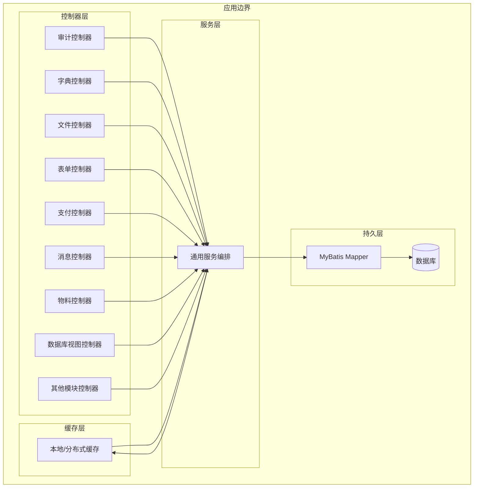
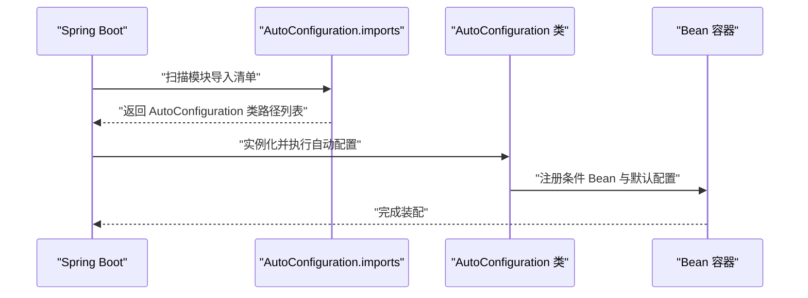
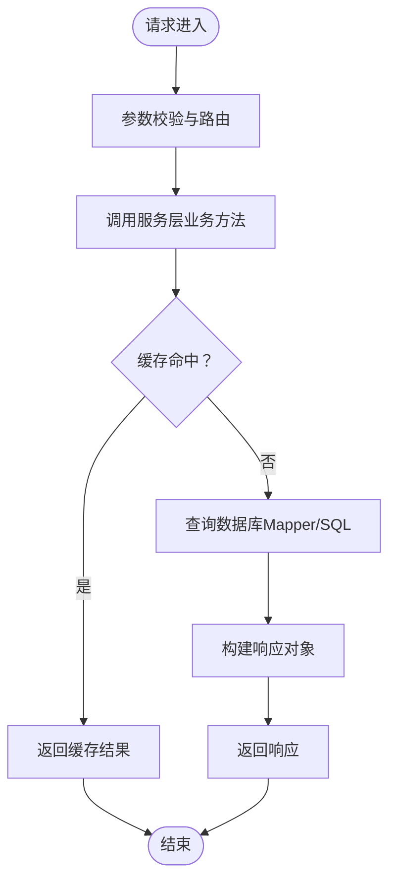
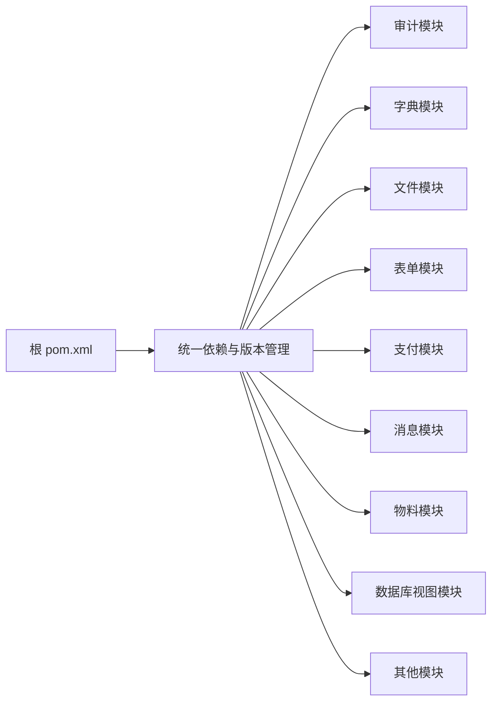

# 架构设计

<cite>
**本文引用的文件**
- [pom.xml](file://pom.xml)
- [CONTEXT.md](file://CONTEXT.md)
- [README.md](file://README.md)
- [AuditAutoConfig.java](file://micro-audit/src/main/java/com/wkclz/micro/audit/AuditAutoConfig.java)
- [AutoTestAutoConfig.java](file://micro-autotest/src/main/java/com/wkclz/auto/AutoTestAutoConfig.java)
- [DbviewAutoConfig.java](file://micro-dbview/src/main/java/com/wkclz/micro/dbview/DbviewAutoConfig.java)
- [DictAutoConfig.java](file://micro-dict/src/main/java/com/wkclz/micro/dict/DictAutoConfig.java)
- [FileosAutoConfig.java](file://micro-fileos/src/main/java/com/wkclz/micro/fileos/FileosAutoConfig.java)
- [FormAutoConfig.java](file://micro-form/src/main/java/com/wkclz/micro/form/FormAutoConfig.java)
- [FunAutoConfig.java](file://micro-fun/src/main/java/com/wkclz/micro/fun/FunAutoConfig.java)
- [K8sAutoConfig.java](file://micro-k8s/src/main/java/com/wkclz/micro/k8s/K8sAutoConfig.java)
- [LiteFlowAutoConfig.java](file://micro-liteflow/src/main/java/com/wkclz/micro/liteflow/LiteFlowAutoConfig.java)
- [MaskAutoConfig.java](file://micro-mask/src/main/java/com/wkclz/micro/mask/MaskAutoConfig.java)
- [MaterialAutoConfig.java](file://micro-material/src/main/java/com/wkclz/micro/material/MaterialAutoConfig.java)
- [MsgAutoConfig.java](file://micro-msg/src/main/java/com/wkclz/micro/msg/MsgAutoConfig.java)
- [PayAutoConfig.java](file://micro-pay/src/main/java/com/wkclz/micro/pay/PayAutoConfig.java)
- [PdfAutoConfig.java](file://micro-pdf/src/main/java/com/wkclz/micro/pdf/PdfAutoConfig.java)
- [ReportAutoConfig.java](file://micro-report/src/main/java/com/wkclz/micro/report/ReportAutoConfig.java)
- [RmcheckAutoConfig.java](file://micro-rmcheck/src/main/java/com/wkclz/micro/rmcheck/RmcheckAutoConfig.java)
- [SeqAutoConfig.java](file://micro-seq/src/main/java/com/wkclz/micro/seq/SeqAutoConfig.java)
- [MicroAppAutoConfig.java](file://micro-wxapp/src/main/java/com/wkclz/micro/wxapp/MicroAppAutoConfig.java)
- [WxmpAutoConfig.java](file://micro-wxmp/src/main/java/com/wkclz/micro/wxmp/WxmpAutoConfig.java)
- [AutoConfiguration.imports](file://micro-audit/src/main/resources/META-INF/spring/org.springframework.boot.autoconfigure.AutoConfiguration.imports)
- [AutoConfiguration.imports](file://micro-autotest/src/main/resources/META-INF/spring/org.springframework.boot.autoconfigure.AutoConfiguration.imports)
- [AutoConfiguration.imports](file://micro-dbview/src/main/resources/META-INF/spring/org.springframework.boot.autoconfigure.AutoConfiguration.imports)
- [AutoConfiguration.imports](file://micro-dict/src/main/resources/META-INF/spring/org.springframework.boot.autoconfigure.AutoConfiguration.imports)
- [AutoConfiguration.imports](file://micro-fileos/src/main/resources/META-INF/spring/org.springframework.boot.autoconfigure.AutoConfiguration.imports)
- [AutoConfiguration.imports](file://micro-form/src/main/resources/META-INF/spring/org.springframework.boot.autoconfigure.AutoConfiguration.imports)
- [AutoConfiguration.imports](file://micro-fun/src/main/resources/META-INF/spring/org.springframework.boot.autoconfigure.AutoConfiguration.imports)
- [AutoConfiguration.imports](file://micro-k8s/src/main/resources/META-INF/spring/org.springframework.boot.autoconfigure.AutoConfiguration.imports)
- [AutoConfiguration.imports](file://micro-liteflow/src/main/resources/META-INF/spring/org.springframework.boot.autoconfigure.AutoConfiguration.imports)
- [AutoConfiguration.imports](file://micro-mask/src/main/resources/META-INF/spring/org.springframework.boot.autoconfigure.AutoConfiguration.imports)
- [AutoConfiguration.imports](file://micro-material/src/main/resources/META-INF/spring/org.springframework.boot.autoconfigure.AutoConfiguration.imports)
- [AutoConfiguration.imports](file://micro-msg/src/main/resources/META-INF/spring/org.springframework.boot.autoconfigure.AutoConfiguration.imports)
- [AutoConfiguration.imports](file://micro-pay/src/main/resources/META-INF/spring/org.springframework.boot.autoconfigure.AutoConfiguration.imports)
- [AutoConfiguration.imports](file://micro-pdf/src/main/resources/META-INF/spring/org.springframework.boot.autoconfigure.AutoConfiguration.imports)
- [AutoConfiguration.imports](file://micro-report/src/main/resources/META-INF/spring/org.springframework.boot.autoconfigure.AutoConfiguration.imports)
- [AutoConfiguration.imports](file://micro-rmcheck/src/main/resources/META-INF/spring/org.springframework.boot.autoconfigure.AutoConfiguration.imports)
- [AutoConfiguration.imports](file://micro-seq/src/main/resources/META-INF/spring/org.springframework.boot.autoconfigure.AutoConfiguration.imports)
- [AutoConfiguration.imports](file://micro-wxapp/src/main/resources/META-INF/spring/org.springframework.boot.autoconfigure.AutoConfiguration.imports)
- [AutoConfiguration.imports](file://micro-wxmp/src/main/resources/META-INF/spring/org.springframework.boot.autoconfigure.AutoConfiguration.imports)
</cite>

## 目录
1. [引言](#引言)
2. [项目结构](#项目结构)
3. [核心组件](#核心组件)
4. [架构总览](#架构总览)
5. [详细组件分析](#详细组件分析)
6. [依赖分析](#依赖分析)
7. [性能考虑](#性能考虑)
8. [故障排查指南](#故障排查指南)
9. [结论](#结论)
10. [附录](#附录)

## 引言
本架构设计文档面向 sh-microapp 微服务框架，系统性阐述其模块化架构设计理念、基于 Spring Boot 的自动配置导入机制、模块间通信模式、分层架构（Controller → Service → Mapper → Entity）职责边界，以及缓存策略、数据持久化与安全架构。文档同时提供系统边界图、组件交互图与数据流向图，说明技术决策的权衡与约束，并覆盖可扩展性、性能优化与监控告警等横切关注点。

## 项目结构
sh-microapp 采用多模块聚合工程组织，每个功能域以独立子模块存在，统一由根 pom.xml 管理版本与依赖。模块遵循“领域驱动”的分层与职责划分：控制器层负责对外接口与路由；服务层承载业务逻辑；持久层封装数据库访问；实体层映射数据模型。各模块均提供自动配置类与 Spring Boot 自动装配导入清单，确保按需启用与零样板代码。

```mermaid
graph TB
Root["根工程<br/>pom.xml"] --> Modules["功能模块集合"]
Modules --> Audit["审计模块<br/>micro-audit"]
Modules --> Autotest["自动化测试模块<br/>micro-autotest"]
Modules --> Dbview["数据库视图模块<br/>micro-dbview"]
Modules --> Dict["字典模块<br/>micro-dict"]
Modules --> Fileos["文件存储模块<br/>micro-fileos"]
Modules --> Form["表单模块<br/>micro-form"]
Modules --> Fun["函数脚本模块<br/>micro-fun"]
Modules --> K8s["K8s资源模块<br/>micro-k8s"]
Modules --> Liteflow["流程编排模块<br/>micro-liteflow"]
Modules --> Mask["脱敏模块<br/>micro-mask"]
Modules --> Material["物料模块<br/>micro-material"]
Modules --> Msg["消息通知模块<br/>micro-msg"]
Modules --> Pay["支付模块<br/>micro-pay"]
Modules --> Pdf["PDF模板模块<br/>micro-pdf"]
Modules --> Report["报表模块<br/>micro-report"]
Modules --> Rmcheck["删除校验模块<br/>micro-rmcheck"]
Modules --> Seq["序列号模块<br/>micro-seq"]
Modules --> Wxapp["微信小程序模块<br/>micro-wxapp"]
Modules --> Wxmp["微信公众号模块<br/>micro-wxmp"]
```

图表来源
- [pom.xml](file://pom.xml)
- [CONTEXT.md](file://CONTEXT.md)

章节来源
- [pom.xml](file://pom.xml)
- [CONTEXT.md](file://CONTEXT.md)
- [README.md](file://README.md)

## 核心组件
- 自动配置与导入机制
  - 每个模块在 resources/META-INF/spring 下提供 AutoConfiguration.imports 清单，声明该模块的 AutoConfiguration 类路径，供 Spring Boot 在启动时自动发现并加载。
  - 各模块均提供对应的 AutoConfiguration 类，集中定义 Bean 注册、条件装配、默认配置与开关控制，实现“约定优于配置”。
- 分层架构
  - 控制器层：REST 接口与路由定义，负责请求接入与响应输出。
  - 服务层：业务编排与规则处理，调用持久层与外部能力。
  - 持久层：MyBatis Mapper 与 XML 映射，封装 SQL 与查询。
  - 实体层：数据模型与字段映射，配合缓存与序列化。
- 缓存策略
  - 多模块内置缓存组件（如字典、表单规则、文件桶、支付客户端等），用于热点数据加速与降压。
- 数据持久化
  - 统一采用 MyBatis 与 XML Mapper，结合分页、事务与连接池配置，保障一致性与性能。
- 安全架构
  - 模块内通过拦截器、AOP 与参数校验实现基础安全控制；对外接口建议结合网关与鉴权中间件进行统一治理。

章节来源
- [AuditAutoConfig.java](file://micro-audit/src/main/java/com/wkclz/micro/audit/AuditAutoConfig.java)
- [AutoTestAutoConfig.java](file://micro-autotest/src/main/java/com/wkclz/auto/AutoTestAutoConfig.java)
- [DbviewAutoConfig.java](file://micro-dbview/src/main/java/com/wkclz/micro/dbview/DbviewAutoConfig.java)
- [DictAutoConfig.java](file://micro-dict/src/main/java/com/wkclz/micro/dict/DictAutoConfig.java)
- [FileosAutoConfig.java](file://micro-fileos/src/main/java/com/wkclz/micro/fileos/FileosAutoConfig.java)
- [FormAutoConfig.java](file://micro-form/src/main/java/com/wkclz/micro/form/FormAutoConfig.java)
- [FunAutoConfig.java](file://micro-fun/src/main/java/com/wkclz/micro/fun/FunAutoConfig.java)
- [K8sAutoConfig.java](file://micro-k8s/src/main/java/com/wkclz/micro/k8s/K8sAutoConfig.java)
- [LiteFlowAutoConfig.java](file://micro-liteflow/src/main/java/com/wkclz/micro/liteflow/LiteFlowAutoConfig.java)
- [MaskAutoConfig.java](file://micro-mask/src/main/java/com/wkclz/micro/mask/MaskAutoConfig.java)
- [MaterialAutoConfig.java](file://micro-material/src/main/java/com/wkclz/micro/material/MaterialAutoConfig.java)
- [MsgAutoConfig.java](file://micro-msg/src/main/java/com/wkclz/micro/msg/MsgAutoConfig.java)
- [PayAutoConfig.java](file://micro-pay/src/main/java/com/wkclz/micro/pay/PayAutoConfig.java)
- [PdfAutoConfig.java](file://micro-pdf/src/main/java/com/wkclz/micro/pdf/PdfAutoConfig.java)
- [ReportAutoConfig.java](file://micro-report/src/main/java/com/wkclz/micro/report/ReportAutoConfig.java)
- [RmcheckAutoConfig.java](file://micro-rmcheck/src/main/java/com/wkclz/micro/rmcheck/RmcheckAutoConfig.java)
- [SeqAutoConfig.java](file://micro-seq/src/main/java/com/wkclz/micro/seq/SeqAutoConfig.java)
- [MicroAppAutoConfig.java](file://micro-wxapp/src/main/java/com/wkclz/micro/wxapp/MicroAppAutoConfig.java)
- [WxmpAutoConfig.java](file://micro-wxmp/src/main/java/com/wkclz/micro/wxmp/WxmpAutoConfig.java)

## 架构总览
下图展示系统边界与模块交互关系：各微模块通过自动配置被 Spring Boot 发现并装配，控制器层对外暴露 REST 接口，服务层编排业务，持久层访问数据库，缓存层提供读加速与热点保护。

图表来源
- [AuditAutoConfig.java](file://micro-audit/src/main/java/com/wkclz/micro/audit/AuditAutoConfig.java)
- [DictAutoConfig.java](file://micro-dict/src/main/java/com/wkclz/micro/dict/DictAutoConfig.java)
- [FileosAutoConfig.java](file://micro-fileos/src/main/java/com/wkclz/micro/fileos/FileosAutoConfig.java)
- [FormAutoConfig.java](file://micro-form/src/main/java/com/wkclz/micro/form/FormAutoConfig.java)
- [PayAutoConfig.java](file://micro-pay/src/main/java/com/wkclz/micro/pay/PayAutoConfig.java)
- [MsgAutoConfig.java](file://micro-msg/src/main/java/com/wkclz/micro/msg/MsgAutoConfig.java)
- [MaterialAutoConfig.java](file://micro-material/src/main/java/com/wkclz/micro/material/MaterialAutoConfig.java)
- [DbviewAutoConfig.java](file://micro-dbview/src/main/java/com/wkclz/micro/dbview/DbviewAutoConfig.java)

## 详细组件分析

### 自动配置与模块注册机制
- Spring Boot 自动配置导入
  - 每个模块在 resources/META-INF/spring 下提供 AutoConfiguration.imports，列出该模块的 AutoConfiguration 类路径，实现“零配置”启用。
  - 启动时 Spring Boot 扫描并加载这些类，完成 Bean 注册、条件装配与默认配置初始化。
- 典型模块自动配置
  - 审计模块：集中注册审计相关 Bean、Mapper 与工具类。
  - 字典模块：注册字典服务、缓存与 Mapper。
  - 文件存储模块：注册文件桶、目录、记录与清理任务。
  - 表单模块：注册表单规则、验证器与 AOP 校验。
  - 支付模块：注册支付配置、客户端缓存与回调 SPI。
  - 消息模块：注册模板、用户设置与通知服务。
  - 物料模块：注册物料、分组、版本与转移日志。
  - 数据库视图模块：注册数据源、权限、SQL 历史与元数据服务。
  - 其他模块（函数脚本、LiteFlow、脱敏、报表、序列号、微信生态等）均遵循相同模式。

图表来源
- [AutoConfiguration.imports](file://micro-audit/src/main/resources/META-INF/spring/org.springframework.boot.autoconfigure.AutoConfiguration.imports)
- [AuditAutoConfig.java](file://micro-audit/src/main/java/com/wkclz/micro/audit/AuditAutoConfig.java)

章节来源
- [AutoConfiguration.imports](file://micro-audit/src/main/resources/META-INF/spring/org.springframework.boot.autoconfigure.AutoConfiguration.imports)
- [AuditAutoConfig.java](file://micro-audit/src/main/java/com/wkclz/micro/audit/AuditAutoConfig.java)
- [AutoConfiguration.imports](file://micro-dict/src/main/resources/META-INF/spring/org.springframework.boot.autoconfigure.AutoConfiguration.imports)
- [DictAutoConfig.java](file://micro-dict/src/main/java/com/wkclz/micro/dict/DictAutoConfig.java)
- [AutoConfiguration.imports](file://micro-fileos/src/main/resources/META-INF/spring/org.springframework.boot.autoconfigure.AutoConfiguration.imports)
- [FileosAutoConfig.java](file://micro-fileos/src/main/java/com/wkclz/micro/fileos/FileosAutoConfig.java)
- [AutoConfiguration.imports](file://micro-form/src/main/resources/META-INF/spring/org.springframework.boot.autoconfigure.AutoConfiguration.imports)
- [FormAutoConfig.java](file://micro-form/src/main/java/com/wkclz/micro/form/FormAutoConfig.java)
- [AutoConfiguration.imports](file://micro-pay/src/main/resources/META-INF/spring/org.springframework.boot.autoconfigure.AutoConfiguration.imports)
- [PayAutoConfig.java](file://micro-pay/src/main/java/com/wkclz/micro/pay/PayAutoConfig.java)
- [AutoConfiguration.imports](file://micro-msg/src/main/resources/META-INF/spring/org.springframework.boot.autoconfigure.AutoConfiguration.imports)
- [MsgAutoConfig.java](file://micro-msg/src/main/java/com/wkclz/micro/msg/MsgAutoConfig.java)
- [AutoConfiguration.imports](file://micro-material/src/main/resources/META-INF/spring/org.springframework.boot.autoconfigure.AutoConfiguration.imports)
- [MaterialAutoConfig.java](file://micro-material/src/main/java/com/wkclz/micro/material/MaterialAutoConfig.java)
- [AutoConfiguration.imports](file://micro-dbview/src/main/resources/META-INF/spring/org.springframework.boot.autoconfigure.AutoConfiguration.imports)
- [DbviewAutoConfig.java](file://micro-dbview/src/main/java/com/wkclz/micro/dbview/DbviewAutoConfig.java)

### 分层架构与职责边界
- 控制器层（REST）
  - 负责接收请求、参数校验、路由到服务层、组装响应。
  - 示例：字典模块的字典、字典项 REST 控制器；文件模块的桶、目录、记录 REST 控制器；支付模块的配置、订单、回调 REST 控制器等。
- 服务层（Service）
  - 封装业务规则与流程编排，协调持久层与外部能力。
  - 示例：字典服务、文件服务、支付服务、消息服务等。
- 持久层（Mapper/XML）
  - MyBatis Mapper 与 XML 映射，封装 SQL 与查询。
  - 示例：字典 Mapper、文件记录 Mapper、支付订单 Mapper、消息模板 Mapper 等。
- 实体层（Entity）
  - 数据模型与字段映射，配合缓存与序列化。
- 缓存层（Cache）
  - 针对热点数据进行缓存，降低数据库压力。
  - 示例：字典缓存、表单规则缓存、文件桶缓存、支付客户端缓存等。

图表来源
- [DictAutoConfig.java](file://micro-dict/src/main/java/com/wkclz/micro/dict/DictAutoConfig.java)
- [FileosAutoConfig.java](file://micro-fileos/src/main/java/com/wkclz/micro/fileos/FileosAutoConfig.java)
- [PayAutoConfig.java](file://micro-pay/src/main/java/com/wkclz/micro/pay/PayAutoConfig.java)

章节来源
- [DictAutoConfig.java](file://micro-dict/src/main/java/com/wkclz/micro/dict/DictAutoConfig.java)
- [FileosAutoConfig.java](file://micro-fileos/src/main/java/com/wkclz/micro/fileos/FileosAutoConfig.java)
- [PayAutoConfig.java](file://micro-pay/src/main/java/com/wkclz/micro/pay/PayAutoConfig.java)

### 模块间通信模式
- 内部模块通信
  - 通过服务层方法调用实现模块内协作；跨模块调用建议通过统一网关或事件总线解耦。
- 外部系统集成
  - 支付模块对接第三方支付平台；文件模块对接对象存储；微信模块对接微信开放平台；K8s 模块对接 Kubernetes API。
- 缓存与一致性
  - 通过缓存失效策略与最终一致性保证，避免强一致带来的性能瓶颈。

章节来源
- [PayAutoConfig.java](file://micro-pay/src/main/java/com/wkclz/micro/pay/PayAutoConfig.java)
- [FileosAutoConfig.java](file://micro-fileos/src/main/java/com/wkclz/micro/fileos/FileosAutoConfig.java)
- [WxmpAutoConfig.java](file://micro-wxmp/src/main/java/com/wkclz/micro/wxmp/WxmpAutoConfig.java)
- [K8sAutoConfig.java](file://micro-k8s/src/main/java/com/wkclz/micro/k8s/K8sAutoConfig.java)

### 数据持久化方案
- MyBatis + XML Mapper
  - 统一使用 XML 映射 SQL，便于维护与优化；结合分页、事务与连接池配置，保障性能与稳定性。
- 事务与并发
  - 通过注解式事务与锁策略（行级锁、乐观锁）保障数据一致性。
- 连接池与性能
  - 建议配置合理的连接池大小、超时与重试策略，避免资源争用。

章节来源
- [DictAutoConfig.java](file://micro-dict/src/main/java/com/wkclz/micro/dict/DictAutoConfig.java)
- [MaterialAutoConfig.java](file://micro-material/src/main/java/com/wkclz/micro/material/MaterialAutoConfig.java)
- [PayAutoConfig.java](file://micro-pay/src/main/java/com/wkclz/micro/pay/PayAutoConfig.java)

### 安全架构
- 输入校验与参数过滤
  - 通过 AOP 与参数校验在入口层拦截异常输入。
- 访问控制与鉴权
  - 建议在网关层统一鉴权与限流，模块内部保留最小权限原则。
- 敏感信息保护
  - 脱敏模块提供响应期脱敏能力；支付与文件模块对敏感数据进行加密与最小化暴露。

章节来源
- [FormAutoConfig.java](file://micro-form/src/main/java/com/wkclz/micro/form/FormAutoConfig.java)
- [MaskAutoConfig.java](file://micro-mask/src/main/java/com/wkclz/micro/mask/MaskAutoConfig.java)
- [PayAutoConfig.java](file://micro-pay/src/main/java/com/wkclz/micro/pay/PayAutoConfig.java)

## 依赖分析
- 模块内聚与耦合
  - 每个模块围绕单一业务域高内聚，跨模块依赖通过服务层接口与 DTO 解耦。
- 外部依赖
  - MyBatis、Spring Boot Starter、Kubernetes 客户端、微信 SDK、支付 SDK 等。
- 依赖冲突与版本管理
  - 通过根 pom.xml 统一管理版本，避免依赖冲突。

图表来源
- [pom.xml](file://pom.xml)

章节来源
- [pom.xml](file://pom.xml)

## 性能考虑
- 缓存策略
  - 对高频读取的数据建立缓存，结合 LRU/过期策略与失效广播，保证热点数据低延迟。
- 数据库优化
  - 合理索引、分页查询、只读事务与连接池优化，避免慢查询与连接泄漏。
- 并发与限流
  - 在网关层实施限流与熔断，模块内使用异步与队列处理非关键路径。
- 监控与可观测性
  - 埋点关键链路耗时、错误率与缓存命中率，结合告警策略快速定位问题。

## 故障排查指南
- 自动配置未生效
  - 检查 AutoConfiguration.imports 是否正确声明 AutoConfiguration 类路径；确认模块坐标与版本无冲突。
- Bean 注入失败
  - 核对 @ConditionalOnProperty、@ConditionalOnMissingBean 等条件注解是否满足；检查包扫描路径。
- 数据访问异常
  - 关注 SQL 日志与慢查询；核对 Mapper XML 与实体字段映射；检查事务传播与回滚策略。
- 缓存不一致
  - 校验缓存键生成规则与失效策略；确认写后读一致性与广播同步。

章节来源
- [AuditAutoConfig.java](file://micro-audit/src/main/java/com/wkclz/micro/audit/AuditAutoConfig.java)
- [AutoConfiguration.imports](file://micro-audit/src/main/resources/META-INF/spring/org.springframework.boot.autoconfigure.AutoConfiguration.imports)

## 结论
sh-microapp 通过模块化与自动配置机制实现了“即插即用”的微服务架构，结合清晰的分层职责、缓存与持久化策略，以及可扩展的安全与监控体系，能够支撑复杂业务场景下的快速迭代与稳定运行。建议在生产环境中进一步完善网关治理、事件驱动与灰度发布能力，持续提升系统的弹性与韧性。

## 附录
- 快速参考
  - 模块启用：确保 AutoConfiguration.imports 正确声明，Spring Boot 启动时自动装配。
  - 新模块开发：提供 AutoConfiguration 类与 AutoConfiguration.imports 清单，按分层规范实现 Controller → Service → Mapper → Entity。
  - 配置管理：集中于模块内的配置类与 YAML，必要时通过环境变量与配置中心动态调整。