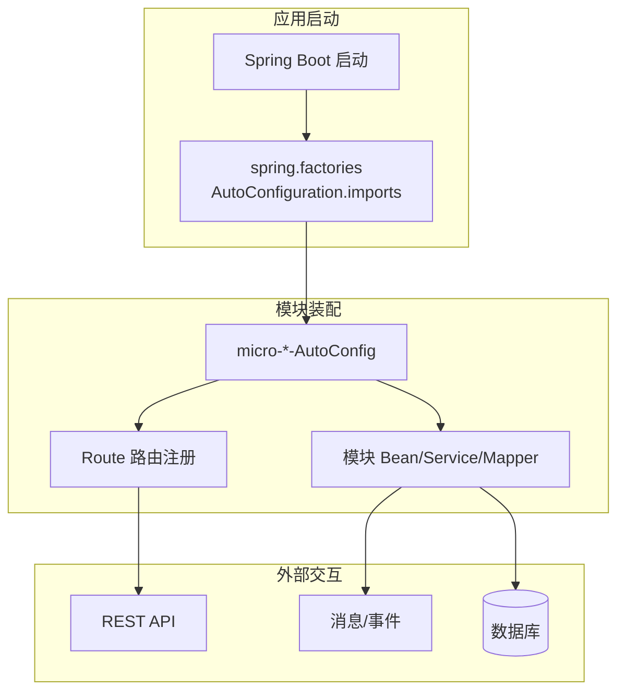
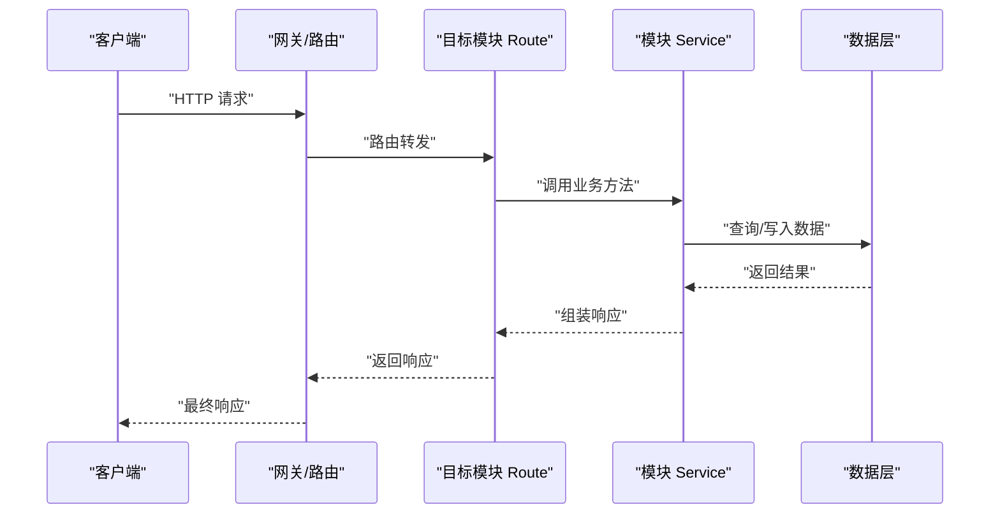
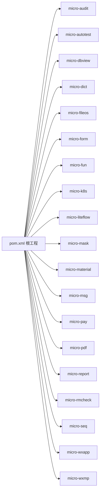

# 模块化架构设计

<cite>
**本文档引用的文件**
- [AGENTS.md](file://AGENTS.md)
- [CONTEXT.md](file://CONTEXT.md)
- [README.md](file://README.md)
- [pom.xml](file://pom.xml)
- [micro-audit/AuditAutoConfig.java](file://micro-audit/src/main/java/com/wkclz/micro/audit/AuditAutoConfig.java)
- [micro-autotest/AutoTestAutoConfig.java](file://micro-autotest/src/main/java/com/wkclz/auto/AutoTestAutoConfig.java)
- [micro-dbview/DbviewAutoConfig.java](file://micro-dbview/src/main/java/com/wkclz/micro/dbview/DbviewAutoConfig.java)
- [micro-dict/DictAutoConfig.java](file://micro-dict/src/main/java/com/wkclz/micro/dict/DictAutoConfig.java)
- [micro-fileos/FileosAutoConfig.java](file://micro-fileos/src/main/java/com/wkclz/micro/fileos/FileosAutoConfig.java)
- [micro-form/FormAutoConfig.java](file://micro-form/src/main/java/com/wkclz/micro/form/FormAutoConfig.java)
- [micro-fun/FunAutoConfig.java](file://micro-fun/src/main/java/com/wkclz/micro/fun/FunAutoConfig.java)
- [micro-k8s/K8sAutoConfig.java](file://micro-k8s/src/main/java/com/wkclz/micro/k8s/K8sAutoConfig.java)
- [micro-liteflow/LiteFlowAutoConfig.java](file://micro-liteflow/src/main/java/com/wkclz/micro/liteflow/LiteFlowAutoConfig.java)
- [micro-mask/MaskAutoConfig.java](file://micro-mask/src/main/java/com/wkclz/micro/mask/MaskAutoConfig.java)
- [micro-material/MaterialAutoConfig.java](file://micro-material/src/main/java/com/wkclz/micro/material/MaterialAutoConfig.java)
- [micro-msg/MsgAutoConfig.java](file://micro-msg/src/main/java/com/wkclz/micro/msg/MsgAutoConfig.java)
- [micro-pay/PayAutoConfig.java](file://micro-pay/src/main/java/com/wkclz/micro/pay/PayAutoConfig.java)
- [micro-pdf/PdfAutoConfig.java](file://micro-pdf/src/main/java/com/wkclz/micro/pdf/PdfAutoConfig.java)
- [micro-report/ReportAutoConfig.java](file://micro-report/src/main/java/com/wkclz/micro/report/ReportAutoConfig.java)
- [micro-rmcheck/RmcheckAutoConfig.java](file://micro-rmcheck/src/main/java/com/wkclz/micro/rmcheck/RmcheckAutoConfig.java)
- [micro-seq/SeqAutoConfig.java](file://micro-seq/src/main/java/com/wkclz/micro/seq/SeqAutoConfig.java)
- [micro-wxapp/MicroAppAutoConfig.java](file://micro-wxapp/src/main/java/com/wkclz/micro/wxapp/MicroAppAutoConfig.java)
- [micro-wxmp/WxmpAutoConfig.java](file://micro-wxmp/src/main/java/com/wkclz/micro/wxmp/WxmpAutoConfig.java)
- [micro-audit/Route.java](file://micro-audit/src/main/java/com/wkclz/micro/audit/rest/Route.java)
- [micro-autotest/Route.java](file://micro-autotest/src/main/java/com/wkclz/auto/rest/Route.java)
- [micro-dbview/Route.java](file://micro-dbview/src/main/java/com/wkclz/micro/dbview/rest/Route.java)
- [micro-dict/Route.java](file://micro-dict/src/main/java/com/wkclz/micro/dict/rest/Route.java)
- [micro-fileos/Route.java](file://micro-fileos/src/main/java/com/wkclz/micro/fileos/rest/Route.java)
- [micro-form/Route.java](file://micro-form/src/main/java/com/wkclz/micro/form/rest/Route.java)
- [micro-fun/Route.java](file://micro-fun/src/main/java/com/wkclz/micro/fun/rest/Route.java)
- [micro-k8s/Route.java](file://micro-k8s/src/main/java/com/wkclz/micro/k8s/Route.java)
- [micro-liteflow/Route.java](file://micro-liteflow/src/main/java/com/wkclz/micro/liteflow/rest/Route.java)
- [micro-mask/Route.java](file://micro-mask/src/main/java/com/wkclz/micro/mask/rest/Route.java)
- [micro-material/Route.java](file://micro-material/src/main/java/com/wkclz/micro/material/rest/Route.java)
- [micro-msg/Route.java](file://micro-msg/src/main/java/com/wkclz/micro/msg/rest/Route.java)
- [micro-pay/Route.java](file://micro-pay/src/main/java/com/wkclz/micro/pay/rest/Route.java)
- [micro-pdf/Route.java](file://micro-pdf/src/main/java/com/wkclz/micro/pdf/rest/Route.java)
- [micro-report/Route.java](file://micro-report/src/main/java/com/wkclz/micro/report/rest/Route.java)
- [micro-rmcheck/Route.java](file://micro-rmcheck/src/main/java/com/wkclz/micro/rmcheck/rest/Route.java)
- [micro-seq/Route.java](file://micro-seq/src/main/java/com/wkclz/micro/seq/rest/Route.java)
- [micro-wxapp/Route.java](file://micro-wxapp/src/main/java/com/wkclz/micro/wxapp/Route.java)
- [micro-wxmp/Route.java](file://micro-wxmp/src/main/java/com/wkclz/micro/wxmp/rest/Route.java)
</cite>

## 目录
1. [引言](#引言)
2. [项目结构](#项目结构)
3. [核心组件](#核心组件)
4. [架构总览](#架构总览)
5. [详细组件分析](#详细组件分析)
6. [依赖分析](#依赖分析)
7. [性能考虑](#性能考虑)
8. [故障排除指南](#故障排除指南)
9. [结论](#结论)
10. [附录](#附录)

## 引言
本文件系统性阐述 sh-microapp 的模块化架构设计，围绕 18 个功能模块的划分原则、设计理念、模块间依赖关系与通信机制展开；说明模块注册机制、加载顺序与生命周期管理；给出模块间接口设计、数据传递协议与错误传播机制；并提供模块扩展指南与自定义模块开发最佳实践。该架构以 Spring Boot 自动配置为核心，通过每个模块的 AutoConfiguration 配置文件进行注册，确保模块独立封装、可插拔式集成与统一治理。

## 项目结构
sh-microapp 采用多模块 Maven 工程组织，每个功能域对应一个子模块（如 micro-audit、micro-form 等），模块内遵循标准的分层结构：api、bean、mapper、rest、service、config、utils 等。所有模块均通过 Spring Boot 的自动配置机制进行装配，注册入口位于各模块的 META-INF/spring/org.springframework.boot.autoconfigure.AutoConfiguration.imports 文件中。

```mermaid
graph TB
subgraph "根工程"
POM[pom.xml]
end
subgraph "模块集合"
MOD_AUDIT[micro-audit]
MOD_AUTOTEST[micro-autotest]
MOD_DBVIEW[micro-dbview]
MOD_DICT[micro-dict]
MOD_FILEOS[micro-fileos]
MOD_FORM[micro-form]
MOD_FUN[micro-fun]
MOD_K8S[micro-k8s]
MOD_LITEFLOW[micro-liteflow]
MOD_MASK[micro-mask]
MOD_MATERIAL[micro-material]
MOD_MSG[micro-msg]
MOD_PAY[micro-pay]
MOD_PDF[micro-pdf]
MOD_REPORT[micro-report]
MOD_RM[micro-rmcheck]
MOD_SEQ[micro-seq]
MOD_WXAPP[micro-wxapp]
MOD_WXMP[micro-wxmp]
end
POM --> MOD_AUDIT
POM --> MOD_AUTOTEST
POM --> MOD_DBVIEW
POM --> MOD_DICT
POM --> MOD_FILEOS
POM --> MOD_FORM
POM --> MOD_FUN
POM --> MOD_K8S
POM --> MOD_LITEFLOW
POM --> MOD_MASK
POM --> MOD_MATERIAL
POM --> MOD_MSG
POM --> MOD_PAY
POM --> MOD_PDF
POM --> MOD_REPORT
POM --> MOD_RM
POM --> MOD_SEQ
POM --> MOD_WXAPP
POM --> MOD_WXMP
```

图表来源
- [pom.xml](file://pom.xml)
- [micro-audit/AuditAutoConfig.java](file://micro-audit/src/main/java/com/wkclz/micro/audit/AuditAutoConfig.java)
- [micro-autotest/AutoTestAutoConfig.java](file://micro-autotest/src/main/java/com/wkclz/auto/AutoTestAutoConfig.java)
- [micro-dbview/DbviewAutoConfig.java](file://micro-dbview/src/main/java/com/wkclz/micro/dbview/DbviewAutoConfig.java)
- [micro-dict/DictAutoConfig.java](file://micro-dict/src/main/java/com/wkclz/micro/dict/DictAutoConfig.java)
- [micro-fileos/FileosAutoConfig.java](file://micro-fileos/src/main/java/com/wkclz/micro/fileos/FileosAutoConfig.java)
- [micro-form/FormAutoConfig.java](file://micro-form/src/main/java/com/wkclz/micro/form/FormAutoConfig.java)
- [micro-fun/FunAutoConfig.java](file://micro-fun/src/main/java/com/wkclz/micro/fun/FunAutoConfig.java)
- [micro-k8s/K8sAutoConfig.java](file://micro-k8s/src/main/java/com/wkclz/micro/k8s/K8sAutoConfig.java)
- [micro-liteflow/LiteFlowAutoConfig.java](file://micro-liteflow/src/main/java/com/wkclz/micro/liteflow/LiteFlowAutoConfig.java)
- [micro-mask/MaskAutoConfig.java](file://micro-mask/src/main/java/com/wkclz/micro/mask/MaskAutoConfig.java)
- [micro-material/MaterialAutoConfig.java](file://micro-material/src/main/java/com/wkclz/micro/material/MaterialAutoConfig.java)
- [micro-msg/MsgAutoConfig.java](file://micro-msg/src/main/java/com/wkclz/micro/msg/MsgAutoConfig.java)
- [micro-pay/PayAutoConfig.java](file://micro-pay/src/main/java/com/wkclz/micro/pay/PayAutoConfig.java)
- [micro-pdf/PdfAutoConfig.java](file://micro-pdf/src/main/java/com/wkclz/micro/pdf/PdfAutoConfig.java)
- [micro-report/ReportAutoConfig.java](file://micro-report/src/main/java/com/wkclz/micro/report/ReportAutoConfig.java)
- [micro-rmcheck/RmcheckAutoConfig.java](file://micro-rmcheck/src/main/java/com/wkclz/micro/rmcheck/RmcheckAutoConfig.java)
- [micro-seq/SeqAutoConfig.java](file://micro-seq/src/main/java/com/wkclz/micro/seq/SeqAutoConfig.java)
- [micro-wxapp/MicroAppAutoConfig.java](file://micro-wxapp/src/main/java/com/wkclz/micro/wxapp/MicroAppAutoConfig.java)
- [micro-wxmp/WxmpAutoConfig.java](file://micro-wxmp/src/main/java/com/wkclz/micro/wxmp/WxmpAutoConfig.java)

章节来源
- [pom.xml](file://pom.xml)
- [CONTEXT.md](file://CONTEXT.md)

## 核心组件
- 模块注册机制：每个模块在 META-INF/spring/ 目录下提供 AutoConfiguration.imports 文件，声明模块的自动配置类，Spring Boot 启动时按文件内容自动装配模块。
- 模块加载顺序：由 Maven 依赖顺序与 AutoConfiguration.imports 中的声明共同决定；可通过模块间依赖与条件装配控制加载优先级。
- 生命周期管理：模块通过 @AutoConfiguration、@ConditionalOnProperty、@Import 等注解实现条件加载与初始化；REST 路由通过 Route 统一注册，便于集中治理。
- 接口与数据模型：模块内部以 bean/dto/req/resp 分层定义数据契约；REST 层负责对外暴露接口；Service 层承载业务逻辑；Mapper 层对接持久化。
- 错误传播：模块内通过统一异常处理与响应包装，结合全局错误码与上下文信息，向上层或调用方传递标准化错误。

章节来源
- [AGENTS.md](file://AGENTS.md)
- [CONTEXT.md](file://CONTEXT.md)

## 架构总览
整体架构采用“微模块 + 自动配置 + 统一路由”的设计。每个模块独立打包、独立部署，启动时通过 AutoConfiguration.imports 注册自身配置；REST 层通过 Route 类集中注册路由，形成统一的 API 入口；模块间通过服务调用、事件/消息或共享数据层进行协作。

图表来源
- [AGENTS.md](file://AGENTS.md)
- [CONTEXT.md](file://CONTEXT.md)
- [micro-audit/AuditAutoConfig.java](file://micro-audit/src/main/java/com/wkclz/micro/audit/AuditAutoConfig.java)
- [micro-audit/Route.java](file://micro-audit/src/main/java/com/wkclz/micro/audit/rest/Route.java)

## 详细组件分析

### 模块划分原则与设计理念
- 功能边界清晰：每个模块聚焦单一业务域，避免交叉耦合；例如审计、表单、文件、支付等各自独立。
- 单一职责：模块内含完整的 CRUD、校验、缓存、定时任务等能力，便于复用与替换。
- 可插拔与可替换：通过自动配置与接口抽象，支持在不改动上层的情况下替换实现或禁用模块。
- 数据与接口隔离：模块内部的数据模型与接口通过 DTO/REQ/RESP 明确边界，降低跨模块耦合。

章节来源
- [README.md](file://README.md)

### 模块注册机制与加载顺序
- 注册方式：各模块在 META-INF/spring/ 下提供 AutoConfiguration.imports，声明模块的 AutoConfiguration 类，Spring Boot 启动时自动扫描并装配。
- 加载顺序：由 Maven 依赖顺序与 AutoConfiguration.imports 决定；可通过 @AutoConfigureBefore/@AutoConfigureAfter 控制装配顺序；也可通过 @ConditionalOnProperty 实现按环境开关启用。
- 生命周期：模块在装配阶段完成 Bean 初始化、路由注册、定时任务启动等；销毁阶段由 Spring 容器统一管理。

章节来源
- [AGENTS.md](file://AGENTS.md)
- [CONTEXT.md](file://CONTEXT.md)

### 模块间依赖关系与通信机制
- 依赖关系：模块间通过服务调用、消息/事件或共享数据层协作；部分模块存在显式依赖（如报表依赖数据源、支付依赖通知 SPI）。
- 通信机制：REST 调用、消息队列、定时调度、共享缓存等；模块内部通过 Service/DAO 层解耦，对外仅暴露 REST 接口。
- 路由集中：各模块通过 Route 类统一注册 REST 路由，便于网关聚合与权限控制。

图表来源
- [micro-audit/Route.java](file://micro-audit/src/main/java/com/wkclz/micro/audit/rest/Route.java)
- [micro-audit/AuditAutoConfig.java](file://micro-audit/src/main/java/com/wkclz/micro/audit/AuditAutoConfig.java)

### 模块间接口设计、数据传递协议与错误传播
- 接口设计：REST 层统一通过 Route 暴露接口；请求/响应对象严格区分 DTO/REQ/RESP，保证前后端与模块间契约稳定。
- 数据传递协议：采用 JSON/表单格式传输；参数校验通过 AOP 或校验器实现；返回值统一包装，包含状态码、消息与数据体。
- 错误传播：模块内捕获异常并转换为统一错误响应；上层可基于错误码与上下文信息进行重试或降级。

章节来源
- [micro-form/FormAutoConfig.java](file://micro-form/src/main/java/com/wkclz/micro/form/FormAutoConfig.java)
- [micro-form/Route.java](file://micro-form/src/main/java/com/wkclz/micro/form/rest/Route.java)

### 模块扩展指南与自定义模块开发最佳实践
- 新模块开发步骤
  - 创建模块目录与基本结构（api、bean、mapper、rest、service、config、utils）。
  - 在 META-INF/spring/ 下创建 AutoConfiguration.imports，声明模块的 AutoConfiguration 类。
  - 在 AutoConfiguration 中完成 Bean 定义、路由注册、条件装配与生命周期管理。
  - 在 Route 中集中注册 REST 路由，确保接口命名规范与版本化。
  - 编写 Mapper/SQL/XML，定义数据访问层；Service 层实现业务逻辑；必要时引入缓存与定时任务。
- 最佳实践
  - 使用统一的异常处理与响应包装，保持错误语义一致。
  - 通过条件装配与开关控制模块启停，提升环境适配能力。
  - 对外接口尽量幂等，配合唯一键与版本控制，降低并发风险。
  - 模块间尽量通过异步消息或事件解耦，减少强依赖链路。

章节来源
- [AGENTS.md](file://AGENTS.md)
- [CONTEXT.md](file://CONTEXT.md)

## 依赖分析
- 模块依赖：根 pom.xml 管理所有模块的构建与版本；模块间通过 Maven 依赖体现功能耦合度。
- 自动配置依赖：各模块 AutoConfiguration.imports 决定装配顺序与条件加载；可通过 @AutoConfigureBefore/After 控制优先级。
- 外部依赖：各模块根据业务需要引入数据库驱动、消息中间件、第三方 SDK 等；建议统一版本管理与安全扫描。

图表来源
- [pom.xml](file://pom.xml)

章节来源
- [pom.xml](file://pom.xml)

## 性能考虑
- 模块拆分带来的收益：独立部署、独立扩缩容、独立演进，降低单体复杂度与热更新风险。
- 性能优化建议
  - 缓存策略：对热点数据与静态配置引入本地缓存与分布式缓存，减少重复计算与 IO。
  - 并发控制：对高并发接口增加限流与熔断，保障系统稳定性。
  - 数据库优化：合理分表分库、索引优化与慢查询治理；读写分离与连接池调优。
  - 日志与监控：统一埋点与指标采集，结合链路追踪定位性能瓶颈。
- 模块粒度权衡：过细会增加网络与协调成本，过粗则影响灵活性；应结合业务场景与团队规模动态调整。

## 故障排除指南
- 模块未被 Spring 扫描到
  - 检查 AutoConfiguration.imports 文件是否存在且内容正确。
  - 确认 @ComponentScan 包路径覆盖模块包结构。
- 路由未生效
  - 检查 Route 是否正确注册，以及是否被网关/路由层拦截。
  - 确认模块启动日志中无装配失败或循环依赖提示。
- 数据访问异常
  - 核对 Mapper/SQL/XML 是否匹配实体字段；检查连接池与事务配置。
- 错误响应不符合预期
  - 统一异常处理器是否生效；错误码与消息是否标准化。
- 模块间调用失败
  - 检查网络连通性与超时设置；确认鉴权与限流策略未阻断请求。

章节来源
- [AGENTS.md](file://AGENTS.md)
- [CONTEXT.md](file://CONTEXT.md)

## 结论
sh-microapp 的模块化架构以 Spring Boot 自动配置为核心，通过 18 个功能模块实现业务领域的独立封装与复用。模块注册机制、加载顺序与生命周期管理清晰可控；模块间通过统一路由与标准化接口进行协作；扩展与维护成本低，具备良好的演进空间。建议在后续实践中持续完善模块边界、统一错误与监控体系，并加强跨模块一致性治理。

## 附录
- 模块清单与职责概览
  - 审计模块：变更日志、对比工具与审计 API。
  - 自动化测试模块：接口扫描、执行器与报告生成。
  - 数据库视图模块：数据源管理、元数据、SQL 执行与历史记录。
  - 字典模块：字典类型与字典项的增删改查。
  - 文件 OS 模块：文件上传、签名下载、桶与目录管理。
  - 表单模块：表单定义、规则与 AOP 校验。
  - 函数模块：脚本引擎与函数分类管理。
  - K8s 模块：Kubernetes 资源管理与辅助工具。
  - LiteFlow 模块：流程编排与脚本链管理。
  - 脱敏模块：响应脱敏规则与切面处理。
  - 物料模块：物料、分组、引用与版本管理。
  - 消息模块：模板、通知与用户设置。
  - 支付模块：支付宝/微信配置、订单与回调 SPI。
  - PDF 模块：PDF 模板与生成工具。
  - 报表模块：报表定义、参数、执行与结果。
  - 合规校验模块：规则与检查项管理。
  - 序列号模块：序列号生成与管理。
  - 小程序模块：微信小程序相关能力。
  - 微信公众号模块：消息处理与服务端能力。

章节来源
- [README.md](file://README.md)