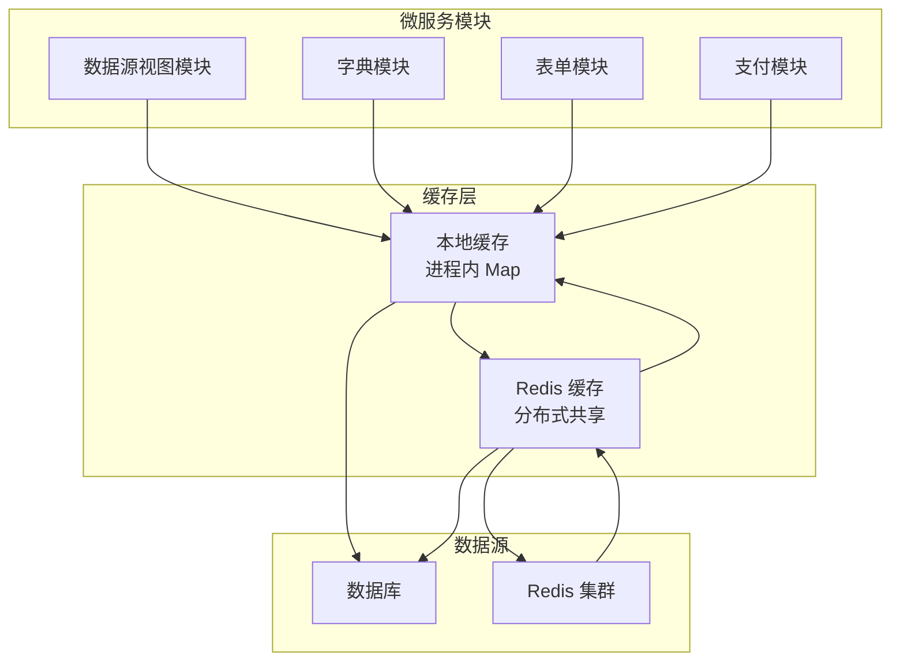
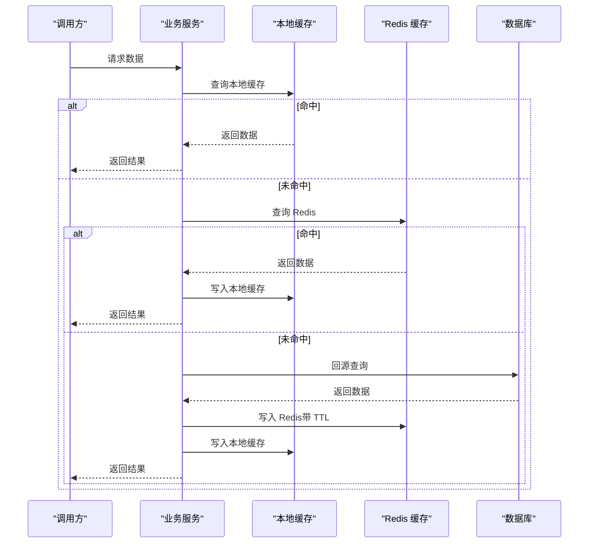
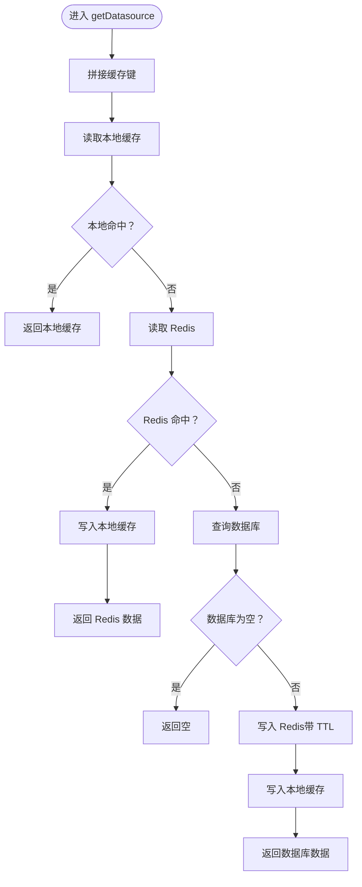
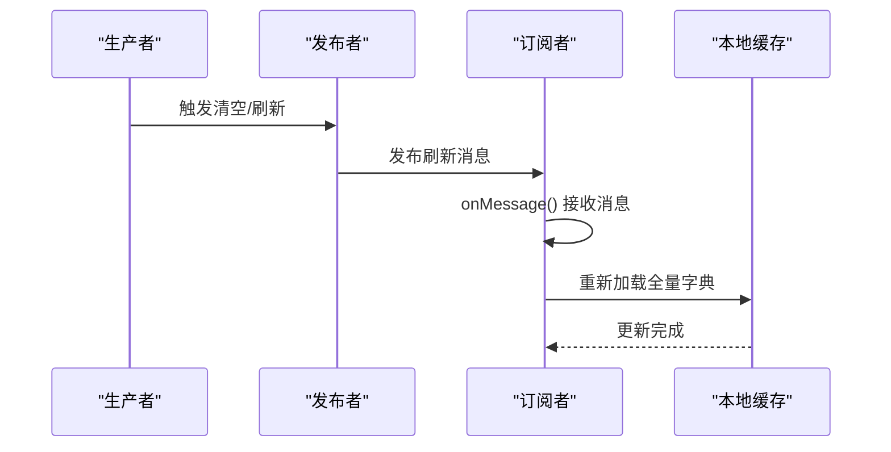
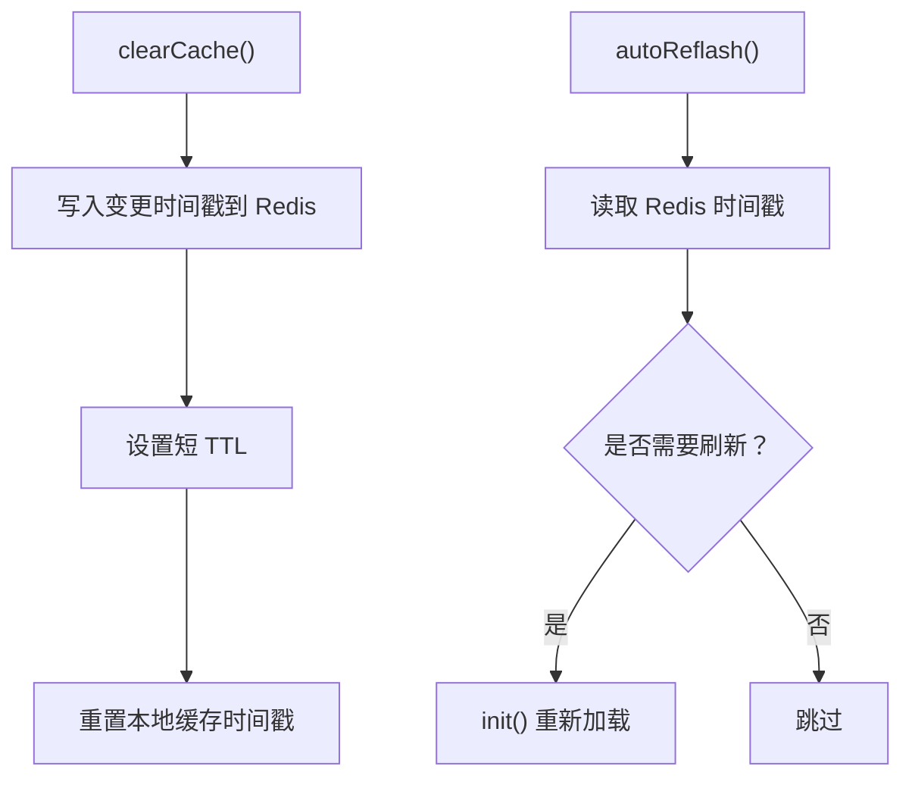
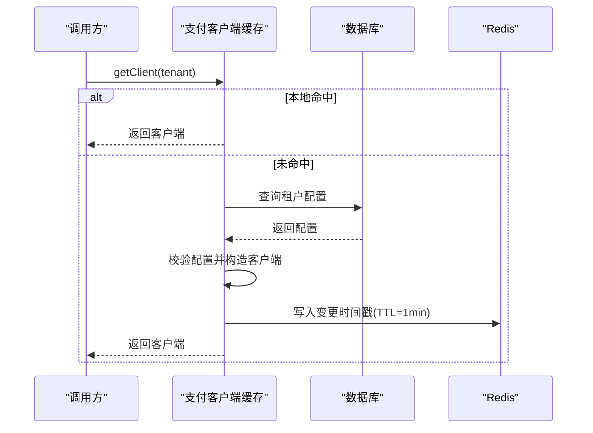
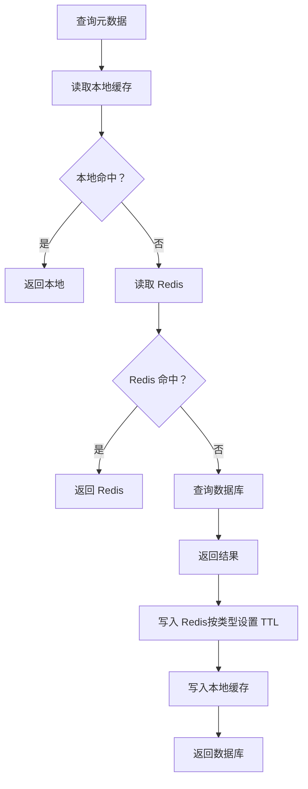
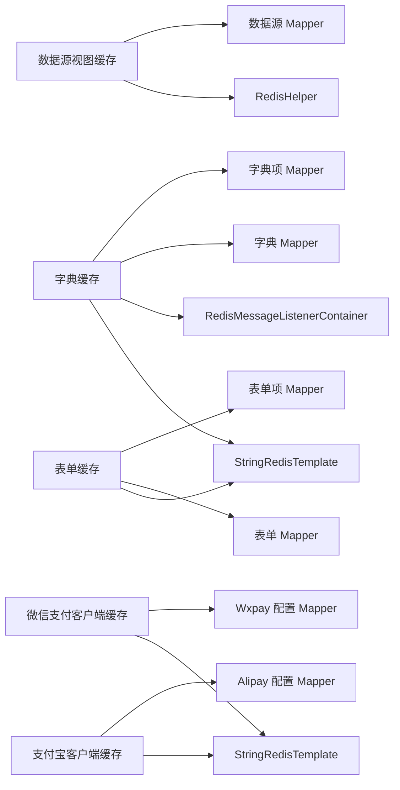

# 缓存策略设计

<cite>
**本文引用的文件**
- [DatasourceCache.java](file://micro-dbview/src/main/java/com/wkclz/micro/dbview/cache/DatasourceCache.java)
- [DictCache.java](file://micro-dict/src/main/java/com/wkclz/micro/dict/cache/DictCache.java)
- [FormCache.java](file://micro-form/src/main/java/com/wkclz/micro/form/cache/FormCache.java)
- [AlipayClientCache.java](file://micro-pay/src/main/java/com/wkclz/micro/pay/cache/AlipayClientCache.java)
- [WxpayClientCache.java](file://micro-pay/src/main/java/com/wkclz/micro/pay/cache/WxpayClientCache.java)
- [DbviewMetadataService.java](file://micro-dbview/src/main/java/com/wkclz/micro/dbview/service/DbviewMetadataService.java)
</cite>

## 目录
1. [引言](#引言)
2. [项目结构](#项目结构)
3. [核心组件](#核心组件)
4. [架构总览](#架构总览)
5. [详细组件分析](#详细组件分析)
6. [依赖关系分析](#依赖关系分析)
7. [性能考量](#性能考量)
8. [故障排查指南](#故障排查指南)
9. [结论](#结论)
10. [附录](#附录)

## 引言
本文件面向 sh-microapp 的缓存策略设计，系统性阐述 Redis 缓存与本地缓存的混合使用模式，覆盖缓存穿透、击穿、雪崩的防护手段；明确缓存更新、失效与一致性保障方案；给出配置管理、监控与性能调优方法，并提供热点处理、分布式同步与数据预热的实现思路，以及异常处理与故障恢复机制。

## 项目结构
本项目采用“微服务 + 多模块”的组织方式，各业务模块（如字典、表单、支付、数据源视图等）均内置独立的缓存组件，统一通过 Redis 实现分布式共享与跨实例同步。典型结构包括：
- 本地缓存层：以静态 Map 或线程安全 Map 维护进程内缓存，降低热点访问延迟
- Redis 分布式缓存层：提供跨实例共享、持久化与广播通知能力
- 业务服务层：在读路径优先命中本地缓存，再回退至 Redis，最后回源数据库；写路径采用“先更新数据库，再广播/清理缓存”的策略

## 核心组件
本节聚焦于与缓存策略直接相关的核心组件及其职责：
- 数据源视图缓存：对数据源实体进行 Redis 缓存，提供按 ID 的读取与淘汰
- 字典缓存：全量加载字典映射，基于 Redis 发布订阅实现跨实例同步
- 表单缓存：动态表单定义与明细的聚合缓存，定时自动刷新
- 支付客户端缓存：按租户维度缓存支付 SDK 客户端与配置，支持广播触发失效
- 元数据服务：在读路径中结合 Redis 与本地缓存，实现多级缓存与 TTL 策略

章节来源
- [DatasourceCache.java:1-41](file://micro-dbview/src/main/java/com/wkclz/micro/dbview/cache/DatasourceCache.java#L1-L41)
- [DictCache.java:1-130](file://micro-dict/src/main/java/com/wkclz/micro/dict/cache/DictCache.java#L1-L130)
- [FormCache.java:1-121](file://micro-form/src/main/java/com/wkclz/micro/form/cache/FormCache.java#L1-L121)
- [AlipayClientCache.java:1-189](file://micro-pay/src/main/java/com/wkclz/micro/pay/cache/AlipayClientCache.java#L1-L189)
- [WxpayClientCache.java:1-170](file://micro-pay/src/main/java/com/wkclz/micro/pay/cache/WxpayClientCache.java#L1-L170)
- [DbviewMetadataService.java:12-216](file://micro-dbview/src/main/java/com/wkclz/micro/dbview/service/DbviewMetadataService.java#L12-L216)

## 架构总览
下图展示缓存策略的整体交互：读路径优先本地缓存，其次 Redis，最后回源数据库；写路径先更新数据库，再广播或删除对应键，确保最终一致。

图表来源
- [DbviewMetadataService.java:51-107](file://micro-dbview/src/main/java/com/wkclz/micro/dbview/service/DbviewMetadataService.java#L51-L107)
- [DatasourceCache.java:22-34](file://micro-dbview/src/main/java/com/wkclz/micro/dbview/cache/DatasourceCache.java#L22-L34)

## 详细组件分析

### 数据源视图缓存（Redis + 本地）
- 读路径：先查本地缓存，未命中再查 Redis，最后回源数据库并写入 Redis 与本地缓存
- 写路径：提供按 ID 的淘汰接口，确保后续读取能回源并重建缓存
- TTL：示例中对数据源实体设置固定 TTL，避免长期占用内存

图表来源
- [DatasourceCache.java:22-34](file://micro-dbview/src/main/java/com/wkclz/micro/dbview/cache/DatasourceCache.java#L22-L34)

章节来源
- [DatasourceCache.java:14-39](file://micro-dbview/src/main/java/com/wkclz/micro/dbview/cache/DatasourceCache.java#L14-L39)

### 字典缓存（全量加载 + 发布订阅）
- 全量加载：启动时拉取所有字典与字典项，构建类型到键值映射的本地缓存
- 同步机制：通过 Redis 发布订阅通道接收刷新指令，收到后重新加载并更新本地缓存
- 防抖：本地加载过程包含时间戳防抖，避免频繁重复加载

图表来源
- [DictCache.java:49-58](file://micro-dict/src/main/java/com/wkclz/micro/dict/cache/DictCache.java#L49-L58)
- [DictCache.java:90-127](file://micro-dict/src/main/java/com/wkclz/micro/dict/cache/DictCache.java#L90-L127)

章节来源
- [DictCache.java:27-58](file://micro-dict/src/main/java/com/wkclz/micro/dict/cache/DictCache.java#L27-L58)
- [DictCache.java:90-127](file://micro-dict/src/main/java/com/wkclz/micro/dict/cache/DictCache.java#L90-L127)

### 表单缓存（定时刷新 + 广播）
- 聚合缓存：将表单定义与其明细项聚合，按表单编码索引
- 自动刷新：通过定时任务检测 Redis 中的变更时间戳，超过阈值则重新加载
- 清理入口：提供显式清理接口，同时向 Redis 广播变更时间戳，触发其他实例刷新

图表来源
- [FormCache.java:38-74](file://micro-form/src/main/java/com/wkclz/micro/form/cache/FormCache.java#L38-L74)
- [FormCache.java:89-118](file://micro-form/src/main/java/com/wkclz/micro/form/cache/FormCache.java#L89-L118)

章节来源
- [FormCache.java:26-74](file://micro-form/src/main/java/com/wkclz/micro/form/cache/FormCache.java#L26-L74)
- [FormCache.java:89-118](file://micro-form/src/main/java/com/wkclz/micro/form/cache/FormCache.java#L89-L118)

### 支付客户端缓存（租户隔离 + 广播失效）
- 租户维度：按租户代码维护独立的支付客户端与配置缓存
- 初始化：首次访问时从数据库加载并校验配置，构造 SDK 客户端
- 失效策略：通过 Redis 写入变更时间戳并设置短 TTL，配合定时任务检测并触发本地缓存失效

图表来源
- [AlipayClientCache.java:75-113](file://micro-pay/src/main/java/com/wkclz/micro/pay/cache/AlipayClientCache.java#L75-L113)
- [WxpayClientCache.java:73-108](file://micro-pay/src/main/java/com/wkclz/micro/pay/cache/WxpayClientCache.java#L73-L108)

章节来源
- [AlipayClientCache.java:30-73](file://micro-pay/src/main/java/com/wkclz/micro/pay/cache/AlipayClientCache.java#L30-L73)
- [WxpayClientCache.java:28-71](file://micro-pay/src/main/java/com/wkclz/micro/pay/cache/WxpayClientCache.java#L28-L71)

### 元数据服务（多级缓存与 TTL）
- 读路径：优先本地缓存，其次 Redis，最后数据库
- 写路径：更新数据库后，删除对应键，确保下次读取回源重建
- TTL 策略：根据配置为不同元数据类型设置不同的 TTL，平衡一致性与性能

图表来源
- [DbviewMetadataService.java:51-107](file://micro-dbview/src/main/java/com/wkclz/micro/dbview/service/DbviewMetadataService.java#L51-L107)
- [DbviewMetadataService.java:140-175](file://micro-dbview/src/main/java/com/wkclz/micro/dbview/service/DbviewMetadataService.java#L140-L175)

章节来源
- [DbviewMetadataService.java:43-216](file://micro-dbview/src/main/java/com/wkclz/micro/dbview/service/DbviewMetadataService.java#L43-L216)

## 依赖关系分析
- 组件耦合：各模块缓存组件相对独立，仅依赖 Redis 与各自 Mapper/Service
- 一致性契约：写路径统一采用“先写数据库，再广播/删除键”，避免脏读
- 依赖链路：本地缓存依赖 Redis 作为“远端缓存”；Redis 依赖数据库作为“权威数据源”

图表来源
- [DatasourceCache.java:16-20](file://micro-dbview/src/main/java/com/wkclz/micro/dbview/cache/DatasourceCache.java#L16-L20)
- [DictCache.java:34-41](file://micro-dict/src/main/java/com/wkclz/micro/dict/cache/DictCache.java#L34-L41)
- [FormCache.java:31-36](file://micro-form/src/main/java/com/wkclz/micro/form/cache/FormCache.java#L31-L36)
- [AlipayClientCache.java:35-38](file://micro-pay/src/main/java/com/wkclz/micro/pay/cache/AlipayClientCache.java#L35-L38)
- [WxpayClientCache.java:33-36](file://micro-pay/src/main/java/com/wkclz/micro/pay/cache/WxpayClientCache.java#L33-L36)

## 性能考量
- 本地缓存命中率优化
  - 将热点数据（如字典、表单、支付配置）放入本地缓存，减少网络往返
  - 对高频小对象设置较短 TTL，避免长时间驻留导致内存压力
- Redis 命中优化
  - 使用前缀命名空间隔离不同模块，便于清理与统计
  - 对大对象采用压缩或序列化策略，降低内存占用
- 刷新策略
  - 定时刷新与广播刷新结合：定时刷新兜底，广播刷新加速一致性
  - 设置刷新间隔与防抖窗口，避免抖动风暴
- 读写分离
  - 读路径优先本地缓存，次选 Redis，最后数据库
  - 写路径先更新数据库，再广播/删除键，确保最终一致

## 故障排查指南
- 缓存未命中
  - 检查本地缓存是否被主动清理或过期
  - 检查 Redis 键是否存在、TTL 是否过短
  - 核查写路径是否正确删除或广播了对应键
- 缓存雪崩
  - 为不同键设置随机 TTL，避免同时过期
  - 保留热点键的长 TTL 或常驻本地缓存
- 缓存穿透
  - 对空结果也写入短 TTL 的占位值，防止持续回源
  - 在入口处增加参数校验与白名单过滤
- 缓存击穿
  - 对热点键设置互斥锁或只允许一个线程回源重建
  - 为热点键设置兜底降级策略（如只读本地缓存）
- 分布式同步异常
  - 检查发布订阅通道是否正常，消费者是否在线
  - 核查广播时间戳写入与过期策略是否生效
- 支付客户端缓存异常
  - 核查租户配置是否正确，SDK 客户端初始化是否抛错
  - 检查广播时间戳是否写入且未过期

章节来源
- [DictCache.java:49-58](file://micro-dict/src/main/java/com/wkclz/micro/dict/cache/DictCache.java#L49-L58)
- [FormCache.java:38-74](file://micro-form/src/main/java/com/wkclz/micro/form/cache/FormCache.java#L38-L74)
- [AlipayClientCache.java:40-73](file://micro-pay/src/main/java/com/wkclz/micro/pay/cache/AlipayClientCache.java#L40-L73)
- [WxpayClientCache.java:38-71](file://micro-pay/src/main/java/com/wkclz/micro/pay/cache/WxpayClientCache.java#L38-L71)

## 结论
本项目通过“本地缓存 + Redis 分布式缓存”的双层架构，在保证高可用与低延迟的同时，实现了跨实例的一致性与可运维性。针对缓存三大风险（穿透、击穿、雪崩），结合广播刷新、TTL 策略与互斥重建等手段，形成完整的防护体系。建议在生产环境中进一步完善监控指标、告警阈值与自动化扩容策略，持续优化缓存命中率与资源利用率。

## 附录
- 配置管理建议
  - 为不同模块与不同键设置差异化 TTL 与刷新周期
  - 提供统一的缓存开关与降级策略，便于紧急处置
- 监控与可观测性
  - 关键指标：缓存命中率、Redis 命中率、平均响应时间、广播延迟
  - 告警阈值：命中率骤降、Redis 过载、广播超时、本地缓存抖动
- 性能调优清单
  - 评估热点键分布，必要时拆分键空间或引入二级缓存
  - 对大对象启用压缩或分片存储，降低网络与内存压力
  - 优化数据库查询与索引，缩短回源耗时
- 热点处理
  - 对热点键设置互斥重建与只读降级
  - 引入本地只读副本与多级缓存，分散热点压力
- 分布式同步
  - 使用发布订阅通道统一广播，避免轮询带来的开销
  - 对广播失败进行重试与幂等处理
- 数据预热
  - 在启动阶段或低峰时段批量加载热点键
  - 对关键路径的依赖数据进行预取与预热