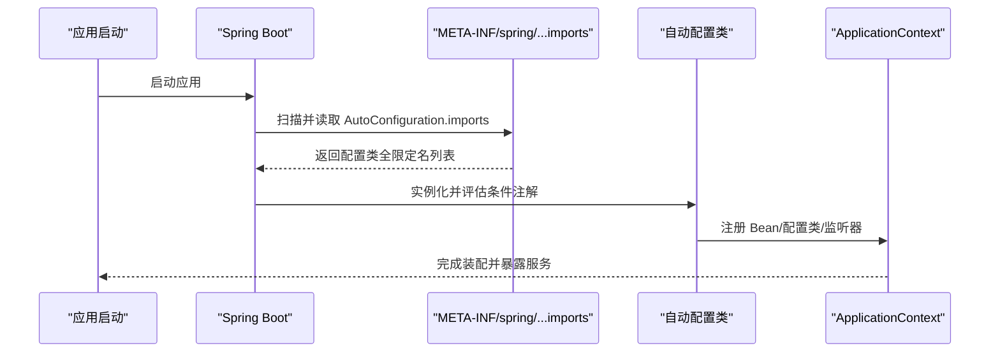
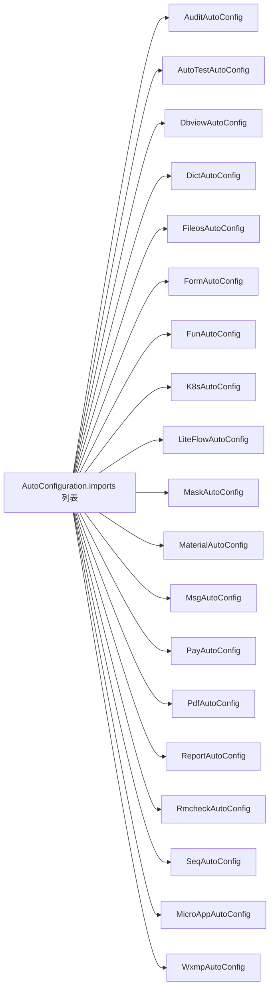

# 自动配置机制

<cite>
**本文引用的文件**
- [micro-audit/AuditAutoConfig.java](file://micro-audit/src/main/java/com/wkclz/micro/audit/AuditAutoConfig.java)
- [micro-autotest/AutoTestAutoConfig.java](file://micro-autotest/src/main/java/com/wkclz/auto/AutoTestAutoConfig.java)
- [micro-dbview/DbviewAutoConfig.java](file://micro-dbview/src/main/java/com/wkclz/micro/dbview/DbviewAutoConfig.java)
- [micro-dict/DictAutoConfig.java](file://micro-dict/src/main/java/com/wkclz/micro/dict/DictAutoConfig.java)
- [micro-fileos/FileosAutoConfig.java](file://micro-fileos/src/main/java/com/wkclz/micro/fileos/FileosAutoConfig.java)
- [micro-form/FormAutoConfig.java](file://micro-form/src/main/java/com/wkclz/micro/form/FormAutoConfig.java)
- [micro-fun/FunAutoConfig.java](file://micro-fun/src/main/java/com/wkclz/micro/fun/FunAutoConfig.java)
- [micro-k8s/K8sAutoConfig.java](file://micro-k8s/src/main/java/com/wkclz/micro/k8s/K8sAutoConfig.java)
- [micro-liteflow/LiteFlowAutoConfig.java](file://micro-liteflow/src/main/java/com/wkclz/micro/liteflow/LiteFlowAutoConfig.java)
- [micro-mask/MaskAutoConfig.java](file://micro-mask/src/main/java/com/wkclz/micro/mask/MaskAutoConfig.java)
- [micro-material/MaterialAutoConfig.java](file://micro-material/src/main/java/com/wkclz/micro/material/MaterialAutoConfig.java)
- [micro-msg/MsgAutoConfig.java](file://micro-msg/src/main/java/com/wkclz/micro/msg/MsgAutoConfig.java)
- [micro-pay/PayAutoConfig.java](file://micro-pay/src/main/java/com/wkclz/micro/pay/PayAutoConfig.java)
- [micro-pdf/PdfAutoConfig.java](file://micro-pdf/src/main/java/com/wkclz/micro/pdf/PdfAutoConfig.java)
- [micro-report/ReportAutoConfig.java](file://micro-report/src/main/java/com/wkclz/micro/report/ReportAutoConfig.java)
- [micro-rmcheck/RmcheckAutoConfig.java](file://micro-rmcheck/src/main/java/com/wkclz/micro/rmcheck/RmcheckAutoConfig.java)
- [micro-seq/SeqAutoConfig.java](file://micro-seq/src/main/java/com/wkclz/micro/seq/SeqAutoConfig.java)
- [micro-wxapp/MicroAppAutoConfig.java](file://micro-wxapp/src/main/java/com/wkclz/micro/wxapp/MicroAppAutoConfig.java)
- [micro-wxmp/WxmpAutoConfig.java](file://micro-wxmp/src/main/java/com/wkclz/micro/wxmp/WxmpAutoConfig.java)
- [micro-audit/META-INF/spring/org.springframework.boot.autoconfigure.AutoConfiguration.imports](filefile://micro-audit/src/main/resources/META-INF/spring/org.springframework.boot.autoconfigure.AutoConfiguration.imports)
- [micro-autotest/META-INF/spring/org.springframework.boot.autoconfigure.AutoConfiguration.imports](file://micro-autotest/src/main/resources/META-INF/spring/org.springframework.boot.autoconfigure.AutoConfiguration.imports)
- [micro-dbview/META-INF/spring/org.springframework.boot.autoconfigure.AutoConfiguration.imports](file://micro-dbview/src/main/resources/META-INF/spring/org.springframework.boot.autoconfigure.AutoConfiguration.imports)
- [micro-dict/META-INF/spring/org.springframework.boot.autoconfigure.AutoConfiguration.imports](file://micro-dict/src/main/resources/META-INF/spring/org.springframework.boot.autoconfigure.AutoConfiguration.imports)
- [micro-fileos/META-INF/spring/org.springframework.boot.autoconfigure.AutoConfiguration.imports](file://micro-fileos/src/main/resources/META-INF/spring/org.springframework.boot.autoconfigure.AutoConfiguration.imports)
- [micro-form/META-INF/spring/org.springframework.boot.autoconfigure.AutoConfiguration.imports](file://micro-form/src/main/resources/META-INF/spring/org.springframework.boot.autoconfigure.AutoConfiguration.imports)
- [micro-fun/META-INF/spring/org.springframework.boot.autoconfigure.AutoConfiguration.imports](file://micro-fun/src/main/resources/META-INF/spring/org.springframework.boot.autoconfigure.AutoConfiguration.imports)
- [micro-k8s/META-INF/spring/org.springframework.boot.autoconfigure.AutoConfiguration.imports](file://micro-k8s/src/main/resources/META-INF/spring/org.springframework.boot.autoconfigure.AutoConfiguration.imports)
- [micro-liteflow/META-INF/spring/org.springframework.boot.autoconfigure.AutoConfiguration.imports](file://micro-liteflow/src/main/resources/META-INF/spring/org.springframework.boot.autoconfigure.AutoConfiguration.imports)
- [micro-mask/META-INF/spring/org.springframework.boot.autoconfigure.AutoConfiguration.imports](file://micro-mask/src/main/resources/META-INF/spring/org.springframework.boot.autoconfigure.AutoConfiguration.imports)
- [micro-material/META-INF/spring/org.springframework.boot.autoconfigure.AutoConfiguration.imports](file://micro-material/src/main/resources/META-INF/spring/org.springframework.boot.autoconfigure.AutoConfiguration.imports)
- [micro-msg/META-INF/spring/org.springframework.boot.autoconfigure.AutoConfiguration.imports](file://micro-msg/src/main/resources/META-INF/spring/org.springframework.boot.autoconfigure.AutoConfiguration.imports)
- [micro-pay/META-INF/spring/org.springframework.boot.autoconfigure.AutoConfiguration.imports](file://micro-pay/src/main/resources/META-INF/spring/org.springframework.boot.autoconfigure.AutoConfiguration.imports)
- [micro-pdf/META-INF/spring/org.springframework.boot.autoconfigure.AutoConfiguration.imports](file://micro-pdf/src/main/resources/META-INF/spring/org.springframework.boot.autoconfigure.AutoConfiguration.imports)
- [micro-report/META-INF/spring/org.springframework.boot.autoconfigure.AutoConfiguration.imports](file://micro-report/src/main/resources/META-INF/spring/org.springframework.boot.autoconfigure.AutoConfiguration.imports)
- [micro-rmcheck/META-INF/spring/org.springframework.boot.autoconfigure.AutoConfiguration.imports](file://micro-rmcheck/src/main/resources/META-INF/spring/org.springframework.boot.autoconfigure.AutoConfiguration.imports)
- [micro-seq/META-INF/spring/org.springframework.boot.autoconfigure.AutoConfiguration.imports](file://micro-seq/src/main/resources/META-INF/spring/org.springframework.boot.autoconfigure.AutoConfiguration.imports)
- [micro-wxapp/META-INF/spring/org.springframework.boot.autoconfigure.AutoConfiguration.imports](file://micro-wxapp/src/main/resources/META-INF/spring/org.springframework.boot.autoconfigure.AutoConfiguration.imports)
- [micro-wxmp/META-INF/spring/org.springframework.boot.autoconfigure.AutoConfiguration.imports](file://micro-wxmp/src/main/resources/META-INF/spring/org.springframework.boot.autoconfigure.AutoConfiguration.imports)
</cite>

## 目录
1. [引言](#引言)
2. [项目结构](#项目结构)
3. [核心组件](#核心组件)
4. [架构总览](#架构总览)
5. [详细组件分析](#详细组件分析)
6. [依赖关系分析](#依赖关系分析)
7. [性能考虑](#性能考虑)
8. [故障排查指南](#故障排查指南)
9. [结论](#结论)
10. [附录](#附录)

## 引言
本文件系统性梳理 sh-microapp 在 Spring Boot 4.x 环境下的自动配置机制，重点围绕 AutoConfiguration.imports 文件的加载与生效流程、条件注解的使用策略、配置类的加载顺序与优先级、以及如何通过自动配置实现模块的“无侵入式”集成。同时给出自定义自动配置的开发指南、最佳实践、调试技巧、配置冲突排查方法与性能优化建议。

## 项目结构
- 本仓库采用多模块结构，每个微模块（如 audit、autotest、dbview、dict、fileos、form、fun、k8s、liteflow、mask、material、msg、pay、pdf、report、rmcheck、seq、wxapp、wxmp）均提供独立的自动配置类与 AutoConfiguration.imports 元数据文件。
- AutoConfiguration.imports 的作用是声明该模块的自动配置类，供 Spring Boot 在启动时扫描并注册，从而实现“约定优于配置”的无侵入集成。

```mermaid
graph TB
subgraph "Spring Boot 启动"
SB["Spring Boot 应用启动"]
REG["条件评估与候选收集"]
LOAD["加载 AutoConfiguration.imports"]
SCAN["扫描并注册自动配置类"]
BEAN["注册 Bean 并完成装配"]
end
subgraph "各微模块"
MOD_AUDIT["micro-audit<br/>AuditAutoConfig"]
MOD_AT["micro-autotest<br/>AutoTestAutoConfig"]
MOD_DBV["micro-dbview<br/>DbviewAutoConfig"]
MOD_DICT["micro-dict<br/>DictAutoConfig"]
MOD_FILEOS["micro-fileos<br/>FileosAutoConfig"]
MOD_FORM["micro-form<br/>FormAutoConfig"]
MOD_FUN["micro-fun<br/>FunAutoConfig"]
MOD_K8S["micro-k8s<br/>K8sAutoConfig"]
MOD_LF["micro-liteflow<br/>LiteFlowAutoConfig"]
MOD_MASK["micro-mask<br/>MaskAutoConfig"]
MOD_MAT["micro-material<br/>MaterialAutoConfig"]
MOD_MSG["micro-msg<br/>MsgAutoConfig"]
MOD_PAY["micro-pay<br/>PayAutoConfig"]
MOD_PDF["micro-pdf<br/>PdfAutoConfig"]
MOD_RPT["micro-report<br/>ReportAutoConfig"]
MOD_RM["micro-rmcheck<br/>RmcheckAutoConfig"]
MOD_SEQ["micro-seq<br/>SeqAutoConfig"]
MOD_WXAPP["micro-wxapp<br/>MicroAppAutoConfig"]
MOD_WXMP["micro-wxmp<br/>WxmpAutoConfig"]
end
SB --> REG --> LOAD --> SCAN --> BEAN
LOAD --> MOD_AUDIT
LOAD --> MOD_AT
LOAD --> MOD_DBV
LOAD --> MOD_DICT
LOAD --> MOD_FILEOS
LOAD --> MOD_FORM
LOAD --> MOD_FUN
LOAD --> MOD_K8S
LOAD --> MOD_LF
LOAD --> MOD_MASK
LOAD --> MOD_MAT
LOAD --> MOD_MSG
LOAD --> MOD_PAY
LOAD --> MOD_PDF
LOAD --> MOD_RPT
LOAD --> MOD_RM
LOAD --> MOD_SEQ
LOAD --> MOD_WXAPP
LOAD --> MOD_WXMP
```

图示来源
- [micro-audit/META-INF/spring/org.springframework.boot.autoconfigure.AutoConfiguration.imports](file://micro-audit/src/main/resources/META-INF/spring/org.springframework.boot.autoconfigure.AutoConfiguration.imports)
- [micro-autotest/META-INF/spring/org.springframework.boot.autoconfigure.AutoConfiguration.imports](file://micro-autotest/src/main/resources/META-INF/spring/org.springframework.boot.autoconfigure.AutoConfiguration.imports)
- [micro-dbview/META-INF/spring/org.springframework.boot.autoconfigure.AutoConfiguration.imports](file://micro-dbview/src/main/resources/META-INF/spring/org.springframework.boot.autoconfigure.AutoConfiguration.imports)
- [micro-dict/META-INF/spring/org.springframework.boot.autoconfigure.AutoConfiguration.imports](file://micro-dict/src/main/resources/META-INF/spring/org.springframework.boot.autoconfigure.AutoConfiguration.imports)
- [micro-fileos/META-INF/spring/org.springframework.boot.autoconfigure.AutoConfiguration.imports](file://micro-fileos/src/main/resources/META-INF/spring/org.springframework.boot.autoconfigure.AutoConfiguration.imports)
- [micro-form/META-INF/spring/org.springframework.boot.autoconfigure.AutoConfiguration.imports](file://micro-form/src/main/resources/META-INF/spring/org.springframework.boot.autoconfigure.AutoConfiguration.imports)
- [micro-fun/META-INF/spring/org.springframework.boot.autoconfigure.AutoConfiguration.imports](file://micro-fun/src/main/resources/META-INF/spring/org.springframework.boot.autoconfigure.AutoConfiguration.imports)
- [micro-k8s/META-INF/spring/org.springframework.boot.autoconfigure.AutoConfiguration.imports](file://micro-k8s/src/main/resources/META-INF/spring/org.springframework.boot.autoconfigure.AutoConfiguration.imports)
- [micro-liteflow/META-INF/spring/org.springframework.boot.autoconfigure.AutoConfiguration.imports](file://micro-liteflow/src/main/resources/META-INF/spring/org.springframework.boot.autoconfigure.AutoConfiguration.imports)
- [micro-mask/META-INF/spring/org.springframework.boot.autoconfigure.AutoConfiguration.imports](file://micro-mask/src/main/resources/META-INF/spring/org.springframework.boot.autoconfigure.AutoConfiguration.imports)
- [micro-material/META-INF/spring/org.springframework.boot.autoconfigure.AutoConfiguration.imports](file://micro-material/src/main/resources/META-INF/spring/org.springframework.boot.autoconfigure.AutoConfiguration.imports)
- [micro-msg/META-INF/spring/org.springframework.boot.autoconfigure.AutoConfiguration.imports](file://micro-msg/src/main/resources/META-INF/spring/org.springframework.boot.autoconfigure.AutoConfiguration.imports)
- [micro-pay/META-INF/spring/org.springframework.boot.autoconfigure.AutoConfiguration.imports](file://micro-pay/src/main/resources/META-INF/spring/org.springframework.boot.autoconfigure.AutoConfiguration.imports)
- [micro-pdf/META-INF/spring/org.springframework.boot.autoconfigure.AutoConfiguration.imports](file://micro-pdf/src/main/resources/META-INF/spring/org.springframework.boot.autoconfigure.AutoConfiguration.imports)
- [micro-report/META-INF/spring/org.springframework.boot.autoconfigure.AutoConfiguration.imports](file://micro-report/src/main/resources/META-INF/spring/org.springframework.boot.autoconfigure.AutoConfiguration.imports)
- [micro-rmcheck/META-INF/spring/org.springframework.boot.autoconfigure.AutoConfiguration.imports](file://micro-rmcheck/src/main/resources/META-INF/spring/org.springframework.boot.autoconfigure.AutoConfiguration.imports)
- [micro-seq/META-INF/spring/org.springframework.boot.autoconfigure.AutoConfiguration.imports](file://micro-seq/src/main/resources/META-INF/spring/org.springframework.boot.autoconfigure.AutoConfiguration.imports)
- [micro-wxapp/META-INF/spring/org.springframework.boot.autoconfigure.AutoConfiguration.imports](file://micro-wxapp/src/main/resources/META-INF/spring/org.springframework.boot.autoconfigure.AutoConfiguration.imports)
- [micro-wxmp/META-INF/spring/org.springframework.boot.autoconfigure.AutoConfiguration.imports](file://micro-wxmp/src/main/resources/META-INF/spring/org.springframework.boot.autoconfigure.AutoConfiguration.imports)

章节来源
- [micro-audit/META-INF/spring/org.springframework.boot.autoconfigure.AutoConfiguration.imports](file://micro-audit/src/main/resources/META-INF/spring/org.springframework.boot.autoconfigure.AutoConfiguration.imports)
- [micro-autotest/META-INF/spring/org.springframework.boot.autoconfigure.AutoConfiguration.imports](file://micro-autotest/src/main/resources/META-INF/spring/org.springframework.boot.autoconfigure.AutoConfiguration.imports)
- [micro-dbview/META-INF/spring/org.springframework.boot.autoconfigure.AutoConfiguration.imports](file://micro-dbview/src/main/resources/META-INF/spring/org.springframework.boot.autoconfigure.AutoConfiguration.imports)
- [micro-dict/META-INF/spring/org.springframework.boot.autoconfigure.AutoConfiguration.imports](file://micro-dict/src/main/resources/META-INF/spring/org.springframework.boot.autoconfigure.AutoConfiguration.imports)
- [micro-fileos/META-INF/spring/org.springframework.boot.autoconfigure.AutoConfiguration.imports](file://micro-fileos/src/main/resources/META-INF/spring/org.springframework.boot.autoconfigure.AutoConfiguration.imports)
- [micro-form/META-INF/spring/org.springframework.boot.autoconfigure.AutoConfiguration.imports](file://micro-form/src/main/resources/META-INF/spring/org.springframework.boot.autoconfigure.AutoConfiguration.imports)
- [micro-fun/META-INF/spring/org.springframework.boot.autoconfigure.AutoConfiguration.imports](file://micro-fun/src/main/resources/META-INF/spring/org.springframework.boot.autoconfigure.AutoConfiguration.imports)
- [micro-k8s/META-INF/spring/org.springframework.boot.autoconfigure.AutoConfiguration.imports](file://micro-k8s/src/main/resources/META-INF/spring/org.springframework.boot.autoconfigure.AutoConfiguration.imports)
- [micro-liteflow/META-INF/spring/org.springframework.boot.autoconfigure.AutoConfiguration.imports](file://micro-liteflow/src/main/resources/META-INF/spring/org.springframework.boot.autoconfigure.AutoConfiguration.imports)
- [micro-mask/META-INF/spring/org.springframework.boot.autoconfigure.AutoConfiguration.imports](file://micro-mask/src/main/resources/META-INF/spring/org.springframework.boot.autoconfigure.AutoConfiguration.imports)
- [micro-material/META-INF/spring/org.springframework.boot.autoconfigure.AutoConfiguration.imports](file://micro-material/src/main/resources/META-INF/spring/org.springframework.boot.autoconfigure.AutoConfiguration.imports)
- [micro-msg/META-INF/spring/org.springframework.boot.autoconfigure.AutoConfiguration.imports](file://micro-msg/src/main/resources/META-INF/spring/org.springframework.boot.autoconfigure.AutoConfiguration.imports)
- [micro-pay/META-INF/spring/org.springframework.boot.autoconfigure.AutoConfiguration.imports](file://micro-pay/src/main/resources/META-INF/spring/org.springframework.boot.autoconfigure.AutoConfiguration.imports)
- [micro-pdf/META-INF/spring/org.springframework.boot.autoconfigure.AutoConfiguration.imports](file://micro-pdf/src/main/resources/META-INF/spring/org.springframework.boot.autoconfigure.AutoConfiguration.imports)
- [micro-report/META-INF/spring/org.springframework.boot.autoconfigure.AutoConfiguration.imports](file://micro-report/src/main/resources/META-INF/spring/org.springframework.boot.autoconfigure.AutoConfiguration.imports)
- [micro-rmcheck/META-INF/spring/org.springframework.boot.autoconfigure.AutoConfiguration.imports](file://micro-rmcheck/src/main/resources/META-INF/spring/org.springframework.boot.autoconfigure.AutoConfiguration.imports)
- [micro-seq/META-INF/spring/org.springframework.boot.autoconfigure.AutoConfiguration.imports](file://micro-seq/src/main/resources/META-INF/spring/org.springframework.boot.autoconfigure.AutoConfiguration.imports)
- [micro-wxapp/META-INF/spring/org.springframework.boot.autoconfigure.AutoConfiguration.imports](file://micro-wxapp/src/main/resources/META-INF/spring/org.springframework.boot.autoconfigure.AutoConfiguration.imports)
- [micro-wxmp/META-INF/spring/org.springframework.boot.autoconfigure.AutoConfiguration.imports](file://micro-wxmp/src/main/resources/META-INF/spring/org.springframework.boot.autoconfigure.AutoConfiguration.imports)

## 核心组件
- 自动配置类：每个模块均提供一个以 AutoConfig 结尾的类，负责在满足条件时向容器注册必要的 Bean、配置类或监听器等。
- AutoConfiguration.imports：位于 META-INF/spring 下，声明该模块的自动配置类全限定名，确保 Spring Boot 启动时可被发现与加载。
- 条件注解：广泛使用 @ConditionalOnProperty、@ConditionalOnClass、@ConditionalOnMissingBean 等，用于控制自动配置的启用与覆盖顺序。
- 配置绑定：通过 @ConfigurationProperties 或 @EnableConfigurationProperties 将外部配置映射到实体类，实现模块化配置。

章节来源
- [micro-audit/AuditAutoConfig.java](file://micro-audit/src/main/java/com/wkclz/micro/audit/AuditAutoConfig.java)
- [micro-autotest/AutoTestAutoConfig.java](file://micro-autotest/src/main/java/com/wkclz/auto/AutoTestAutoConfig.java)
- [micro-dbview/DbviewAutoConfig.java](file://micro-dbview/src/main/java/com/wkclz/micro/dbview/DbviewAutoConfig.java)
- [micro-dict/DictAutoConfig.java](file://micro-dict/src/main/java/com/wkclz/micro/dict/DictAutoConfig.java)
- [micro-fileos/FileosAutoConfig.java](file://micro-fileos/src/main/java/com/wkclz/micro/fileos/FileosAutoConfig.java)
- [micro-form/FormAutoConfig.java](file://micro-form/src/main/java/com/wkclz/micro/form/FormAutoConfig.java)
- [micro-fun/FunAutoConfig.java](file://micro-fun/src/main/java/com/wkclz/micro/fun/FunAutoConfig.java)
- [micro-k8s/K8sAutoConfig.java](file://micro-k8s/src/main/java/com/wkclz/micro/k8s/K8sAutoConfig.java)
- [micro-liteflow/LiteFlowAutoConfig.java](file://micro-liteflow/src/main/java/com/wkclz/micro/liteflow/LiteFlowAutoConfig.java)
- [micro-mask/MaskAutoConfig.java](file://micro-mask/src/main/java/com/wkclz/micro/mask/MaskAutoConfig.java)
- [micro-material/MaterialAutoConfig.java](file://micro-material/src/main/java/com/wkclz/micro/material/MaterialAutoConfig.java)
- [micro-msg/MsgAutoConfig.java](file://micro-msg/src/main/java/com/wkclz/micro/msg/MsgAutoConfig.java)
- [micro-pay/PayAutoConfig.java](file://micro-pay/src/main/java/com/wkclz/micro/pay/PayAutoConfig.java)
- [micro-pdf/PdfAutoConfig.java](file://micro-pdf/src/main/java/com/wkclz/micro/pdf/PdfAutoConfig.java)
- [micro-report/ReportAutoConfig.java](file://micro-report/src/main/java/com/wkclz/micro/report/ReportAutoConfig.java)
- [micro-rmcheck/RmcheckAutoConfig.java](file://micro-rmcheck/src/main/java/com/wkclz/micro/rmcheck/RmcheckAutoConfig.java)
- [micro-seq/SeqAutoConfig.java](file://micro-seq/src/main/java/com/wkclz/micro/seq/SeqAutoConfig.java)
- [micro-wxapp/MicroAppAutoConfig.java](file://micro-wxapp/src/main/java/com/wkclz/micro/wxapp/MicroAppAutoConfig.java)
- [micro-wxmp/WxmpAutoConfig.java](file://micro-wxmp/src/main/java/com/wkclz/micro/wxmp/WxmpAutoConfig.java)

## 架构总览
下图展示了 Spring Boot 4.x 中 AutoConfiguration.imports 的工作流：应用启动后，Spring Boot 扫描所有模块的 AutoConfiguration.imports，解析其中声明的自动配置类，再根据条件注解进行评估，最终完成 Bean 注册与装配。

图示来源
- [micro-audit/META-INF/spring/org.springframework.boot.autoconfigure.AutoConfiguration.imports](file://micro-audit/src/main/resources/META-INF/spring/org.springframework.boot.autoconfigure.AutoConfiguration.imports)
- [micro-autotest/META-INF/spring/org.springframework.boot.autoconfigure.AutoConfiguration.imports](file://micro-autotest/src/main/resources/META-INF/spring/org.springframework.boot.autoconfigure.AutoConfiguration.imports)
- [micro-dbview/META-INF/spring/org.springframework.boot.autoconfigure.AutoConfiguration.imports](file://micro-dbview/src/main/resources/META-INF/spring/org.springframework.boot.autoconfigure.AutoConfiguration.imports)
- [micro-dict/META-INF/spring/org.springframework.boot.autoconfigure.AutoConfiguration.imports](file://micro-dict/src/main/resources/META-INF/spring/org.springframework.boot.autoconfigure.AutoConfiguration.imports)
- [micro-fileos/META-INF/spring/org.springframework.boot.autoconfigure.AutoConfiguration.imports](file://micro-fileos/src/main/resources/META-INF/spring/org.springframework.boot.autoconfigure.AutoConfiguration.imports)
- [micro-form/META-INF/spring/org.springframework.boot.autoconfigure.AutoConfiguration.imports](file://micro-form/src/main/resources/META-INF/spring/org.springframework.boot.autoconfigure.AutoConfiguration.imports)
- [micro-fun/META-INF/spring/org.springframework.boot.autoconfigure.AutoConfiguration.imports](file://micro-fun/src/main/resources/META-INF/spring/org.springframework.boot.autoconfigure.AutoConfiguration.imports)
- [micro-k8s/META-INF/spring/org.springframework.boot.autoconfigure.AutoConfiguration.imports](file://micro-k8s/src/main/resources/META-INF/spring/org.springframework.boot.autoconfigure.AutoConfiguration.imports)
- [micro-liteflow/META-INF/spring/org.springframework.boot.autoconfigure.AutoConfiguration.imports](file://micro-liteflow/src/main/resources/META-INF/spring/org.springframework.boot.autoconfigure.AutoConfiguration.imports)
- [micro-mask/META-INF/spring/org.springframework.boot.autoconfigure.AutoConfiguration.imports](file://micro-mask/src/main/resources/META-INF/spring/org.springframework.boot.autoconfigure.AutoConfiguration.imports)
- [micro-material/META-INF/spring/org.springframework.boot.autoconfigure.AutoConfiguration.imports](file://micro-material/src/main/resources/META-INF/spring/org.springframework.boot.autoconfigure.AutoConfiguration.imports)
- [micro-msg/META-INF/spring/org.springframework.boot.autoconfigure.AutoConfiguration.imports](file://micro-msg/src/main/resources/META-INF/spring/org.springframework.boot.autoconfigure.AutoConfiguration.imports)
- [micro-pay/META-INF/spring/org.springframework.boot.autoconfigure.AutoConfiguration.imports](file://micro-pay/src/main/resources/META-INF/spring/org.springframework.boot.autoconfigure.AutoConfiguration.imports)
- [micro-pdf/META-INF/spring/org.springframework.boot.autoconfigure.AutoConfiguration.imports](file://micro-pdf/src/main/resources/META-INF/spring/org.springframework.boot.autoconfigure.AutoConfiguration.imports)
- [micro-report/META-INF/spring/org.springframework.boot.autoconfigure.AutoConfiguration.imports](file://micro-report/src/main/resources/META-INF/spring/org.springframework.boot.autoconfigure.AutoConfiguration.imports)
- [micro-rmcheck/META-INF/spring/org.springframework.boot.autoconfigure.AutoConfiguration.imports](file://micro-rmcheck/src/main/resources/META-INF/spring/org.springframework.boot.autoconfigure.AutoConfiguration.imports)
- [micro-seq/META-INF/spring/org.springframework.boot.autoconfigure.AutoConfiguration.imports](file://micro-seq/src/main/resources/META-INF/spring/org.springframework.boot.autoconfigure.AutoConfiguration.imports)
- [micro-wxapp/META-INF/spring/org.springframework.boot.autoconfigure.AutoConfiguration.imports](file://micro-wxapp/src/main/resources/META-INF/spring/org.springframework.boot.autoconfigure.AutoConfiguration.imports)
- [micro-wxmp/META-INF/spring/org.springframework.boot.autoconfigure.AutoConfiguration.imports](file://micro-wxmp/src/main/resources/META-INF/spring/org.springframework.boot.autoconfigure.AutoConfiguration.imports)

## 详细组件分析

### Audit 模块自动配置
- 自动配置类：[AuditAutoConfig.java](file://micro-audit/src/main/java/com/wkclz/micro/audit/AuditAutoConfig.java)
- AutoConfiguration.imports：[org.springframework.boot.autoconfigure.AutoConfiguration.imports](file://micro-audit/src/main/resources/META-INF/spring/org.springframework.boot.autoconfigure.AutoConfiguration.imports)
- 关键点：通过条件注解判断是否启用审计功能；注册审计相关的 Mapper、Service、REST 接口与工具类；支持基于配置的开关控制。

章节来源
- [micro-audit/AuditAutoConfig.java](file://micro-audit/src/main/java/com/wkclz/micro/audit/AuditAutoConfig.java)
- [micro-audit/META-INF/spring/org.springframework.boot.autoconfigure.AutoConfiguration.imports](file://micro-audit/src/main/resources/META-INF/spring/org.springframework.boot.autoconfigure.AutoConfiguration.imports)

### 自动测试模块自动配置
- 自动配置类：[AutoTestAutoConfig.java](file://micro-autotest/src/main/java/com/wkclz/auto/AutoTestAutoConfig.java)
- AutoConfiguration.imports：[org.springframework.boot.autoconfigure.AutoConfiguration.imports](file://micro-autotest/src/main/resources/META-INF/spring/org.springframework.boot.autoconfigure.AutoConfiguration.imports)
- 关键点：注册测试执行器、报告生成器、扫描器与 Mock 处理器；提供测试接口路由；通过条件注解按需启用。

章节来源
- [micro-autotest/AutoTestAutoConfig.java](file://micro-autotest/src/main/java/com/wkclz/auto/AutoTestAutoConfig.java)
- [micro-autotest/META-INF/spring/org.springframework.boot.autoconfigure.AutoConfiguration.imports](file://micro-autotest/src/main/resources/META-INF/spring/org.springframework.boot.autoconfigure.AutoConfiguration.imports)

### 数据库视图模块自动配置
- 自动配置类：[DbviewAutoConfig.java](file://micro-dbview/src/main/java/com/wkclz/micro/dbview/DbviewAutoConfig.java)
- AutoConfiguration.imports：[org.springframework.boot.autoconfigure.AutoConfiguration.imports](file://micro-dbview/src/main/resources/META-INF/spring/org.springframework.boot.autoconfigure.AutoConfiguration.imports)
- 关键点：注册数据源工厂、缓存、Mapper、Service 与 REST 接口；支持元数据查询、DDL 执行与 SQL 历史管理。

章节来源
- [micro-dbview/DbviewAutoConfig.java](file://micro-dbview/src/main/java/com/wkclz/micro/dbview/DbviewAutoConfig.java)
- [micro-dbview/META-INF/spring/org.springframework.boot.autoconfigure.AutoConfiguration.imports](file://micro-dbview/src/main/resources/META-INF/spring/org.springframework.boot.autoconfigure.AutoConfiguration.imports)

### 字典模块自动配置
- 自动配置类：[DictAutoConfig.java](file://micro-dict/src/main/java/com/wkclz/micro/dict/DictAutoConfig.java)
- AutoConfiguration.imports：[org.springframework.boot.autoconfigure.AutoConfiguration.imports](file://micro-dict/src/main/resources/META-INF/spring/org.springframework.boot.autoconfigure.AutoConfiguration.imports)
- 关键点：注册字典与字典项的缓存、Mapper、Service 与 REST 接口；提供通用字典访问能力。

章节来源
- [micro-dict/DictAutoConfig.java](file://micro-dict/src/main/java/com/wkclz/micro/dict/DictAutoConfig.java)
- [micro-dict/META-INF/spring/org.springframework.boot.autoconfigure.AutoConfiguration.imports](file://micro-dict/src/main/resources/META-INF/spring/org.springframework.boot.autoconfigure.AutoConfiguration.imports)

### 文件对象存储模块自动配置
- 自动配置类：[FileosAutoConfig.java](file://micro-fileos/src/main/java/com/wkclz/micro/fileos/FileosAutoConfig.java)
- AutoConfiguration.imports：[org.springframework.boot.autoconfigure.AutoConfiguration.imports](file://micro-fileos/src/main/resources/META-INF/spring/org.springframework.boot.autoconfigure.AutoConfiguration.imports)
- 关键点：注册桶与目录管理、签名上传/下载、哈希与类型辅助工具、定时清理任务；提供统一的文件操作接口。

章节来源
- [micro-fileos/FileosAutoConfig.java](file://micro-fileos/src/main/java/com/wkclz/micro/fileos/FileosAutoConfig.java)
- [micro-fileos/META-INF/spring/org.springframework.boot.autoconfigure.AutoConfiguration.imports](file://micro-fileos/src/main/resources/META-INF/spring/org.springframework.boot.autoconfigure.AutoConfiguration.imports)

### 表单模块自动配置
- 自动配置类：[FormAutoConfig.java](file://micro-form/src/main/java/com/wkclz/micro/form/FormAutoConfig.java)
- AutoConfiguration.imports：[org.springframework.boot.autoconfigure.AutoConfiguration.imports](file://micro-form/src/main/resources/META-INF/spring/org.springframework.boot.autoconfigure.AutoConfiguration.imports)
- 关键点：注册表单与规则的缓存、Mapper、Service、REST 接口与 AOP 校验；支持规则字段与验证器模板管理。

章节来源
- [micro-form/FormAutoConfig.java](file://micro-form/src/main/java/com/wkclz/micro/form/FormAutoConfig.java)
- [micro-form/META-INF/spring/org.springframework.boot.autoconfigure.AutoConfiguration.imports](file://micro-form/src/main/resources/META-INF/spring/org.springframework.boot.autoconfigure.AutoConfiguration.imports)

### 函数脚本模块自动配置
- 自动配置类：[FunAutoConfig.java](file://micro-fun/src/main/java/com/wkclz/micro/fun/FunAutoConfig.java)
- AutoConfiguration.imports：[org.springframework.boot.autoconfigure.AutoConfiguration.imports](file://micro-fun/src/main/resources/META-INF/spring/org.springframework.boot.autoconfigure.AutoConfiguration.imports)
- 关键点：注册函数分类与函数的 Mapper、Service、REST 接口与脚本引擎；支持动态脚本执行。

章节来源
- [micro-fun/FunAutoConfig.java](file://micro-fun/src/main/java/com/wkclz/micro/fun/FunAutoConfig.java)
- [micro-fun/META-INF/spring/org.springframework.boot.autoconfigure.AutoConfiguration.imports](file://micro-fun/src/main/resources/META-INF/spring/org.springframework.boot.autoconfigure.AutoConfiguration.imports)

### Kubernetes 模块自动配置
- 自动配置类：[K8sAutoConfig.java](file://micro-k8s/src/main/java/com/wkclz/micro/k8s/K8sAutoConfig.java)
- AutoConfiguration.imports：[org.springframework.boot.autoconfigure.AutoConfiguration.imports](file://micro-k8s/src/main/resources/META-INF/spring/org.springframework.boot.autoconfigure.AutoConfiguration.imports)
- 关键点：注册 K8s 资源的 Mapper、Service、REST 接口与工具类；提供自定义资源支持。

章节来源
- [micro-k8s/K8sAutoConfig.java](file://micro-k8s/src/main/java/com/wkclz/micro/k8s/K8sAutoConfig.java)
- [micro-k8s/META-INF/spring/org.springframework.boot.autoconfigure.AutoConfiguration.imports](file://micro-k8s/src/main/resources/META-INF/spring/org.springframework.boot.autoconfigure.AutoConfiguration.imports)

### LiteFlow 流程模块自动配置
- 自动配置类：[LiteFlowAutoConfig.java](file://micro-liteflow/src/main/java/com/wkclz/micro/liteflow/LiteFlowAutoConfig.java)
- AutoConfiguration.imports：[org.springframework.boot.autoconfigure.AutoConfiguration.imports](file://micro-liteflow/src/main/resources/META-INF/spring/org.springframework.boot.autoconfigure.AutoConfiguration.imports)
- 关键点：注册流程链与脚本的 Mapper、Service、REST 接口；提供流程演示与测试 REST。

章节来源
- [micro-liteflow/LiteFlowAutoConfig.java](file://micro-liteflow/src/main/java/com/wkclz/micro/liteflow/LiteFlowAutoConfig.java)
- [micro-liteflow/META-INF/spring/org.springframework.boot.autoconfigure.AutoConfiguration.imports](file://micro-liteflow/src/main/resources/META-INF/spring/org.springframework.boot.autoconfigure.AutoConfiguration.imports)

### 敏感信息掩码模块自动配置
- 自自动配置类：[MaskAutoConfig.java](file://micro-mask/src/main/java/com/wkclz/micro/mask/MaskAutoConfig.java)
- AutoConfiguration.imports：[org.springframework.boot.autoconfigure.AutoConfiguration.imports](file://micro-mask/src/main/resources/META-INF/spring/org.springframework.boot.autoconfigure.AutoConfiguration.imports)
- 关键点：注册掩码规则的 Mapper、Service、REST 接口与响应增强器；提供统一的敏感信息处理。

章节来源
- [micro-mask/MaskAutoConfig.java](file://micro-mask/src/main/java/com/wkclz/micro/mask/MaskAutoConfig.java)
- [micro-mask/META-INF/spring/org.springframework.boot.autoconfigure.AutoConfiguration.imports](file://micro-mask/src/main/resources/META-INF/spring/org.springframework.boot.autoconfigure.AutoConfiguration.imports)

### 物料模块自动配置
- 自动配置类：[MaterialAutoConfig.java](file://micro-material/src/main/java/com/wkclz/micro/material/MaterialAutoConfig.java)
- AutoConfiguration.imports：[org.springframework.boot.autoconfigure.AutoConfiguration.imports](file://micro-material/src/main/resources/META-INF/spring/org.springframework.boot.autoconfigure.AutoConfiguration.imports)
- 关键点：注册物料、分组、版本与转移记录的 Mapper、Service、REST 接口与缓存；提供物料选择器与统计接口。

章节来源
- [micro-material/MaterialAutoConfig.java](file://micro-material/src/main/java/com/wkclz/micro/material/MaterialAutoConfig.java)
- [micro-material/META-INF/spring/org.springframework.boot.autoconfigure.AutoConfiguration.imports](file://micro-material/src/main/resources/META-INF/spring/org.springframework.boot.autoconfigure.AutoConfiguration.imports)

### 消息模块自动配置
- 自动配置类：[MsgAutoConfig.java](file://micro-msg/src/main/java/com/wkclz/micro/msg/MsgAutoConfig.java)
- AutoConfiguration.imports：[org.springframework.boot.autoconfigure.AutoConfiguration.imports](file://micro-msg/src/main/resources/META-INF/spring/org.springframework.boot.autoconfigure.AutoConfiguration.imports)
- 关键点：注册通知、模板、用户记录与设置的 Mapper、Service、REST 接口；提供个人与管理端接口。

章节来源
- [micro-msg/MsgAutoConfig.java](file://micro-msg/src/main/java/com/wkclz/micro/msg/MsgAutoConfig.java)
- [micro-msg/META-INF/spring/org.springframework.boot.autoconfigure.AutoConfiguration.imports](file://micro-msg/src/main/resources/META-INF/spring/org.springframework.boot.autoconfigure.AutoConfiguration.imports)

### 支付模块自动配置
- 自动配置类：[PayAutoConfig.java](file://micro-pay/src/main/java/com/wkclz/micro/pay/PayAutoConfig.java)
- AutoConfiguration.imports：[org.springframework.boot.autoconfigure.AutoConfiguration.imports](file://micro-pay/src/main/resources/META-INF/spring/org.springframework.boot.autoconfigure.AutoConfiguration.imports)
- 关键点：注册支付宝与微信支付客户端缓存、订单 Mapper、Service、REST 接口与定时任务；提供支付回调 SPI。

章节来源
- [micro-pay/PayAutoConfig.java](file://micro-pay/src/main/java/com/wkclz/micro/pay/PayAutoConfig.java)
- [micro-pay/META-INF/spring/org.springframework.boot.autoconfigure.AutoConfiguration.imports](file://micro-pay/src/main/resources/META-INF/spring/org.springframework.boot.autoconfigure.AutoConfiguration.imports)

### PDF 模块自动配置
- 自动配置类：[PdfAutoConfig.java](file://micro-pdf/src/main/java/com/wkclz/micro/pdf/PdfAutoConfig.java)
- AutoConfiguration.imports：[org.springframework.boot.autoconfigure.AutoConfiguration.imports](file://micro-pdf/src/main/resources/META-INF/spring/org.springframework.boot.autoconfigure.AutoConfiguration.imports)
- 关键点：注册 PDF 模板的缓存、Mapper、Service、REST 接口与辅助工具；提供模板管理能力。

章节来源
- [micro-pdf/PdfAutoConfig.java](file://micro-pdf/src/main/java/com/wkclz/micro/pdf/PdfAutoConfig.java)
- [micro-pdf/META-INF/spring/org.springframework.boot.autoconfigure.AutoConfiguration.imports](file://micro-pdf/src/main/resources/META-INF/spring/org.springframework.boot.autoconfigure.AutoConfiguration.imports)

### 报表模块自动配置
- 自动配置类：[ReportAutoConfig.java](file://micro-report/src/main/java/com/wkclz/micro/report/ReportAutoConfig.java)
- AutoConfiguration.imports：[org.springframework.boot.autoconfigure.AutoConfiguration.imports](file://micro-report/src/main/resources/META-INF/spring/org.springframework.boot.autoconfigure.AutoConfiguration.imports)
- 关键点：注册报表定义、参数、结果与历史的 Mapper、Service、REST 接口与导出助手；提供报表执行接口。

章节来源
- [micro-report/ReportAutoConfig.java](file://micro-report/src/main/java/com/wkclz/micro/report/ReportAutoConfig.java)
- [micro-report/META-INF/spring/org.springframework.boot.autoconfigure.AutoConfiguration.imports](file://micro-report/src/main/resources/META-INF/spring/org.springframework.boot.autoconfigure.AutoConfiguration.imports)

### 清理校验模块自动配置
- 自动配置类：[RmcheckAutoConfig.java](file://micro-rmcheck/src/main/java/com/wkclz/micro/rmcheck/RmcheckAutoConfig.java)
- AutoConfiguration.imports：[org.springframework.boot.autoconfigure.AutoConfiguration.imports](file://micro-rmcheck/src/main/resources/META-INF/spring/org.springframework.boot.autoconfigure.AutoConfiguration.imports)
- 关键点：注册清理规则与检查的 Mapper、Service、REST 接口；提供规则项管理。

章节来源
- [micro-rmcheck/RmcheckAutoConfig.java](file://micro-rmcheck/src/main/java/com/wkclz/micro/rmcheck/RmcheckAutoConfig.java)
- [micro-rmcheck/META-INF/spring/org.springframework.boot.autoconfigure.AutoConfiguration.imports](file://micro-rmcheck/src/main/resources/META-INF/spring/org.springframework.boot.autoconfigure.AutoConfiguration.imports)

### 序列号模块自动配置
- 自动配置类：[SeqAutoConfig.java](file://micro-seq/src/main/java/com/wkclz/micro/seq/SeqAutoConfig.java)
- AutoConfiguration.imports：[org.springframework.boot.autoconfigure.AutoConfiguration.imports](file://micro-seq/src/main/resources/META-INF/spring/org.springframework.boot.autoconfigure.AutoConfiguration.imports)
- 关键点：注册序列号 Mapper、Service、REST 接口与 API；提供序列号生成能力。

章节来源
- [micro-seq/SeqAutoConfig.java](file://micro-seq/src/main/java/com/wkclz/micro/seq/SeqAutoConfig.java)
- [micro-seq/META-INF/spring/org.springframework.boot.autoconfigure.AutoConfiguration.imports](file://micro-seq/src/main/resources/META-INF/spring/org.springframework.boot.autoconfigure.AutoConfiguration.imports)

### 微信小程序模块自动配置
- 自动配置类：[MicroAppAutoConfig.java](file://micro-wxapp/src/main/java/com/wkclz/micro/wxapp/MicroAppAutoConfig.java)
- AutoConfiguration.imports：[org.springframework.boot.autoconfigure.AutoConfiguration.imports](file://micro-wxapp/src/main/resources/META-INF/spring/org.springframework.boot.autoconfigure.AutoConfiguration.imports)
- 关键点：注册小程序相关 Mapper、Service、REST 接口与配置；提供路由与业务能力。

章节来源
- [micro-wxapp/MicroAppAutoConfig.java](file://micro-wxapp/src/main/java/com/wkclz/micro/wxapp/MicroAppAutoConfig.java)
- [micro-wxapp/META-INF/spring/org.springframework.boot.autoconfigure.AutoConfiguration.imports](file://micro-wxapp/src/main/resources/META-INF/spring/org.springframework.boot.autoconfigure.AutoConfiguration.imports)

### 微信公众号模块自动配置
- 自动配置类：[WxmpAutoConfig.java](file://micro-wxmp/src/main/java/com/wkclz/micro/wxmp/WxmpAutoConfig.java)
- AutoConfiguration.imports：[org.springframework.boot.autoconfigure.AutoConfiguration.imports](file://micro-wxmp/src/main/resources/META-INF/spring/org.springframework.boot.autoconfigure.AutoConfiguration.imports)
- 关键点：注册公众号相关 Mapper、Service、REST 接口、处理器与构建器；提供消息与事件处理能力。

章节来源
- [micro-wxmp/WxmpAutoConfig.java](file://micro-wxmp/src/main/java/com/wkclz/micro/wxmp/WxmpAutoConfig.java)
- [micro-wxmp/META-INF/spring/org.springframework.boot.autoconfigure.AutoConfiguration.imports](file://micro-wxmp/src/main/resources/META-INF/spring/org.springframework.boot.autoconfigure.AutoConfiguration.imports)

## 依赖关系分析
- 模块间耦合度低：每个模块通过 AutoConfiguration.imports 独立声明自身配置类，避免跨模块直接依赖。
- 条件驱动：大量使用条件注解，确保仅在满足前置条件（类存在、属性开启、Bean 缺失）时才注册配置，降低冲突概率。
- 配置隔离：各模块的配置属性通常以模块前缀命名，减少命名冲突。

图示来源
- [micro-audit/META-INF/spring/org.springframework.boot.autoconfigure.AutoConfiguration.imports](file://micro-audit/src/main/resources/META-INF/spring/org.springframework.boot.autoconfigure.AutoConfiguration.imports)
- [micro-autotest/META-INF/spring/org.springframework.boot.autoconfigure.AutoConfiguration.imports](file://micro-autotest/src/main/resources/META-INF/spring/org.springframework.boot.autoconfigure.AutoConfiguration.imports)
- [micro-dbview/META-INF/spring/org.springframework.boot.autoconfigure.AutoConfiguration.imports](file://micro-dbview/src/main/resources/META-INF/spring/org.springframework.boot.autoconfigure.AutoConfiguration.imports)
- [micro-dict/META-INF/spring/org.springframework.boot.autoconfigure.AutoConfiguration.imports](file://micro-dict/src/main/resources/META-INF/spring/org.springframework.boot.autoconfigure.AutoConfiguration.imports)
- [micro-fileos/META-INF/spring/org.springframework.boot.autoconfigure.AutoConfiguration.imports](file://micro-fileos/src/main/resources/META-INF/spring/org.springframework.boot.autoconfigure.AutoConfiguration.imports)
- [micro-form/META-INF/spring/org.springframework.boot.autoconfigure.AutoConfiguration.imports](file://micro-form/src/main/resources/META-INF/spring/org.springframework.boot.autoconfigure.AutoConfiguration.imports)
- [micro-fun/META-INF/spring/org.springframework.boot.autoconfigure.AutoConfiguration.imports](file://micro-fun/src/main/resources/META-INF/spring/org.springframework.boot.autoconfigure.AutoConfiguration.imports)
- [micro-k8s/META-INF/spring/org.springframework.boot.autoconfigure.AutoConfiguration.imports](file://micro-k8s/src/main/resources/META-INF/spring/org.springframework.boot.autoconfigure.AutoConfiguration.imports)
- [micro-liteflow/META-INF/spring/org.springframework.boot.autoconfigure.AutoConfiguration.imports](file://micro-liteflow/src/main/resources/META-INF/spring/org.springframework.boot.autoconfigure.AutoConfiguration.imports)
- [micro-mask/META-INF/spring/org.springframework.boot.autoconfigure.AutoConfiguration.imports](file://micro-mask/src/main/resources/META-INF/spring/org.springframework.boot.autoconfigure.AutoConfiguration.imports)
- [micro-material/META-INF/spring/org.springframework.boot.autoconfigure.AutoConfiguration.imports](file://micro-material/src/main/resources/META-INF/spring/org.springframework.boot.autoconfigure.AutoConfiguration.imports)
- [micro-msg/META-INF/spring/org.springframework.boot.autoconfigure.AutoConfiguration.imports](file://micro-msg/src/main/resources/META-INF/spring/org.springframework.boot.autoconfigure.AutoConfiguration.imports)
- [micro-pay/META-INF/spring/org.springframework.boot.autoconfigure.AutoConfiguration.imports](file://micro-pay/src/main/resources/META-INF/spring/org.springframework.boot.autoconfigure.AutoConfiguration.imports)
- [micro-pdf/META-INF/spring/org.springframework.boot.autoconfigure.AutoConfiguration.imports](file://micro-pdf/src/main/resources/META-INF/spring/org.springframework.boot.autoconfigure.AutoConfiguration.imports)
- [micro-report/META-INF/spring/org.springframework.boot.autoconfigure.AutoConfiguration.imports](file://micro-report/src/main/resources/META-INF/spring/org.springframework.boot.autoconfigure.AutoConfiguration.imports)
- [micro-rmcheck/META-INF/spring/org.springframework.boot.autoconfigure.AutoConfiguration.imports](file://micro-rmcheck/src/main/resources/META-INF/spring/org.springframework.boot.autoconfigure.AutoConfiguration.imports)
- [micro-seq/META-INF/spring/org.springframework.boot.autoconfigure.AutoConfiguration.imports](file://micro-seq/src/main/resources/META-INF/spring/org.springframework.boot.autoconfigure.AutoConfiguration.imports)
- [micro-wxapp/META-INF/spring/org.springframework.boot.autoconfigure.AutoConfiguration.imports](file://micro-wxapp/src/main/resources/META-INF/spring/org.springframework.boot.autoconfigure.AutoConfiguration.imports)
- [micro-wxmp/META-INF/spring/org.springframework.boot.autoconfigure.AutoConfiguration.imports](file://micro-wxmp/src/main/resources/META-INF/spring/org.springframework.boot.autoconfigure.AutoConfiguration.imports)

## 性能考虑
- 减少不必要的条件评估：尽量将高开销的条件判断放在更靠后的配置类中，或通过更精确的条件注解缩小评估范围。
- 控制 Bean 数量：仅在必要时注册 Bean，避免一次性注册过多实例；对可选功能使用延迟初始化。
- 配置属性懒加载：将不常用的配置属性延迟绑定，减少启动时的内存占用。
- 缓存策略：对热点数据与远程调用结果进行缓存，降低重复计算与网络请求。
- 定时任务与异步：将耗时任务拆分为异步执行或定时调度，避免阻塞主流程。

## 故障排查指南
- 启动日志定位：查看启动日志中关于 AutoConfiguration.imports 的扫描与加载信息，确认模块是否被正确识别。
- 条件未满足：若配置未生效，检查对应的条件注解是否满足（类是否存在、属性是否开启、Bean 是否已存在）。
- 配置覆盖：若出现意外行为，检查是否存在更高优先级的配置类或外部配置覆盖了默认值。
- 冲突排查步骤
  1) 确认模块的 AutoConfiguration.imports 是否存在且路径正确。
  2) 检查条件注解组合是否合理，避免相互排斥。
  3) 使用 Spring Boot Actuator 的 conditions 映射查看条件评估详情。
  4) 临时禁用可疑模块的自动配置，观察问题是否消失。
  5) 对比不同环境的配置文件，排除环境差异导致的问题。

## 结论
sh-microapp 通过 AutoConfiguration.imports 与条件注解实现了模块化的自动配置，每个模块均可独立启用与禁用，具备良好的可维护性与扩展性。遵循本文提供的开发指南、最佳实践与调试技巧，可在保证性能的前提下快速集成新模块并稳定运行。

## 附录
- 开发自定义自动配置的步骤
  1) 创建配置类并在 META-INF/spring 下新增 AutoConfiguration.imports，声明配置类全限定名。
  2) 使用合适的条件注解控制启用时机。
  3) 通过 @ConfigurationProperties 或 @EnableConfigurationProperties 绑定配置。
  4) 注册必要的 Bean、Mapper、Service、REST 接口等。
  5) 提供最小可用的默认配置，并允许上层应用覆盖。
  6) 编写单元测试与集成测试，验证条件与覆盖逻辑。
  7) 在文档中说明配置项含义、默认值与启用条件。

- 调试技巧
  - 使用 --debug 或在应用中开启 debug 日志，观察条件评估与 Bean 注册过程。
  - 使用 Spring Boot DevTools 快速重启，加速迭代。
  - 使用 IDE 的断点与条件断点，定位特定配置类的执行路径。
  - 导出配置快照，对比不同环境的差异。