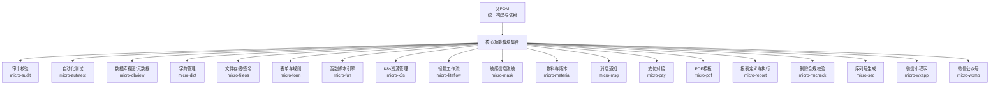
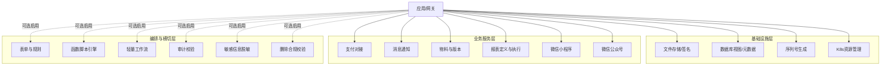
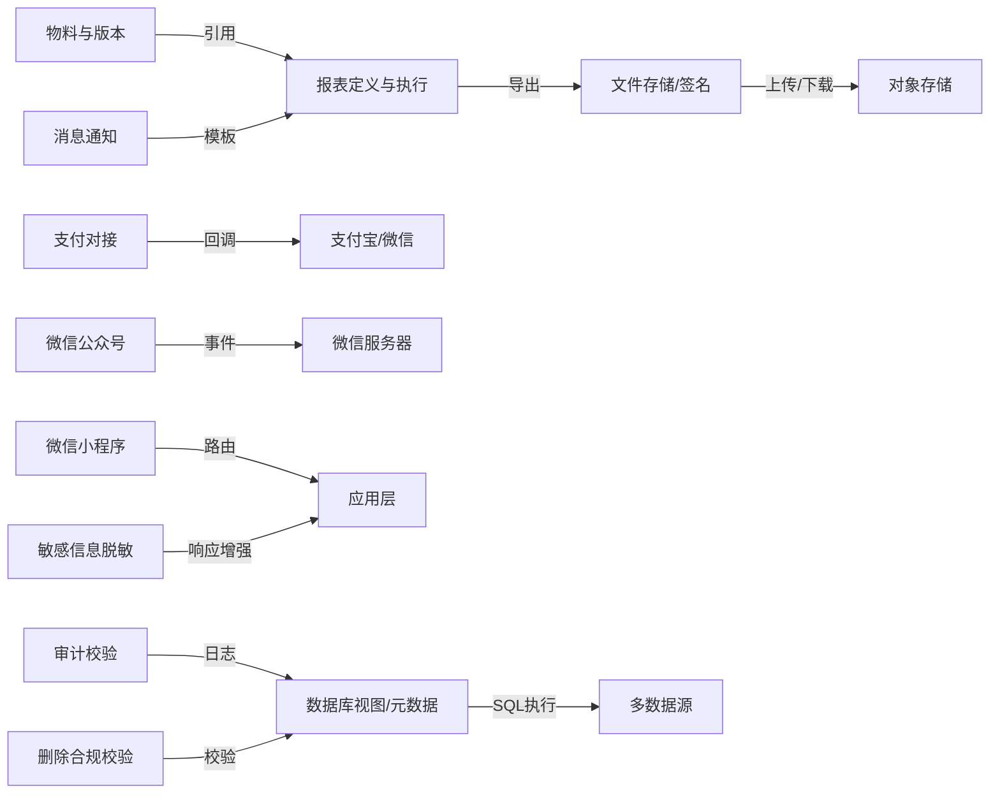

# 核心功能模块

<cite>
**本文引用的文件**
- [README.md](file://README.md)
- [CONTEXT.md](file://CONTEXT.md)
- [docs/living-docs-business/modules/README.md](file://docs/living-docs-business/modules/README.md)
- [docs/living-docs-technical/modules/README.md](file://docs/living-docs-technical/modules/README.md)
- [docs/stories/基础设施/README.md](file://docs/stories/基础设施/README.md)
- [docs/stories/审计校验/README.md](file://docs/stories/审计校验/README.md)
- [docs/stories/微信/README.md](file://docs/stories/微信/README.md)
- [docs/stories/支付/README.md](file://docs/stories/支付/README.md)
- [docs/stories/数据管理/README.md](file://docs/stories/数据管理/README.md)
- [docs/stories/文件文档/README.md](file://docs/stories/文件文档/README.md)
- [docs/stories/消息通知/README.md](file://docs/stories/消息通知/README.md)
- [micro-audit/pom.xml](file://micro-audit/pom.xml)
- [micro-autotest/README.md](file://micro-autotest/README.md)
- [micro-dbview/pom.xml](file://micro-dbview/pom.xml)
- [micro-dict/pom.xml](file://micro-dict/pom.xml)
- [micro-fileos/pom.xml](file://micro-fileos/pom.xml)
- [micro-form/pom.xml](file://micro-form/pom.xml)
- [micro-fun/pom.xml](file://micro-fun/pom.xml)
- [micro-k8s/pom.xml](file://micro-k8s/pom.xml)
- [micro-liteflow/pom.xml](file://micro-liteflow/pom.xml)
- [micro-mask/pom.xml](file://micro-mask/pom.xml)
- [micro-material/pom.xml](file://micro-material/pom.xml)
- [micro-msg/pom.xml](file://micro-msg/pom.xml)
- [micro-pay/pom.xml](file://micro-pay/pom.xml)
- [micro-pdf/pom.xml](file://micro-pdf/pom.xml)
- [micro-report/pom.xml](file://micro-report/pom.xml)
- [micro-rmcheck/pom.xml](file://micro-rmcheck/pom.xml)
- [micro-seq/pom.xml](file://micro-seq/pom.xml)
- [micro-wxapp/pom.xml](file://micro-wxapp/pom.xml)
- [micro-wxmp/pom.xml](file://micro-wxmp/pom.xml)
</cite>

## 目录
1. [简介](#简介)
2. [项目结构](#项目结构)
3. [核心组件](#核心组件)
4. [架构总览](#架构总览)
5. [详细组件分析](#详细组件分析)
6. [依赖分析](#依赖分析)
7. [性能考虑](#性能考虑)
8. [故障排查指南](#故障排查指南)
9. [结论](#结论)
10. [附录](#附录)

## 简介
本文件面向 sh-microapp 的18个核心功能模块，提供综合性功能概览：每个模块的业务定位、解决的关键问题、在微服务架构中的角色、模块间依赖与交互模式、模块化设计对业务能力独立演进与组合使用的影响、模块选择指南、集成最佳实践与常见场景、以及生命周期管理、版本兼容性与升级策略建议。  
该仓库采用多模块 Maven 结构，每个功能模块以独立子工程存在，便于按需启用与独立演进。

## 项目结构
- 顶层通过统一的父 POM 管理构建与依赖；各功能模块位于根目录下，命名遵循“micro-模块名”的约定。
- 业务侧“活文档”位于 docs/living-docs-business，技术侧“活文档”位于 docs/living-docs-technical，二者共同描述模块边界、职责与交互。
- 各模块均提供 pom.xml 作为构建配置入口，便于独立打包与发布。

图表来源
- [README.md](file://README.md)
- [CONTEXT.md](file://CONTEXT.md)
- [docs/living-docs-business/modules/README.md](file://docs/living-docs-business/modules/README.md)

章节来源
- [README.md](file://README.md)
- [CONTEXT.md](file://CONTEXT.md)
- [docs/living-docs-business/modules/README.md](file://docs/living-docs-business/modules/README.md)

## 核心组件
以下从“业务价值—核心问题—模块职责—在架构中位置”四个维度，对18个模块进行概览式梳理（不含代码片段）：

- 审计校验（micro-audit）
  - 业务价值：保障数据变更可追溯、合规可审计。
  - 核心问题：如何记录字段级差异、生成变更日志、支持回溯与合规检查。
  - 模块职责：提供变更日志采集、对比与查询接口，支撑审计与风控。
  - 架构位置：横切能力，被业务模块调用或由框架自动触发。

- 自动化测试（micro-autotest）
  - 业务价值：提升接口与流程测试效率与覆盖率。
  - 核心问题：如何扫描接口、生成/执行测试用例、输出报告与结果统计。
  - 模块职责：扫描 API、执行器、报告生成、Mock 辅助。
  - 架构位置：开发/测试期能力，可独立部署或内嵌于应用。

- 数据库视图/元数据（micro-dbview）
  - 业务价值：统一数据源接入、SQL 执行与元数据管理。
  - 核心问题：如何安全地动态访问多数据源、执行 DDL/DML、管理权限与历史。
  - 模块职责：数据源管理、连接服务、元数据、SQL 执行、DDL、权限与历史。
  - 架构位置：基础设施层，为上层数据管理与报表提供底座。

- 字典管理（micro-dict）
  - 业务价值：标准化业务字典与字典项，支撑全局复用。
  - 核心问题：如何实现字典类型与项的增删改查、批量导入与缓存一致性。
  - 模块职责：字典与字典项 CRUD、缓存、权限控制。
  - 架构位置：基础数据层，跨模块共享。

- 文件存储/签名（micro-fileos）
  - 业务价值：统一文件上传、签名下载、目录与桶管理。
  - 核心问题：如何实现预签名上传、签名下载、分片清理、路径与类型处理。
  - 模块职责：桶/目录/记录/分片管理，签名与下载接口，辅助工具。
  - 架构位置：基础设施层，对外提供文件能力。

- 表单与规则（micro-form）
  - 业务价值：可视化/可配置的表单与规则引擎，降低前端/后端耦合。
  - 核心问题：如何抽象表单项、规则字段、验证器与模板，支持运行时校验。
  - 模块职责：表单、规则、字段、验证器与模板的 CRUD 与缓存。
  - 架构位置：业务编排层，与前端/客户端协同。

- 函数脚本引擎（micro-fun）
  - 业务价值：通过函数/脚本扩展业务逻辑，快速响应变化。
  - 核心问题：如何安全地加载与执行脚本、分类组织函数、提供运行时服务。
  - 模块职责：函数与分类管理、脚本引擎与服务封装。
  - 架构位置：扩展层，按需启用。

- K8s 资源管理（micro-k8s）
  - 业务价值：在微服务环境中管理自定义资源与集群资源。
  - 核心问题：如何对接 Kubernetes API、管理 CRD 与内置资源。
  - 模块职责：自定义资源与内置资源的管理、辅助工具。
  - 架构位置：基础设施层，面向运维与平台能力。

- 轻量工作流（micro-liteflow）
  - 业务价值：以脚本/链路驱动轻量业务流程，替代复杂状态机。
  - 核心问题：如何定义流程链、脚本节点与通用执行器。
  - 模块职责：流程链与脚本的定义、执行与通用 REST 接口。
  - 架构位置：编排层，适合事件驱动与简单编排。

- 敏感信息脱敏（micro-mask）
  - 业务价值：在返回层对敏感字段进行脱敏，满足合规要求。
  - 核心问题：如何基于规则对响应体进行脱敏处理。
  - 模块职责：脱敏规则管理与响应增强。
  - 架构位置：横切层，可全局生效。

- 物料与版本（micro-material）
  - 业务价值：物料的全生命周期管理与版本追踪。
  - 核心问题：如何管理物料、分组、引用、转移与版本。
  - 模块职责：物料、分组、引用、转移日志与版本管理。
  - 架构位置：业务数据层，支撑产品/内容管理。

- 消息通知（micro-msg）
  - 业务价值：统一的消息模板、通知与用户设置管理。
  - 核心问题：如何管理模板、发送通知、记录用户设置与个人记录。
  - 模块职责：模板、通知、用户设置与个人记录的管理。
  - 架构位置：业务服务层，面向用户触达。

- 支付对接（micro-pay）
  - 业务价值：统一下单、回调、配置与定时任务处理。
  - 核心问题：如何对接支付宝/微信支付，处理订单与超时清理。
  - 模块职责：支付配置、订单管理、回调 SPI、定时任务。
  - 架构位置：业务服务层，面向交易闭环。

- PDF 模板（micro-pdf）
  - 业务价值：统一 PDF 模板管理与渲染能力。
  - 核心问题：如何管理模板、配置与渲染辅助。
  - 模块职责：模板管理与渲染辅助。
  - 架构位置：文档服务层，支撑导出与打印。

- 报表定义与执行（micro-report）
  - 业务价值：报表定义、参数、结果与执行过程的全生命周期管理。
  - 核心问题：如何定义报表、传参与结果管理、执行与导出。
  - 模块职责：定义、参数、结果与执行服务。
  - 架构位置：数据分析层，面向运营与决策。

- 删除合规校验（micro-rmcheck）
  - 业务价值：删除前的合规校验，避免误删与违规。
  - 核心问题：如何配置规则、校验关联数据并拒绝危险删除。
  - 模块职责：规则与规则项的管理与校验。
  - 架构位置：横切层，保护关键数据。

- 序列号生成（micro-seq）
  - 业务价值：提供全局唯一且有序的序列号，满足编号与追踪需求。
  - 核心问题：如何高效、可靠地生成序列号。
  - 模块职责：序列号生成 API 与持久化。
  - 架构位置：基础设施层，通用能力。

- 微信小程序（micro-wxapp）
  - 业务价值：小程序侧的业务能力封装与路由暴露。
  - 核心问题：如何在小程序环境提供稳定的接口与配置。
  - 模块职责：小程序相关 API、配置与路由。
  - 架构位置：业务服务层，面向小程序生态。

- 微信公众号（micro-wxmp）
  - 业务价值：公众号侧的事件处理、消息构建与服务编排。
  - 核心问题：如何处理微信回调、构建消息与管理服务。
  - 模块职责：处理器、构建器、配置与服务。
  - 架构位置：业务服务层，面向公众号生态。

章节来源
- [docs/living-docs-business/modules/README.md](file://docs/living-docs-business/modules/README.md)
- [docs/living-docs-technical/modules/README.md](file://docs/living-docs-technical/modules/README.md)
- [docs/stories/基础设施/README.md](file://docs/stories/基础设施/README.md)
- [docs/stories/审计校验/README.md](file://docs/stories/审计校验/README.md)
- [docs/stories/微信/README.md](file://docs/stories/微信/README.md)
- [docs/stories/支付/README.md](file://docs/stories/支付/README.md)
- [docs/stories/数据管理/README.md](file://docs/stories/数据管理/README.md)
- [docs/stories/文件文档/README.md](file://docs/stories/文件文档/README.md)
- [docs/stories/消息通知/README.md](file://docs/stories/消息通知/README.md)

## 架构总览
模块化设计通过“能力边界清晰、接口稳定、可插拔启用”实现业务能力的独立演进与组合使用。整体架构分为三层：
- 基础设施层：文件存储、数据库视图、序列号、K8s 管理等，提供通用能力。
- 业务服务层：支付、消息通知、物料、报表、小程序/公众号等，承载具体业务。
- 编排与横切层：表单规则、函数脚本、轻量工作流、审计校验、脱敏、删除校验等，提供扩展与治理能力。

图表来源
- [docs/living-docs-business/modules/README.md](file://docs/living-docs-business/modules/README.md)
- [docs/living-docs-technical/modules/README.md](file://docs/living-docs-technical/modules/README.md)

## 详细组件分析

### 审计校验（micro-audit）
- 主要业务功能：字段级变更记录、差异对比、变更日志查询。
- 解决的核心问题：数据变更不可见、审计证据缺失、合规检查困难。
- 在架构中的作用：横切能力，贯穿业务模块，保障可追溯性。
- 交互模式：业务模块触发采集，模块内部完成对比与入库，提供查询接口。
- 最佳实践：对关键表开启自动审计，结合脱敏与权限控制。

章节来源
- [docs/stories/审计校验/README.md](file://docs/stories/审计校验/README.md)
- [micro-audit/pom.xml](file://micro-audit/pom.xml)

### 自动化测试（micro-autotest）
- 主要业务功能：接口扫描、用例执行、报告生成、Mock 辅助。
- 解决的核心问题：测试效率低、覆盖率不足、回归成本高。
- 在架构中的作用：开发/测试期能力，可内嵌或独立部署。
- 交互模式：扫描 API → 生成用例 → 执行器执行 → 输出报告。
- 最佳实践：与 CI/CD 集成，按模块启用，定期生成报告。

章节来源
- [micro-autotest/README.md](file://micro-autotest/README.md)

### 数据库视图/元数据（micro-dbview）
- 主要业务功能：数据源管理、元数据查询、SQL 执行、DDL、权限与历史。
- 解决的核心问题：多数据源接入复杂、SQL 执行不统一、权限与历史缺失。
- 在架构中的作用：基础设施底座，为数据管理与报表提供统一入口。
- 交互模式：数据源配置 → 权限校验 → 元数据查询 → SQL 执行 → 历史记录。
- 最佳实践：严格权限控制、SQL 审计与历史归档。

章节来源
- [docs/stories/基础设施/README.md](file://docs/stories/基础设施/README.md)
- [micro-dbview/pom.xml](file://micro-dbview/pom.xml)

### 字典管理（micro-dict）
- 主要业务功能：字典类型与字典项的增删改查、批量导入、缓存。
- 解决的核心问题：业务字典分散、重复维护、缓存不一致。
- 在架构中的作用：基础数据层，跨模块共享。
- 交互模式：类型管理 → 字典项管理 → 缓存更新 → 业务读取。
- 最佳实践：集中维护、版本化变更、缓存失效策略。

章节来源
- [docs/stories/数据管理/README.md](file://docs/stories/数据管理/README.md)
- [micro-dict/pom.xml](file://micro-dict/pom.xml)

### 文件存储/签名（micro-fileos）
- 主要业务功能：桶/目录/记录/分片管理，预签名上传、签名下载。
- 解决的核心问题：文件上传/下载体验差、安全性与可靠性不足。
- 在架构中的作用：基础设施层，统一文件能力。
- 交互模式：预签名上传 → 分片清理 → 签名下载 → 记录归档。
- 最佳实践：最小权限、路径规范化、过期清理与哈希校验。

章节来源
- [docs/stories/文件文档/README.md](file://docs/stories/文件文档/README.md)
- [micro-fileos/pom.xml](file://micro-fileos/pom.xml)

### 表单与规则（micro-form）
- 主要业务功能：表单、规则、字段、验证器与模板的 CRUD 与缓存。
- 解决的核心问题：表单与校验逻辑耦合、前端/后端重复实现。
- 在架构中的作用：业务编排层，降低前后端耦合。
- 交互模式：定义表单与规则 → 运行时校验 → 返回错误信息。
- 最佳实践：模板化与缓存、AOP 统一拦截。

章节来源
- [docs/stories/数据管理/README.md](file://docs/stories/数据管理/README.md)
- [micro-form/pom.xml](file://micro-form/pom.xml)

### 函数脚本引擎（micro-fun）
- 主要业务功能：函数与分类管理、脚本引擎与服务封装。
- 解决的核心问题：业务逻辑频繁变更导致代码膨胀。
- 在架构中的作用：扩展层，按需启用。
- 交互模式：函数定义 → 分类组织 → 脚本执行 → 结果返回。
- 最佳实践：沙箱与白名单、版本化与灰度。

章节来源
- [micro-fun/pom.xml](file://micro-fun/pom.xml)

### K8s 资源管理（micro-k8s）
- 主要业务功能：自定义资源与内置资源的管理。
- 解决的核心问题：集群资源管理复杂、运维成本高。
- 在架构中的作用：基础设施层，面向平台与运维。
- 交互模式：CRD/内置资源 → 客户端 → 管理服务。
- 最佳实践：RBAC 控制、只读优先、变更审计。

章节来源
- [micro-k8s/pom.xml](file://micro-k8s/pom.xml)

### 轻量工作流（micro-liteflow）
- 主要业务功能：流程链与脚本的定义、执行与通用 REST 接口。
- 解决的核心问题：复杂状态机难以维护、事件驱动编排困难。
- 在架构中的作用：编排层，适合简单流程。
- 交互模式：定义链路 → 脚本节点 → 执行器 → 结果反馈。
- 最佳实践：链路可视化、失败重试与可观测性。

章节来源
- [micro-liteflow/pom.xml](file://micro-liteflow/pom.xml)

### 敏感信息脱敏（micro-mask）
- 主要业务功能：基于规则对响应体进行脱敏处理。
- 解决的核心问题：敏感信息泄露风险、合规要求。
- 在架构中的作用：横切层，可全局生效。
- 交互模式：规则配置 → 响应增强 → 脱敏输出。
- 最佳实践：最小暴露原则、规则热更新。

章节来源
- [micro-mask/pom.xml](file://micro-mask/pom.xml)

### 物料与版本（micro-material）
- 主要业务功能：物料、分组、引用、转移日志与版本管理。
- 解决的核心问题：物料散乱、版本混乱、追踪困难。
- 在架构中的作用：业务数据层，支撑产品/内容管理。
- 交互模式：物料管理 → 分组与引用 → 版本与转移 → 日志归档。
- 最佳实践：版本号策略、原子性操作、幂等设计。

章节来源
- [micro-material/pom.xml](file://micro-material/pom.xml)

### 消息通知（micro-msg）
- 主要业务功能：模板、通知、用户设置与个人记录管理。
- 解决的核心问题：消息渠道分散、模板与用户设置不统一。
- 在架构中的作用：业务服务层，面向用户触达。
- 交互模式：模板管理 → 通知发送 → 用户记录与设置。
- 最佳实践：异步发送、重试与去重、用户偏好管理。

章节来源
- [micro-msg/pom.xml](file://micro-msg/pom.xml)

### 支付对接（micro-pay）
- 主要业务功能：支付配置、订单管理、回调 SPI、定时任务。
- 解决的核心问题：多支付渠道接入复杂、回调与对账困难。
- 在架构中的作用：业务服务层，面向交易闭环。
- 交互模式：下单 → 支付渠道 → 回调 → 对账与清理。
- 最佳实践：幂等下单、回调鉴权、超时清理。

章节来源
- [docs/stories/支付/README.md](file://docs/stories/支付/README.md)
- [micro-pay/pom.xml](file://micro-pay/pom.xml)

### PDF 模板（micro-pdf）
- 主要业务功能：模板管理与渲染辅助。
- 解决的核心问题：导出格式不统一、模板维护困难。
- 在架构中的作用：文档服务层。
- 交互模式：模板定义 → 渲染辅助 → 导出输出。
- 最佳实践：模板版本化、渲染缓存、异常兜底。

章节来源
- [micro-pdf/pom.xml](file://micro-pdf/pom.xml)

### 报表定义与执行（micro-report）
- 主要业务功能：报表定义、参数、结果与执行服务。
- 解决的核心问题：报表定义分散、执行与导出不统一。
- 在架构中的作用：数据分析层。
- 交互模式：定义与参数 → 执行 → 结果归档 → 导出。
- 最佳实践：SQL 审计、分页与并发控制、导出队列。

章节来源
- [micro-report/pom.xml](file://micro-report/pom.xml)

### 删除合规校验（micro-rmcheck）
- 主要业务功能：规则与规则项的管理与校验。
- 解决的核心问题：误删与违规删除风险。
- 在架构中的作用：横切层，保护关键数据。
- 交互模式：规则配置 → 关联校验 → 拒绝删除。
- 最佳实践：规则可视化、白名单与灰度。

章节来源
- [micro-rmcheck/pom.xml](file://micro-rmcheck/pom.xml)

### 序列号生成（micro-seq）
- 主要业务功能：全局唯一且有序的序列号生成。
- 解决的核心问题：编号冲突、无序与不可追踪。
- 在架构中的作用：基础设施层，通用能力。
- 交互模式：请求 → 号段/单点 → 写入 → 返回。
- 最佳实践：号段缓存、降级与熔断。

章节来源
- [micro-seq/pom.xml](file://micro-seq/pom.xml)

### 微信小程序（micro-wxapp）
- 主要业务功能：小程序侧的业务能力封装与路由暴露。
- 解决的核心问题：小程序生态适配与接口稳定性。
- 在架构中的作用：业务服务层。
- 交互模式：小程序请求 → 路由 → 业务服务。
- 最佳实践：鉴权与限流、参数校验。

章节来源
- [micro-wxapp/pom.xml](file://micro-wxapp/pom.xml)

### 微信公众号（micro-wxmp）
- 主要业务功能：事件处理、消息构建与服务编排。
- 解决的核心问题：微信回调处理复杂、消息构建不统一。
- 在架构中的作用：业务服务层。
- 交互模式：接收事件 → 处理器 → 构建消息 → 发送。
- 最佳实践：签名校验、幂等与异步处理。

章节来源
- [micro-wxmp/pom.xml](file://micro-wxmp/pom.xml)

## 依赖分析
- 模块内聚与解耦：各模块以独立子工程存在，通过 REST/接口交互，避免强耦合。
- 外部依赖：模块通常依赖 Spring Boot 自动装配机制与 MyBatis Mapper/XML，部分模块依赖第三方 SDK（如支付、K8s 客户端）。
- 可能的循环依赖：模块间无直接代码依赖，通过接口/路由交互，不存在循环依赖风险。
- 配置与自动装配：多数模块在 META-INF/spring 下声明自动装配入口，便于按需启用。

图表来源
- [micro-pay/pom.xml](file://micro-pay/pom.xml)
- [micro-wxmp/pom.xml](file://micro-wxmp/pom.xml)
- [micro-fileos/pom.xml](file://micro-fileos/pom.xml)
- [micro-dbview/pom.xml](file://micro-dbview/pom.xml)
- [micro-report/pom.xml](file://micro-report/pom.xml)
- [micro-material/pom.xml](file://micro-material/pom.xml)
- [micro-msg/pom.xml](file://micro-msg/pom.xml)
- [micro-audit/pom.xml](file://micro-audit/pom.xml)
- [micro-mask/pom.xml](file://micro-mask/pom.xml)
- [micro-rmcheck/pom.xml](file://micro-rmcheck/pom.xml)

章节来源
- [micro-pay/pom.xml](file://micro-pay/pom.xml)
- [micro-wxmp/pom.xml](file://micro-wxmp/pom.xml)
- [micro-fileos/pom.xml](file://micro-fileos/pom.xml)
- [micro-dbview/pom.xml](file://micro-dbview/pom.xml)
- [micro-report/pom.xml](file://micro-report/pom.xml)
- [micro-material/pom.xml](file://micro-material/pom.xml)
- [micro-msg/pom.xml](file://micro-msg/pom.xml)
- [micro-audit/pom.xml](file://micro-audit/pom.xml)
- [micro-mask/pom.xml](file://micro-mask/pom.xml)
- [micro-rmcheck/pom.xml](file://micro-rmcheck/pom.xml)

## 性能考虑
- 缓存策略：字典、表单规则、文件桶/目录、PDF 模板、序列号等模块建议引入本地/分布式缓存，减少重复查询。
- 异步与批处理：消息通知、报表导出、文件分片清理等场景采用异步与队列，避免阻塞主流程。
- 并发与限流：微信回调、支付回调、文件上传等接口需做限流与幂等处理。
- SQL 优化：报表与元数据查询需关注索引、分页与只读事务。
- 容灾与降级：支付、文件、消息等关键链路需具备降级与熔断策略。

## 故障排查指南
- 审计校验：核对变更日志是否入库、字段对比是否正确、查询接口是否返回最新。
- 自动化测试：检查扫描范围、用例执行日志、报告生成是否成功。
- 数据库视图：确认数据源连通性、权限、DDL 执行与历史记录。
- 字典管理：核对缓存一致性、批量导入是否幂等。
- 文件存储：检查预签名有效期、分片清理任务、哈希校验与目录权限。
- 表单与规则：确认规则缓存刷新、AOP 校验是否生效。
- 函数脚本：检查脚本引擎可用性、白名单与隔离。
- K8s 资源：核对 RBAC、CRD 安装与客户端配置。
- 轻量工作流：检查链路定义、脚本节点与执行器状态。
- 敏感信息脱敏：核对规则匹配与响应增强时机。
- 物料与版本：核对引用关系、转移日志与版本号策略。
- 消息通知：核对模板、用户设置与个人记录一致性。
- 支付对接：核对回调签名、幂等与超时清理。
- PDF 模板：核对模板渲染与导出异常。
- 报表定义：核对参数绑定、SQL 审计与导出队列。
- 删除合规校验：核对规则配置与关联校验。
- 序列号生成：核对号段缓存与降级策略。
- 微信小程序/公众号：核对路由与鉴权、签名校验与幂等。

章节来源
- [docs/stories/审计校验/README.md](file://docs/stories/审计校验/README.md)
- [docs/stories/基础设施/README.md](file://docs/stories/基础设施/README.md)
- [docs/stories/文件文档/README.md](file://docs/stories/文件文档/README.md)
- [docs/stories/数据管理/README.md](file://docs/stories/数据管理/README.md)
- [docs/stories/消息通知/README.md](file://docs/stories/消息通知/README.md)
- [docs/stories/支付/README.md](file://docs/stories/支付/README.md)
- [docs/stories/微信/README.md](file://docs/stories/微信/README.md)

## 结论
sh-microapp 的18个核心模块通过清晰的能力边界与稳定的接口，实现了业务能力的独立演进与灵活组合。基础设施层提供通用能力，业务服务层承载具体业务，编排与横切层增强扩展与治理。模块化设计使团队可以按需启用与迭代，同时通过“活文档”与“故事”持续沉淀业务与技术知识，支撑长期演进。

## 附录
- 模块选择指南
  - 需要数据变更可追溯：启用 审计校验。
  - 需要统一文件能力：启用 文件存储/签名。
  - 需要多数据源与元数据：启用 数据库视图/元数据。
  - 需要统一字典与字典项：启用 字典管理。
  - 需要表单与规则：启用 表单与规则。
  - 需要扩展逻辑：启用 函数脚本引擎。
  - 需要流程编排：启用 轻量工作流。
  - 需要敏感信息脱敏：启用 敏感信息脱敏。
  - 需要物料与版本：启用 物料与版本。
  - 需要消息通知：启用 消息通知。
  - 需要支付对接：启用 支付对接。
  - 需要 PDF 模板：启用 PDF 模板。
  - 需要报表定义与执行：启用 报表定义与执行。
  - 需要删除合规校验：启用 删除合规校验。
  - 需要序列号：启用 序列号生成。
  - 需要微信小程序能力：启用 微信小程序。
  - 需要微信公众号能力：启用 微信公众号。
  - 需要 K8s 资源管理：启用 K8s 资源管理。
- 集成最佳实践
  - 以模块为单位启用/禁用，避免不必要的依赖。
  - 使用统一的路由与鉴权策略，确保安全。
  - 对关键链路实施异步化、缓存与监控。
  - 通过“活文档”与“故事”持续完善模块边界与交互。
- 生命周期管理、版本兼容性与升级策略
  - 生命周期：开发（模块内测）→ 测试（全链路联调）→ 预生产（灰度）→ 生产（全量）。
  - 版本兼容：保持接口向后兼容，必要时引入版本前缀或特性开关。
  - 升级策略：灰度发布、回滚预案、监控告警与压测验证。