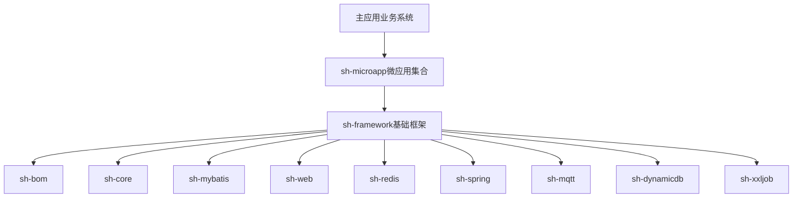
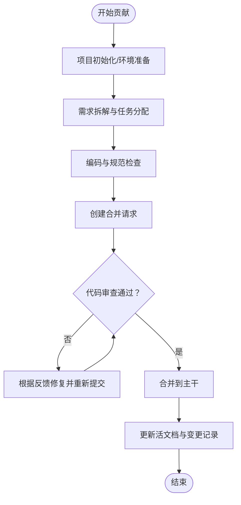
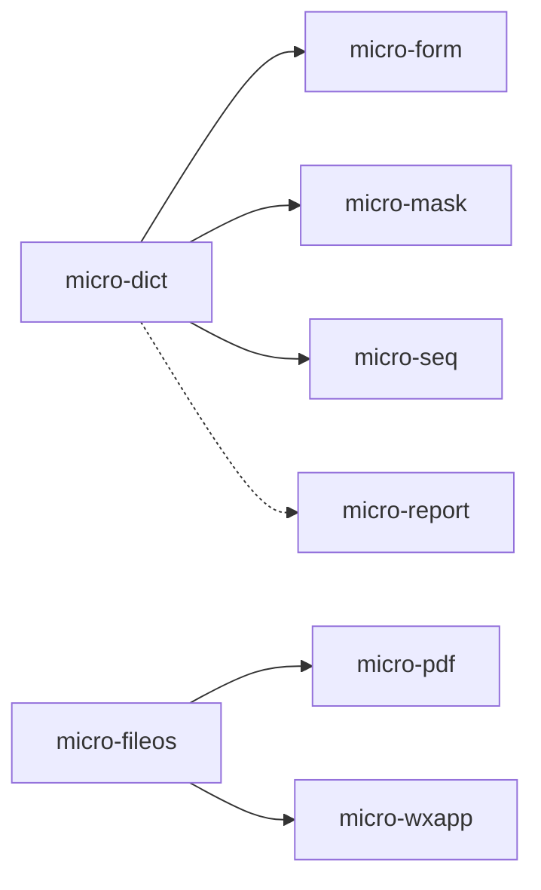

# 社区贡献

<cite>
**本文引用的文件**
- [README.md](file://README.md)
- [CONTEXT.md](file://CONTEXT.md)
- [LICENSE](file://LICENSE)
- [AGENTS.md](file://AGENTS.md)
- [pom.xml](file://pom.xml)
- [docs/dev-process.md](file://docs/dev-process.md)
- [docs/living-docs-guide.md](file://docs/living-docs-guide.md)
- [docs/stories-guide.md](file://docs/stories-guide.md)
- [docs/requirement-template.md](file://docs/requirement-template.md)
- [docs/coding-standards/java.md](file://docs/coding-standards/java.md)
</cite>

## 目录
1. [简介](#简介)
2. [项目结构](#项目结构)
3. [核心组件](#核心组件)
4. [架构总览](#架构总览)
5. [详细组件分析](#详细组件分析)
6. [依赖分析](#依赖分析)
7. [性能考虑](#性能考虑)
8. [故障排查指南](#故障排查指南)
9. [结论](#结论)
10. [附录](#附录)

## 简介
本指南面向希望参与 sh-microapp 微服务框架建设的社区贡献者，系统阐述贡献流程、行为准则、代码审查与合并规范、需求与故事卡片的使用、任务分配机制、文档与测试贡献方式、社区沟通与决策流程、许可证与知识产权政策，以及新老贡献者的角色分工。目标是帮助不同背景的参与者高效协作，共同维护高质量、可持续演进的微应用生态。

## 项目结构
sh-microapp 是一个以 Spring Boot 4.x + Java 25 为基础的微应用集合项目，统一依赖 sh-framework 框架。项目采用多模块聚合结构，父工程通过 Maven 管理模块生命周期与依赖版本。

- 父工程与模块
  - 父工程：统一属性、插件与模块声明
  - 模块：按业务域划分的 micro-* 模块，每个模块遵循统一的目录结构与开发规范
- 项目上下文
  - 技术栈、核心业务领域、关键约束与外部依赖均在上下文文档中给出

```mermaid
graph TB
Root["sh-microapp 父工程<br/>聚合多模块"] --> ModAudit["micro-audit"]
Root --> ModDict["micro-dict"]
Root --> ModFileOS["micro-fileos"]
Root --> ModLiteFlow["micro-liteflow"]
Root --> ModForm["micro-form"]
Root --> ModFun["micro-fun"]
Root --> ModK8s["micro-k8s"]
Root --> ModMask["micro-mask"]
Root --> ModMaterial["micro-material"]
Root --> ModMsg["micro-msg"]
Root --> ModPay["micro-pay"]
Root --> ModPdf["micro-pdf"]
Root --> ModRmCheck["micro-rmcheck"]
Root --> ModSeq["micro-seq"]
Root --> ModWxApp["micro-wxapp"]
Root --> ModWxMp["micro-wxmp"]
Root --> ModAutoTest["micro-autotest"]
Root --> ModDbView["micro-dbview"]
Root --> ModReport["micro-report"]
```

图表来源
- [pom.xml:28-48](file://pom.xml#L28-L48)

章节来源
- [pom.xml:1-50](file://pom.xml#L1-L50)
- [CONTEXT.md:5-43](file://CONTEXT.md#L5-L43)

## 核心组件
- 开发与贡献规范
  - 研发过程规范：项目初始化、需求拆解、编码规范、规范检查、代码审查、活文档更新
  - 编码规范：Java 命名、风格、注释、异常、集合、并发、日志等最佳实践
  - 活文档更新规则：技术与业务两类活文档的更新时机、格式与原则
  - Stories 拆解规则：系统逻辑分析、故事粒度与命名、Mermaid 图规范、文件组织与索引
  - 需求拆解模板：需求描述、目标、验收标准、影响范围、任务拆解、技术方案与风险点
- 项目上下文与开发指南
  - 项目概述、技术栈、核心业务领域、关键约束与外部依赖
  - 模块清单、标准目录结构、自动配置与路由常量、实体/Mapper/Service/REST 控制器约定
  - 数据库命名与基础字段、依赖关系、开发流程、常见问题与质量门禁

章节来源
- [docs/dev-process.md:1-189](file://docs/dev-process.md#L1-L189)
- [docs/coding-standards/java.md:1-707](file://docs/coding-standards/java.md#L1-L707)
- [docs/living-docs-guide.md:1-89](file://docs/living-docs-guide.md#L1-L89)
- [docs/stories-guide.md:1-100](file://docs/stories-guide.md#L1-L100)
- [docs/requirement-template.md:1-94](file://docs/requirement-template.md#L1-L94)
- [AGENTS.md:1-368](file://AGENTS.md#L1-L368)
- [CONTEXT.md:5-43](file://CONTEXT.md#L5-L43)

## 架构总览
sh-microapp 通过微应用模块承接独立业务能力，主应用按需引入所需模块。底层统一依赖 sh-framework，提供 BOM、核心基础、ORM、Web 扩展、Redis、Spring 扩展、MQTT、动态数据源、定时任务等能力。

图表来源
- [AGENTS.md:21-45](file://AGENTS.md#L21-L45)
- [CONTEXT.md:33-43](file://CONTEXT.md#L33-L43)

## 详细组件分析

### 贡献流程与工作流
- 项目初始化
  - 使用脚本或 AI 指引初始化，按规范调整目录结构、配置工具链、创建初始提交与规范文档
- 需求拆解与任务分配
  - 使用需求拆解模板，按“描述、验收标准、影响范围”进行拆解，任务粒度控制在 1-2 天内完成，设定优先级（P0/P1/P2）
  - Stories 拆解：按业务域/模块分组，使用 Mermaid 流程图与时序图表达完整流程
- 编码与规范检查
  - 遵循编码规范，提交前执行 pre-commit 检查（lint、格式化、类型检查等）
  - CI 质量门禁：Lint → 类型检查 → Test → Build，任一阶段失败阻断流水线
- 代码审查与合并
  - MR 至少一名审查者通过，审查要点包括逻辑正确性、规范符合度、测试覆盖、安全风险与对现有功能的影响
  - 审查反馈应在 1 个工作日内响应
- 活文档更新
  - 每次任务完成后，同步更新技术与业务两类活文档，并在业务变更日志中记录

图表来源
- [docs/dev-process.md:7-31](file://docs/dev-process.md#L7-L31)
- [docs/dev-process.md:34-58](file://docs/dev-process.md#L34-L58)
- [docs/dev-process.md:145-189](file://docs/dev-process.md#L145-L189)

章节来源
- [docs/dev-process.md:1-189](file://docs/dev-process.md#L1-L189)
- [docs/stories-guide.md:1-100](file://docs/stories-guide.md#L1-L100)
- [docs/requirement-template.md:1-94](file://docs/requirement-template.md#L1-L94)

### 代码规范与质量门禁
- Java 编码规范
  - 命名、代码风格、注释、异常处理、集合使用、并发编程、日志规范与最佳实践
  - 核心规则：禁止调用系统资源、保留注释、关键位置加日志、更新文档、Req/Resp 封装
- 质量门禁
  - lint、test、build、typecheck 四阶段门禁，确保代码质量与一致性

章节来源
- [docs/coding-standards/java.md:1-707](file://docs/coding-standards/java.md#L1-L707)
- [AGENTS.md:339-346](file://AGENTS.md#L339-L346)

### 活文档与技术债务
- 活文档更新规则
  - 技术与业务两类活文档的更新时机、格式与通用原则
  - 技术债状态变更需在业务变更日志中记录
- 技术债扫描与约定
  - 通过扫描与约定机制持续识别与治理技术债

章节来源
- [docs/living-docs-guide.md:1-89](file://docs/living-docs-guide.md#L1-L89)

### 模块开发与约定
- 标准目录结构与自动配置
  - 每个 micro-* 模块遵循统一目录结构，包含自动配置类、实体、Mapper、Service、REST 控制器、资源与 Spring 自动装配导入文件
- 路由常量与统一响应
  - Route 接口定义模块路由前缀与常用路径，REST 控制器统一返回 R<T> 统一响应对象
- 数据库规范
  - 表与字段命名、基础字段、扩展字段、逻辑删除与乐观锁策略

章节来源
- [AGENTS.md:106-215](file://AGENTS.md#L106-L215)
- [AGENTS.md:272-314](file://AGENTS.md#L272-L314)

### 需求与故事卡片
- 需求拆解模板
  - 背景、目标、验收标准、影响范围、任务拆解、技术方案与风险点
- Stories 拆解规则
  - 系统逻辑分析步骤、故事命名与优先级、Mermaid 图规范、文件组织与索引

章节来源
- [docs/requirement-template.md:1-94](file://docs/requirement-template.md#L1-L94)
- [docs/stories-guide.md:1-100](file://docs/stories-guide.md#L1-L100)

### 测试与文档贡献
- 测试贡献
  - 遵循编码规范与质量门禁，确保单元测试与集成测试覆盖充分
- 文档贡献
  - 活文档与变更日志同步更新，保持“当前状态”，禁止文档滞后

章节来源
- [docs/dev-process.md:167-189](file://docs/dev-process.md#L167-L189)
- [docs/living-docs-guide.md:65-71](file://docs/living-docs-guide.md#L65-L71)

### 社区交流与决策
- 交流渠道与讨论规则
  - 建议通过 Issue/PR 讨论需求与变更，遵循礼貌、客观、聚焦技术的原则
- 决策流程
  - 重大变更通过需求拆解与 Stories 讨论形成共识，必要时上升到维护者评审

章节来源
- [docs/dev-process.md:171-181](file://docs/dev-process.md#L171-L181)

### 许可证与知识产权
- 许可证
  - 项目采用 MIT 许可证，允许自由使用、复制、修改、分发与再许可，但需保留版权与许可声明
- 知识产权
  - 贡献者对其原创作品保留版权；通过提交获得使用授权；第三方内容遵守其原许可证

章节来源
- [LICENSE:1-22](file://LICENSE#L1-L22)

### 新贡献者与资深贡献者
- 新贡献者
  - 从上下文与开发指南入手，完成环境搭建与模块初始化，从 P2 任务开始参与，逐步熟悉 Stories 与活文档
- 资深贡献者
  - 负责需求拆解、Stories 设计、代码审查与质量把关，推动活文档与技术债治理，协助新人成长

章节来源
- [CONTEXT.md:1-43](file://CONTEXT.md#L1-L43)
- [AGENTS.md:1-368](file://AGENTS.md#L1-L368)

## 依赖分析
- 模块间依赖
  - 数据字典模块与多个模块存在依赖关系，如表单规则、脱敏、序列号、报表参数等
  - 文件模块与 PDF、小程序媒体上传存在依赖关系
- 框架依赖
  - sh-bom 统一版本管理，sh-core 提供基础实体与统一响应，sh-mybatis 提供通用 CRUD 与分页，sh-redis 提供缓存与消息，sh-spring 提供扩展工具

图表来源
- [AGENTS.md:235-244](file://AGENTS.md#L235-L244)

章节来源
- [AGENTS.md:218-244](file://AGENTS.md#L218-L244)

## 性能考虑
- 缓存一致性与刷新
  - 使用 Redis Pub/Sub 广播刷新，3 秒防抖，避免频繁刷新带来的抖动
- 乐观锁与逻辑删除
  - 更新时携带 version，删除写入时间戳，减少并发冲突与数据不一致
- 事务与异常处理
  - 事务注解置于 Service 层，异常统一处理，避免异常控制流程

章节来源
- [AGENTS.md:304-314](file://AGENTS.md#L304-L314)

## 故障排查指南
- 常见问题
  - 模块未被 Spring 扫描到：检查 AutoConfiguration.imports 与 @ComponentScan 包路径
  - Mapper 无法注入：检查 @MapperScan 包路径
  - 依赖版本冲突：确认 sh-bom 统一管理，子模块不指定版本
  - 缓存不一致：确认 Redis Pub/Sub 频道通信正常
  - 乐观锁更新失败：前端需回传 version 字段
- 质量门禁
  - lint、test、build、typecheck 四阶段门禁，定位问题优先级

章节来源
- [AGENTS.md:317-326](file://AGENTS.md#L317-L326)
- [AGENTS.md:339-343](file://AGENTS.md#L339-L343)

## 结论
sh-microapp 通过标准化的模块结构、严格的编码规范与质量门禁、完善的活文档与 Stories 机制，构建了高可维护、可演进的微应用生态。贡献者应遵循本文档的流程与规范，积极参与需求拆解、代码审查与文档维护，共同推动项目健康持续发展。

## 附录
- 快速参考
  - 研发过程规范、编码规范、活文档更新规则、Stories 拆解规则、需求拆解模板
- 术语
  - 活文档：技术与业务两类文档，记录当前状态与变更历史
  - Stories：按业务域/模块分组的故事卡片，使用 Mermaid 图表达流程

章节来源
- [docs/dev-process.md:1-189](file://docs/dev-process.md#L1-L189)
- [docs/living-docs-guide.md:1-89](file://docs/living-docs-guide.md#L1-L89)
- [docs/stories-guide.md:1-100](file://docs/stories-guide.md#L1-L100)
- [docs/requirement-template.md:1-94](file://docs/requirement-template.md#L1-L94)