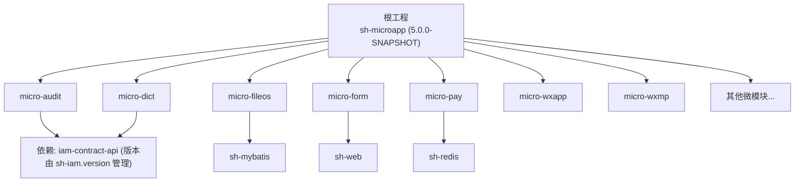
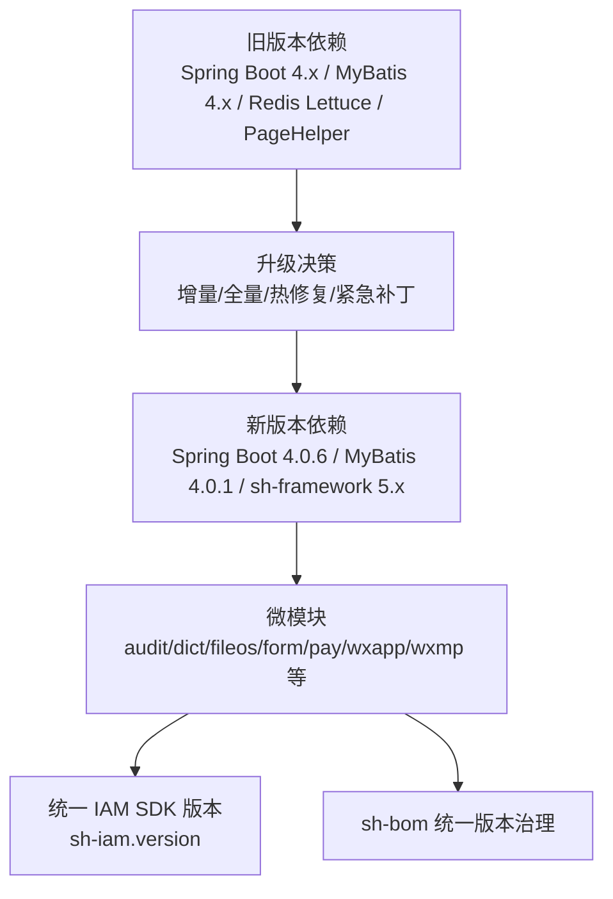
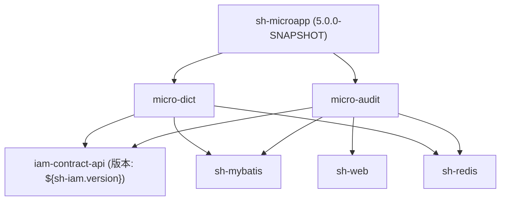

# 迁移升级

<cite>
**本文引用的文件**   
- [pom.xml](file://pom.xml)
- [README.md](file://README.md)
- [CONTEXT.md](file://CONTEXT.md)
- [docs/dev-process.md](file://docs/dev-process.md)
- [docs/living-docs-business/changelog.md](file://docs/living-docs-business/changelog.md)
- [micro-audit/pom.xml](file://micro-audit/pom.xml)
- [micro-dict/pom.xml](file://micro-dict/pom.xml)
</cite>

## 目录
1. [简介](#简介)
2. [项目结构](#项目结构)
3. [核心组件](#核心组件)
4. [架构总览](#架构总览)
5. [详细组件分析](#详细组件分析)
6. [依赖分析](#依赖分析)
7. [性能考虑](#性能考虑)
8. [故障排查指南](#故障排查指南)
9. [结论](#结论)
10. [附录](#附录)

## 简介
本文件面向 sh-microapp 微服务框架的版本迁移与升级，提供从旧版本到新版本的完整迁移指南，覆盖版本升级流程、兼容性要求、迁移策略、依赖版本影响分析与风险评估、向后兼容说明、废弃功能替代方案、增量与全量升级策略选择、热修复与紧急补丁处理、升级前后验证与监控等。  
本项目采用多模块聚合工程组织，统一基于 Spring Boot 4.x + Java 25，核心依赖由 sh-framework 提供，各微模块通过 AutoConfiguration.imports 注册自动配置，遵循统一的数据模型与响应规范。

章节来源
- [README.md:1-4](file://README.md#L1-L4)
- [CONTEXT.md:5-43](file://CONTEXT.md#L5-L43)

## 项目结构
sh-microapp 为多模块 Maven 聚合工程，顶层 POM 定义了父级版本与模块列表；各微模块（如 audit、dict、fileos、form、pay、wxapp、wxmp 等）均继承顶层版本并引入 sh-framework 的统一依赖。  
模块间通过 sh-iam 版本变量进行统一管理，确保跨模块的一致性与可追踪性。

图表来源
- [pom.xml:28-48](file://pom.xml#L28-L48)
- [micro-audit/pom.xml:22-40](file://micro-audit/pom.xml#L22-L40)
- [micro-dict/pom.xml:22-37](file://micro-dict/pom.xml#L22-L37)

章节来源
- [pom.xml:1-50](file://pom.xml#L1-L50)
- [CONTEXT.md:25-43](file://CONTEXT.md#L25-L43)

## 核心组件
- 版本与构建
  - 顶层 POM 定义了当前版本与 Java 25 目标编译级别，并通过 sh-iam.version 统一管理 IAM SDK 版本。
  - 各模块使用 ${revision} 作为模块版本占位符，确保与根版本保持一致。
- 依赖治理
  - 核心依赖由 sh-framework 提供，包括 sh-mybatis、sh-redis、sh-web 等，模块仅声明所需依赖即可复用统一版本。
  - 第三方依赖版本由 sh-bom 统一管理，避免版本漂移。
- 约束与规范
  - 所有模块必须通过 AutoConfiguration.imports 注册自动配置。
  - 实体继承 BaseEntity、Mapper 继承 BaseMapper、Service 继承 BaseService。
  - REST 返回统一使用 R<T>。
  - 逻辑删除字段 deleted，乐观锁字段 version。
  - 缓存使用 Redis Pub/Sub 广播刷新，带 3 秒防抖。

章节来源
- [pom.xml:19-26](file://pom.xml#L19-L26)
- [pom.xml:42-47](file://pom.xml#L42-L47)
- [CONTEXT.md:25-43](file://CONTEXT.md#L25-L43)

## 架构总览
下图展示升级路径与关键依赖关系，帮助理解从旧版本到新版本的升级维度与影响面。

图表来源
- [CONTEXT.md:8-43](file://CONTEXT.md#L8-L43)
- [pom.xml:19-26](file://pom.xml#L19-L26)

## 详细组件分析

### 升级流程与策略
- 版本升级流程
  - 准备阶段：梳理变更日志与影响范围，制定回滚预案与验证清单。
  - 依赖升级：统一提升 sh-iam.version 与 sh-framework 版本，确保模块间一致性。
  - 代码与配置：遵循统一基类与响应规范，修正不兼容变更。
  - 测试与验证：单元测试、集成测试、端到端回归，重点验证缓存广播、分页、乐观锁等关键路径。
  - 发布与监控：灰度发布或蓝绿部署，结合指标与日志监控，快速回滚。
- 兼容性要求
  - Java 25 运行时与编译级别，Spring Boot 4.0.6 应用框架，MyBatis 4.0.1 ORM。
  - 统一实体、Mapper、Service 基类约定，REST 统一响应 R<T>。
  - 逻辑删除与乐观锁字段约定，缓存刷新策略与防抖。
- 迁移策略
  - 增量升级：优先升级核心模块（audit、dict、fileos、form、pay），逐步扩展至其他模块。
  - 全量升级：一次性升级所有模块，适用于版本跨度较大或需要统一治理的场景。
  - 热修复与紧急补丁：通过最小改动修复问题，走快速评审与灰度发布流程。

章节来源
- [CONTEXT.md:8-43](file://CONTEXT.md#L8-L43)
- [docs/dev-process.md:145-189](file://docs/dev-process.md#L145-L189)
- [docs/living-docs-business/changelog.md:1-8](file://docs/living-docs-business/changelog.md#L1-L8)

### 依赖版本升级的影响分析与风险评估
- 影响分析
  - Spring Boot 4.0.6：关注自动配置变化、启动器差异、WebFlux 默认启用等对同步接口的影响。
  - MyBatis 4.0.1：关注 Mapper 注解、XML 映射、分页插件 PageHelper 的兼容性。
  - sh-framework 5.x：统一依赖版本，减少模块间差异，但需验证各模块适配性。
  - sh-iam.version：统一 IAM SDK 版本，避免跨模块版本不一致导致的认证/鉴权问题。
- 风险评估
  - 高风险：框架升级带来的自动配置与 Bean 生命周期变化。
  - 中风险：ORM 与分页插件升级引发的 SQL 行为差异。
  - 低风险：第三方 SDK 版本升级，需验证接口签名与回调兼容性。

章节来源
- [CONTEXT.md:8-43](file://CONTEXT.md#L8-L43)
- [pom.xml:19-26](file://pom.xml#L19-L26)

### 向后兼容性说明与废弃功能替代
- 向后兼容性
  - 通过统一基类与响应规范保证接口契约稳定。
  - 逻辑删除与乐观锁字段约定降低数据层破坏性变更风险。
- 废弃功能替代
  - 若出现废弃 API，优先使用新接口或 SPI 扩展点替代。
  - 对于缓存刷新策略，继续沿用 Redis Pub/Sub 广播并保持 3 秒防抖。

章节来源
- [CONTEXT.md:25-43](file://CONTEXT.md#L25-L43)

### 增量升级与全量升级策略选择
- 增量升级
  - 适合版本跨度较小、风险可控的场景。
  - 优先升级核心模块，验证通过后再扩展。
- 全量升级
  - 适合版本跨度较大或需要统一治理的场景。
  - 需要完善的测试矩阵与回滚预案。

章节来源
- [docs/dev-process.md:145-189](file://docs/dev-process.md#L145-L189)

### 热修复、紧急补丁与安全更新处理
- 热修复
  - 通过最小改动定位问题，走快速评审与灰度发布。
- 紧急补丁
  - 优先修复高危缺陷，限制影响面，尽快回滚验证。
- 安全更新
  - 结合安全扫描结果，统一升级受影响依赖，进行回归测试。

章节来源
- [docs/dev-process.md:145-189](file://docs/dev-process.md#L145-L189)

### 升级前准备、升级中监控与升级后验证
- 升级前准备
  - 梳理变更日志与影响范围，准备回滚方案与验证清单。
  - 统一依赖版本，确保模块间一致性。
- 升级中监控
  - 关注启动日志、健康检查、关键指标（QPS、错误率、延迟）。
  - 缓存刷新与分页行为是否正常。
- 升级后验证
  - 单元测试、集成测试、端到端回归。
  - 重点验证统一响应、逻辑删除、乐观锁、缓存广播等。

章节来源
- [docs/dev-process.md:145-189](file://docs/dev-process.md#L145-L189)
- [CONTEXT.md:25-43](file://CONTEXT.md#L25-L43)

## 依赖分析
下图展示模块与核心依赖的关系，帮助识别升级时的依赖变更点。

图表来源
- [pom.xml:19-26](file://pom.xml#L19-L26)
- [micro-audit/pom.xml:22-40](file://micro-audit/pom.xml#L22-L40)
- [micro-dict/pom.xml:22-37](file://micro-dict/pom.xml#L22-L37)

章节来源
- [pom.xml:19-26](file://pom.xml#L19-L26)
- [micro-audit/pom.xml:22-40](file://micro-audit/pom.xml#L22-L40)
- [micro-dict/pom.xml:22-37](file://micro-dict/pom.xml#L22-L37)

## 性能考虑
- 缓存刷新策略：Redis Pub/Sub 广播刷新配合 3 秒防抖，降低热点更新带来的压力。
- 分页与 ORM：MyBatis 4.0.1 与 PageHelper 的组合需关注 SQL 执行计划与索引设计。
- 并发与限流：在网关或服务侧实施合理的限流与熔断策略，避免级联故障。

章节来源
- [CONTEXT.md:25-43](file://CONTEXT.md#L25-L43)

## 故障排查指南
- 启动失败
  - 检查 AutoConfiguration.imports 是否正确注册自动配置。
  - 核对 Java 25 运行时与编译级别是否匹配。
- 接口异常
  - 统一响应 R<T> 是否正确封装错误信息。
  - 业务异常与系统异常区分是否清晰。
- 缓存不一致
  - 检查 Redis Pub/Sub 广播是否生效，确认 3 秒防抖策略未过度抑制更新。
- 数据不一致
  - 核对逻辑删除字段 deleted 与乐观锁字段 version 的使用是否一致。

章节来源
- [CONTEXT.md:25-43](file://CONTEXT.md#L25-L43)
- [docs/dev-process.md:145-189](file://docs/dev-process.md#L145-L189)

## 结论
通过统一版本治理、严格的升级流程与风险评估、完备的测试与监控体系，sh-microapp 可以在保障稳定性的同时高效完成版本升级。建议优先采用增量升级策略，结合热修复与紧急补丁的快速通道，确保业务连续性与安全性。

## 附录
- 变更日志与业务影响跟踪：定期更新变更日志，明确版本变更与关联故事。
- 活文档更新：每次任务完成后更新技术与业务活文档，确保知识沉淀与传承。

章节来源
- [docs/living-docs-business/changelog.md:1-8](file://docs/living-docs-business/changelog.md#L1-L8)
- [docs/dev-process.md:182-189](file://docs/dev-process.md#L182-L189)