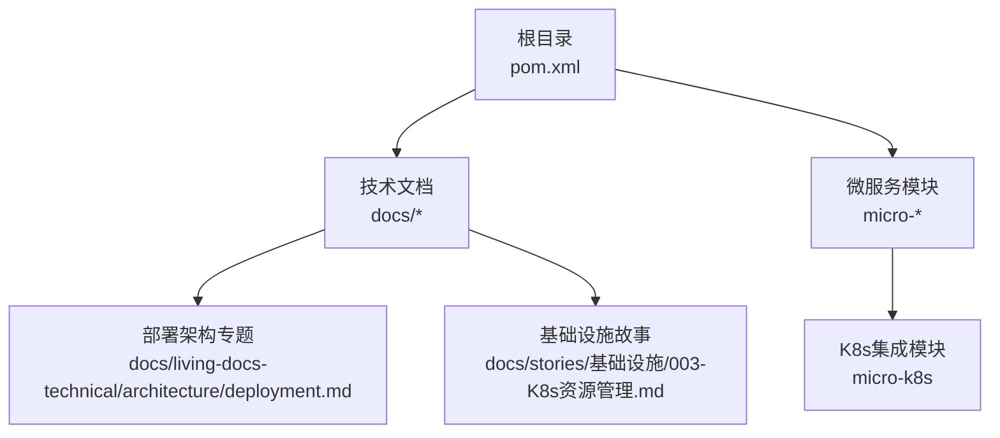
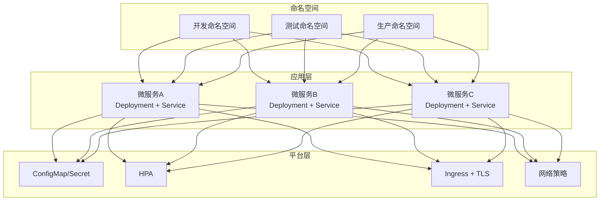
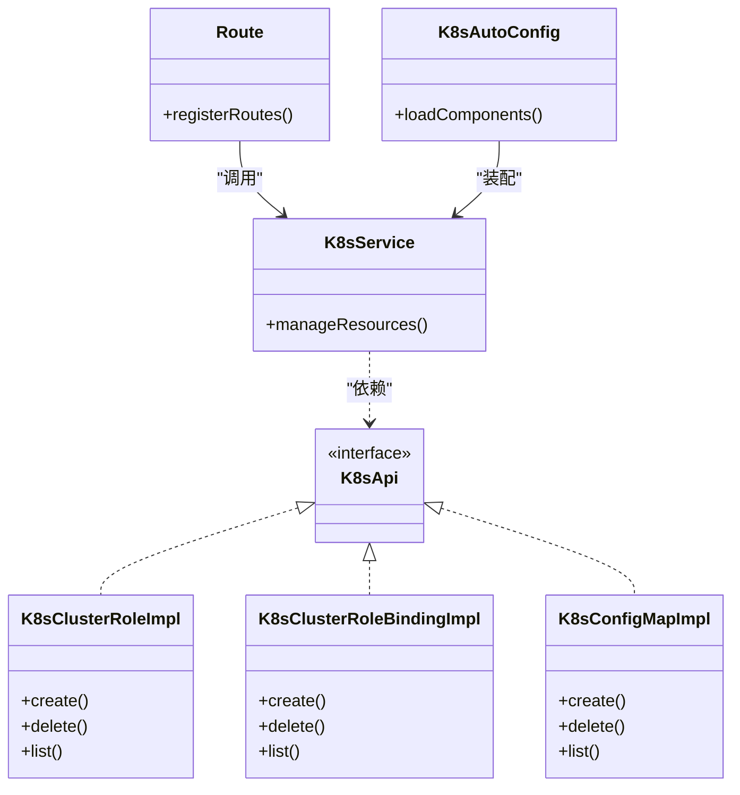
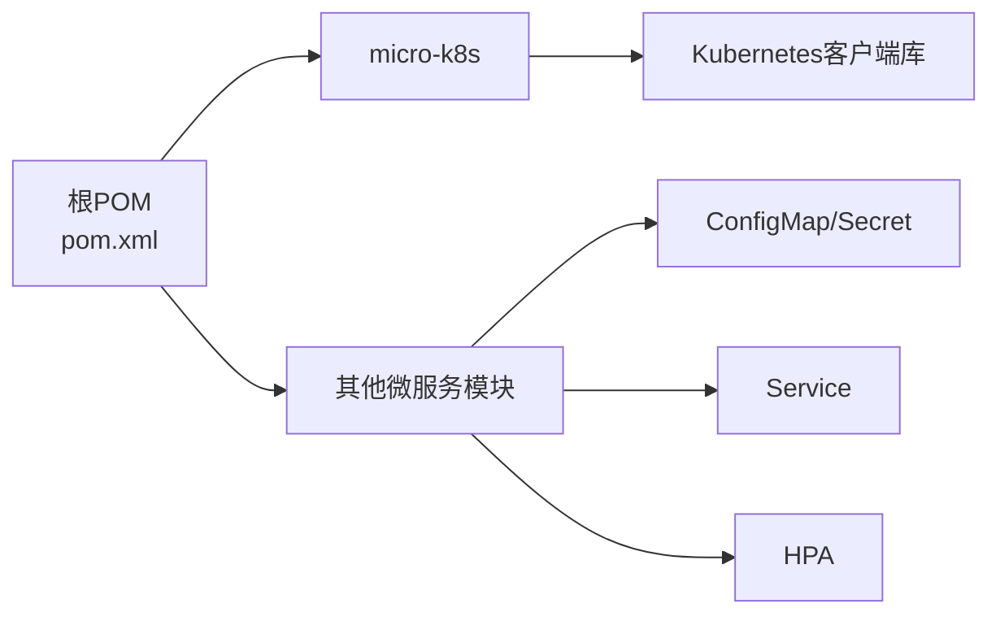

# Kubernetes部署

<cite>
**本文引用的文件**
- [docs/living-docs-technical/architecture/deployment.md](file://docs/living-docs-technical/architecture/deployment.md)
- [docs/living-docs-technical/README.md](file://docs/living-docs-technical/README.md)
- [docs/stories/基础设施/003-K8s资源管理.md](file://docs/stories/基础设施/003-K8s资源管理.md)
- [micro-k8s/pom.xml](file://micro-k8s/pom.xml)
- [micro-k8s/src/main/java/com/wkclz/micro/k8s/custom/K8sApi.java](file://micro-k8s/src/main/java/com/wkclz/micro/k8s/custom/K8sApi.java)
- [micro-k8s/src/main/java/com/wkclz/micro/k8s/custom/impl/K8sClusterRoleImpl.java](file://micro-k8s/src/main/java/com/wkclz/micro/k8s/custom/impl/K8sClusterRoleImpl.java)
- [micro-k8s/src/main/java/com/wkclz/micro/k8s/custom/impl/K8sClusterRoleBindingImpl.java](file://micro-k8s/src/main/java/com/wkclz/micro/k8s/custom/impl/K8sClusterRoleBindingImpl.java)
- [micro-k8s/src/main/java/com/wkclz/micro/k8s/custom/impl/K8sConfigMapImpl.java](file://micro-k8s/src/main/java/com/wkclz/micro/k8s/custom/impl/K8sConfigMapImpl.java)
- [micro-k8s/src/main/java/com/wkclz/micro/k8s/rest/Route.java](file://micro-k8s/src/main/java/com/wkclz/micro/k8s/rest/Route.java)
- [micro-k8s/src/main/java/com/wkclz/micro/k8s/service/K8sService.java](file://micro-k8s/src/main/java/com/wkclz/micro/k8s/service/K8sService.java)
- [micro-k8s/src/main/resources/mapper/K8sConfigMapper.xml](file://micro-k8s/src/main/resources/mapper/K8sConfigMapper.xml)
- [micro-k8s/src/main/java/com/wkclz/micro/k8s/K8sAutoConfig.java](file://micro-k8s/src/main/java/com/wkclz/micro/k8s/K8sAutoConfig.java)
- [micro-fileos/docs/configuration-guide.md](file://micro-fileos/docs/configuration-guide.md)
- [micro-fileos/docs/integration-guide.md](file://micro-fileos/docs/integration-guide.md)
- [micro-liteflow/src/main/resources/config/application.yml](file://micro-liteflow/src/main/resources/config/application.yml)
- [pom.xml](file://pom.xml)
</cite>

## 目录
1. [简介](#简介)
2. [项目结构](#项目结构)
3. [核心组件](#核心组件)
4. [架构总览](#架构总览)
5. [详细组件分析](#详细组件分析)
6. [依赖关系分析](#依赖关系分析)
7. [性能考虑](#性能考虑)
8. [故障排查指南](#故障排查指南)
9. [结论](#结论)
10. [附录](#附录)

## 简介
本文件面向 sh-microapp 微服务框架的Kubernetes部署实践，结合仓库中已有的技术文档与微服务模块，系统阐述K8s集群架构设计、命名空间管理、资源配置（Deployment、Service、ConfigMap、Secret）、HPA自动伸缩、滚动更新与蓝绿发布策略、Ingress与TLS、网络策略以及Helm Chart使用建议与版本管理策略。内容以仓库现有技术文档与微服务模块为依据，确保可落地与可追溯。

## 项目结构
- 技术文档位于 docs 目录，其中包含“部署架构”专题与“基础设施故事”，为K8s部署提供了高层指导。
- 微服务模块位于 micro-* 目录，每个模块独立构建与运行；部分模块（如 micro-k8s）直接集成Kubernetes客户端能力，便于在K8s内进行资源编排与运维。
- 全局配置与依赖管理集中在根目录的 pom.xml 中，用于统一管理各模块的依赖与插件。

图示来源
- [pom.xml](file://pom.xml)
- [docs/living-docs-technical/architecture/deployment.md](file://docs/living-docs-technical/architecture/deployment.md)
- [docs/stories/基础设施/003-K8s资源管理.md](file://docs/stories/基础设施/003-K8s资源管理.md)

章节来源
- [docs/living-docs-technical/README.md](file://docs/living-docs-technical/README.md)
- [docs/living-docs-technical/architecture/deployment.md](file://docs/living-docs-technical/architecture/deployment.md)
- [docs/stories/基础设施/003-K8s资源管理.md](file://docs/stories/基础设施/003-K8s资源管理.md)
- [pom.xml](file://pom.xml)

## 核心组件
- 集群与命名空间：建议按环境（dev/test/prod）划分命名空间，并在各命名空间内隔离业务域（如 fileos、dict、form 等），实现资源与权限的最小化控制。
- 资源编排：通过 Deployment 管理无状态应用副本，Service 提供稳定访问入口，ConfigMap/Secret 管理配置与密钥，HPA根据CPU/内存或自定义指标自动扩缩容。
- Ingress与TLS：通过 Ingress 控制器暴露服务，结合证书管理（如 cert-manager 或外部CA）实现域名与TLS终止。
- 发布策略：优先采用滚动更新；在关键模块可引入蓝绿/金丝雀发布，配合权重切换与健康检查。
- 网络策略：默认拒绝入站流量，仅开放必要的端口与来源，保障服务间通信安全。
- Helm：以Helm Chart封装部署清单，统一版本管理与参数化配置，支持多环境差异化部署。

章节来源
- [docs/living-docs-technical/architecture/deployment.md](file://docs/living-docs-technical/architecture/deployment.md)
- [docs/stories/基础设施/003-K8s资源管理.md](file://docs/stories/基础设施/003-K8s资源管理.md)

## 架构总览
下图展示了基于微服务模块的K8s部署架构概览，包括命名空间、服务暴露、配置管理与发布策略的关系。

图示来源
- [docs/living-docs-technical/architecture/deployment.md](file://docs/living-docs-technical/architecture/deployment.md)
- [docs/stories/基础设施/003-K8s资源管理.md](file://docs/stories/基础设施/003-K8s资源管理.md)

## 详细组件分析

### 命名空间与资源隔离
- 建议命名空间划分：dev（开发联调）、test（集成测试）、prod（生产）。每个命名空间内按业务域拆分微服务，避免资源交叉影响。
- 权限模型：为不同团队授予最小权限，使用RBAC绑定到对应命名空间，限制跨命名空间访问。

章节来源
- [docs/living-docs-technical/architecture/deployment.md](file://docs/living-docs-technical/architecture/deployment.md)
- [docs/stories/基础设施/003-K8s资源管理.md](file://docs/stories/基础设施/003-K8s资源管理.md)

### Deployment与Service
- Deployment：定义副本数、容器镜像、探针（liveness/readiness）、资源请求/限制、滚动更新策略（maxUnavailable/maxSurge）。
- Service：ClusterIP/LoadBalancer/NodePort，选择器匹配Pod标签；对外暴露使用Ingress。
- 健康检查：readinessProbe探测就绪，livenessProbe探测存活；失败时由K8s重启或驱逐。

章节来源
- [docs/living-docs-technical/architecture/deployment.md](file://docs/living-docs-technical/architecture/deployment.md)

### ConfigMap与Secret
- ConfigMap：存放非敏感配置（如日志级别、功能开关、数据库连接串前缀），通过挂载或环境变量注入。
- Secret：存放敏感信息（如数据库密码、第三方密钥），通过挂载或环境变量注入；启用严格的访问控制与轮换策略。
- 配置注入最佳实践：将配置按模块拆分，避免单个ConfigMap/Secret过大；使用Key-Value或文件形式注入。

章节来源
- [micro-fileos/docs/configuration-guide.md](file://micro-fileos/docs/configuration-guide.md)
- [micro-fileos/docs/integration-guide.md](file://micro-fileos/docs/integration-guide.md)

### 水平Pod自动伸缩（HPA）
- 指标类型：CPU利用率、内存使用量、自定义指标（如QPS、错误率）。
- 策略：设置最小/最大副本数、目标利用率阈值；对高流量模块（如网关、核心业务）开启HPA。
- 注意：HPA需配合资源requests/limits，避免过度扩缩导致抖动。

章节来源
- [docs/living-docs-technical/architecture/deployment.md](file://docs/living-docs-technical/architecture/deployment.md)

### 滚动更新与蓝绿/金丝雀发布
- 滚动更新：通过Deployment的滚动更新策略实现零停机升级；建议结合readinessProbe确保新实例完全就绪后再切流量。
- 蓝绿/金丝雀：在关键模块采用蓝绿发布（双套Deployment+Service切换）或金丝雀（按百分比流量切分），配合Ingress路由与权重控制，降低风险。
- 回滚：记录发布版本与镜像标签，异常时快速回滚至上一稳定版本。

章节来源
- [docs/living-docs-technical/architecture/deployment.md](file://docs/living-docs-technical/architecture/deployment.md)

### Ingress、TLS与证书管理
- Ingress：集中暴露HTTP/HTTPS服务，配置路径转发、主机名与重写规则。
- TLS：使用证书管理工具（如cert-manager）自动签发与续期；或使用外部CA签发的证书，通过Secret注入。
- 安全：启用强制HTTPS、禁用不安全协议；限制源IP白名单（如需要）。

章节来源
- [docs/living-docs-technical/architecture/deployment.md](file://docs/living-docs-technical/architecture/deployment.md)

### 网络策略
- 默认拒绝入站流量，仅放行必要的端口与来源（如Prometheus抓取、同命名空间服务间访问）。
- 对外只开放必要端口（80/443），内部服务间通过Service名称访问，避免硬编码IP。

章节来源
- [docs/living-docs-technical/architecture/deployment.md](file://docs/living-docs-technical/architecture/deployment.md)

### Helm Chart使用与版本管理
- Chart结构：将Deployment、Service、ConfigMap、Secret、HPA、Ingress、NetworkPolicy等封装为模板，使用values.yaml参数化。
- 版本策略：语义化版本（MAJOR.MINOR.PATCH），主版本用于破坏性变更；每次发布打Tag并记录变更摘要。
- 多环境：通过不同values文件（如 values-dev.yaml、values-prod.yaml）管理差异配置；CI/CD流水线中指定环境与Chart版本。

章节来源
- [docs/living-docs-technical/architecture/deployment.md](file://docs/living-docs-technical/architecture/deployment.md)

### K8s集成模块（micro-k8s）能力
该模块展示了如何在微服务中直接使用Kubernetes客户端进行资源管理，具备以下能力：
- RBAC资源：ClusterRole、ClusterRoleBinding 的创建与管理。
- Core资源：ConfigMap 的创建与管理。
- REST接口：提供K8s资源管理的REST路由，便于外部系统调用。
- 自动装配：通过自动配置类加载相关组件。

图示来源
- [micro-k8s/src/main/java/com/wkclz/micro/k8s/custom/K8sApi.java](file://micro-k8s/src/main/java/com/wkclz/micro/k8s/custom/K8sApi.java)
- [micro-k8s/src/main/java/com/wkclz/micro/k8s/custom/impl/K8sClusterRoleImpl.java](file://micro-k8s/src/main/java/com/wkclz/micro/k8s/custom/impl/K8sClusterRoleImpl.java)
- [micro-k8s/src/main/java/com/wkclz/micro/k8s/custom/impl/K8sClusterRoleBindingImpl.java](file://micro-k8s/src/main/java/com/wkclz/micro/k8s/custom/impl/K8sClusterRoleBindingImpl.java)
- [micro-k8s/src/main/java/com/wkclz/micro/k8s/custom/impl/K8sConfigMapImpl.java](file://micro-k8s/src/main/java/com/wkclz/micro/k8s/custom/impl/K8sConfigMapImpl.java)
- [micro-k8s/src/main/java/com/wkclz/micro/k8s/service/K8sService.java](file://micro-k8s/src/main/java/com/wkclz/micro/k8s/service/K8sService.java)
- [micro-k8s/src/main/java/com/wkclz/micro/k8s/rest/Route.java](file://micro-k8s/src/main/java/com/wkclz/micro/k8s/rest/Route.java)
- [micro-k8s/src/main/java/com/wkclz/micro/k8s/K8sAutoConfig.java](file://micro-k8s/src/main/java/com/wkclz/micro/k8s/K8sAutoConfig.java)

章节来源
- [micro-k8s/pom.xml](file://micro-k8s/pom.xml)
- [micro-k8s/src/main/java/com/wkclz/micro/k8s/custom/K8sApi.java](file://micro-k8s/src/main/java/com/wkclz/micro/k8s/custom/K8sApi.java)
- [micro-k8s/src/main/java/com/wkclz/micro/k8s/custom/impl/K8sClusterRoleImpl.java](file://micro-k8s/src/main/java/com/wkclz/micro/k8s/custom/impl/K8sClusterRoleImpl.java)
- [micro-k8s/src/main/java/com/wkclz/micro/k8s/custom/impl/K8sClusterRoleBindingImpl.java](file://micro-k8s/src/main/java/com/wkclz/micro/k8s/custom/impl/K8sClusterRoleBindingImpl.java)
- [micro-k8s/src/main/java/com/wkclz/micro/k8s/custom/impl/K8sConfigMapImpl.java](file://micro-k8s/src/main/java/com/wkclz/micro/k8s/custom/impl/K8sConfigMapImpl.java)
- [micro-k8s/src/main/java/com/wkclz/micro/k8s/service/K8sService.java](file://micro-k8s/src/main/java/com/wkclz/micro/k8s/service/K8sService.java)
- [micro-k8s/src/main/java/com/wkclz/micro/k8s/rest/Route.java](file://micro-k8s/src/main/java/com/wkclz/micro/k8s/rest/Route.java)
- [micro-k8s/src/main/java/com/wkclz/micro/k8s/K8sAutoConfig.java](file://micro-k8s/src/main/java/com/wkclz/micro/k8s/K8sAutoConfig.java)

### 配置示例与最佳实践
- 配置来源：优先使用ConfigMap/Secret管理配置；对于模块特定配置，参考模块文档中的配置项组织方式。
- 示例路径：
  - [micro-fileos/docs/configuration-guide.md](file://micro-fileos/docs/configuration-guide.md)
  - [micro-fileos/docs/integration-guide.md](file://micro-fileos/docs/integration-guide.md)
  - [micro-liteflow/src/main/resources/config/application.yml](file://micro-liteflow/src/main/resources/config/application.yml)

章节来源
- [micro-fileos/docs/configuration-guide.md](file://micro-fileos/docs/configuration-guide.md)
- [micro-fileos/docs/integration-guide.md](file://micro-fileos/docs/integration-guide.md)
- [micro-liteflow/src/main/resources/config/application.yml](file://micro-liteflow/src/main/resources/config/application.yml)

## 依赖关系分析
- 组件耦合：微服务模块彼此解耦，通过Service进行通信；K8s集成模块（micro-k8s）提供资源管理能力，其他模块可按需调用。
- 外部依赖：Kubernetes客户端库（见 micro-k8s 依赖声明），用于在应用内直接管理K8s资源。
- 配置依赖：各模块通过ConfigMap/Secret注入配置，避免硬编码；模块文档明确了配置项的命名空间与位置。

图示来源
- [pom.xml](file://pom.xml)
- [micro-k8s/pom.xml](file://micro-k8s/pom.xml)

章节来源
- [pom.xml](file://pom.xml)
- [micro-k8s/pom.xml](file://micro-k8s/pom.xml)

## 性能考虑
- 资源规划：为每个Deployment设置合理的requests/limits，避免共享资源争用；对高流量模块开启HPA。
- 探针优化：readinessProbe应快速返回，避免过长超时导致流量延迟；livenessProbe避免频繁重启。
- 网络与存储：Ingress层做连接复用与压缩；持久化配置尽量使用ConfigMap/Secret，减少磁盘IO。
- 观测性：启用Pod指标采集与日志聚合，结合告警策略及时发现异常。

## 故障排查指南
- 服务不可达：检查Service选择器是否匹配Pod标签、端口映射是否正确；确认Ingress路由与证书配置。
- Pod反复重启：查看liveness/readiness探针配置与日志；检查资源限制是否过低。
- 配置不生效：确认ConfigMap/Secret挂载路径与键名；验证环境变量注入顺序与覆盖关系。
- 权限问题：核对RBAC角色与绑定，确保ServiceAccount具有所需权限；检查命名空间隔离策略。
- 发布异常：回滚至上一个稳定版本；检查滚动更新策略与探针配置；必要时采用蓝绿/金丝雀逐步放量。

章节来源
- [docs/living-docs-technical/architecture/deployment.md](file://docs/living-docs-technical/architecture/deployment.md)
- [docs/stories/基础设施/003-K8s资源管理.md](file://docs/stories/基础设施/003-K8s资源管理.md)

## 结论
本部署文档基于仓库现有技术文档与微服务模块，给出了K8s集群架构、命名空间与资源管理、配置与密钥、HPA、滚动更新与蓝绿发布、Ingress/TLS、网络策略及Helm Chart的实施建议。结合 micro-k8s 模块提供的K8s客户端能力，可在应用内实现资源编排与运维自动化，提升整体交付效率与安全性。

## 附录
- 参考文档索引：
  - [docs/living-docs-technical/architecture/deployment.md](file://docs/living-docs-technical/architecture/deployment.md)
  - [docs/stories/基础设施/003-K8s资源管理.md](file://docs/stories/基础设施/003-K8s资源管理.md)
  - [micro-fileos/docs/configuration-guide.md](file://micro-fileos/docs/configuration-guide.md)
  - [micro-fileos/docs/integration-guide.md](file://micro-fileos/docs/integration-guide.md)
  - [micro-liteflow/src/main/resources/config/application.yml](file://micro-liteflow/src/main/resources/config/application.yml)
  - [micro-k8s/pom.xml](file://micro-k8s/pom.xml)
  - [micro-k8s/src/main/java/com/wkclz/micro/k8s/custom/K8sApi.java](file://micro-k8s/src/main/java/com/wkclz/micro/k8s/custom/K8sApi.java)
  - [micro-k8s/src/main/java/com/wkclz/micro/k8s/custom/impl/K8sClusterRoleImpl.java](file://micro-k8s/src/main/java/com/wkclz/micro/k8s/custom/impl/K8sClusterRoleImpl.java)
  - [micro-k8s/src/main/java/com/wkclz/micro/k8s/custom/impl/K8sClusterRoleBindingImpl.java](file://micro-k8s/src/main/java/com/wkclz/micro/k8s/custom/impl/K8sClusterRoleBindingImpl.java)
  - [micro-k8s/src/main/java/com/wkclz/micro/k8s/custom/impl/K8sConfigMapImpl.java](file://micro-k8s/src/main/java/com/wkclz/micro/k8s/custom/impl/K8sConfigMapImpl.java)
  - [micro-k8s/src/main/java/com/wkclz/micro/k8s/service/K8sService.java](file://micro-k8s/src/main/java/com/wkclz/micro/k8s/service/K8sService.java)
  - [micro-k8s/src/main/java/com/wkclz/micro/k8s/rest/Route.java](file://micro-k8s/src/main/java/com/wkclz/micro/k8s/rest/Route.java)
  - [micro-k8s/src/main/java/com/wkclz/micro/k8s/K8sAutoConfig.java](file://micro-k8s/src/main/java/com/wkclz/micro/k8s/K8sAutoConfig.java)
  - [micro-k8s/src/main/resources/mapper/K8sConfigMapper.xml](file://micro-k8s/src/main/resources/mapper/K8sConfigMapper.xml)