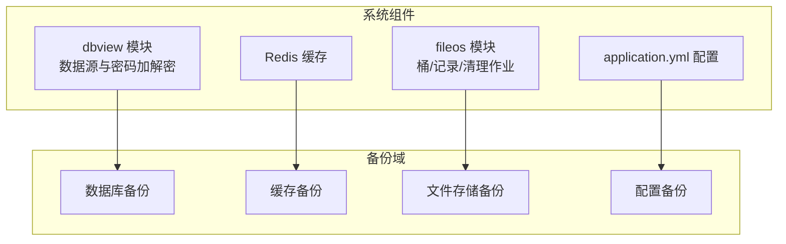
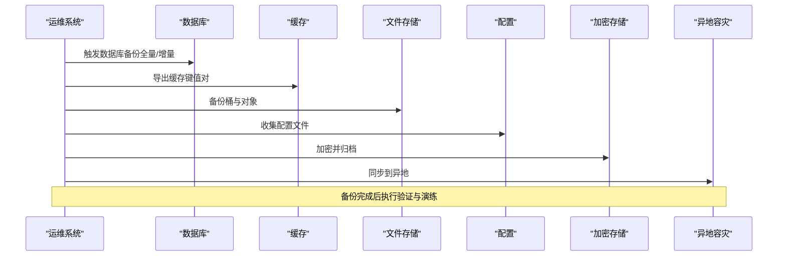
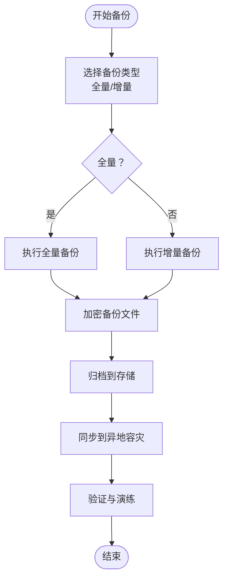
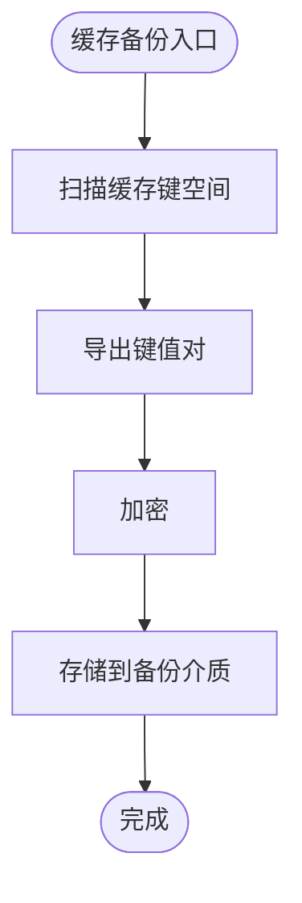
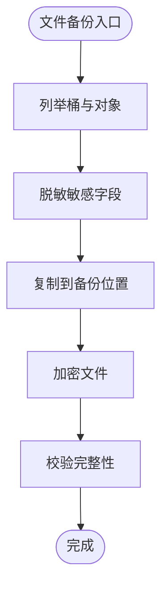
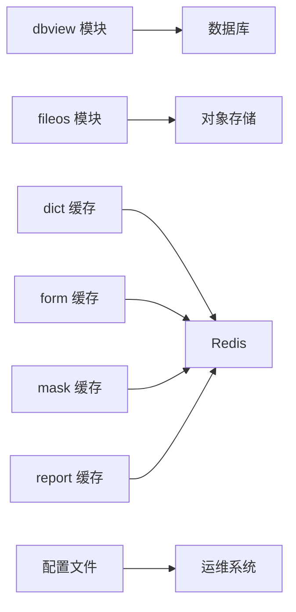

# 备份恢复

<cite>
**本文引用的文件**
- [DbviewConnectionService.java](file://micro-dbview/src/main/java/com/wkclz/micro/dbview/service/DbviewConnectionService.java)
- [DbviewDatasourceService.java](file://micro-dbview/src/main/java/com/wkclz/micro/dbview/service/DbviewDatasourceService.java)
- [MdmFileosBucket.java](file://micro-fileos/src/main/java/com/wkclz/micro/fileos/bean/entity/MdmFileosBucket.java)
- [BucketCreateReq.java](file://micro-fileos/src/main/java/com/wkclz/micro/fileos/bean/req/BucketCreateReq.java)
- [BucketUpdateReq.java](file://micro-fileos/src/main/java/com/wkclz/micro/fileos/bean/req/BucketUpdateReq.java)
- [BucketResp.java](file://micro-fileos/src/main/java/com/wkclz/micro/fileos/bean/resp/BucketResp.java)
- [FileosBucketRest.java](file://micro-fileos/src/main/java/com/wkclz/micro/fileos/rest/FileosBucketRest.java)
- [application.yml](file://micro-liteflow/src/main/resources/config/application.yml)
- [MultipartCleanupJob.java](file://micro-fileos/src/main/java/com/wkclz/micro/fileos/job/MultipartCleanupJob.java)
- [AuditImpl.java](file://micro-audit/src/main/java/com/wkclz/micro/audit/api/impl/AuditImpl.java)
- [DbviewAutoConfig.java](file://micro-dbview/src/main/java/com/wkclz/micro/dbview/DbviewAutoConfig.java)
- [FileosAutoConfig.java](file://micro-fileos/src/main/java/com/wkclz/micro/fileos/FileosAutoConfig.java)
- [DictCache.java](file://micro-dict/src/main/java/com/wkclz/micro/dict/cache/DictCache.java)
- [FormCache.java](file://micro-form/src/main/java/com/wkclz/micro/form/cache/FormCache.java)
- [MaskCache.java](file://micro-mask/src/main/java/com/wkclz/micro/mask/cache/MaskCache.java)
- [ReportCache.java](file://micro-report/src/main/java/com/wkclz/micro/report/cache/ReportCache.java)
- [RedisIdGenerator.java](file://micro-audit/src/main/java/com/wkclz/redis/helper/RedisIdGenerator.java)
</cite>

## 目录
1. [简介](#简介)
2. [项目结构](#项目结构)
3. [核心组件](#核心组件)
4. [架构总览](#架构总览)
5. [详细组件分析](#详细组件分析)
6. [依赖关系分析](#依赖关系分析)
7. [性能考量](#性能考量)
8. [故障排查指南](#故障排查指南)
9. [结论](#结论)
10. [附录](#附录)

## 简介
本文件面向 sh-microapp 微服务框架，提供系统化的备份与恢复方案。内容覆盖数据库备份（全量/增量）、缓存数据备份、文件存储备份、配置数据备份、灾难恢复计划（RTO/RPO）、恢复演练流程、备份数据加密存储、异地容灾与版本管理策略，以及备份验证、恢复测试与故障切换的操作指南。由于仓库中未发现现成的备份/恢复脚本或工具模块，本方案以现有组件能力为基础，结合最佳实践给出可落地的实施建议。

## 项目结构
围绕备份与恢复的关键模块与职责如下：
- 数据库访问与安全：dbview 模块负责数据源管理与密码加解密，为数据库备份提供基础能力
- 文件存储：fileos 模块负责对象存储桶与文件记录管理，是文件备份的核心
- 缓存：各业务模块（如 dict、form、mask、report）使用缓存，需纳入缓存备份范围
- 配置：各模块通过 Spring Boot 自动装配扫描与 YAML 配置加载，备份时应统一收集
- 调度与作业：fileos 的清理任务用于生命周期管理，可作为备份前清理的参考

图示来源
- [DbviewAutoConfig.java:7-9](file://micro-dbview/src/main/java/com/wkclz/micro/dbview/DbviewAutoConfig.java#L7-L9)
- [FileosAutoConfig.java](file://micro-fileos/src/main/java/com/wkclz/micro/fileos/FileosAutoConfig.java#L7)

章节来源
- [DbviewAutoConfig.java:7-9](file://micro-dbview/src/main/java/com/wkclz/micro/dbview/DbviewAutoConfig.java#L7-L9)
- [FileosAutoConfig.java:7](file://micro-fileos/src/main/java/com/wkclz/micro/fileos/FileosAutoConfig.java#L7)

## 核心组件
- 数据库密码加解密：dbview 模块在持久化数据源凭据时进行加密，在需要时进行解密，确保备份数据中的敏感信息受控
- 对象存储桶与密钥：fileos 模块定义了桶实体及请求/响应模型，涉及 Secret Key 字段，备份时应按策略处理
- 缓存组件：各业务模块均使用缓存，备份时需考虑缓存快照与重建策略
- 配置文件：各模块通过自动装配扫描与 YAML 配置加载，备份时应统一收集

章节来源
- [DbviewConnectionService.java:91-104](file://micro-dbview/src/main/java/com/wkclz/micro/dbview/service/DbviewConnectionService.java#L91-L104)
- [DbviewDatasourceService.java:41](file://micro-dbview/src/main/java/com/wkclz/micro/dbview/service/DbviewDatasourceService.java#L41)
- [DbviewDatasourceService.java:56](file://micro-dbview/src/main/java/com/wkclz/micro/dbview/service/DbviewDatasourceService.java#L56)
- [MdmFileosBucket.java:32-33](file://micro-fileos/src/main/java/com/wkclz/micro/fileos/bean/entity/MdmFileosBucket.java#L32-L33)
- [BucketCreateReq.java:32-33](file://micro-fileos/src/main/java/com/wkclz/micro/fileos/bean/req/BucketCreateReq.java#L32-L33)
- [BucketUpdateReq.java:32-33](file://micro-fileos/src/main/java/com/wkclz/micro/fileos/bean/req/BucketUpdateReq.java#L32-L33)
- [BucketResp.java:35-36](file://micro-fileos/src/main/java/com/wkclz/micro/fileos/bean/resp/BucketResp.java#L35-L36)
- [FileosBucketRest.java:35-36](file://micro-fileos/src/main/java/com/wkclz/micro/fileos/rest/FileosBucketRest.java#L35-L36)
- [FileosBucketRest.java:49-50](file://micro-fileos/src/main/java/com/wkclz/micro/fileos/rest/FileosBucketRest.java#L49-L50)
- [FileosBucketRest.java:65-66](file://micro-fileos/src/main/java/com/wkclz/micro/fileos/rest/FileosBucketRest.java#L65-L66)

## 架构总览
备份与恢复的整体流程包括：数据采集（数据库/缓存/文件/配置）、加密与归档、异地复制、验证与演练、故障切换与回切。

## 详细组件分析

### 数据库备份策略（全量/增量）
- 全量备份
  - 使用数据库自带的物理/逻辑导出工具定期执行全量备份
  - 备份文件命名包含时间戳与版本号，便于版本管理与回溯
- 增量备份
  - 基于数据库的二进制日志（binlog）或变更数据捕获（CDC）实现增量
  - 增量备份周期与保留策略需满足 RPO 目标
- 备份数据加密
  - 在传输与静态存储阶段采用强加密算法保护
  - 密钥轮换与权限控制遵循最小授权原则
- 备份验证
  - 定期执行抽样恢复测试，验证备份文件完整性与可恢复性
- 故障切换
  - 切换前进行一致性检查与数据校验；切换后持续监控与回切演练

### 缓存数据备份
- 缓存组件清单：dict、form、mask、report 模块均使用缓存
- 备份方式
  - 通过缓存客户端导出键空间快照（如 Redis RDB 或 AOF）
  - 对热键与热点数据进行优先级备份
- 恢复策略
  - 恢复时按模块维度重建缓存，避免缓存雪崩
  - 结合 TTL 与失效策略，保证数据新鲜度

### 文件存储备份
- 关注点
  - 桶与对象的备份，涉及 Secret Key 等敏感字段
  - 对敏感字段在备份输出中进行脱敏或屏蔽
- 实施要点
  - 使用对象存储的跨区域复制或版本化功能
  - 对备份文件进行加密与访问控制
  - 定期校验对象完整性与访问权限

章节来源
- [MdmFileosBucket.java:32-33](file://micro-fileos/src/main/java/com/wkclz/micro/fileos/bean/entity/MdmFileosBucket.java#L32-L33)
- [BucketCreateReq.java:32-33](file://micro-fileos/src/main/java/com/wkclz/micro/fileos/bean/req/BucketCreateReq.java#L32-L33)
- [BucketUpdateReq.java:32-33](file://micro-fileos/src/main/java/com/wkclz/micro/fileos/bean/req/BucketUpdateReq.java#L32-L33)
- [BucketResp.java:35-36](file://micro-fileos/src/main/java/com/wkclz/micro/fileos/bean/resp/BucketResp.java#L35-L36)
- [FileosBucketRest.java:35-36](file://micro-fileos/src/main/java/com/wkclz/micro/fileos/rest/FileosBucketRest.java#L35-L36)
- [FileosBucketRest.java:49-50](file://micro-fileos/src/main/java/com/wkclz/micro/fileos/rest/FileosBucketRest.java#L49-L50)
- [FileosBucketRest.java:65-66](file://micro-fileos/src/main/java/com/wkclz/micro/fileos/rest/FileosBucketRest.java#L65-L66)

### 配置数据备份
- 配置来源
  - 各模块通过自动装配扫描与 YAML 配置加载
  - application.yml 属于配置备份的重要组成部分
- 备份范围
  - 所有模块的 YAML 配置文件与环境变量
  - 动态配置中心（如存在）需纳入备份范围
- 版本管理
  - 配置变更纳入版本管理，备份时保留最近 N 个版本

章节来源
- [application.yml](file://micro-liteflow/src/main/resources/config/application.yml)
- [DbviewAutoConfig.java:7-9](file://micro-dbview/src/main/java/com/wkclz/micro/dbview/DbviewAutoConfig.java#L7-L9)
- [FileosAutoConfig.java:7](file://micro-fileos/src/main/java/com/wkclz/micro/fileos/FileosAutoConfig.java#L7)

### 数据库凭据与敏感信息保护
- 凭据加密
  - dbview 模块在持久化数据源密码前进行加密
  - 解密仅在必要场景下进行，且严格限制访问
- 备份输出脱敏
  - 备份脚本或工具应对敏感字段进行屏蔽或替换
  - 日志中避免输出明文敏感信息

章节来源
- [DbviewConnectionService.java:91-104](file://micro-dbview/src/main/java/com/wkclz/micro/dbview/service/DbviewConnectionService.java#L91-L104)
- [DbviewDatasourceService.java:41](file://micro-dbview/src/main/java/com/wkclz/micro/dbview/service/DbviewDatasourceService.java#L41)
- [DbviewDatasourceService.java:56](file://micro-dbview/src/main/java/com/wkclz/micro/dbview/service/DbviewDatasourceService.java#L56)

### 缓存组件与 ID 生成器
- 缓存组件
  - dict、form、mask、report 模块均使用缓存，备份时需考虑缓存快照
- ID 生成器
  - 审计模块使用 Redis 进行 ID 生成，备份时需关注其状态与一致性

章节来源
- [DictCache.java](file://micro-dict/src/main/java/com/wkclz/micro/dict/cache/DictCache.java#L25)
- [FormCache.java](file://micro-form/src/main/java/com/wkclz/micro/form/cache/FormCache.java)
- [MaskCache.java](file://micro-mask/src/main/java/com/wkclz/micro/mask/cache/MaskCache.java)
- [ReportCache.java](file://micro-report/src/main/java/com/wkclz/micro/report/cache/ReportCache.java)
- [AuditImpl.java:39](file://micro-audit/src/main/java/com/wkclz/micro/audit/api/impl/AuditImpl.java#L39)
- [RedisIdGenerator.java](file://micro-audit/src/main/java/com/wkclz/redis/helper/RedisIdGenerator.java)

### 清理作业与生命周期管理
- fileos 提供多部分上传清理作业，可用于备份前的临时文件清理
- 建议在备份窗口内执行清理作业，减少无效数据占用

章节来源
- [MultipartCleanupJob.java:26-40](file://micro-fileos/src/main/java/com/wkclz/micro/fileos/job/MultipartCleanupJob.java#L26-L40)

## 依赖关系分析
- 组件耦合
  - dbview 与 fileos 分别承担数据源与文件存储的备份相关职责
  - 各业务模块缓存组件独立，备份时需统一协调
- 外部依赖
  - 数据库与对象存储服务的可用性直接影响备份与恢复效率
  - 配置文件集中管理，便于统一备份与版本控制

## 性能考量
- 备份窗口规划：根据业务峰值流量安排备份，避免影响在线服务
- 并行与增量：数据库与文件存储采用并行与增量策略，缩短 RTO
- 存储优化：压缩与去重降低存储成本，同时保证恢复速度
- 缓存重建：分批加载与延迟生效，防止缓存雪崩

## 故障排查指南
- 备份失败
  - 检查存储空间与网络连通性
  - 校验加密密钥与权限
- 恢复异常
  - 核对备份版本与目标环境兼容性
  - 逐模块验证数据一致性
- 缓存恢复问题
  - 检查键空间与 TTL 设置
  - 关注热点键的重建顺序
- 配置不一致
  - 对比备份版本与当前配置差异
  - 逐步回滚或应用补丁

## 结论
本方案基于现有组件能力，提出可操作的备份与恢复策略。建议尽快引入标准化的备份工具链与自动化流程，完善监控与告警机制，持续优化 RTO/RPO 目标，并定期开展恢复演练，确保在真实故障中快速、可靠地完成数据恢复与服务回切。

## 附录
- 备份验证清单
  - 数据库：抽样查询、索引完整性、事务一致性
  - 缓存：键空间统计、热点命中率、TTL 生效
  - 文件存储：对象完整性校验、访问权限验证
  - 配置：版本对比、参数生效验证
- 恢复测试流程
  - 制定测试场景与预期结果
  - 执行离线恢复与回归测试
  - 记录测试结果与改进项
- 故障切换步骤
  - 切换前准备：数据一致性检查、监控指标基线
  - 切换执行：域名/路由切换、健康检查
  - 回切流程：数据回灌、服务回切、监控恢复