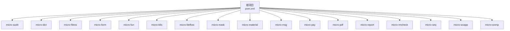
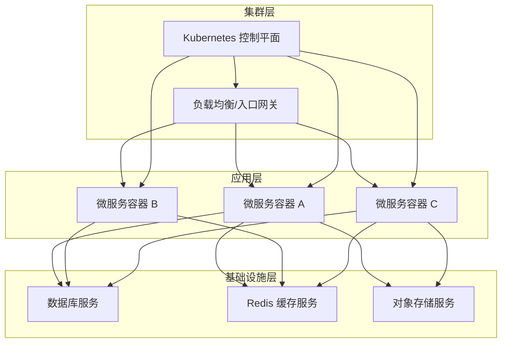
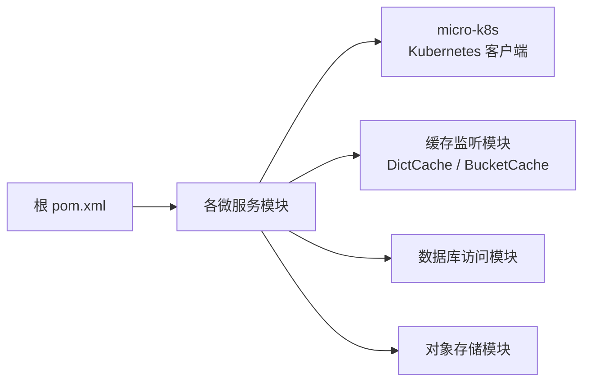

# 容器化部署

<cite>
**本文引用的文件**
- [AGENTS.md](file://AGENTS.md)
- [CONTEXT.md](file://CONTEXT.md)
- [README.md](file://README.md)
- [pom.xml](file://pom.xml)
- [docs/living-docs-technical/architecture/deployment.md](file://docs/living-docs-technical/architecture/deployment.md)
- [docs/standards/ops.md](file://docs/standards/ops.md)
- [docs/standards/architecture.md](file://docs/standards/architecture.md)
- [micro-fileos/docs/configuration-guide.md](file://micro-fileos/docs/configuration-guide.md)
- [micro-k8s/pom.xml](file://micro-k8s/pom.xml)
- [micro-k8s/src/main/java/com/wkclz/micro/k8s/bean/kube/Kind.java](file://micro-k8s/src/main/java/com/wkclz/micro/k8s/bean/kube/Kind.java)
- [micro-dict/src/main/java/com/wkclz/micro/dict/cache/DictCache.java](file://micro-dict/src/main/java/com/wkclz/micro/dict/cache/DictCache.java)
- [micro-fileos/src/main/java/com/wkclz/micro/fileos/helper/BucketCache.java](file://micro-fileos/src/main/java/com/wkclz/micro/fileos/helper/BucketCache.java)
- [micro-liteflow/src/main/resources/config/application.yml](file://micro-liteflow/src/main/resources/config/application.yml)
</cite>

## 目录
1. [简介](#简介)
2. [项目结构](#项目结构)
3. [核心组件](#核心组件)
4. [架构总览](#架构总览)
5. [详细组件分析](#详细组件分析)
6. [依赖分析](#依赖分析)
7. [性能考虑](#性能考虑)
8. [故障排查指南](#故障排查指南)
9. [结论](#结论)
10. [附录](#附录)

## 简介
本文件面向 sh-microapp 微服务框架的容器化与编排部署，目标是提供从 Docker 镜像构建到 Kubernetes 编排的完整实践指南。内容覆盖多阶段构建策略、镜像优化技巧、容器配置、服务发现与负载均衡、安全与资源限制、健康检查以及调试与日志收集等主题，并结合仓库内现有技术标准与文档进行落地说明。

## 项目结构
- 项目采用多模块 Maven 结构，每个微服务以独立模块存在（如 micro-audit、micro-dict、micro-fileos 等），便于分别构建与容器化。
- 核心根级配置文件包括根 pom.xml、上下文说明文件 CONTEXT.md、总体介绍 README.md，以及技术标准与部署相关文档。
- 部分模块展示了对 Kubernetes 的集成能力（如 micro-k8s）与对 Redis 的缓存监听机制（如 micro-dict、micro-fileos），这些特性在容器化部署中需要特别关注网络连通性与资源暴露。

**章节来源**
- [pom.xml](file://pom.xml)
- [CONTEXT.md](file://CONTEXT.md)
- [README.md](file://README.md)

## 核心组件
- 多模块 Maven 构建：每个微服务模块拥有独立的 pom.xml，便于按需构建与镜像化。
- 技术标准与部署文档：明确要求使用 Docker 容器化与 Kubernetes 编排，为容器化落地提供依据。
- Kubernetes 集成示例：micro-k8s 模块展示了对 Kubernetes 客户端的使用，表明系统具备在 K8s 中运行的基础能力。
- 缓存与消息监听：部分模块通过 RedisMessageListenerContainer 实现缓存失效监听，容器化时需确保 Redis 服务可达与网络策略允许。

**章节来源**
- [docs/standards/ops.md](file://docs/standards/ops.md)
- [docs/standards/architecture.md](file://docs/standards/architecture.md)
- [micro-k8s/pom.xml](file://micro-k8s/pom.xml)
- [micro-k8s/src/main/java/com/wkclz/micro/k8s/bean/kube/Kind.java](file://micro-k8s/src/main/java/com/wkclz/micro/k8s/bean/kube/Kind.java)
- [micro-dict/src/main/java/com/wkclz/micro/dict/cache/DictCache.java](file://micro-dict/src/main/java/com/wkclz/micro/dict/cache/DictCache.java)
- [micro-fileos/src/main/java/com/wkclz/micro/fileos/helper/BucketCache.java](file://micro-fileos/src/main/java/com/wkclz/micro/fileos/helper/BucketCache.java)

## 架构总览
下图展示容器化部署的整体视图：各微服务以独立容器运行，通过统一的配置中心/环境变量注入参数；数据库与缓存（如 Redis）作为外部服务；Kubernetes 负责服务发现、负载均衡与滚动更新；日志与指标采集由外部系统完成。

## 详细组件分析

### Docker 镜像构建与多阶段构建策略
- 多阶段构建建议
  - 第一阶段：使用完整 JDK 构建（含依赖下载与编译），产物为可执行包。
  - 第二阶段：使用精简基础镜像（如 distroless 或 alpine），仅复制第一阶段的运行产物，避免携带构建工具与依赖。
  - 第三阶段（可选）：根据需要加入非 root 用户与最小权限，提升安全性。
- Java 应用打包要点
  - 使用 Maven 插件生成可执行 jar 或原生镜像（如 GraalVM），减少启动时间与内存占用。
  - 将配置文件与资源文件分离，容器内通过挂载卷或环境变量注入敏感配置。
- 镜像优化技巧
  - 合理利用 Docker 缓存：将变动较少的层放在前面，如安装依赖与编译步骤。
  - 清理构建缓存与临时文件，减小镜像体积。
  - 使用只读根文件系统与最小权限用户运行进程。
  - 在容器内禁用不必要的服务与端口，降低攻击面。

### 每个微服务的 Dockerfile 编写指南
- 通用模板
  - 基础镜像选择：优先选择官方精简基础镜像，避免重复安装系统组件。
  - 层顺序：依赖安装 → 代码复制 → 打包 → 运行用户与权限设置。
  - 入口命令：通过环境变量控制 JVM 参数（如堆大小、GC 参数），便于在不同环境中调整。
  - 健康检查：提供 HTTP 健康检查端点，确保 K8s 能及时发现异常。
- 特定模块注意事项
  - micro-k8s：若启用 Kubernetes 客户端功能，需确保容器内可访问集群 API（可通过 kubeconfig 或服务账号）。
  - micro-dict、micro-fileos：涉及 Redis 缓存监听，需在容器网络中暴露与连接 Redis 的端口，并配置正确的主机名与端口。
  - micro-liteflow：若包含本地配置文件，需确认容器内路径与挂载卷一致。

### 容器配置与运行参数
- 环境变量注入
  - 数据库连接串、Redis 地址、对象存储 endpoint 等敏感信息通过环境变量注入，避免硬编码。
  - 日志级别、服务端口、健康检查端点等通过环境变量控制。
- 卷与持久化
  - 仅在必要时挂载卷（如临时文件、日志目录），并设置合适的权限与配额。
- 网络与端口
  - 暴露必要的端口（HTTP/HTTPS、健康检查端口），关闭不使用的端口。
  - 对外暴露通过 Ingress/LoadBalancer，内部通信使用 ClusterIP 与服务名解析。

### 容器编排、服务发现与负载均衡
- 服务发现
  - 在 K8s 中通过 Service 与 DNS 实现服务发现，微服务间通过服务名与端口访问。
- 负载均衡
  - 使用 Service 的 ClusterIP 或 LoadBalancer 暴露服务，配合 Ingress 实现外部流量接入。
- 滚动更新与回滚
  - 使用 Deployment 的滚动更新策略，结合就绪探针与存活探针保障更新期间的服务可用性。

### 容器安全配置
- 最小权限原则
  - 使用非 root 用户运行容器，移除不必要的系统工具与包。
- 只读根文件系统
  - 默认启用只读根文件系统，仅在必要时挂载写入卷。
- 安全上下文
  - 设置安全上下文（如 seccomp、apparmor），限制容器能力。
- 秘密与配置
  - 使用 Secret 管理敏感配置，避免将其放入镜像或环境变量中明文传递。

### 资源限制与性能调优
- 资源请求与限制
  - 为每个容器设置合理的 CPU 与内存请求/限制，避免资源争抢。
- JVM 参数调优
  - 通过环境变量传入 JVM 参数（如堆大小、GC 策略），结合业务负载进行调优。
- 存储与 I/O
  - 对频繁写入的日志与缓存目录使用 SSD 或高性能存储类。

### 健康检查与可观测性
- 健康检查
  - 提供 HTTP 健康检查端点，K8s 使用 livenessProbe 与 readinessProbe 判断容器状态。
- 日志与追踪
  - 将日志输出到 stdout/stderr，交由集群日志系统收集。
  - 配合分布式追踪系统（如 Jaeger）记录请求链路。

### 容器调试与日志收集
- 调试方法
  - 进入容器执行诊断命令（如 netstat、ss、top），检查网络与资源使用。
  - 临时开启更详细的日志级别，定位问题。
- 日志收集
  - 使用集中式日志系统（如 ELK/Fluentd/ECS）收集容器日志。
  - 对关键错误与异常进行采样与告警。

## 依赖分析
- 模块间依赖
  - 各微服务模块相互独立，主要通过 HTTP 接口交互，便于容器化后独立部署与扩缩容。
- 外部依赖
  - 数据库与缓存（如 Redis）作为外部服务，容器化时需通过网络策略与服务发现进行连接。
  - 对象存储（如 MinIO）在容器化部署中通常以独立服务运行，需配置正确的 endpoint 与认证信息。

**图表来源**
- [pom.xml](file://pom.xml)
- [micro-k8s/pom.xml](file://micro-k8s/pom.xml)
- [micro-dict/src/main/java/com/wkclz/micro/dict/cache/DictCache.java](file://micro-dict/src/main/java/com/wkclz/micro/dict/cache/DictCache.java)
- [micro-fileos/src/main/java/com/wkclz/micro/fileos/helper/BucketCache.java](file://micro-fileos/src/main/java/com/wkclz/micro/fileos/helper/BucketCache.java)

**章节来源**
- [pom.xml](file://pom.xml)
- [micro-k8s/pom.xml](file://micro-k8s/pom.xml)
- [micro-dict/src/main/java/com/wkclz/micro/dict/cache/DictCache.java](file://micro-dict/src/main/java/com/wkclz/micro/dict/cache/DictCache.java)
- [micro-fileos/src/main/java/com/wkclz/micro/fileos/helper/BucketCache.java](file://micro-fileos/src/main/java/com/wkclz/micro/fileos/helper/BucketCache.java)

## 性能考虑
- 镜像体积与启动速度
  - 使用多阶段构建与精简基础镜像，缩短拉取与启动时间。
- JVM 启动与运行
  - 合理设置 JVM 参数，避免过大的初始堆导致启动缓慢。
- 并发与线程池
  - 根据容器 CPU 限制合理配置线程池大小，避免过度竞争。
- I/O 与缓存
  - 将热点数据放入缓存，减少数据库压力；对日志与临时文件使用高性能存储。

## 故障排查指南
- 健康检查失败
  - 检查健康检查端点是否可达，确认端口与协议正确。
- 无法连接数据库/缓存
  - 核对容器内的连接串、主机名与端口，确保网络策略允许访问。
- 启动慢或 OOM
  - 调整 JVM 参数与容器资源限制，观察 GC 行为与内存曲线。
- 日志缺失
  - 确认日志输出到 stdout/stderr，检查日志收集系统的配置与索引状态。

**章节来源**
- [docs/standards/ops.md](file://docs/standards/ops.md)
- [docs/living-docs-technical/architecture/deployment.md](file://docs/living-docs-technical/architecture/deployment.md)

## 结论
通过多阶段构建与精简基础镜像，结合 Kubernetes 的服务发现与负载均衡能力，sh-microapp 微服务框架可以实现高效、安全、可观测的容器化部署。建议在生产环境中严格遵循最小权限、资源限制与健康检查等最佳实践，并持续优化 JVM 与存储 I/O，以获得稳定的运行表现。

## 附录
- Docker 与 Kubernetes 技术标准参考
  - 容器化与编排要求：参见技术标准文档中的运维与架构说明。
  - 部署架构说明：参见技术文档中的部署架构章节。
- 示例与参考
  - MinIO Docker 部署参考：参见文件系统模块的配置指南，了解对象存储在容器环境中的部署要点。
  - Kubernetes 客户端集成：参见 micro-k8s 模块的依赖与用途说明，了解如何在容器内访问集群 API。

**章节来源**
- [docs/standards/ops.md](file://docs/standards/ops.md)
- [docs/standards/architecture.md](file://docs/standards/architecture.md)
- [docs/living-docs-technical/architecture/deployment.md](file://docs/living-docs-technical/architecture/deployment.md)
- [micro-fileos/docs/configuration-guide.md](file://micro-fileos/docs/configuration-guide.md)
- [micro-k8s/pom.xml](file://micro-k8s/pom.xml)
- [micro-k8s/src/main/java/com/wkclz/micro/k8s/bean/kube/Kind.java](file://micro-k8s/src/main/java/com/wkclz/micro/k8s/bean/kube/Kind.java)
- [micro-dict/src/main/java/com/wkclz/micro/dict/cache/DictCache.java](file://micro-dict/src/main/java/com/wkclz/micro/dict/cache/DictCache.java)
- [micro-fileos/src/main/java/com/wkclz/micro/fileos/helper/BucketCache.java](file://micro-fileos/src/main/java/com/wkclz/micro/fileos/helper/BucketCache.java)
- [micro-liteflow/src/main/resources/config/application.yml](file://micro-liteflow/src/main/resources/config/application.yml)