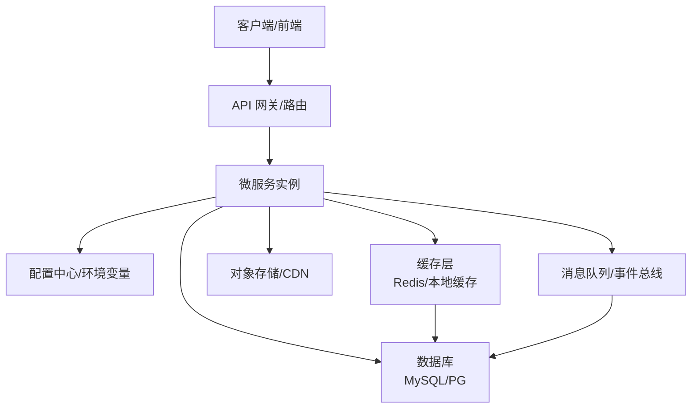
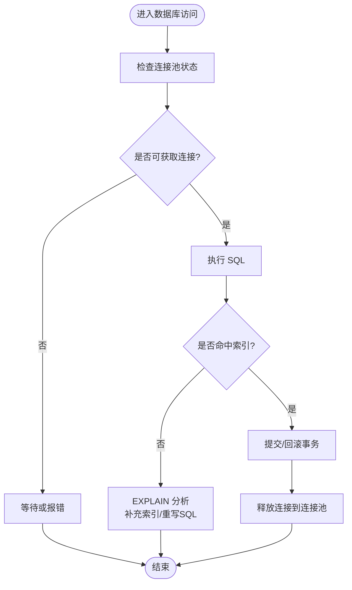
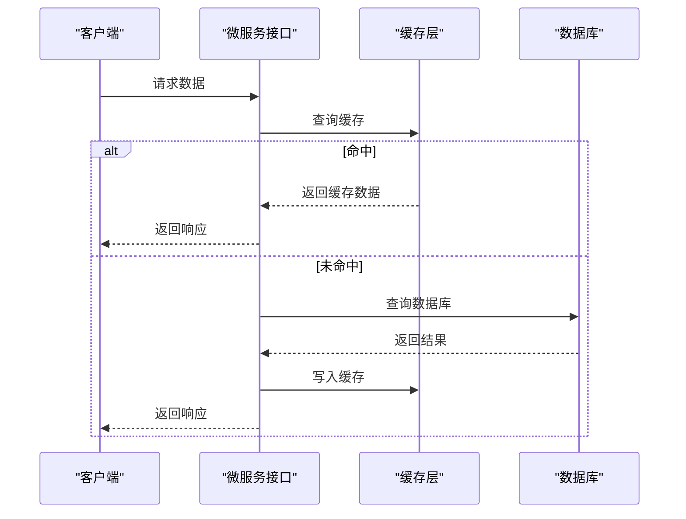
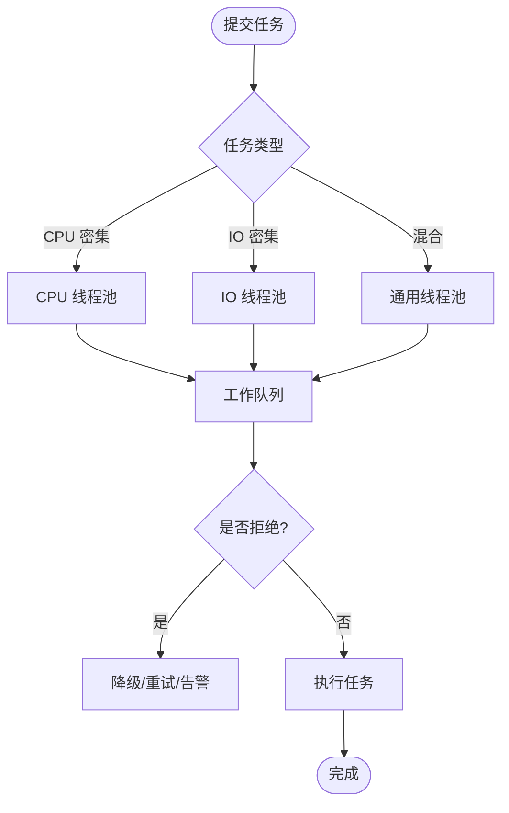
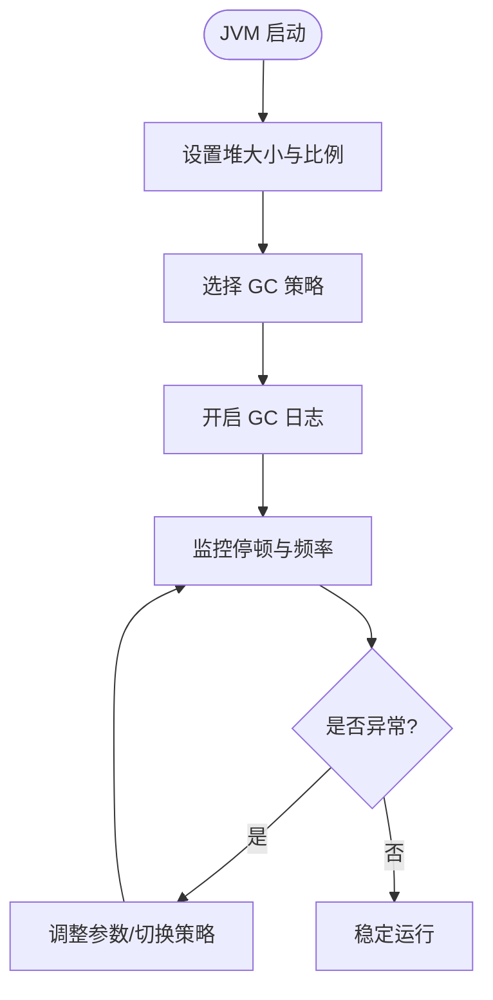
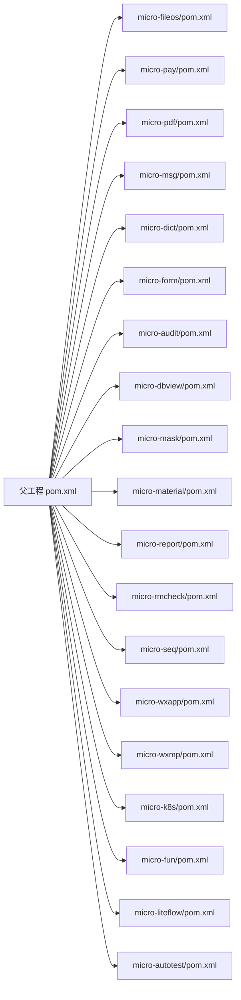

# 性能优化

<cite>
**本文引用的文件**
- [pom.xml](file://pom.xml)
- [micro-fileos/docs/configuration-guide.md](file://micro-fileos/docs/configuration-guide.md)
- [micro-fileos/docs/integration-guide.md](file://micro-fileos/docs/integration-guide.md)
- [micro-fileos/pom.xml](file://micro-fileos/pom.xml)
- [micro-pay/pom.xml](file://micro-pay/pom.xml)
- [micro-pdf/pom.xml](file://micro-pdf/pom.xml)
- [micro-msg/pom.xml](file://micro-msg/pom.xml)
- [micro-dict/pom.xml](file://micro-dict/pom.xml)
- [micro-form/pom.xml](file://micro-form/pom.xml)
- [micro-audit/pom.xml](file://micro-audit/pom.xml)
- [micro-dbview/pom.xml](file://micro-dbview/pom.xml)
- [micro-mask/pom.xml](file://micro-mask/pom.xml)
- [micro-material/pom.xml](file://micro-material/pom.xml)
- [micro-report/pom.xml](file://micro-report/pom.xml)
- [micro-rmcheck/pom.xml](file://micro-rmcheck/pom.xml)
- [micro-seq/pom.xml](file://micro-seq/pom.xml)
- [micro-wxapp/pom.xml](file://micro-wxapp/pom.xml)
- [micro-wxmp/pom.xml](file://micro-wxmp/pom.xml)
- [micro-k8s/pom.xml](file://micro-k8s/pom.xml)
- [micro-fun/pom.xml](file://micro-fun/pom.xml)
- [micro-liteflow/pom.xml](file://micro-liteflow/pom.xml)
- [micro-autotest/pom.xml](file://micro-autotest/pom.xml)
</cite>

## 目录
1. [简介](#简介)
2. [项目结构](#项目结构)
3. [核心组件](#核心组件)
4. [架构总览](#架构总览)
5. [详细组件分析](#详细组件分析)
6. [依赖分析](#依赖分析)
7. [性能考虑](#性能考虑)
8. [故障排查指南](#故障排查指南)
9. [结论](#结论)
10. [附录](#附录)

## 简介
本文件面向 sh-microapp 微服务框架的性能优化，聚焦于 JVM 调优、GC 策略、内存分配；数据库查询与索引、连接池配置；缓存策略、CDN 加速与静态资源优化；并发控制、线程池与异步处理；以及性能基准测试、瓶颈分析与容量规划的落地方法。内容基于仓库中各微服务模块的依赖与配置现状进行归纳总结，并提供可操作的优化建议。

## 项目结构
- 项目采用多模块 Maven 结构，父工程统一管理依赖与插件，子模块按功能域拆分（如文件存储、支付、消息、报表等）。
- 各子模块通过各自的 pom.xml 引入公共依赖与版本管理，便于统一性能相关库（如数据库驱动、连接池、监控、序列化等）的版本与行为。

```mermaid
graph TB
Root["父工程<br/>pom.xml"] --> Mod1["micro-fileos<br/>pom.xml"]
Root --> Mod2["micro-pay<br/>pom.xml"]
Root --> Mod3["micro-pdf<br/>pom.xml"]
Root --> Mod4["micro-msg<br/>pom.xml"]
Root --> Mod5["micro-dict<br/>pom.xml"]
Root --> Mod6["micro-form<br/>pom.xml"]
Root --> Mod7["micro-audit<br/>pom.xml"]
Root --> Mod8["micro-dbview<br/>pom.xml"]
Root --> Mod9["micro-mask<br/>pom.xml"]
Root --> Mod10["micro-material<br/>pom.xml"]
Root --> Mod11["micro-report<br/>pom.xml"]
Root --> Mod12["micro-rmcheck<br/>pom.xml"]
Root --> Mod13["micro-seq<br/>pom.xml"]
Root --> Mod14["micro-wxapp<br/>pom.xml"]
Root --> Mod15["micro-wxmp<br/>pom.xml"]
Root --> Mod16["micro-k8s<br/>pom.xml"]
Root --> Mod17["micro-fun<br/>pom.xml"]
Root --> Mod18["micro-liteflow<br/>pom.xml"]
Root --> Mod19["micro-autotest<br/>pom.xml"]
```

图表来源
- [pom.xml](file://pom.xml)
- [micro-fileos/pom.xml](file://micro-fileos/pom.xml)
- [micro-pay/pom.xml](file://micro-pay/pom.xml)
- [micro-pdf/pom.xml](file://micro-pdf/pom.xml)
- [micro-msg/pom.xml](file://micro-msg/pom.xml)
- [micro-dict/pom.xml](file://micro-dict/pom.xml)
- [micro-form/pom.xml](file://micro-form/pom.xml)
- [micro-audit/pom.xml](file://micro-audit/pom.xml)
- [micro-dbview/pom.xml](file://micro-dbview/pom.xml)
- [micro-mask/pom.xml](file://micro-mask/pom.xml)
- [micro-material/pom.xml](file://micro-material/pom.xml)
- [micro-report/pom.xml](file://micro-report/pom.xml)
- [micro-rmcheck/pom.xml](file://micro-rmcheck/pom.xml)
- [micro-seq/pom.xml](file://micro-seq/pom.xml)
- [micro-wxapp/pom.xml](file://micro-wxapp/pom.xml)
- [micro-wxmp/pom.xml](file://micro-wxmp/pom.xml)
- [micro-k8s/pom.xml](file://micro-k8s/pom.xml)
- [micro-fun/pom.xml](file://micro-fun/pom.xml)
- [micro-liteflow/pom.xml](file://micro-liteflow/pom.xml)
- [micro-autotest/pom.xml](file://micro-autotest/pom.xml)

章节来源
- [pom.xml](file://pom.xml)

## 核心组件
- 多模块架构：通过父工程集中管理依赖与版本，确保各模块在性能相关库上的一致性与可控性。
- 功能域划分：文件存储、支付、消息、报表、字典、表单、审计、数据库视图、掩码、物料、序列号、微信生态、K8s、流程编排、自动化测试等模块，便于针对不同场景做专项优化。
- 配置与集成：部分模块提供了配置指南与集成说明，有助于在部署阶段统一性能参数（如连接池、超时、缓存等）。

章节来源
- [pom.xml](file://pom.xml)
- [micro-fileos/docs/configuration-guide.md](file://micro-fileos/docs/configuration-guide.md)
- [micro-fileos/docs/integration-guide.md](file://micro-fileos/docs/integration-guide.md)

## 架构总览
从性能视角看，系统由“接入层（API/网关）→ 微服务（业务模块）→ 数据层（数据库/缓存/对象存储）”构成。性能优化应覆盖请求链路、数据库访问、缓存命中、IO 与网络传输等关键路径。

## 详细组件分析

### 数据库访问与连接池优化
- 连接池选择与参数
  - 优先选用成熟的连接池实现（如 HikariCP），并结合模块实际引入的数据库驱动与连接池依赖进行统一配置。
  - 关键参数包括：最小空闲连接、最大连接数、连接生命周期、获取超时、空闲超时、连接测试策略等。
- SQL 查询与索引
  - 使用慢查询日志与执行计划分析热点 SQL，针对性建立复合索引或调整字段顺序。
  - 避免 SELECT *、避免隐式转换、减少 N+1 查询、合理分页与 LIMIT。
- 事务与锁
  - 缩短事务时间，降低锁持有时间；对只读场景使用合适的隔离级别。
- 只读副本与读写分离
  - 将读流量分流至只读副本，写库专注写入，提升整体吞吐。

### 缓存策略优化
- 分层缓存
  - 本地缓存（如 Caffeine）用于热点数据快速访问；分布式缓存（Redis）用于跨实例共享与持久化。
- 缓存一致性
  - 写策略：直写/回写/失效策略；读策略：旁路/直读/回写。
  - 使用版本号或时间戳实现缓存失效与并发更新控制。
- 缓存穿透与击穿
  - 对空值设置短期缓存；对热点 key 提前加载与双写保护。
- 缓存预热与降级
  - 启动时预热关键数据；下游异常时启用降级返回兜底数据。

### CDN 加速与静态资源优化
- 静态资源托管
  - 将图片、视频、JS/CSS 等静态资源迁移至 CDN，缩短边缘节点延迟。
- 缓存策略
  - 设置合理的 Cache-Control、ETag/Last-Modified，区分强缓存与协商缓存。
- 压缩与格式优化
  - 启用 Gzip/Brotli 压缩；优先使用现代编码格式（WebP、AVIF）。
- 边缘计算
  - 利用 CDN 边缘脚本进行简单计算或裁剪，减轻源站压力。

### 并发控制、线程池与异步处理
- 线程池配置
  - CPU 密集型任务：线程数 ≈ CPU 核数；IO 密集型任务：适当扩大线程数。
  - 关键参数：核心线程数、最大线程数、队列长度、拒绝策略、空闲存活时间。
- 异步与批处理
  - 使用 CompletableFuture 或消息队列进行异步解耦；对 IO 密集型操作采用非阻塞模型。
- 并发安全
  - 使用原子类、无锁容器、读写锁等；避免共享可变状态或进行细粒度加锁。

### JVM 调优与 GC 策略
- 堆大小与新生代比例
  - 初始堆与最大堆根据服务内存需求设定；新生代过小会导致频繁晋升，过大则增加 STW 时间。
- GC 策略选择
  - 低延迟场景优先考虑 G1/ ZGC；吞吐量优先可考虑 Parallel Scavenge + Parallel Old。
- GC 日志与分析
  - 开启 GC 日志，关注 Full GC 频率与停顿时间，定位大对象晋升、老年代碎片等问题。
- 元空间与直接内存
  - 控制类元数据大小，避免 OutOfMemoryError；对 Netty/NIO 直接内存进行上限控制。
- 参数建议（示例方向）
  - 新生代比例、晋升阈值、并发标记线程数、GC 并行线程数、堆外内存上限等。

### 性能基准测试与容量规划
- 基准测试
  - 使用 JMeter/Locust/K6 等工具构造稳定压测场景，覆盖核心接口与数据库热点。
  - 关注指标：吞吐量、P99 延迟、错误率、资源占用（CPU/内存/GC/IO）。
- 瓶颈分析
  - 通过 APM/火焰图/线程转储定位 CPU、锁竞争、GC、数据库慢查询、IO 等瓶颈。
- 容量规划
  - 基于峰值 QPS 与 RT，结合缓存命中率与数据库承载能力，估算所需实例数与资源规格。
  - 考虑弹性伸缩策略与限流熔断，保障高峰期稳定性。

## 依赖分析
- 依赖统一管理：父工程 pom.xml 统一声明版本与依赖范围，子模块通过 <parent> 继承，减少重复与冲突。
- 模块间依赖：各子模块按需引入依赖，避免不必要的传递依赖导致包体膨胀与启动开销增大。
- 性能相关依赖：建议在父工程中统一引入数据库驱动、连接池、序列化、监控、日志等库的版本，确保全链路一致。

图表来源
- [pom.xml](file://pom.xml)
- [micro-fileos/pom.xml](file://micro-fileos/pom.xml)
- [micro-pay/pom.xml](file://micro-pay/pom.xml)
- [micro-pdf/pom.xml](file://micro-pdf/pom.xml)
- [micro-msg/pom.xml](file://micro-msg/pom.xml)
- [micro-dict/pom.xml](file://micro-dict/pom.xml)
- [micro-form/pom.xml](file://micro-form/pom.xml)
- [micro-audit/pom.xml](file://micro-audit/pom.xml)
- [micro-dbview/pom.xml](file://micro-dbview/pom.xml)
- [micro-mask/pom.xml](file://micro-mask/pom.xml)
- [micro-material/pom.xml](file://micro-material/pom.xml)
- [micro-report/pom.xml](file://micro-report/pom.xml)
- [micro-rmcheck/pom.xml](file://micro-rmcheck/pom.xml)
- [micro-seq/pom.xml](file://micro-seq/pom.xml)
- [micro-wxapp/pom.xml](file://micro-wxapp/pom.xml)
- [micro-wxmp/pom.xml](file://micro-wxmp/pom.xml)
- [micro-k8s/pom.xml](file://micro-k8s/pom.xml)
- [micro-fun/pom.xml](file://micro-fun/pom.xml)
- [micro-liteflow/pom.xml](file://micro-liteflow/pom.xml)
- [micro-autotest/pom.xml](file://micro-autotest/pom.xml)

章节来源
- [pom.xml](file://pom.xml)

## 性能考虑
- 统一治理：通过父工程统一性能相关依赖与版本，确保各模块在数据库驱动、连接池、序列化、监控等方面保持一致。
- 配置规范：参考文件存储模块的配置指南，将性能相关参数（连接池、超时、缓存 TTL 等）纳入统一命名空间与配置中心，便于灰度与回滚。
- 指标可观测：在各模块中埋点关键指标（QPS、RT、错误率、缓存命中率、数据库耗时、GC 次数/时长），结合 APM 工具进行持续观测。
- 渐进优化：先做热点接口与数据库的优化，再扩展到缓存与 IO 层面；每次变更后进行回归测试与压测验证。

## 故障排查指南
- 数据库问题
  - 现象：RT 突增、慢查询增多、连接池耗尽。
  - 排查：查看慢查询日志、执行计划、索引使用情况；核对连接池参数与数据库最大连接数。
- 缓存问题
  - 现象：缓存抖动、穿透、击穿、雪崩。
  - 排查：检查缓存键设计、TTL 设置、失效策略与降级逻辑。
- GC 问题
  - 现象：Full GC 频繁、STW 显著、内存占用高。
  - 排查：分析 GC 日志、堆内对象分布、晋升曲线，评估堆大小与 GC 策略。
- 并发问题
  - 现象：死锁、线程池拒绝、大量阻塞。
  - 排查：线程转储、锁竞争分析、线程池队列长度与拒绝策略。

章节来源
- [micro-fileos/docs/configuration-guide.md](file://micro-fileos/docs/configuration-guide.md)
- [micro-fileos/docs/integration-guide.md](file://micro-fileos/docs/integration-guide.md)

## 结论
sh-microapp 通过多模块与统一依赖管理，为性能优化提供了良好的基础。建议围绕“数据库访问优化、缓存与 CDN、并发与线程池、JVM 与 GC、基准测试与容量规划”五个维度，结合各模块特性制定专项优化策略，并以可观测性与自动化测试保障优化效果的可持续演进。

## 附录
- 配置与集成参考：文件存储模块提供了配置命名空间与集成步骤，可作为其他模块性能参数落地的模板。
- 版本与依赖：父工程统一管理版本，子模块按需继承，减少不一致带来的性能隐患。

章节来源
- [micro-fileos/docs/configuration-guide.md](file://micro-fileos/docs/configuration-guide.md)
- [micro-fileos/docs/integration-guide.md](file://micro-fileos/docs/integration-guide.md)
- [pom.xml](file://pom.xml)