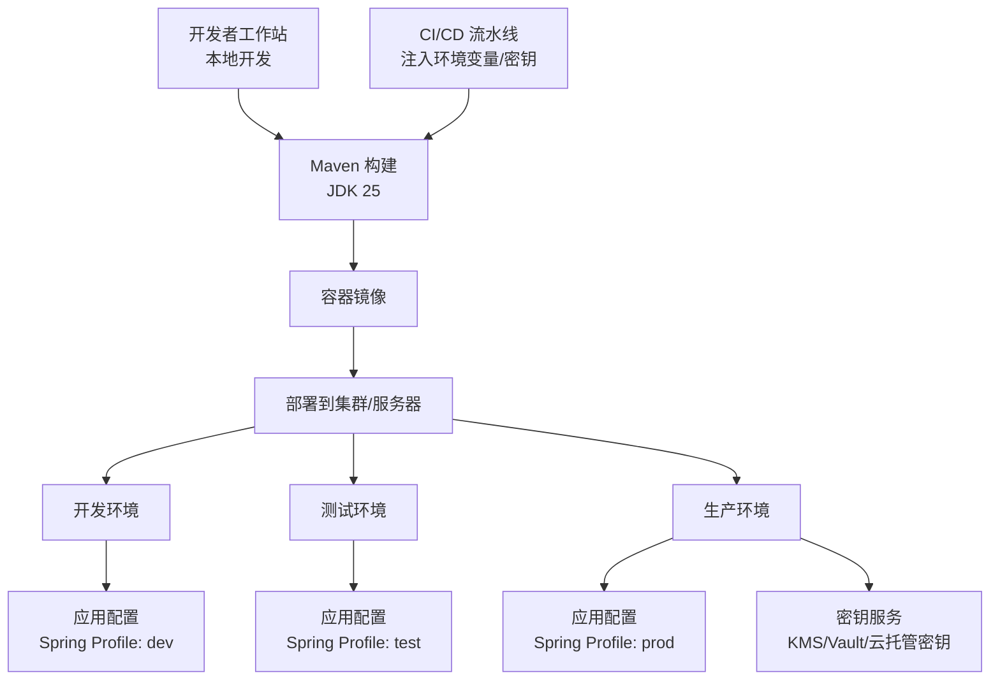
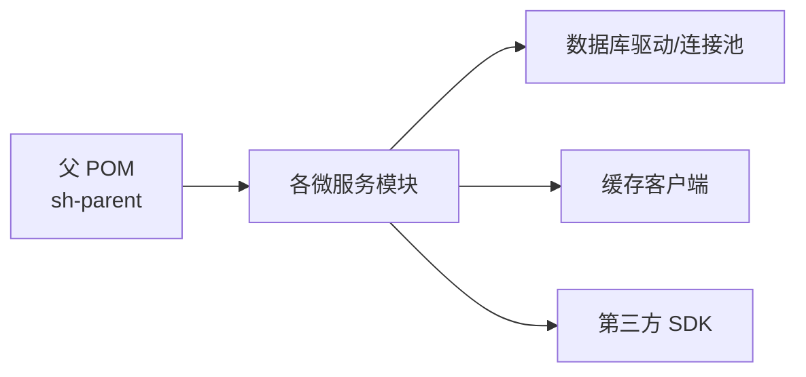

# 环境配置

<cite>
**本文引用的文件**
- [pom.xml](file://pom.xml)
- [application.yml](file://micro-liteflow/src/main/resources/config/application.yml)
</cite>

## 目录
1. [简介](#简介)
2. [项目结构](#项目结构)
3. [核心组件](#核心组件)
4. [架构总览](#架构总览)
5. [详细组件分析](#详细组件分析)
6. [依赖分析](#依赖分析)
7. [性能考虑](#性能考虑)
8. [故障排查指南](#故障排查指南)
9. [结论](#结论)
10. [附录](#附录)

## 简介
本文件面向 sh-microapp 微服务框架的环境配置，聚焦于开发、测试与生产三类环境的统一配置策略，涵盖 JDK 版本、Maven 构建、数据库连接参数、缓存配置、环境变量与配置文件管理、密钥管理最佳实践，并提供网络与域名解析的配置建议。由于本仓库以多模块 Maven 工程组织，各微服务模块可按需启用或禁用特定能力（如数据库、缓存、第三方 SDK），因此本文在不涉及具体代码实现的前提下，给出通用且可扩展的配置范式与模板。

## 项目结构
- 顶层 Maven 聚合工程，定义统一的 Java 版本属性与模块清单。
- 各微服务模块采用 Spring Boot 自动装配与资源目录组织，部分模块包含独立的配置文件示例（如 LiteFlow 的 application.yml）。

```mermaid
graph TB
Root["根工程<br/>聚合所有微服务模块"] --> ModAudit["micro-audit"]
Root --> ModDict["micro-dict"]
Root --> ModFileos["micro-fileos"]
Root --> ModLiteflow["micro-liteflow"]
Root --> ModForm["micro-form"]
Root --> ModFun["micro-fun"]
Root --> ModK8s["micro-k8s"]
Root --> ModMask["micro-mask"]
Root --> ModMaterial["micro-material"]
Root --> ModMsg["micro-msg"]
Root --> ModPay["micro-pay"]
Root --> ModPdf["micro-pdf"]
Root --> ModRmcheck["micro-rmcheck"]
Root --> ModSeq["micro-seq"]
Root --> ModWxapp["micro-wxapp"]
Root --> ModWxmp["micro-wxmp"]
Root --> ModAutotest["micro-autotest"]
Root --> ModDbview["micro-dbview"]
Root --> ModReport["micro-report"]
```

图表来源
- [pom.xml:28-48](file://pom.xml#L28-L48)

章节来源
- [pom.xml:19-26](file://pom.xml#L19-L26)
- [pom.xml:28-48](file://pom.xml#L28-L48)

## 核心组件
- JDK 与构建：统一使用高版本 Java 进行编译与运行，确保模块兼容性与性能优势。
- 配置中心与环境：通过 Spring Profile 与外部化配置实现环境隔离；数据库与缓存参数按环境注入。
- 密钥与敏感信息：通过环境变量或密钥管理服务注入，避免硬编码到仓库中。
- 网络与域名：通过反向代理与 DNS 解析实现多环境访问与安全边界控制。

章节来源
- [pom.xml:19-26](file://pom.xml#L19-L26)

## 架构总览
下图展示跨环境的配置流：开发者本地使用默认配置，CI/CD 注入环境变量与密钥，生产环境通过配置中心与密钥服务统一管理。

## 详细组件分析

### JDK 与 Maven 配置
- 统一编译与目标版本：建议在 CI/CD 中固定 JDK 版本，确保构建一致性。
- 依赖与父工程：子模块继承父 POM 的版本与插件配置，减少重复维护成本。

章节来源
- [pom.xml:19-26](file://pom.xml#L19-L26)
- [pom.xml:6-10](file://pom.xml#L6-L10)

### 数据库连接参数
- 参数注入方式：通过环境变量或配置文件注入 JDBC 连接串、用户名与密码。
- 连接池与健康检查：建议启用连接池与健康检查，按环境调整超时与并发参数。
- 多数据源：若模块需要多数据源，应明确区分主从与只读实例，按需启用读写分离。

（本节为通用配置指导，不直接分析具体文件）

### 缓存配置
- 缓存类型：Redis/Memcached/本地缓存等，按模块需求选择。
- 连接参数：主机、端口、认证、过期策略、序列化方式等。
- 命名空间与键前缀：避免键冲突，便于运维与监控。

（本节为通用配置指导，不直接分析具体文件）

### 配置文件管理
- Profile 分层：dev/test/prod 三层配置，公共配置放在默认文件，差异配置放入对应 profile 文件。
- 外部化配置：优先从环境变量与配置中心加载，其次再回退到本地配置文件。
- 配置热更新：对非敏感配置支持热更新；敏感配置建议重启生效。

章节来源
- [application.yml:1-26](file://micro-liteflow/src/main/resources/config/application.yml#L1-L26)

### 环境变量设置
- 必备变量：服务端口、数据库连接串、缓存地址、第三方 SDK 密钥等。
- 变量命名规范：使用全大写与下划线，避免与系统变量冲突。
- 注入位置：CI/CD 环境变量 > Docker/K8s Secret > 本地 .env 文件。

（本节为通用配置指导，不直接分析具体文件）

### 密钥管理最佳实践
- 不在代码或配置中存储明文密钥。
- 使用密钥管理服务（如 KMS、Vault、云托管密钥）进行密钥轮换与权限控制。
- 通过环境变量或挂载 Secret 的方式注入密钥，最小权限原则。

（本节为通用配置指导，不直接分析具体文件）

### 网络配置、防火墙与域名解析
- 反向代理：通过 Nginx/Traefik 等实现 HTTPS 终止、路由与限流。
- 防火墙：仅开放必要端口（如 80/443、应用端口），内网访问数据库与缓存。
- 域名解析：生产环境使用 CDN 与 DNS 策略（权重、健康检查）提升可用性。

（本节为通用配置指导，不直接分析具体文件）

## 依赖分析
- 模块耦合：各微服务模块相对独立，通过 API 或事件交互；数据库与缓存按需启用。
- 外部依赖：统一由父 POM 管理版本，子模块按需引入。

图表来源
- [pom.xml:6-10](file://pom.xml#L6-L10)
- [pom.xml:28-48](file://pom.xml#L28-L48)

章节来源
- [pom.xml:6-10](file://pom.xml#L6-L10)
- [pom.xml:28-48](file://pom.xml#L28-L48)

## 性能考虑
- JVM 参数：根据业务吞吐与延迟目标调优堆大小、GC 策略与线程数。
- 连接池：合理设置最大连接数、空闲超时与查询超时，避免资源争用。
- 缓存命中率：通过合理的键设计与过期策略提升命中率，降低后端压力。
- 并发模型：结合异步与限流策略，避免雪崩效应。

（本节为通用指导，不直接分析具体文件）

## 故障排查指南
- 启动失败：检查 JDK 版本与 Maven 构建日志，确认模块依赖与打包顺序。
- 数据库连接异常：核对连接串、凭据与网络连通性，查看连接池状态。
- 缓存不可用：验证地址、认证与网络策略，检查键空间与过期策略。
- 配置不生效：确认 Profile 是否正确激活，环境变量优先级与配置覆盖关系。

（本节为通用指导，不直接分析具体文件）

## 结论
通过统一的 JDK/Maven 管理、分环境配置与密钥治理、以及清晰的网络与域名策略，sh-microapp 能够在开发、测试与生产环境中保持一致的交付质量与运维效率。建议在团队内固化配置模板与 CI/CD 规范，持续优化性能与可观测性。

## 附录

### 开发环境配置模板
- JDK：使用与父 POM 对齐的版本进行本地构建与调试。
- 数据库：本地或内网测试库，连接参数通过环境变量注入。
- 缓存：本地 Redis 或内存缓存，用于快速验证功能。
- 配置文件：dev profile，启用必要的日志与调试开关。
- 网络：本地端口映射与内网可达，无需暴露公网。

（本节为通用模板，不直接分析具体文件）

### 测试环境配置模板
- JDK：与生产一致的版本，确保二进制兼容。
- 数据库：独立测试库，定期快照与回滚策略。
- 缓存：与生产相近规模的缓存集群，模拟真实负载。
- 配置文件：test profile，启用性能与安全相关日志。
- 网络：通过内网域名访问，限制外网访问。

（本节为通用模板，不直接分析具体文件）

### 生产环境配置模板
- JDK：锁定版本并启用安全补丁策略。
- 数据库：主从复制、只读实例与备份策略，连接池参数按压测结果调优。
- 缓存：高可用集群，带哨兵/集群模式与自动故障转移。
- 配置文件：prod profile，启用审计与告警日志。
- 密钥：通过密钥服务动态注入，定期轮换。
- 网络：HTTPS 终止、WAF、DDoS 防护与 DNS 健康检查。

（本节为通用模板，不直接分析具体文件）