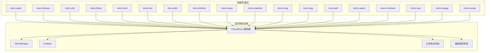
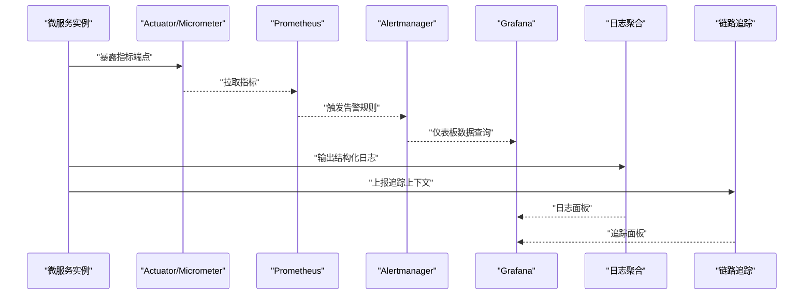
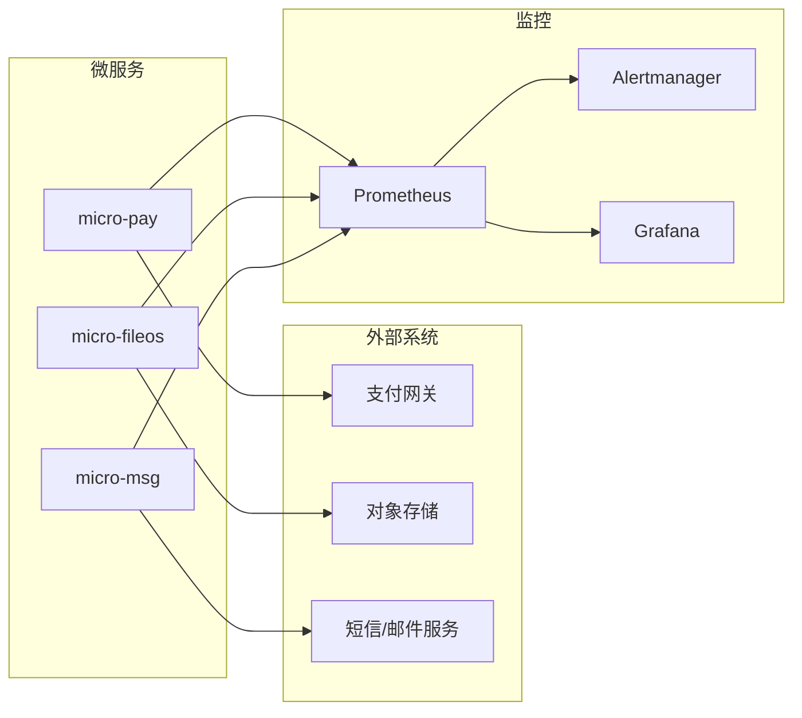

# 监控告警

<cite>
**本文引用的文件**
- [README.md](file://README.md)
- [deployment.md](file://docs/living-docs-technical/architecture/deployment.md)
- [logging.md](file://docs/standards/logging.md)
- [ops.md](file://docs/standards/ops.md)
- [application.yml](file://micro-liteflow/src/main/resources/config/application.yml)
</cite>

## 目录
1. [简介](#简介)
2. [项目结构](#项目结构)
3. [核心组件](#核心组件)
4. [架构总览](#架构总览)
5. [详细组件分析](#详细组件分析)
6. [依赖分析](#依赖分析)
7. [性能考虑](#性能考虑)
8. [故障排查指南](#故障排查指南)
9. [结论](#结论)
10. [附录](#附录)

## 简介
本文件面向 sh-microapp 微服务框架的监控与告警落地，围绕 Prometheus 指标采集、Grafana 仪表板配置、告警规则与通知渠道、静默与升级策略、日志聚合与链路追踪、错误率监控、长期存储与趋势分析等方面，提供可操作的实施建议与最佳实践。由于当前代码库中未发现现成的监控配置或集成代码，本文以通用微服务监控体系为基础，结合本项目的模块化特性与部署现状，给出可落地的实施方案。

## 项目结构
- 项目采用多模块微服务架构，每个功能域（如 audit、dbview、dict、fileos、form、fun、k8s、liteflow、mask、material、msg、pay、pdf、report、rmcheck、seq、wxapp、wxmp）独立为 Maven 模块，便于分别接入监控与告警。
- 部署与运维相关文档位于 docs/standards 与 docs/living-docs-technical/architecture 下，可作为监控方案的背景依据。
- 部分模块存在 application.yml 配置文件，可用于统一配置监控相关参数（如端点暴露、采样等）。

**章节来源**
- [README.md](file://README.md)
- [deployment.md](file://docs/living-docs-technical/architecture/deployment.md)

## 核心组件
- 指标采集层：各微服务通过 Spring Boot Actuator 暴露 JVM/应用指标；结合 Micrometer 可扩展到自定义指标。
- 存储层：Prometheus 负责时间序列存储与查询，支持短期高效存储与规则计算。
- 展示层：Grafana 提供可视化仪表板，支持跨服务聚合视图。
- 告警层：Alertmanager 聚合并去重告警，按路由规则投递至不同通知渠道。
- 日志与追踪：集中式日志（如 ELK/Fluentd/Loki）+ 分布式追踪（如 Jaeger/OpenTelemetry），用于问题定位与根因分析。
- 运维与规范：遵循 ops 与 logging 文档中的运维与日志规范，确保可观测性一致性和可维护性。

**章节来源**
- [ops.md](file://docs/standards/ops.md)
- [logging.md](file://docs/standards/logging.md)

## 架构总览
下图展示从微服务到监控系统的整体流程：指标导出、采集、存储、告警与可视化。

**图表来源**
- [ops.md](file://docs/standards/ops.md)
- [logging.md](file://docs/standards/logging.md)

## 详细组件分析

### 指标采集与暴露
- 指标范围建议
  - 系统级：CPU 使用率、内存使用量、磁盘 IO、网络吞吐、文件描述符数。
  - 应用级：请求延迟（P50/P90/P99）、请求速率、错误率、超时率、饱和度（线程池队列长度、连接池剩余）。
  - 业务级：关键业务指标（如支付成功率、下单转化率、文件上传成功数）。
- 指标命名与标签
  - 统一前缀与命名风格，避免歧义；为跨服务关联添加服务名、实例、版本、环境等标签。
- 采样与降噪
  - 对高频指标进行采样或降采样，降低存储与查询压力。
- 端点与安全
  - 仅在内网或受控网络暴露指标端点；必要时启用认证与加密。

**章节来源**
- [application.yml](file://micro-liteflow/src/main/resources/config/application.yml)
- [ops.md](file://docs/standards/ops.md)

### Prometheus 规则与告警
- 告警规则建议
  - CPU：持续 5 分钟平均 CPU 使用率 > 85%
  - 内存：堆外内存/直接缓冲区增长异常
  - 磁盘：可用空间 < 10% 或写入延迟 > 100ms
  - 网络：出口带宽使用率 > 90%，连接数异常激增
  - 应用：错误率 > 1%/5m、P99 延迟 > 2s、超时率 > 0.5%/5m
  - 业务：关键指标偏离基线（如同比/环比）
- 告警分级与静默
  - 分级：P1（业务中断）、P2（性能退化）、P3（潜在风险）
  - 静默：发布窗口、节假日、演练期可设置静默
- 升级策略
  - 多级升级：首次告警短信/邮件，未处理自动升级电话；跨团队升级至技术负责人

**章节来源**
- [ops.md](file://docs/standards/ops.md)

### Grafana 仪表板
- 仪表板建议
  - 服务总览：QPS、错误率、P99 延迟、CPU/内存/IO
  - 环境对比：多集群/多环境对比
  - 业务看板：关键业务指标趋势与异常
  - 日志与追踪：日志检索与关键追踪链路
- 面板优化
  - 合理的时间范围与刷新频率；对高基数标签进行过滤；使用模板变量统一环境与服务选择

**章节来源**
- [logging.md](file://docs/standards/logging.md)

### 日志聚合与错误率监控
- 日志采集
  - 统一日志格式（JSON），包含 trace_id、span_id、服务名、实例、级别、时间戳、模块、消息体
  - 通过 Filebeat/Fluent Bit/Vector 收集，写入 Loki/Elasticsearch
- 错误率与根因
  - 基于日志统计错误率、异常堆栈分布；结合追踪 ID 回溯调用链
  - 异常告警：错误数突增、特定异常占比上升

**章节来源**
- [logging.md](file://docs/standards/logging.md)

### 链路追踪与错误率监控
- 追踪采集
  - OpenTelemetry SDK 注入 trace_id/spam_id；上报 Jaeger/Zipkin/Tempo
- 追踪分析
  - 关键路径耗时、慢调用、失败调用、跨服务依赖关系
- 与告警联动
  - 将追踪异常与日志异常结合，形成闭环告警

**章节来源**
- [ops.md](file://docs/standards/ops.md)

### 通知渠道与静默规则
- 通知渠道
  - 钉钉/企业微信机器人、邮件、电话（P1）
- 静默规则
  - 发布窗口、演练期、节假日、低优先级环境
- 升级策略
  - 未确认/未处理自动升级；跨团队升级

**章节来源**
- [ops.md](file://docs/standards/ops.md)

### 性能与容量规划
- 指标基线与阈值
  - 基于历史数据设定基线；结合容量规划预留安全余量
- 降载与熔断
  - 在高峰期自动降级非关键指标采集；熔断第三方依赖

**章节来源**
- [ops.md](file://docs/standards/ops.md)

## 依赖分析
- 模块耦合
  - 各微服务模块之间通过 API 网关或内部服务发现交互，监控应关注跨模块调用链路与依赖健康。
- 外部依赖
  - 第三方支付、文件存储、消息推送等外部服务的可用性与延迟应纳入监控与告警。
- 监控依赖
  - Prometheus、Alertmanager、Grafana、日志与追踪系统之间的连通性与可用性需纳入 SLA。

**图表来源**
- [deployment.md](file://docs/living-docs-technical/architecture/deployment.md)

**章节来源**
- [deployment.md](file://docs/living-docs-technical/architecture/deployment.md)

## 性能考虑
- 指标规模控制
  - 控制高基数标签数量；对热点指标进行采样或降采样
- 查询优化
  - 合理使用 PromQL，避免复杂聚合导致查询超时
- 存储与保留
  - 不同指标设置不同保留周期；热数据与冷数据分离

**章节来源**
- [ops.md](file://docs/standards/ops.md)

## 故障排查指南
- 快速定位
  - 先看错误率与延迟，再看系统资源与外部依赖
- 日志与追踪
  - 通过 trace_id 在日志与追踪系统中串联全链路
- 告警收敛
  - 利用静默与抑制规则减少噪声，聚焦真实问题

**章节来源**
- [logging.md](file://docs/standards/logging.md)
- [ops.md](file://docs/standards/ops.md)

## 结论
本方案基于通用微服务可观测性体系，结合 sh-microapp 的模块化架构与部署现状，提供了从指标采集、存储、告警到可视化与日志/追踪的完整路径。建议先在部分核心模块试点，逐步推广至全量服务，持续迭代阈值与规则，提升告警准确性与响应效率。

## 附录
- 关键性能指标（KPI）清单
  - 系统级：CPU 使用率、内存使用量、磁盘可用空间、网络吞吐、文件描述符
  - 应用级：QPS、错误率、P50/P90/P99 延迟、超时率、饱和度
  - 业务级：关键业务指标（如支付成功率、文件上传成功数）
- 阈值参考（示例）
  - CPU > 85%（持续 5 分钟）
  - 错误率 > 1%/5m
  - P99 延迟 > 2s
  - 磁盘可用空间 < 10%
  - 网络出口带宽使用率 > 90%