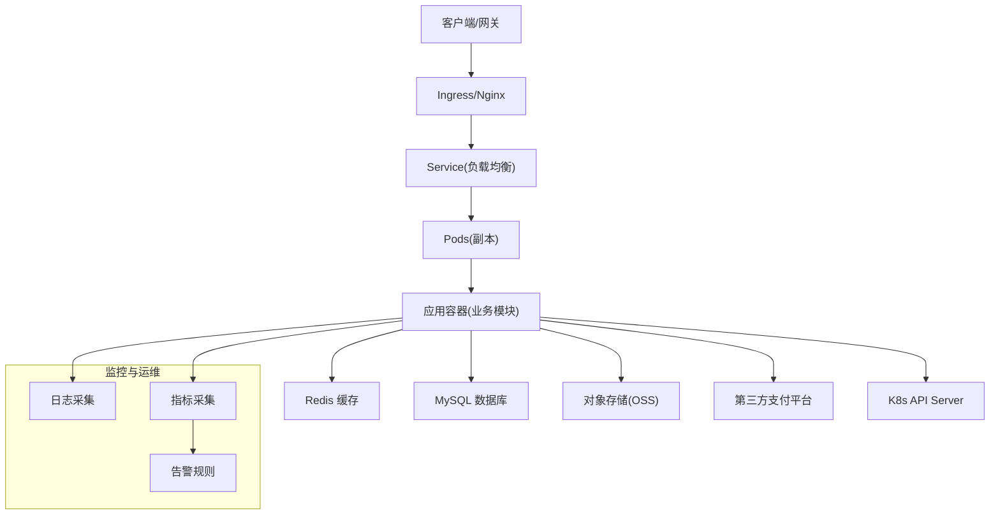
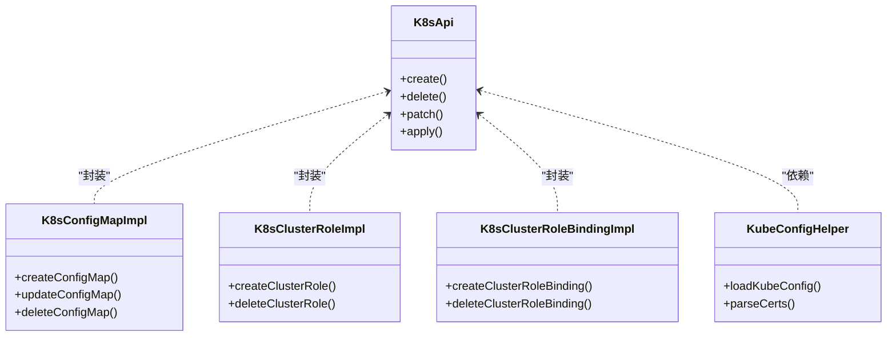
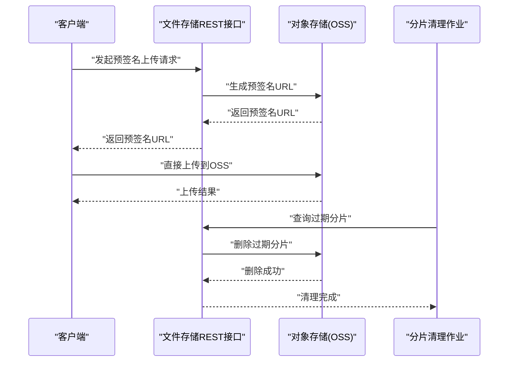
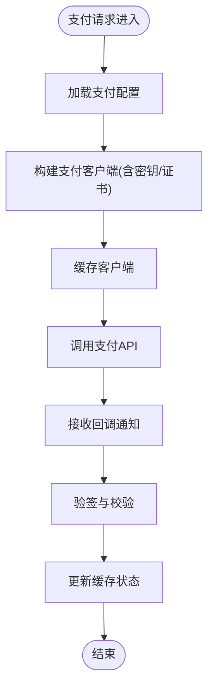
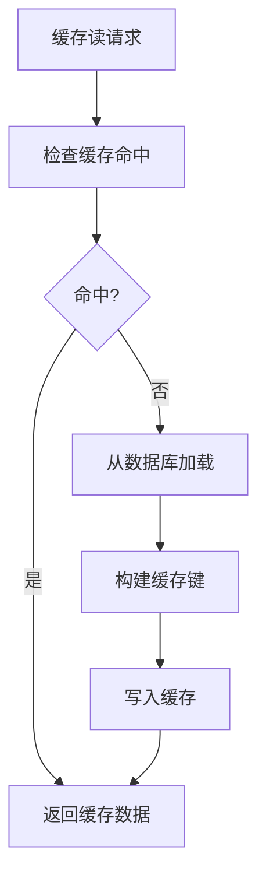
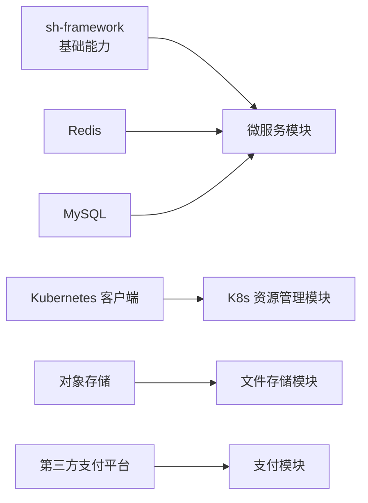

```mermaid
graph TB
subgraph "基础设施"
K8s["Kubernetes 集群"]
Redis["Redis 缓存"]
MySQL["MySQL 数据库"]
Oss["对象存储(OSS)"]
end
subgraph "微服务模块"
Dict["字典模块"]
Material["物料模块"]
Pay["支付模块"]
FileOS["文件存储模块"]
WXApp["微信小程序模块"]
WXMP["微信公众号模块"]
Seq["序列号模块"]
Audit["审计模块"]
Msg["消息模块"]
PDF["PDF 模板模块"]
LiteFlow["流程引擎模块"]
Mask["脱敏模块"]
RMCheck["删除校验模块"]
Report["报表模块"]
Autotest["自动化测试模块"]
DBView["数据库视图模块"]
Fun["函数模块"]
K8sMod["K8s 资源管理模块"]
end
K8s --> Dict
K8s --> Material
K8s --> Pay
K8s --> FileOS
K8s --> WXApp
K8s --> WXMP
K8s --> Seq
K8s --> Audit
K8s --> Msg
K8s --> PDF
K8s --> LiteFlow
K8s --> Mask
K8s --> RMCheck
K8s --> Report
K8s --> Autotest
K8s --> DBView
K8s --> Fun
K8s --> K8sMod
Dict --> Redis
Material --> Redis
Pay --> Redis
FileOS --> Oss
WXApp --> Redis
WXMP --> Redis
Seq --> Redis
Audit --> Redis
Msg --> Redis
PDF --> Redis
LiteFlow --> Redis
Mask --> Redis
RMCheck --> Redis
Report --> Redis
DBView --> Redis
Fun --> Redis
K8sMod --> K8s
```

# 部署运维

<cite>
**本文引用的文件**   
- [AGENTS.md](file://AGENTS.md)
- [CONTEXT.md](file://CONTEXT.md)
- [docs/living-docs-technical/architecture/deployment.md](file://docs/living-docs-technical/architecture/deployment.md)
- [docs/standards/logging.md](file://docs/standards/logging.md)
- [docs/standards/ops.md](file://docs/standards/ops.md)
- [docs/standards/security.md](file://docs/standards/security.md)
- [docs/risk-analysis.md](file://docs/risk-analysis.md)
- [micro-k8s/pom.xml](file://micro-k8s/pom.xml)
- [micro-k8s/src/main/java/com/wkclz/micro/k8s/custom/K8sApi.java](file://micro-k8s/src/main/java/com/wkclz/micro/k8s/custom/K8sApi.java)
- [micro-k8s/src/main/java/com/wkclz/micro/k8s/custom/impl/K8sClusterRoleImpl.java](file://micro-k8s/src/main/java/com/wkclz/micro/k8s/custom/impl/K8sClusterRoleImpl.java)
- [micro-k8s/src/main/java/com/wkclz/micro/k8s/custom/impl/K8sClusterRoleBindingImpl.java](file://micro-k8s/src/main/java/com/wkclz/micro/k8s/custom/impl/K8sClusterRoleBindingImpl.java)
- [micro-k8s/src/main/java/com/wkclz/micro/k8s/custom/impl/K8sConfigMapImpl.java](file://micro-k8s/src/main/java/com/wkclz/micro/k8s/custom/impl/K8sConfigMapImpl.java)
- [micro-k8s/src/main/java/com/wkclz/micro/k8s/helper/KubeConfigHelper.java](file://micro-k8s/src/main/java/com/wkclz/micro/k8s/helper/KubeConfigHelper.java)
- [micro-fileos/docs/configuration-guide.md](file://micro-fileos/docs/configuration-guide.md)
- [micro-fileos/src/main/java/com/wkclz/micro/fileos/utils/OssUtil.java](file://micro-fileos/src/main/java/com/wkclz/micro/fileos/utils/OssUtil.java)
- [micro-pay/src/main/java/com/wkclz/micro/pay/cache/AlipayClientCache.java](file://micro-pay/src/main/java/com/wkclz/micro/pay/cache/AlipayClientCache.java)
- [micro-pay/src/main/java/com/wkclz/micro/pay/cache/WxpayClientCache.java](file://micro-pay/src/main/java/com/wkclz/micro/pay/cache/WxpayClientCache.java)
- [micro-pay/src/main/java/com/wkclz/micro/pay/helper/AlipayHelper.java](file://micro-pay/src/main/java/com/wkclz/micro/pay/helper/AlipayHelper.java)
- [micro-pay/src/main/java/com/wkclz/micro/pay/helper/WxpayHelper.java](file://micro-pay/src/main/java/com/wkclz/micro/pay/helper/WxpayHelper.java)
- [micro-pay/src/main/java/com/wkclz/micro/pay/service/PayAlipayConfigService.java](file://micro-pay/src/main/java/com/wkclz/micro/pay/service/PayAlipayConfigService.java)
- [micro-pay/src/main/java/com/wkclz/micro/pay/service/PayWxpayConfigService.java](file://micro-pay/src/main/java/com/wkclz/micro/pay/service/PayWxpayConfigService.java)
- [micro-dict/src/main/java/com/wkclz/micro/dict/cache/DictCache.java](file://micro-dict/src/main/java/com/wkclz/micro/dict/cache/DictCache.java)
- [micro-material/src/main/java/com/wkclz/micro/material/cache/MaterialGroupCache.java](file://micro-material/src/main/java/com/wkclz/micro/material/cache/MaterialGroupCache.java)
- [micro-mask/src/main/java/com/wkclz/micro/mask/cache/MaskCache.java](file://micro-mask/src/main/java/com/wkclz/micro/mask/cache/MaskCache.java)
- [micro-seq/src/main/java/com/wkclz/micro/seq/api/SeqApi.java](file://micro-seq/src/main/java/com/wkclz/micro/seq/api/SeqApi.java)
- [micro-wxapp/src/main/java/com/wkclz/micro/wxapp/service/MicroAppAutoConfig.java](file://micro-wxapp/src/main/java/com/wkclz/micro/wxapp/service/MicroAppAutoConfig.java)
- [micro-wxmp/src/main/java/com/wkclz/micro/wxmp/service/WxmpAutoConfig.java](file://micro-wxmp/src/main/java/com/wkclz/micro/wxmp/service/WxmpAutoConfig.java)
</cite>

## 目录
1. [引言](#引言)
2. [项目结构](#项目结构)
3. [核心组件](#核心组件)
4. [架构总览](#架构总览)
5. [详细组件分析](#详细组件分析)
6. [依赖关系分析](#依赖关系分析)
7. [性能考量](#性能考量)
8. [故障排查指南](#故障排查指南)
9. [结论](#结论)
10. [附录](#附录)

## 引言
本部署运维文档面向 sh-microapp 微服务框架的生产环境，覆盖部署架构、容器化与集群管理、镜像构建、Kubernetes 部署与服务编排、监控告警、运维工具、数据库与缓存、第三方服务集成、故障排查、性能指标、容量规划、灰度发布与回滚策略、备份恢复与安全加固等主题。内容基于仓库中现有技术文档与关键实现文件进行系统化整理，帮助团队在不同环境中稳定交付与持续运维。

## 项目结构
sh-microapp 是一个以多模块微服务为核心的工程，每个功能域独立封装为模块（如字典、物料、支付、文件存储、微信应用等），并通过统一的基础能力（如 Redis、Spring、Web 等）支撑运行。部署侧的关键落点包括：
- Kubernetes 能力模块：提供对 RBAC、ConfigMap、ClusterRole/Binding 等资源的客户端封装与工具类，便于在集群内进行资源编排与配置管理。
- 文件存储模块：提供对象存储集成与签名上传/下载能力，常用于生产中的静态资源与附件存储。
- 支付模块：提供支付宝与微信支付的配置、客户端缓存与回调处理，是生产环境需要重点保障的服务。
- 缓存模块：各领域模块均内置缓存策略，需结合 Redis 实施统一的缓存治理与清理机制。
- 日志与运维标准：提供可观测性与运维规范，指导健康检查、日志采集、指标暴露与告警配置。

**图表来源**
- [AGENTS.md:120-130](file://AGENTS.md#L120-L130)
- [CONTEXT.md:30-36](file://CONTEXT.md#L30-L36)
- [docs/living-docs-technical/architecture/deployment.md](file://docs/living-docs-technical/architecture/deployment.md)

**章节来源**
- [AGENTS.md:40-46](file://AGENTS.md#L40-L46)
- [CONTEXT.md:30-36](file://CONTEXT.md#L30-L36)
- [docs/living-docs-technical/architecture/deployment.md](file://docs/living-docs-technical/architecture/deployment.md)

## 核心组件
- Kubernetes 资源管理模块：提供对 RBAC、ConfigMap、ClusterRole/Binding 等资源的封装与工具类，支持在集群内进行资源编排与配置管理。
- 文件存储模块：提供对象存储集成与签名上传/下载能力，支持桶与目录管理、分片清理等任务。
- 支付模块：提供支付宝与微信支付的配置、客户端缓存与回调处理，涉及敏感密钥与证书的缓存与自动清理。
- 缓存模块：各领域模块均内置缓存策略，需结合 Redis 实施统一的缓存治理与清理机制。
- 日志与运维标准：提供可观测性与运维规范，指导健康检查、日志采集、指标暴露与告警配置。

**章节来源**
- [micro-k8s/pom.xml:20-30](file://micro-k8s/pom.xml#L20-L30)
- [micro-fileos/docs/configuration-guide.md](file://micro-fileos/docs/configuration-guide.md)
- [micro-pay/src/main/java/com/wkclz/micro/pay/cache/AlipayClientCache.java](file://micro-pay/src/main/java/com/wkclz/micro/pay/cache/AlipayClientCache.java)
- [micro-pay/src/main/java/com/wkclz/micro/pay/cache/WxpayClientCache.java](file://micro-pay/src/main/java/com/wkclz/micro/pay/cache/WxpayClientCache.java)
- [docs/standards/logging.md](file://docs/standards/logging.md)
- [docs/standards/ops.md](file://docs/standards/ops.md)

## 架构总览
下图展示生产环境的典型部署架构：微服务通过 Docker 容器化后部署于 Kubernetes 集群；缓存采用 Redis，数据库采用 MySQL；对象存储用于静态资源与附件；支付模块对接第三方支付平台；审计、消息、报表等模块按需接入。

**图表来源**
- [docs/living-docs-technical/architecture/deployment.md](file://docs/living-docs-technical/architecture/deployment.md)
- [docs/standards/logging.md](file://docs/standards/logging.md)
- [docs/standards/ops.md](file://docs/standards/ops.md)

## 详细组件分析

### Kubernetes 资源管理组件
该模块提供对 RBAC、ConfigMap、ClusterRole/Binding 等资源的封装与工具类，便于在集群内进行资源编排与配置管理。关键点：
- 使用 Kubernetes Java 客户端进行资源操作，支持异常处理与 YAML 序列化。
- 提供 ConfigMap、ClusterRole、ClusterRoleBinding 的实现类，便于在应用启动时完成必要的集群资源准备。
- 提供 KubeConfigHelper 工具类，用于加载与解析 kubeconfig，支持证书与私钥处理。

**图表来源**
- [micro-k8s/src/main/java/com/wkclz/micro/k8s/custom/K8sApi.java](file://micro-k8s/src/main/java/com/wkclz/micro/k8s/custom/K8sApi.java)
- [micro-k8s/src/main/java/com/wkclz/micro/k8s/custom/impl/K8sConfigMapImpl.java](file://micro-k8s/src/main/java/com/wkclz/micro/k8s/custom/impl/K8sConfigMapImpl.java)
- [micro-k8s/src/main/java/com/wkclz/micro/k8s/custom/impl/K8sClusterRoleImpl.java](file://micro-k8s/src/main/java/com/wkclz/micro/k8s/custom/impl/K8sClusterRoleImpl.java)
- [micro-k8s/src/main/java/com/wkclz/micro/k8s/custom/impl/K8sClusterRoleBindingImpl.java](file://micro-k8s/src/main/java/com/wkclz/micro/k8s/custom/impl/K8sClusterRoleBindingImpl.java)
- [micro-k8s/src/main/java/com/wkclz/micro/k8s/helper/KubeConfigHelper.java](file://micro-k8s/src/main/java/com/wkclz/micro/k8s/helper/KubeConfigHelper.java)

**章节来源**
- [micro-k8s/pom.xml:20-30](file://micro-k8s/pom.xml#L20-L30)
- [micro-k8s/src/main/java/com/wkclz/micro/k8s/custom/K8sApi.java](file://micro-k8s/src/main/java/com/wkclz/micro/k8s/custom/K8sApi.java)
- [micro-k8s/src/main/java/com/wkclz/micro/k8s/custom/impl/K8sConfigMapImpl.java](file://micro-k8s/src/main/java/com/wkclz/micro/k8s/custom/impl/K8sConfigMapImpl.java)
- [micro-k8s/src/main/java/com/wkclz/micro/k8s/custom/impl/K8sClusterRoleImpl.java](file://micro-k8s/src/main/java/com/wkclz/micro/k8s/custom/impl/K8sClusterRoleImpl.java)
- [micro-k8s/src/main/java/com/wkclz/micro/k8s/custom/impl/K8sClusterRoleBindingImpl.java](file://micro-k8s/src/main/java/com/wkclz/micro/k8s/custom/impl/K8sClusterRoleBindingImpl.java)
- [micro-k8s/src/main/java/com/wkclz/micro/k8s/helper/KubeConfigHelper.java](file://micro-k8s/src/main/java/com/wkclz/micro/k8s/helper/KubeConfigHelper.java)

### 文件存储组件
该模块提供对象存储集成与签名上传/下载能力，支持桶与目录管理、分片清理等任务。关键点：
- 提供预签名上传与签名下载接口，便于前端直传与安全访问控制。
- 提供桶与目录管理接口，支持权限控制与元数据维护。
- 提供分片清理作业，避免临时分片占用存储空间。

**图表来源**
- [micro-fileos/docs/configuration-guide.md](file://micro-fileos/docs/configuration-guide.md)
- [micro-fileos/src/main/java/com/wkclz/micro/fileos/utils/OssUtil.java](file://micro-fileos/src/main/java/com/wkclz/micro/fileos/utils/OssUtil.java)

**章节来源**
- [micro-fileos/docs/configuration-guide.md](file://micro-fileos/docs/configuration-guide.md)
- [micro-fileos/src/main/java/com/wkclz/micro/fileos/utils/OssUtil.java](file://micro-fileos/src/main/java/com/wkclz/micro/fileos/utils/OssUtil.java)

### 支付组件
该模块提供支付宝与微信支付的配置、客户端缓存与回调处理，涉及敏感密钥与证书的缓存与自动清理。关键点：
- 支付宝与微信支付分别维护客户端缓存，包含私钥/证书等敏感信息。
- 提供配置服务，支持对支付渠道参数的动态管理。
- 提供定时任务，定期清理过期缓存，降低安全风险。

**图表来源**
- [micro-pay/src/main/java/com/wkclz/micro/pay/cache/AlipayClientCache.java](file://micro-pay/src/main/java/com/wkclz/micro/pay/cache/AlipayClientCache.java)
- [micro-pay/src/main/java/com/wkclz/micro/pay/cache/WxpayClientCache.java](file://micro-pay/src/main/java/com/wkclz/micro/pay/cache/WxpayClientCache.java)
- [micro-pay/src/main/java/com/wkclz/micro/pay/service/PayAlipayConfigService.java](file://micro-pay/src/main/java/com/wkclz/micro/pay/service/PayAlipayConfigService.java)
- [micro-pay/src/main/java/com/wkclz/micro/pay/service/PayWxpayConfigService.java](file://micro-pay/src/main/java/com/wkclz/micro/pay/service/PayWxpayConfigService.java)

**章节来源**
- [micro-pay/src/main/java/com/wkclz/micro/pay/cache/AlipayClientCache.java](file://micro-pay/src/main/java/com/wkclz/micro/pay/cache/AlipayClientCache.java)
- [micro-pay/src/main/java/com/wkclz/micro/pay/cache/WxpayClientCache.java](file://micro-pay/src/main/java/com/wkclz/micro/pay/cache/WxpayClientCache.java)
- [micro-pay/src/main/java/com/wkclz/micro/pay/service/PayAlipayConfigService.java](file://micro-pay/src/main/java/com/wkclz/micro/pay/service/PayAlipayConfigService.java)
- [micro-pay/src/main/java/com/wkclz/micro/pay/service/PayWxpayConfigService.java](file://micro-pay/src/main/java/com/wkclz/micro/pay/service/PayWxpayConfigService.java)

### 缓存组件
各领域模块均内置缓存策略，需结合 Redis 实施统一的缓存治理与清理机制。关键点：
- 字典、物料、脱敏等模块均提供缓存类，负责热点数据的读写与失效。
- 支付模块的缓存包含敏感信息，需特别注意缓存键命名与清理策略，避免相互干扰。

**图表来源**
- [micro-dict/src/main/java/com/wkclz/micro/dict/cache/DictCache.java](file://micro-dict/src/main/java/com/wkclz/micro/dict/cache/DictCache.java)
- [micro-material/src/main/java/com/wkclz/micro/material/cache/MaterialGroupCache.java](file://micro-material/src/main/java/com/wkclz/micro/material/cache/MaterialGroupCache.java)
- [micro-mask/src/main/java/com/wkclz/micro/mask/cache/MaskCache.java](file://micro-mask/src/main/java/com/wkclz/micro/mask/cache/MaskCache.java)

**章节来源**
- [micro-dict/src/main/java/com/wkclz/micro/dict/cache/DictCache.java](file://micro-dict/src/main/java/com/wkclz/micro/dict/cache/DictCache.java)
- [micro-material/src/main/java/com/wkclz/micro/material/cache/MaterialGroupCache.java](file://micro-material/src/main/java/com/wkclz/micro/material/cache/MaterialGroupCache.java)
- [micro-mask/src/main/java/com/wkclz/micro/mask/cache/MaskCache.java](file://micro-mask/src/main/java/com/wkclz/micro/mask/cache/MaskCache.java)

## 依赖关系分析
- 基础框架与组件：项目依赖 sh-framework（包含 sh-redis、sh-spring 等），为微服务提供通用能力。
- Kubernetes 客户端：K8s 模块引入 Kubernetes Java 客户端依赖，用于集群资源操作。
- 缓存与数据库：各模块普遍依赖 Redis 与 MySQL，需统一配置与治理。
- 对象存储：文件存储模块依赖对象存储 SDK，用于直传与签名访问。

**图表来源**
- [CONTEXT.md:30-36](file://CONTEXT.md#L30-L36)
- [micro-k8s/pom.xml:20-30](file://micro-k8s/pom.xml#L20-L30)
- [AGENTS.md:220-230](file://AGENTS.md#L220-L230)

**章节来源**
- [CONTEXT.md:30-36](file://CONTEXT.md#L30-L36)
- [AGENTS.md:220-230](file://AGENTS.md#L220-L230)
- [micro-k8s/pom.xml:20-30](file://micro-k8s/pom.xml#L20-L30)

## 性能考量
- 缓存命中率：通过合理的缓存键设计与失效策略提升热点数据命中率，减少数据库压力。
- 并发与连接池：合理配置数据库连接池与线程池大小，避免过载与抖动。
- 对象存储直传：前端直传与预签名可显著降低应用服务器带宽与 CPU 开销。
- 指标与采样：结合 Prometheus/Grafana 对关键指标进行采样与可视化，识别瓶颈。

[本节为通用性能建议，不直接分析具体文件]

## 故障排查指南
- 健康检查与日志：确保每个服务暴露健康检查端点，并按日志规范输出结构化日志，便于定位问题。
- 缓存冲突与清理：关注缓存键命名一致性，避免不同模块共享相同键导致互相干扰；定期清理过期缓存。
- 支付敏感信息：核对支付模块缓存键命名与清理逻辑，防止密钥/证书被错误清理或覆盖。
- 数据库安全：严格校验 JDBC URL，限制协议与目标地址，防止反序列化攻击与连接到恶意服务器。
- 安全扫描：定期执行安全扫描，识别潜在漏洞与风险。

**章节来源**
- [docs/standards/logging.md](file://docs/standards/logging.md)
- [docs/standards/ops.md](file://docs/standards/ops.md)
- [docs/risk-analysis.md](file://docs/risk-analysis.md)
- [micro-pay/src/main/java/com/wkclz/micro/pay/cache/AlipayClientCache.java](file://micro-pay/src/main/java/com/wkclz/micro/pay/cache/AlipayClientCache.java)
- [micro-pay/src/main/java/com/wkclz/micro/pay/cache/WxpayClientCache.java](file://micro-pay/src/main/java/com/wkclz/micro/pay/cache/WxpayClientCache.java)

## 结论
本运维文档基于仓库现有技术文档与关键实现文件，梳理了 sh-microapp 在生产环境的部署架构、容器化与集群管理、监控告警、数据库与缓存、第三方服务集成、故障排查与安全加固等方面的实践要点。建议在实际落地时结合团队现状完善镜像构建、Kubernetes 部署与服务编排、灰度发布与回滚策略、备份恢复与容量规划方案。

[本节为总结性内容，不直接分析具体文件]

## 附录

### Docker 镜像构建与 Kubernetes 部署
- 镜像构建：建议为每个微服务单独构建镜像，包含最小化运行时与必要依赖，启用多阶段构建优化体积。
- 配置注入：通过 ConfigMap 注入应用配置，Secret 管理敏感信息（如数据库密码、支付密钥）。
- 资源配额：为 Pod 设置合理的 CPU/内存请求与限制，结合 HPA 实现弹性伸缩。
- 就绪探针与存活探针：配置健康检查端点，确保滚动更新期间流量平滑切换。
- 网络策略：通过 NetworkPolicy 控制入站/出站流量，限制不必要的暴露面。

[本节为通用部署建议，不直接分析具体文件]

### 监控告警与运维工具
- 指标采集：Prometheus 抓取各服务指标，Grafana 可视化关键指标（QPS、P95/P99、错误率、缓存命中率、数据库连接数）。
- 日志采集：集中式日志收集（如 ELK/EFK），按服务与级别过滤与检索。
- 告警规则：基于阈值与趋势设置告警，区分严重、警告与通知级别，避免告警风暴。
- 运维工具：结合 GitOps（如 ArgoCD）实现声明式部署与版本回滚。

**章节来源**
- [docs/standards/logging.md](file://docs/standards/logging.md)
- [docs/standards/ops.md](file://docs/standards/ops.md)

### 数据库与缓存运维要点
- 数据库：主从复制、只读实例、慢查询分析与索引优化；定期备份与恢复演练。
- 缓存：统一命名空间与 TTL 策略，定期清理过期键；监控缓存命中率与内存使用。
- 第三方服务：对支付、短信、邮件等服务建立降级与熔断策略，确保核心链路可用。

**章节来源**
- [docs/standards/ops.md](file://docs/standards/ops.md)

### 灰度发布、滚动更新与回滚
- 灰度发布：通过金丝雀或蓝绿发布策略，逐步扩大流量比例，结合指标与告警快速收敛。
- 滚动更新：设置最大不可用 Pod 数量与最大额外副本数，保证更新过程稳定性。
- 回滚策略：记录每次发布版本与配置，出现异常时快速回滚至上一稳定版本。

[本节为通用发布策略，不直接分析具体文件]

### 备份恢复与灾难恢复
- 数据备份：数据库全量/增量备份与对象存储快照，定期验证恢复流程。
- 配置备份：ConfigMap/Secret 与 Helm/ArgoCD 清单纳入版本管理，确保可追溯。
- DR 计划：跨可用区/多集群部署，制定故障切换与数据同步策略。

[本节为通用容灾建议，不直接分析具体文件]

### 安全加固措施
- 最小权限：RBAC 授权最小化，避免使用 cluster-admin；定期审计权限。
- 加密传输：TLS 终止与证书轮换；密钥与证书存储于 Secret，禁用明文配置。
- 输入校验：严格校验 JDBC URL、文件名与路径，防止注入与越权访问。
- 安全扫描：定期执行静态分析与依赖扫描，修复高危漏洞。

**章节来源**
- [docs/standards/security.md](file://docs/standards/security.md)
- [docs/risk-analysis.md](file://docs/risk-analysis.md)