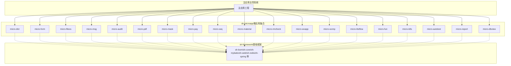
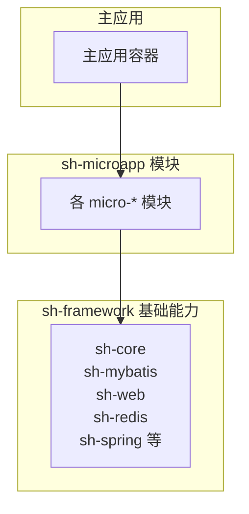
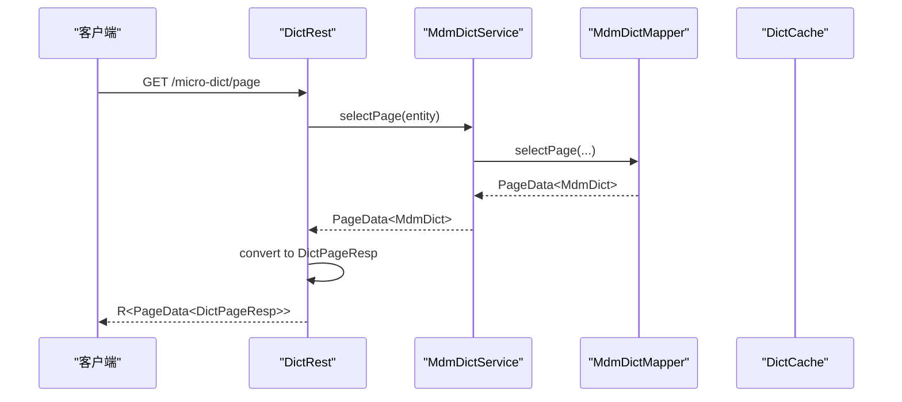
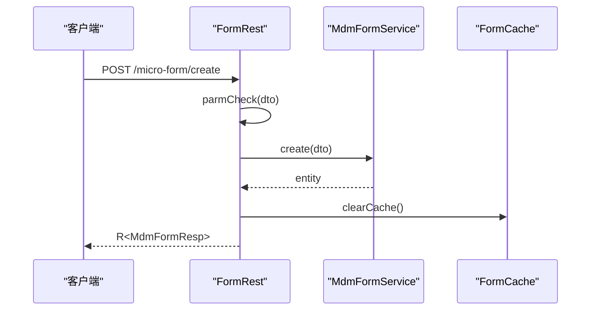
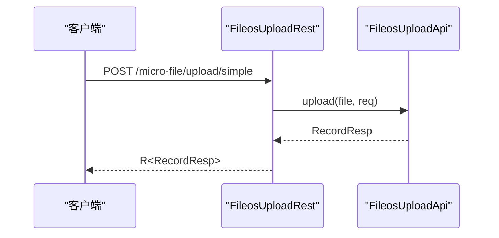
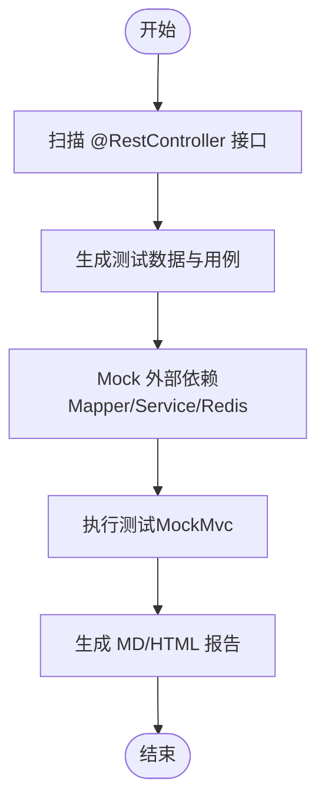
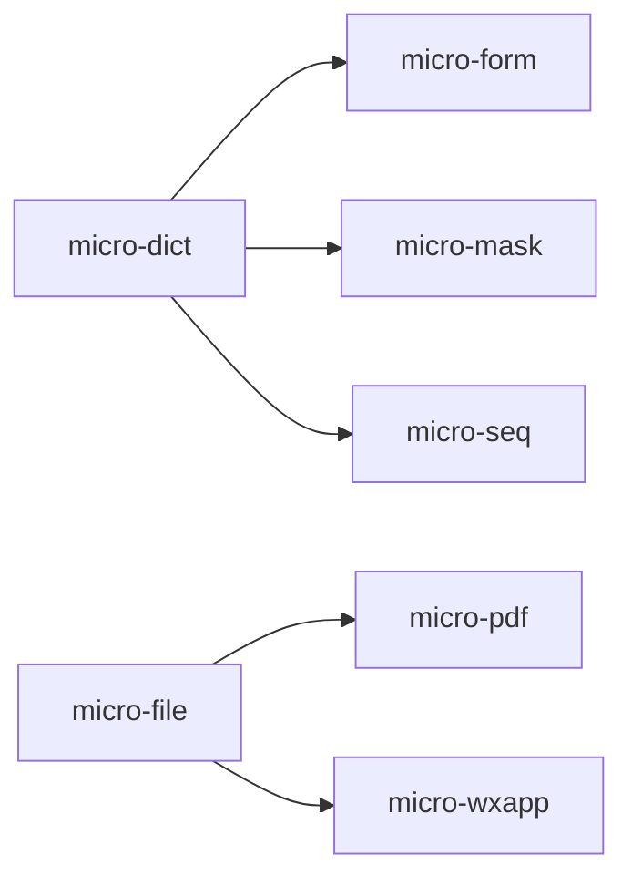

# 项目概述

<cite>
**本文引用的文件**
- [README.md](file://README.md)
- [CONTEXT.md](file://CONTEXT.md)
- [AGENTS.md](file://AGENTS.md)
- [pom.xml](file://pom.xml)
- [docs/standards/backend.md](file://docs/standards/backend.md)
- [docs/living-docs-technical/architecture/deployment.md](file://docs/living-docs-technical/architecture/deployment.md)
- [micro-dict/src/main/resources/META-INF/spring/org.springframework.boot.autoconfigure.AutoConfiguration.imports](file://micro-dict/src/main/resources/META-INF/spring/org.springframework.boot.autoconfigure.AutoConfiguration.imports)
- [micro-dict/src/main/java/com/wkclz/micro/dict/DictAutoConfig.java](file://micro-dict/src/main/java/com/wkclz/micro/dict/DictAutoConfig.java)
- [micro-form/src/main/java/com/wkclz/micro/form/FormAutoConfig.java](file://micro-form/src/main/java/com/wkclz/micro/form/FormAutoConfig.java)
- [micro-fileos/src/main/java/com/wkclz/micro/fileos/FileosAutoConfig.java](file://micro-fileos/src/main/java/com/wkclz/micro/fileos/FileosAutoConfig.java)
- [micro-k8s/src/main/java/com/wkclz/micro/k8s/K8sAutoConfig.java](file://micro-k8s/src/main/java/com/wkclz/micro/k8s/K8sAutoConfig.java)
- [micro-autotest/README.md](file://micro-autotest/README.md)
- [micro-dict/src/main/java/com/wkclz/micro/dict/rest/DictRest.java](file://micro-dict/src/main/java/com/wkclz/micro/dict/rest/DictRest.java)
- [micro-form/src/main/java/com/wkclz/micro/form/rest/FormRest.java](file://micro-form/src/main/java/com/wkclz/micro/form/rest/FormRest.java)
- [micro-fileos/src/main/java/com/wkclz/micro/fileos/rest/FileosUploadRest.java](file://micro-fileos/src/main/java/com/wkclz/micro/fileos/rest/FileosUploadRest.java)
</cite>

## 目录
1. [简介](#简介)
2. [项目结构](#项目结构)
3. [核心组件](#核心组件)
4. [架构总览](#架构总览)
5. [详细组件分析](#详细组件分析)
6. [依赖分析](#依赖分析)
7. [性能考虑](#性能考虑)
8. [故障排查指南](#故障排查指南)
9. [结论](#结论)
10. [附录](#附录)

## 简介
sh-microapp 是一个“微应用集合”项目，旨在通过一组高度内聚、低耦合的独立模块，为上层主应用提供可插拔的业务能力。每个 micro-* 模块封装相对独立的业务域，主应用仅按需引入所需模块依赖，即可获得对应的 API 与能力。项目基于 Spring Boot 4.x + Java 25 构建，统一依赖 sh-framework 框架，采用 MyBatis 4 + PageHelper 进行数据持久化，结合 Redis(Lettuce) 实现缓存与消息能力。

- 项目定位：微应用集合，非独立运行的服务，而是作为主应用的“能力拼装器”
- 技术选型：Spring Boot 4、MyBatis 4、Redis、PageHelper、微信 SDK、LiteFlow、XXL-Job 等
- 架构约束：统一的实体/Mapper/Service 基类约定、统一响应 R<T>、逻辑删除与乐观锁字段、缓存广播刷新策略、BOM 版本统一管理

**章节来源**
- [README.md:1-4](file://README.md#L1-L4)
- [CONTEXT.md:5-43](file://CONTEXT.md#L5-L43)
- [AGENTS.md:5-18](file://AGENTS.md#L5-L18)

## 项目结构
sh-microapp 采用多模块聚合工程组织，父 POM 聚合了 18 个独立的 micro-* 模块，每个模块均遵循统一的目录结构与开发规范。模块之间通过 sh-framework 提供的基础能力进行协作，主应用通过 Maven 依赖引入所需模块，借助 Spring Boot 的自动配置机制加载模块。

**图表来源**
- [AGENTS.md:21-45](file://AGENTS.md#L21-L45)
- [pom.xml:28-48](file://pom.xml#L28-L48)

**章节来源**
- [pom.xml:1-50](file://pom.xml#L1-L50)
- [AGENTS.md:49-104](file://AGENTS.md#L49-L104)

## 核心组件
- 自动配置与模块发现：每个 micro-* 模块通过 XxxAutoConfig 注册组件扫描与 Mapper 扫描，并在 META-INF/spring 自动配置导入文件中声明，实现 Spring Boot 的自动装配。
- 统一基类与规范：实体继承 BaseEntity、Mapper 继承 BaseMapper、Service 继承 BaseService；REST 接口统一返回 R<T>；逻辑删除使用 deleted 字段，乐观锁使用 version 字段。
- 缓存与一致性：Redis Pub/Sub 广播缓存刷新，配合 3 秒防抖策略，保证多实例间缓存一致性。
- 依赖治理：第三方依赖版本由 sh-bom 统一管理，子模块不重复声明版本，降低版本冲突风险。

**章节来源**
- [CONTEXT.md:25-31](file://CONTEXT.md#L25-L31)
- [AGENTS.md:106-215](file://AGENTS.md#L106-L215)

## 架构总览
sh-microapp 的整体架构强调“模块化、可组合、可演进”。模块间通过 API 与共享能力协作，主应用按需装配，形成“能力即服务”的微应用生态。部署层面，sh-microapp 本身不独立部署，而是以 Maven 依赖的形式被主应用引入，模块加载依赖 Spring Boot 的自动配置机制。

**图表来源**
- [docs/living-docs-technical/architecture/deployment.md:5-14](file://docs/living-docs-technical/architecture/deployment.md#L5-L14)
- [AGENTS.md:21-45](file://AGENTS.md#L21-L45)

**章节来源**
- [docs/living-docs-technical/architecture/deployment.md:1-14](file://docs/living-docs-technical/architecture/deployment.md#L1-L14)
- [AGENTS.md:21-45](file://AGENTS.md#L21-L45)

## 详细组件分析

### 字典模块（micro-dict）
- 能力边界：字典类型与字典项的 CRUD、跨环境复制/粘贴、Redis Pub/Sub 缓存。
- 设计要点：统一的 REST 接口前缀 /micro-dict，Route 常量集中管理；服务层继承 BaseService，Mapper 继承 BaseMapper；缓存通过 Redis 广播刷新。
- 典型流程：分页查询 → 实体转换 → 统一响应 R<T> 返回。

**图表来源**
- [micro-dict/src/main/java/com/wkclz/micro/dict/rest/DictRest.java:40-47](file://micro-dict/src/main/java/com/wkclz/micro/dict/rest/DictRest.java#L40-L47)

**章节来源**
- [micro-dict/src/main/java/com/wkclz/micro/dict/rest/DictRest.java:1-129](file://micro-dict/src/main/java/com/wkclz/micro/dict/rest/DictRest.java#L1-L129)

### 表单规则模块（micro-form）
- 能力边界：表单定义、表单项、规则与校验器管理；AOP 规则拦截；数据库字段信息查询。
- 设计要点：FormCache 缓存表单规则，更新/删除后主动清理缓存；表单字段信息通过 FormTableInfoService 动态查询数据库列元信息。

**图表来源**
- [micro-form/src/main/java/com/wkclz/micro/form/rest/FormRest.java:66-75](file://micro-form/src/main/java/com/wkclz/micro/form/rest/FormRest.java#L66-L75)

**章节来源**
- [micro-form/src/main/java/com/wkclz/micro/form/rest/FormRest.java:1-125](file://micro-form/src/main/java/com/wkclz/micro/form/rest/FormRest.java#L1-L125)

### 文件存储模块（micro-fileos）
- 能力边界：简单上传、公开上传、分片上传初始化/完成/中止；支持多 OSS 提供商；Magic Bytes 校验；目录与桶管理。
- 设计要点：Upload API 与 REST 控制器分离；统一响应 R<T>；日志记录关键操作。

**图表来源**
- [micro-fileos/src/main/java/com/wkclz/micro/fileos/rest/FileosUploadRest.java:30-36](file://micro-fileos/src/main/java/com/wkclz/micro/fileos/rest/FileosUploadRest.java#L30-L36)

**章节来源**
- [micro-fileos/src/main/java/com/wkclz/micro/fileos/rest/FileosUploadRest.java:1-71](file://micro-fileos/src/main/java/com/wkclz/micro/fileos/rest/FileosUploadRest.java#L1-L71)

### 自动化测试模块（micro-autotest）
- 能力边界：运行时扫描 REST 接口、自动生成测试数据、零配置 Mock（MyBatis Mapper、Service、Redis）、生成 Markdown/HTML 报告。
- 设计要点：基于 Spring MockMvc 与 Mockito/WireMock；支持容器级 Mock；报告文件按时间戳命名。

**图表来源**
- [micro-autotest/README.md:5-199](file://micro-autotest/README.md#L5-L199)

**章节来源**
- [micro-autotest/README.md:1-199](file://micro-autotest/README.md#L1-L199)

### 基础设施与平台能力
- 规则引擎（micro-liteflow）：链/脚本管理，规则编排。
- 函数管理（micro-fun）：函数分类/函数定义、JS 脚本引擎执行。
- K8s 管理（micro-k8s）：集群配置、资源查询、自定义 API。
- 报表（micro-report）：SQL 报表定义、参数与结果字段管理、动态查询执行、Excel 导出。
- 数据视图（micro-dbview）：数据源与元数据管理、DDL 操作、SQL 执行与历史记录。
- 自动化测试（micro-autotest）：见上节。

**章节来源**
- [AGENTS.md:94-104](file://AGENTS.md#L94-L104)

## 依赖分析
- 模块间依赖关系（示例）：micro-dict 与 micro-form（表单字典选项）、micro-dict 与 micro-mask（脱敏字典）、micro-dict 与 micro-seq（序列号字典类型）、micro-file 与 micro-pdf（PDF 文件存储）、micro-file 与 micro-wxapp（小程序媒体上传）。
- 框架依赖：sh-bom 统一版本管理；sh-core 提供 BaseEntity/R/CommonException/UserContext；sh-mybatis 提供 BaseMapper/BaseService/PageQuery；sh-web 提供 Web 扩展；sh-redis 提供 Redis 工具；sh-spring 提供 Spring 扩展；sh-dynamicdb 提供动态数据源；sh-xxljob 提供定时任务。

**图表来源**
- [AGENTS.md:235-244](file://AGENTS.md#L235-L244)

**章节来源**
- [AGENTS.md:220-234](file://AGENTS.md#L220-L234)
- [AGENTS.md:235-244](file://AGENTS.md#L235-L244)

## 性能考虑
- 缓存一致性：使用 Redis Pub/Sub 广播刷新，3 秒防抖，避免频繁刷新导致的抖动。
- ORM 与分页：MyBatis + PageHelper，合理使用分页查询，避免一次性加载大量数据。
- 事务与锁：Service 层使用 @Transactional，乐观锁 version 字段确保并发安全。
- 外部依赖 Mock：自动化测试阶段通过 Mock 减少真实依赖开销，提升回归效率。
- 部署与装配：模块通过自动配置装配，减少手动装配成本，提升启动与维护效率。

[本节为通用指导，无需列出具体文件来源]

## 故障排查指南
- 模块未被 Spring 扫描到：检查 AutoConfiguration.imports 文件与 @ComponentScan 包路径。
- Mapper 无法注入：检查 @MapperScan 包路径是否包含 Mapper 接口所在包。
- 依赖版本冲突：确认 sh-bom 是否统一管理，子模块 pom.xml 不要重复声明版本。
- 缓存不一致：确认 Redis Pub/Sub 频道通信正常，广播刷新生效。
- 乐观锁更新失败：前端必须回传 version 字段，否则更新会失败。
- 统一响应与异常：统一使用 R<T> 响应，异常使用 ValidationException 或其他 CommonException 子类。

**章节来源**
- [AGENTS.md:317-326](file://AGENTS.md#L317-L326)

## 结论
sh-microapp 通过 18 个独立的功能模块，构建了一个高内聚、低耦合的微应用集合，满足企业级应用对“能力即服务”的诉求。其统一的开发规范、自动配置机制与基础框架支撑，使得主应用可以按需装配能力，快速迭代与扩展。结合缓存广播刷新、统一响应与异常处理、以及自动化测试能力，项目在可维护性、可扩展性与可测试性方面具备良好基础。

[本节为总结性内容，无需列出具体文件来源]

## 附录
- 项目上下文与技术栈：详见 CONTEXT.md。
- 开发规范与最佳实践：详见 AGENTS.md 与 docs/standards/backend.md。
- 部署与模块加载机制：详见 docs/living-docs-technical/architecture/deployment.md。

**章节来源**
- [CONTEXT.md:1-43](file://CONTEXT.md#L1-L43)
- [AGENTS.md:345-354](file://AGENTS.md#L345-L354)
- [docs/standards/backend.md:1-394](file://docs/standards/backend.md#L1-L394)
- [docs/living-docs-technical/architecture/deployment.md:1-14](file://docs/living-docs-technical/architecture/deployment.md#L1-L14)