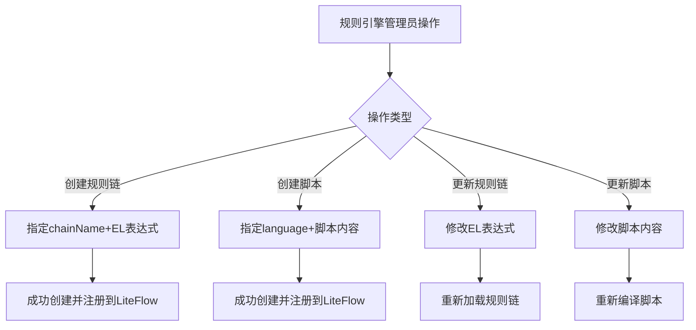

# Story: LiteFlow链与脚本

## 描述
作为规则引擎管理员，管理LiteFlow规则链和脚本，灵活编排业务流程。

## 参与者
| 角色 | 说明 |
|------|------|
| 规则引擎管理员 | 管理规则链和脚本 |
| 系统 | 后端服务，注册和管理LiteFlow规则 |

## 流程图

## 验收标准
- [ ] 创建规则链：Given 规则链不存在, When 创建规则链(指定chainName+EL表达式), Then 成功创建并注册到LiteFlow
- [ ] 创建脚本：Given 脚本不存在, When 创建脚本(指定language+脚本内容), Then 成功创建并注册到LiteFlow
- [ ] 更新规则链：Given 规则链已更新, When 更新EL表达式, Then 重新加载规则链
- [ ] 更新脚本：Given 脚本已更新, When 修改脚本内容, Then 重新编译脚本

## 关联模块
- micro-liteflow

## 关联 API
- `/micro-liteflow/chain/insert`
- `/micro-liteflow/chain/update`
- `/micro-liteflow/script/insert`
- `/micro-liteflow/script/update`

## 优先级
P1

## 状态
待开发
