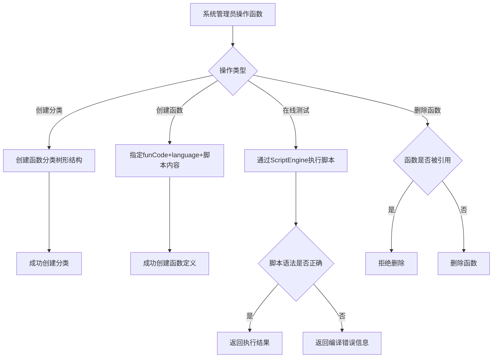

# Story: 函数脚本引擎

## 描述
作为系统管理员，管理函数定义并通过多语言脚本引擎执行，动态扩展业务逻辑。

## 参与者
| 角色 | 说明 |
|------|------|
| 系统管理员 | 管理函数分类和定义 |
| 系统 | 后端服务，脚本引擎执行 |

## 流程图

## 验收标准
- [ ] 创建分类：Given 函数分类不存在, When 创建分类(树形结构), Then 成功创建
- [ ] 创建函数：Given 函数定义不存在, When 创建函数(指定funCode+language+脚本内容), Then 成功创建
- [ ] 在线测试：Given 函数已定义, When 在线测试执行, Then 通过ScriptEngine执行脚本并返回结果
- [ ] 脚本错误：Given 脚本语法错误, When 执行, Then 返回编译错误信息
- [ ] 引用保护：Given 函数被引用, When 删除函数, Then 拒绝删除

## 关联模块
- micro-fun

## 关联 API
- `/micro-fun/category/insert`
- `/micro-fun/function/insert`
- `/micro-fun/function/execute`

## 优先级
P1

## 状态
待开发
