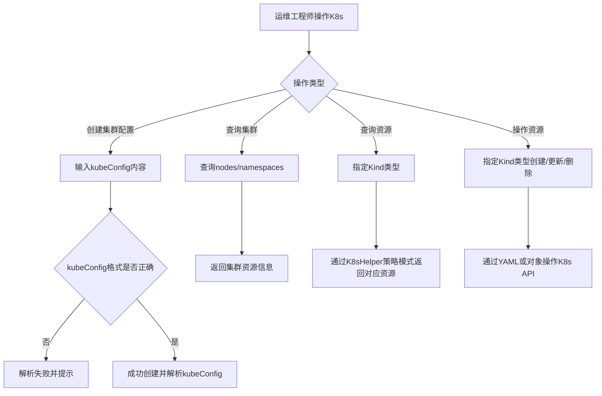

# Story: K8s资源管理

## 描述
作为运维工程师，管理K8s集群配置并通过策略模式操作集群资源，统一管理多集群的K8s资源。

## 参与者
| 角色 | 说明 |
|------|------|
| 运维工程师 | 管理K8s集群和资源 |
| 系统 | 后端服务，通过策略模式操作K8s API |

## 流程图

## 验收标准
- [ ] 创建配置：Given K8s集群配置不存在, When 创建配置(kubeConfig内容), Then 成功创建并解析kubeConfig
- [ ] 查询集群：Given 集群配置已就绪, When 查询集群nodes/namespaces, Then 返回集群资源信息
- [ ] 查询资源：Given 指定Kind类型, When 查询资源列表, Then 通过K8sHelper策略模式返回对应资源
- [ ] 操作资源：Given 指定Kind类型, When 创建/更新/删除资源, Then 通过YAML或对象操作K8s API
- [ ] 格式校验：Given kubeConfig格式错误, When 创建配置, Then 解析失败并提示

## 关联模块
- micro-k8s

## 关联 API
- `/micro-k8s/config/insert`
- `/micro-k8s/cluster/nodes`
- `/micro-k8s/cluster/namespaces`
- `/micro-k8s/kind/list`
- `/micro-k8s/kind/apply`

## 优先级
P1

## 状态
待开发
