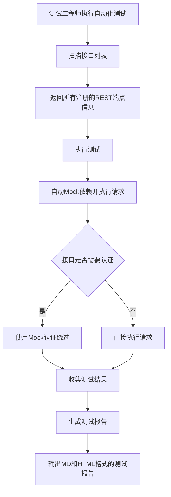

# Story: 自动化测试执行

## 描述
作为测试工程师，自动扫描REST接口并执行自动化测试，快速验证接口功能正确性。

## 参与者
| 角色 | 说明 |
|------|------|
| 测试工程师 | 触发测试和查看报告 |
| 系统 | 后端服务，扫描接口、执行测试、生成报告 |

## 流程图

## 验收标准
- [ ] 接口扫描：Given 系统已启动, When 扫描接口列表, Then 返回所有注册的REST端点信息
- [ ] 测试执行：Given 接口已扫描, When 执行测试, Then 自动Mock依赖并执行请求
- [ ] 报告生成：Given 测试执行完成, When 生成报告, Then 输出MD和HTML格式的测试报告
- [ ] 认证绕过：Given 接口需要认证, When 执行测试, Then 使用Mock认证绕过

## 关联模块
- micro-autotest

## 关联 API
- `/micro-autotest/scan`
- `/micro-autotest/execute`
- `/micro-autotest/report`

## 优先级
P2

## 状态
待开发
