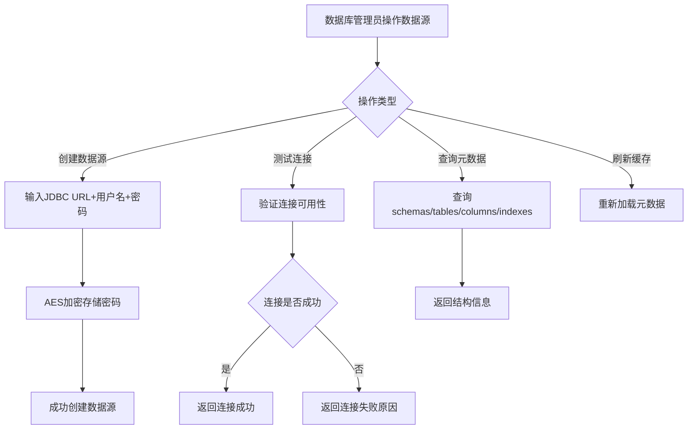

# Story: 数据源与元数据

## 描述
作为数据库管理员，管理多数据源并浏览数据库元数据，快速了解数据库结构。

## 参与者
| 角色 | 说明 |
|------|------|
| 数据库管理员 | 管理数据源和浏览元数据 |
| 系统 | 后端服务，管理数据源连接和元数据查询 |

## 流程图

## 验收标准
- [ ] 创建数据源：Given 数据源配置不存在, When 创建(JDBC URL+用户名+AES加密密码), Then 成功创建
- [ ] 测试连接：Given 数据源已配置, When 测试连接, Then 验证连接可用性
- [ ] 查询元数据：Given 数据源已连接, When 查询元数据(schemas/tables/columns/indexes), Then 返回结构信息
- [ ] 缓存刷新：Given 元数据已缓存, When 刷新缓存, Then 重新加载元数据
- [ ] 密码加密：Given 数据源密码, When 存储, Then 使用AES加密存储

## 关联模块
- micro-dbview

## 关联 API
- `/micro-dbview/datasource/insert`
- `/micro-dbview/datasource/test`
- `/micro-dbview/metadata/schemas`
- `/micro-dbview/metadata/tables`
- `/micro-dbview/metadata/columns`

## 优先级
P1

## 状态
待开发
