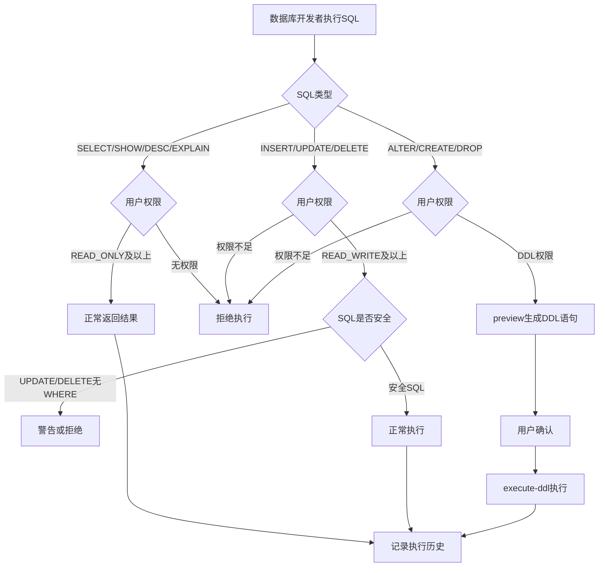

# Story: SQL与DDL操作

## 描述
作为数据库开发者，在权限控制下执行SQL和DDL操作，安全地管理数据库结构和数据。

## 参与者
| 角色 | 说明 |
|------|------|
| 数据库开发者 | 执行SQL和DDL操作 |
| 系统 | 后端服务，权限校验和SQL执行 |

## 流程图

## 验收标准
- [ ] 只读查询：Given 用户有READ_ONLY权限, When 执行SELECT/SHOW/DESC/EXPLAIN, Then 正常返回结果
- [ ] 读写操作：Given 用户有READ_WRITE权限, When 执行INSERT/UPDATE/DELETE, Then 正常执行
- [ ] DDL操作：Given 用户有DDL权限, When 执行ALTER/CREATE/DROP, Then 正常执行
- [ ] 权限不足：Given 用户权限不足, When 执行越权SQL, Then 拒绝执行
- [ ] 危险操作：Given SQL为危险操作(UPDATE/DELETE无WHERE), When 执行, Then 警告或拒绝
- [ ] DDL预览：Given DDL操作, When 先预览再执行, Then preview生成DDL语句→用户确认→execute-ddl执行
- [ ] 执行历史：Given SQL执行完成, When 查询历史, Then 分页返回执行历史记录

## 关联模块
- micro-dbview

## 关联 API
- `/micro-dbview/sql/execute`
- `/micro-dbview/ddl/preview`
- `/micro-dbview/ddl/execute`
- `/micro-dbview/sql/history/page`

## 优先级
P1

## 状态
待开发
