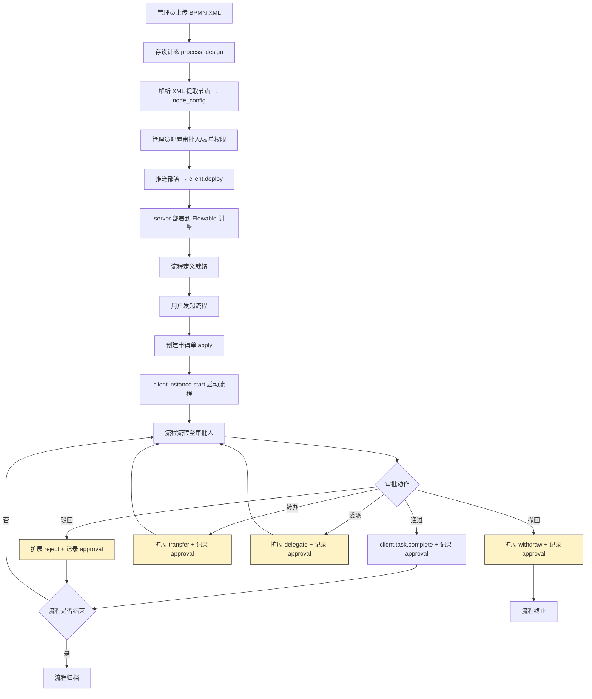
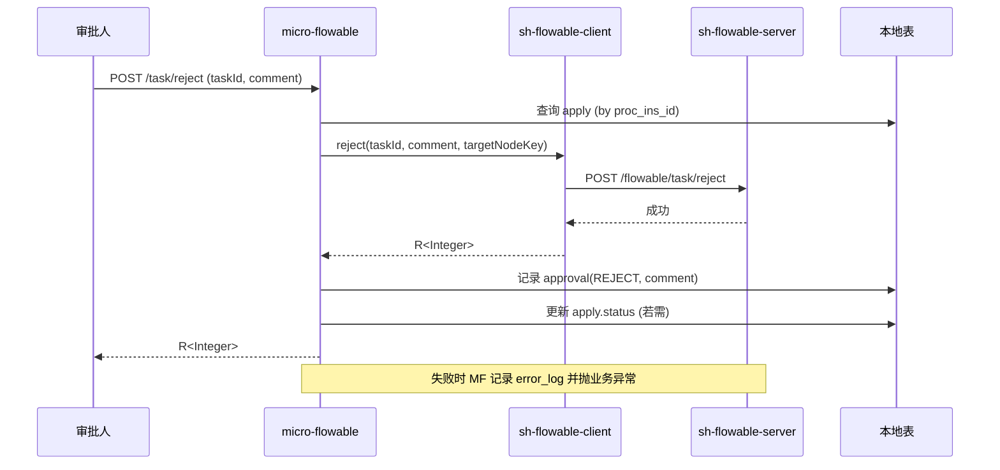
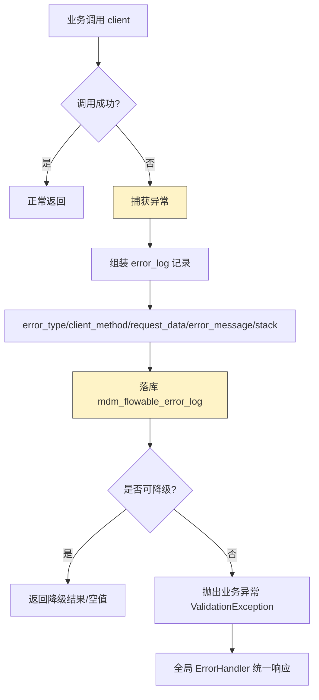

# 007 - micro-flowable 流程引擎模块需求文档

> 本文档为 `micro-flowable` 模块的需求规格说明，基于 brainstorming 流程与用户确认的 4 项关键设计决策编写。当前阶段仅产出需求文档，不含实现。

---

## 一、背景与目标

### 1.1 背景

- `sh-microapp` 微应用集合需要统一的流程引擎能力，覆盖流程定义维护、流程发起、审批流转、流程查询、异常监控等场景。
- 集团已有独立工程 `sh-flowable`（路径 `/Users/shrimp/project/shrimp-group/sh-flowable`），其 `sh-flowable-server` 基于 Flowable 引擎提供执行能力，并通过 `sh-flowable-client` SDK（`com.wkclz.flowable:sh-flowable-client:1.0.0-SNAPSHOT`）对外暴露 5 个 `@HttpExchange` 客户端、共 22 个端点。
- `micro-flowable` 作为业务系统侧的对接壳，需要在 client 之上补充：**设计态管理**（流程图维护/版本/节点配置）、**业务态管理**（申请单/审批意见）、**异常监控**（异常落库与查询），而运行态数据（部署后的定义/实例/任务/历史）实时从 server 获取，避免与 server 扩展表重复。

### 1.2 目标

| 序号 | 目标 | 量化指标 |
|------|------|----------|
| G1 | 管理端可维护流程图（上传 BPMN XML）、推送部署到 flowable、查询 flowable 流程定义/部署记录 | 支持流程设计 CRUD + 部署 + 透传查询 9 个管理端端点 |
| G2 | 业务端可发起流程、查询待办/已办、执行审批流转（含驳回/转办/委派/撤回）、查询流程与历史 | 支持 6 种审批动作 + 申请/查询端点 |
| G3 | 流程异常可落库追溯 | 异常表 + 列表/详情查询 2 个端点 |
| G4 | 不与 server 扩展表重复 | 运行态数据 0 本地镜像 |

### 1.3 对接方式

- **依赖**：`micro-flowable` 依赖 `sh-flowable-client`，client 自带 `FlowableClientAutoConfig`（`@AutoConfiguration` + imports），Spring Boot 自动注册 5 个客户端 Bean：`ProcessDeployClient` / `ProcessDefinitionClient` / `ProcessInstanceClient` / `TaskClient` / `HistoryClient`。
- **配置**：主应用在 `application.yml` 配置 `sh.flowable.server-url` 指向 `sh-flowable-server` 地址（默认 `http://localhost:8080`，连接超时 5s，读取超时 30s）。
- **Token 透传**：client 依赖 `iam-session`，自动透传当前用户 Token 至 server。

### 1.4 关键设计决策（已确认）

| 决策项 | 选定方案 | 说明 |
|--------|----------|------|
| 本地表定位 | **设计态 + 业务态本地，运行态实时取** | 设计态（流程图/版本/节点配置）、业务态（申请单/审批意见/异常日志）本地存；运行态（部署后定义/实例/任务/历史）实时从 server 取 |
| 审批流转范围 | **常用扩展** | 完成/认领/取消认领（透传）+ 驳回/转办/委派/撤回（扩展）；加签/减签/跳转/会签列入后续迭代 |
| 流程图维护 | **仅上传 BPMN XML** | 管理端上传 XML 文件部署；可视化设计器（bpmn-js）后续迭代 |
| 异常监控深度 | **异常表 + 列表查询** | 异常落库 + 列表/详情查询；告警/大盘/重试后续迭代 |

---

## 二、架构与职责边界

### 2.1 职责划分原则

```
┌─────────────────────────────────────────────────────────────┐
│                    micro-flowable (本模块)                    │
│                                                              │
│  [设计态·本地]  流程设计(草稿/版本/节点配置/表单绑定)         │
│  [业务态·本地]  申请单 / 审批意见 / 异常日志                  │
│  [对接层]       透传 client 22 端点 + 扩展流转编排            │
└─────────────────────────────────────────────────────────────┘
                              │ HTTP (@HttpExchange)
┌─────────────────────────────────────────────────────────────┐
│                  sh-flowable-client (SDK)                    │
│  deploy / definition / instance / task / history            │
└─────────────────────────────────────────────────────────────┘
                              │
┌─────────────────────────────────────────────────────────────┐
│                sh-flowable-server (Flowable 引擎)            │
│  [运行态·server 扩展表]                                      │
│  ProcessDefinitionExt / ProcessInstanceExt / TaskExt /      │
│  Node / ProcessDeploy + Flowable ACT_* 引擎表                │
└─────────────────────────────────────────────────────────────┘
```

### 2.2 与 server 扩展表的边界（避免重复）

| 数据类别 | server 扩展表（运行态快照） | micro-flowable 本地表（设计态/业务态） | 是否重复 |
|----------|----------------------------|----------------------------------------|----------|
| 流程定义 | `ProcessDefinitionExt`（部署后：procDefId/xmlContent/formKey） | `mdm_flowable_process_design`（设计态：草稿/版本/可编辑） | 否，设计态 vs 运行态 |
| 节点 | `Node`（部署后节点快照） | `mdm_flowable_node_config`（设计态节点配置：审批人/表单权限） | 否，配置态 vs 快照态 |
| 流程实例 | `ProcessInstanceExt`（运行实例） | 不本地存，实时透传 `instance/page/info` | 不重复 |
| 任务 | `TaskExt`（运行任务） | 不本地存，实时透传 `task/todo/done` | 不重复 |
| 部署记录 | `ProcessDeploy`（部署记录） | 不本地存，透传 `deploy/page` | 不重复 |
| 申请单 | server 无 | `mdm_flowable_apply`（业务单据内容） | 不重复 |
| 审批意见 | server 无（Flowable history 不强制存意见文本） | `mdm_flowable_approval`（动作/意见/审批人） | 不重复 |
| 异常日志 | server 无（依赖 JobExecutor） | `mdm_flowable_error_log` | 不重复 |

**结论**：micro-flowable 本地表与 server 扩展表无重叠，各自承担设计态/业务态与运行态职责。

### 2.3 整体业务流程



---

## 三、本地数据模型

### 3.1 设计依据（行业实践）

| 本地表 | 行业必要性 | 依据 |
|--------|-----------|------|
| `mdm_flowable_process_design` | 必要 | 流程平台需分离"设计态"与"运行态"。设计态支持草稿、版本管理、编辑后重新部署，Flowable 引擎的 `ACT_RE_PROCDEF` 是部署后只读快照，无法承载设计态编辑 |
| `mdm_flowable_node_config` | 必要 | 审批人配置、表单字段权限需在 UI 编辑并独立存储，BPMN XML 内嵌配置难以支撑动态 UI；部署后解析 XML 自动生成节点配置基线 |
| `mdm_flowable_apply` | 必要 | 业务单据（请假单/报销单内容）是业务数据，不属于流程引擎；申请单与流程实例通过 `proc_ins_id` 关联 |
| `mdm_flowable_approval` | 必要 | Flowable `ACT_HI_TASKINST` 记录任务历史但不强制存"审批意见文本/审批动作语义"；审计与展示需独立审批意见表 |
| `mdm_flowable_error_log` | 必要 | Flowable 异常依赖 JobExecutor 日志，难以业务化查询；独立异常表支持按实例/任务/类型检索追溯 |

> 运行态数据（流程实例/任务/历史）行业惯例是实时从引擎查询，不本地镜像，避免一致性维护成本。本模块遵循此惯例。

### 3.2 公共字段约定

所有本地表继承 `BaseEntity`，包含以下公共字段（由框架自动维护）：

| 字段 | 类型 | 说明 |
|------|------|------|
| `id` | bigint | 主键 |
| `sort` | int | 排序 |
| `create_time` | datetime | 创建时间 |
| `create_by` | varchar(31) | 创建人 |
| `update_time` | datetime | 修改时间 |
| `update_by` | varchar(31) | 修改人 |
| `remark` | varchar(255) | 备注 |
| `version` | int | 乐观锁 |
| `deleted` | tinyint | 逻辑删除，0=未删除（数字类型，不带引号） |

> 约束：唯一索引必须包含 `deleted` 字段；字符集 `utf8mb4` + `utf8mb4_unicode_ci`。

### 3.3 表设计

#### 3.3.1 mdm_flowable_process_design（流程设计）

| 字段 | 类型 | 必填 | 说明 |
|------|------|------|------|
| `design_code` | varchar(63) | 是 | 设计编码，唯一 |
| `design_name` | varchar(127) | 是 | 流程名称 |
| `category` | varchar(63) | 否 | 流程分类 |
| `xml_content` | longtext | 是 | BPMN XML 内容 |
| `form_key` | varchar(127) | 否 | 关联表单 key（对接 micro-form） |
| `version` | int | 是 | 设计版本，从 1 递增 |
| `status` | varchar(31) | 是 | 状态：DRAFT(草稿)/DEPLOYED(已部署)/DISABLED(已停用) |
| `deploy_id` | varchar(63) | 否 | 最近一次部署 ID（关联 server ProcessDeploy） |
| `proc_def_id` | varchar(63) | 否 | 最近一次部署返回的流程定义 ID |
| `tenant_code` | varchar(31) | 否 | 租户编码 |

- **唯一索引**：`uk_design_code_tenant (design_code, tenant_code, deleted)`
- **普通索引**：`idx_category (category, deleted)`、`idx_status (status, deleted)`

#### 3.3.2 mdm_flowable_node_config（节点配置）

| 字段 | 类型 | 必填 | 说明 |
|------|------|------|------|
| `design_id` | bigint | 是 | 关联 process_design.id |
| `node_key` | varchar(63) | 是 | 节点 ID（BPMN 中的 taskDefKey） |
| `node_name` | varchar(127) | 是 | 节点名称 |
| `node_type` | varchar(31) | 是 | 节点类型：START/APPROVAL/CC(抄送)/GATEWAY/END |
| `assignee_type` | varchar(31) | 否 | 审批人类型：USER/ROLE/DEPT/STARTER(发起人)/SCRIPT |
| `assignee_value` | varchar(511) | 否 | 审批人配置值（用户ID/角色编码/部门，多个逗号分隔） |
| `form_fields` | text | 否 | 表单字段权限 JSON（字段级可见/可编辑配置） |
| `order_num` | int | 否 | 节点顺序 |
| `tenant_code` | varchar(31) | 否 | 租户编码 |

- **唯一索引**：`uk_design_node (design_id, node_key, deleted)`
- **普通索引**：`idx_design_id (design_id, deleted)`

#### 3.3.3 mdm_flowable_apply（流程申请单）

| 字段 | 类型 | 必填 | 说明 |
|------|------|------|------|
| `apply_code` | varchar(63) | 是 | 申请单号，唯一 |
| `design_code` | varchar(63) | 是 | 关联流程设计编码 |
| `proc_ins_id` | varchar(63) | 否 | flowable 流程实例 ID（启动后回填） |
| `proc_def_id` | varchar(63) | 否 | 流程定义 ID |
| `business_type` | varchar(63) | 否 | 业务类型（请假/报销/采购等） |
| `business_summary` | varchar(511) | 否 | 申请内容摘要 |
| `business_data` | text | 否 | 业务表单数据 JSON（业务单据完整内容） |
| `start_user_id` | varchar(31) | 是 | 发起人用户 ID |
| `status` | varchar(31) | 是 | 状态：RUNNING(进行中)/APPROVED(通过)/REJECTED(驳回)/TERMINATED(终止)/WITHDRAWN(撤回) |
| `tenant_code` | varchar(31) | 否 | 租户编码 |

- **唯一索引**：`uk_apply_code_tenant (apply_code, tenant_code, deleted)`
- **普通索引**：`idx_proc_ins_id (proc_ins_id)`、`idx_start_user (start_user_id, deleted)`、`idx_status (status, deleted)`

#### 3.3.4 mdm_flowable_approval（审批意见）

| 字段 | 类型 | 必填 | 说明 |
|------|------|------|------|
| `apply_id` | bigint | 是 | 关联 apply.id |
| `proc_ins_id` | varchar(63) | 是 | 流程实例 ID |
| `task_id` | varchar(63) | 否 | flowable 任务 ID |
| `node_key` | varchar(63) | 否 | 节点 key |
| `node_name` | varchar(127) | 否 | 节点名称 |
| `approver_id` | varchar(31) | 是 | 审批人用户 ID |
| `action` | varchar(31) | 是 | 审批动作：APPROVE(通过)/REJECT(驳回)/TRANSFER(转办)/DELEGATE(委派)/WITHDRAW(撤回)/CLAIM(认领) |
| `comment` | varchar(1023) | 否 | 审批意见 |
| `target_user_id` | varchar(31) | 否 | 目标用户（转办/委派对象） |
| `tenant_code` | varchar(31) | 否 | 租户编码 |

- **唯一索引**：无
- **普通索引**：`idx_apply_id (apply_id, deleted)`、`idx_proc_ins_id (proc_ins_id, deleted)`、`idx_approver (approver_id, deleted)`

#### 3.3.5 mdm_flowable_error_log（异常日志）

| 字段 | 类型 | 必填 | 说明 |
|------|------|------|------|
| `error_type` | varchar(63) | 是 | 异常类型：DEPLOY_ERROR/START_ERROR/APPROVE_ERROR/QUERY_ERROR/CALLBACK_ERROR |
| `proc_ins_id` | varchar(63) | 否 | 关联流程实例 |
| `task_id` | varchar(63) | 否 | 关联任务 |
| `apply_id` | bigint | 否 | 关联申请单 |
| `client_method` | varchar(127) | 否 | client 调用方法（如 ProcessInstanceClient#start） |
| `request_data` | text | 否 | 请求参数 JSON |
| `error_message` | varchar(1023) | 是 | 异常消息 |
| `error_stack` | text | 否 | 异常堆栈 |
| `occur_time` | datetime | 是 | 发生时间 |
| `handle_status` | varchar(31) | 否 | 处理状态：PENDING(待处理)/RESOLVED(已处理)/IGNORED(已忽略) |
| `tenant_code` | varchar(31) | 否 | 租户编码 |

- **唯一索引**：无
- **普通索引**：`idx_error_type (error_type, deleted)`、`idx_proc_ins_id (proc_ins_id, deleted)`、`idx_occur_time (occur_time)`、`idx_handle_status (handle_status, deleted)`

---

## 四、接口规划

> 命名遵循项目规范：REST 控制器不带 Mdm 前缀（如 `ProcessDesignRest`），请求参数封装 Req 对象，返回封装 Resp 对象（单值除外）。
>
> **透传端点**：标注"透传"的端点直接转发 client 调用，其 Req/Resp 复用 `com.wkclz.flowable.client.bean.req/resp` 下的 Bean（避免重复定义）；标注"扩展"的端点由 micro-flowable 自定义 Req/Resp 并编排本地表与 client 调用。

### 4.1 管理端接口（前缀 `/micro-flowable/admin`）

#### 4.1.1 流程设计管理

| 端点 | 方法 | 入参 | 出参 | 说明 |
|------|------|------|------|------|
| `/admin/design/upload` | POST | `DesignUploadReq`（designName/category/xmlContent/formKey） | `DesignUploadResp`（designId/designCode/version） | 上传 BPMN XML 创建设计，解析 XML 提取节点自动建 node_config |
| `/admin/design/page` | POST | `DesignPageReq`（designName/category/status/分页） | `PageData<DesignPageResp>` | 设计列表分页 |
| `/admin/design/info` | GET | `IdReq` | `DesignInfoResp`（含节点配置列表） | 设计详情 |
| `/admin/design/update` | POST | `DesignUpdateReq`（id/xmlContent/designName/category/formKey） | `Integer` | 更新设计，XML 变更时重新解析节点 |
| `/admin/design/remove` | POST | `RemoveReq` | `Integer` | 删除设计（逻辑删除） |
| `/admin/design/deploy` | POST | `DesignDeployReq`（id） | `DesignDeployResp`（deployId/procDefId） | 推送部署：调 `client.deploy`，回写 deploy_id/proc_def_id，状态置 DEPLOYED |

#### 4.1.2 节点配置管理

| 端点 | 方法 | 入参 | 出参 | 说明 |
|------|------|------|------|------|
| `/admin/node/list` | GET | `NodeListReq`（designId） | `List<NodeConfigResp>` | 某设计的节点配置列表 |
| `/admin/node/info` | GET | `IdReq` | `NodeConfigResp` | 节点配置详情 |
| `/admin/node/update` | POST | `NodeUpdateReq`（id/assigneeType/assigneeValue/formFields） | `Integer` | 更新节点审批人/表单权限 |

#### 4.1.3 流程定义查询（透传 client）

| 端点 | 方法 | 入参 | 出参 | 说明 |
|------|------|------|------|------|
| `/admin/definition/page` | GET | `ProcessDefPageReq` | `PageData<ProcessDefPageResp>` | 透传 `ProcessDefinitionClient#page` |
| `/admin/definition/info` | GET | `IdReq` | `ProcessDefResp` | 透传 `ProcessDefinitionClient#info` |
| `/admin/definition/list` | GET | 无 | `List<ProcessDefListResp>` | 透传 `ProcessDefinitionClient#list` |

#### 4.1.4 部署记录查询（透传 client）

| 端点 | 方法 | 入参 | 出参 | 说明 |
|------|------|------|------|------|
| `/admin/deploy/page` | GET | `ProcessDeployPageReq` | `PageData<ProcessDeployPageResp>` | 透传 `ProcessDeployClient#page` |
| `/admin/deploy/remove` | POST | `RemoveReq` | `Integer` | 透传 `ProcessDeployClient#remove` |

### 4.2 业务端接口（前缀 `/micro-flowable`）

#### 4.2.1 流程发起

| 端点 | 方法 | 入参 | 出参 | 说明 |
|------|------|------|------|------|
| `/apply/create` | POST | `ApplyCreateReq`（designCode/businessType/businessSummary/businessData/variables） | `ApplyCreateResp`（applyCode/procInsId） | 创建申请单 + 调 `client.start` 启动流程，回填 proc_ins_id |
| `/apply/page` | GET | `ApplyPageReq`（businessType/status/分页） | `PageData<ApplyPageResp>` | 我的申请列表（按当前用户过滤） |
| `/apply/info` | GET | `IdReq` | `ApplyInfoResp`（含申请数据 + 流程实例信息） | 申请详情 |

#### 4.2.2 待办与已办（透传 client）

| 端点 | 方法 | 入参 | 出参 | 说明 |
|------|------|------|------|------|
| `/task/todo/page` | GET | `TaskPageReq` | `PageData<TaskPageResp>` | 透传 `TaskClient#todoPage` |
| `/task/done/page` | GET | `TaskPageReq` | `PageData<TaskPageResp>` | 透传 `TaskClient#donePage` |
| `/task/info` | GET | `IdReq` | `TaskResp` | 透传 `TaskClient#info` |

#### 4.2.3 审批流转

| 端点 | 方法 | 入参 | 出参 | 说明 | 类型 |
|------|------|------|------|------|------|
| `/task/complete` | POST | `TaskCompleteReq`（taskId/variables/comment） | `Integer` | 完成任务 + 记录 approval(APPROVE) | 透传 |
| `/task/claim` | POST | `IdReq`（taskId） | `Integer` | 认领 + 记录 approval(CLAIM) | 透传 |
| `/task/unclaim` | POST | `IdReq`（taskId） | `Integer` | 取消认领 | 透传 |
| `/task/reject` | POST | `TaskRejectReq`（taskId/comment/targetNodeKey?） | `Integer` | 驳回：默认回上一节点，可指定目标节点；记录 approval(REJECT) | **扩展（需 server 支持）** |
| `/task/transfer` | POST | `TaskTransferReq`（taskId/targetUserId/comment） | `Integer` | 转办：任务指派给目标用户；记录 approval(TRANSFER) | **扩展（需 server 支持）** |
| `/task/delegate` | POST | `TaskDelegateReq`（taskId/targetUserId/comment） | `Integer` | 委派：任务委派给目标用户，完成后回到原人；记录 approval(DELEGATE) | **扩展（需 server 支持）** |
| `/instance/withdraw` | POST | `InstanceWithdrawReq`（procInsId/comment） | `Integer` | 撤回：发起人撤回已发起流程；记录 approval(WITHDRAW)，apply 状态置 WITHDRAWN | **扩展（需 server 支持）** |

#### 4.2.4 流程与历史查询（透传 client）

| 端点 | 方法 | 入参 | 出参 | 说明 |
|------|------|------|------|------|
| `/instance/page` | GET | `ProcessInstancePageReq` | `PageData<ProcessInstancePageResp>` | 透传 `ProcessInstanceClient#page` |
| `/instance/info` | GET | `IdReq` | `ProcessInstanceResp` | 透传 `ProcessInstanceClient#info` |
| `/history/instance/page` | GET | `HistoryPageReq` | `PageData<HistoryInstancePageResp>` | 透传 `HistoryClient#instancePage` |
| `/history/task/page` | GET | `HistoryPageReq` | `PageData<HistoryTaskPageResp>` | 透传 `HistoryClient#taskPage` |
| `/history/activity/list` | GET | `IdReq` | `List<HistoryActivityResp>` | 透传 `HistoryClient#activityList` |

#### 4.2.5 审批意见

| 端点 | 方法 | 入参 | 出参 | 说明 |
|------|------|------|------|------|
| `/approval/list` | GET | `ApprovalListReq`（procInsId/applyId） | `List<ApprovalResp>` | 某流程实例的审批意见时间线 |

### 4.3 异常监控接口（前缀 `/micro-flowable/error`）

| 端点 | 方法 | 入参 | 出参 | 说明 |
|------|------|------|------|------|
| `/error/page` | GET | `ErrorPageReq`（errorType/handleStatus/procInsId/时间范围/分页） | `PageData<ErrorLogResp>` | 异常列表分页 |
| `/error/info` | GET | `IdReq` | `ErrorLogResp`（含堆栈/请求参数） | 异常详情 |
| `/error/handle` | POST | `ErrorHandleReq`（id/handleStatus/remark） | `Integer` | 标记异常处理状态 |

---

## 五、审批流转设计

### 5.1 透传能力（client 已支持）

| 操作 | client 端点 | 本地附加动作 |
|------|------------|-------------|
| 完成 | `TaskClient#complete` | 记录 `approval(APPROVE)` + 根据流程是否结束更新 `apply.status` |
| 认领 | `TaskClient#claim` | 记录 `approval(CLAIM)` |
| 取消认领 | `TaskClient#unclaim` | 无 |

### 5.2 扩展能力（需 server 增补端点）

> **重要前提**：以下 4 种扩展操作，`sh-flowable-client` 当前无对应端点，`sh-flowable-server` 也未内置。需 `sh-flowable-server` 增补对应端点后，`sh-flowable-client` 同步增加客户端方法，`micro-flowable` 再行调用并记录审批意见。

| 操作 | Flowable 引擎能力 | server 需增补端点（建议） | micro-flowable 职责 |
|------|------------------|-------------------------|---------------------|
| 驳回 | `runtimeService.createChangeActivityStateBuilder().moveActivityIdToSingleActivityId()` | `POST /flowable/task/reject` | 调用 + 记录 approval(REJECT) + 更新 apply.status=REJECTED（若驳回到发起节点） |
| 转办 | `taskService.setAssignee(taskId, userId)` | `POST /flowable/task/transfer` | 调用 + 记录 approval(TRANSFER, targetUserId) |
| 委派 | `taskService.delegateTask(taskId, userId)` | `POST /flowable/task/delegate` | 调用 + 记录 approval(DELEGATE, targetUserId) |
| 撤回 | `runtimeService.createChangeActivityStateBuilder()` 跳回首个用户节点 | `POST /flowable/instance/withdraw` | 调用 + 记录 approval(WITHDRAW) + apply.status=WITHDRAWN |

### 5.3 扩展操作时序（以驳回为例）



---

## 六、异常监控设计

### 6.1 异常拦截点

| 拦截点 | 实现方式 | 异常类型 |
|--------|----------|----------|
| client 调用异常 | 包装 client 调用（Service 层 try-catch + AOP） | DEPLOY_ERROR/START_ERROR/APPROVE_ERROR/QUERY_ERROR |
| 流程回调异常 | 回调入口 try-catch（如有） | CALLBACK_ERROR |
| 定时检查异常 | 定时任务 try-catch（如有） | QUERY_ERROR |

### 6.2 异常处理流程



### 6.3 异常查询

- 列表查询支持按 `error_type`、`handle_status`、`proc_ins_id`、时间范围过滤
- 详情查询返回完整堆栈与请求参数，便于排查
- `handle` 端点支持标记 PENDING→RESOLVED/IGNORED

---

## 七、配置项

| 配置项 | 默认值 | 说明 |
|--------|--------|------|
| `sh.flowable.server-url` | `http://localhost:8080` | sh-flowable-server 地址（client 自带） |
| `sh.flowable.connect-timeout` | 5000 | 连接超时毫秒（client 自带） |
| `sh.flowable.read-timeout` | 30000 | 读取超时毫秒（client 自带） |
| `sh.flowable.error-log.enabled` | true | 是否启用异常落库（micro-flowable 自有） |
| `sh.flowable.error-log.include-stack` | true | 是否记录异常堆栈 |

---

## 八、非功能需求

| 项 | 要求 |
|----|------|
| 日志 | 关键位置加 log：方法入口（DEBUG）、分支判断（INFO）、外部 client 调用（INFO，含方法名）、异常捕获（ERROR，含堆栈） |
| 事务 | `@Transactional` 放 Service 层；本地表写操作与 client 调用的事务边界需明确——client 调用失败不回滚本地已记 error_log（error_log 独立事务） |
| 异常处理 | 统一 `ValidationException.of("消息")` 或 CommonException 子类；client 异常包装为业务异常 |
| 响应封装 | 所有 REST 返回 `R<T>`；请求参数封装 Req，返回封装 Resp（单值除外） |
| 逻辑删除 | 所有本地表 `deleted` 字段，数字类型，0=未删除 |
| 乐观锁 | 本地表更新必须传 `version` |
| 自动填充 | `createBy`/`updateBy` 由框架自动填充 |

---

## 九、范围与非范围（YAGNI）

### 9.1 本期范围

- 5 张本地表（设计态 2 + 业务态 2 + 异常 1）
- 管理端：流程设计 CRUD + 部署 + 节点配置 + 透传查询
- 业务端：发起 + 待办/已办 + 6 种审批动作 + 流程/历史查询 + 审批意见
- 异常监控：落库 + 列表/详情/标记

### 9.2 明确不做（后续迭代）

| 不做项 | 原因 |
|--------|------|
| 加签/减签/跳转/会签 | 复杂场景，需求频次低，列入后续迭代 |
| bpmn-js 可视化设计器 | 工作量大，本期仅上传 XML |
| 流程实例/任务本地镜像 | 与 server 扩展表重复，一致性成本高 |
| 异常告警通知（接 micro-msg） | 本期仅落库查询，告警后续迭代 |
| 异常统计大盘 + 自动重试 | 本期仅追溯，大盘/重试后续迭代 |
| 流程定义本地缓存 | 实时查询满足需求，缓存非必要 |

---

## 十、任务拆解

| 任务 | 描述 | 预估 | 优先级 |
|------|------|------|--------|
| T1 | 建表脚本 + Entity/Mapper/Service（5 张本地表） | 1.5天 | P0 |
| T2 | 管理端：流程设计 CRUD + 上传解析 XML + 节点自动生成 | 1.5天 | P0 |
| T3 | 管理端：推送部署（对接 client.deploy） | 0.5天 | P0 |
| T4 | 管理端：节点配置管理 + 流程定义/部署记录透传查询 | 1天 | P0 |
| T5 | 业务端：申请单 CRUD + 发起流程（对接 client.start） | 1天 | P0 |
| T6 | 业务端：待办/已办/任务详情透传 + 审批意见记录 | 0.5天 | P0 |
| T7 | 业务端：完成/认领/取消认领（透传 + 审批意见） | 0.5天 | P0 |
| T8 | 业务端：驳回/转办/委派/撤回（依赖 server 扩展端点） | 1.5天 | P1 |
| T9 | 业务端：流程实例/历史透传查询 + 审批意见时间线 | 0.5天 | P1 |
| T10 | 异常监控：AOP 拦截 client 调用 + error_log 落库 | 1天 | P1 |
| T11 | 异常监控：列表/详情/标记端点 | 0.5天 | P1 |
| T12 | 协调 sh-flowable-server 增补 reject/transfer/delegate/withdraw 端点 | 2天（外部） | P0（T8 前置） |
| T13 | 单元测试 + 集成测试 | 2天 | P1 |

> **关键依赖**：T8 依赖 T12（server 增补端点）。建议 T12 与本模块开发并行推进，先与 sh-flowable-server 团队对齐端点契约。

---

## 十一、风险点

| 风险 | 影响 | 应对方案 |
|------|------|----------|
| sh-flowable-server 未支持驳回/转办/委派/撤回端点 | T8 无法完成 | T12 前置：先与 server 团队对齐 4 个端点契约（入参/出参/错误码），server 开发与 micro-flowable 并行 |
| client 调用超时导致业务阻塞 | 用户体验差 | client 已配 30s 读超时；核心操作加超时兜底，超时后落 error_log 并返回明确提示 |
| 本地审批意见与 flowable history 不一致 | 审计偏差 | 审批意见在 client 调用成功后立即记录（同事务）；以本地 approval 表为准展示，history 仅作引擎侧核对 |
| BPMN XML 解析失败 | 节点配置无法生成 | 上传时校验 XML 格式（Flowable BPMN model API 解析），解析失败返回明确错误，不阻塞设计保存 |
| server 不可用时管理端/业务端不可用 | 功能不可用 | 健康检查 + error_log 记录；设计态本地表可独立维护（草稿），server 恢复后再部署 |
| 多租户隔离 | 数据越权 | 所有本地表带 tenant_code，唯一索引含 tenant_code；client 透传 Token 携带租户信息 |

---

## 十二、验收标准

- [ ] 5 张本地表建表脚本就绪，Entity/Mapper/Service 可正常 CRUD
- [ ] 管理端可上传 BPMN XML 创建流程设计，自动解析生成节点配置
- [ ] 管理端可推送部署到 flowable，回写 deploy_id/proc_def_id
- [ ] 管理端可查询 flowable 流程定义/部署记录（透传）
- [ ] 业务端可发起流程，创建申请单并启动流程实例
- [ ] 业务端可查询待办/已办，执行完成/认领/取消认领并记录审批意见
- [ ] 业务端可执行驳回/转办/委派/撤回（server 端点就绪后）
- [ ] 业务端可查询流程实例/历史/审批意见时间线
- [ ] 异常监控可落库并按类型/状态/实例/时间查询
- [ ] 启动日志无 "No MyBatis mapper was found" 警告
- [ ] Swagger 文档可见所有新模块端点
- [ ] `mvn compile -pl micro-flowable` 通过
