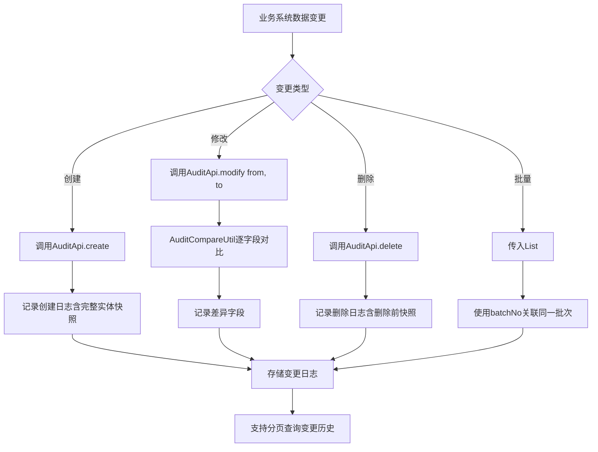

# Story: 变更审计日志

## 描述
作为业务系统，记录数据变更日志并支持字段级差异对比，追溯数据变更历史和审计合规。

## 参与者
| 角色 | 说明 |
|------|------|
| 业务系统 | 调用AuditApi记录变更 |
| 系统 | 后端服务，记录变更日志和差异对比 |

## 流程图

## 验收标准
- [ ] 创建场景：Given 实体被创建, When 调用AuditApi.create(), Then 记录创建日志(含完整实体快照)
- [ ] 修改场景：Given 实体被修改, When 调用AuditApi.modify(from, to), Then 逐字段对比记录差异
- [ ] 删除场景：Given 实体被删除, When 调用AuditApi.delete(), Then 记录删除日志(含删除前快照)
- [ ] 批量场景：Given 批量操作, When 传入List, Then 使用batchNo关联同一批次的变更
- [ ] 查询场景：Given 查询变更历史, When 调用getLogPage, Then 分页返回变更日志(含差异详情)

## 关联模块
- micro-audit

## 关联 API
- `/micro-audit/change-log/page`

## 优先级
P0

## 状态
待开发
