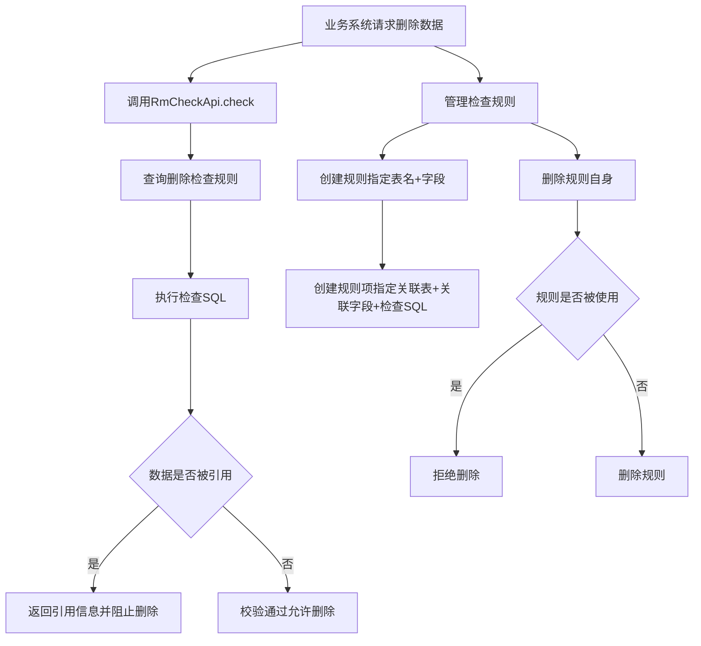

# Story: 删除合规校验

## 描述
作为业务系统，在删除数据前自动检查是否被其他表引用，防止误删导致数据完整性破坏。

## 参与者
| 角色 | 说明 |
|------|------|
| 业务系统 | 调用RmCheckApi校验删除合规性 |
| 系统 | 后端服务，执行引用检查 |

## 流程图

## 验收标准
- [ ] 规则创建：Given 配置了删除检查规则(指定表名+字段), When 创建规则项(指定关联表+关联字段+检查SQL), Then 成功创建
- [ ] 引用阻止：Given 数据被其他表引用, When 调用RmCheckApi.check(), Then 返回引用信息并阻止删除
- [ ] 校验通过：Given 数据未被引用, When 调用RmCheckApi.check(), Then 校验通过允许删除
- [ ] 规则自检：Given 删除检查规则自身, When 执行删除, Then 先检查规则是否被使用

## 关联模块
- micro-rmcheck

## 关联 API
- `/micro-rmcheck/rule/insert`
- `/micro-rmcheck/rule-item/insert`
- `/micro-rmcheck/rule/check`

## 优先级
P0

## 状态
待开发
