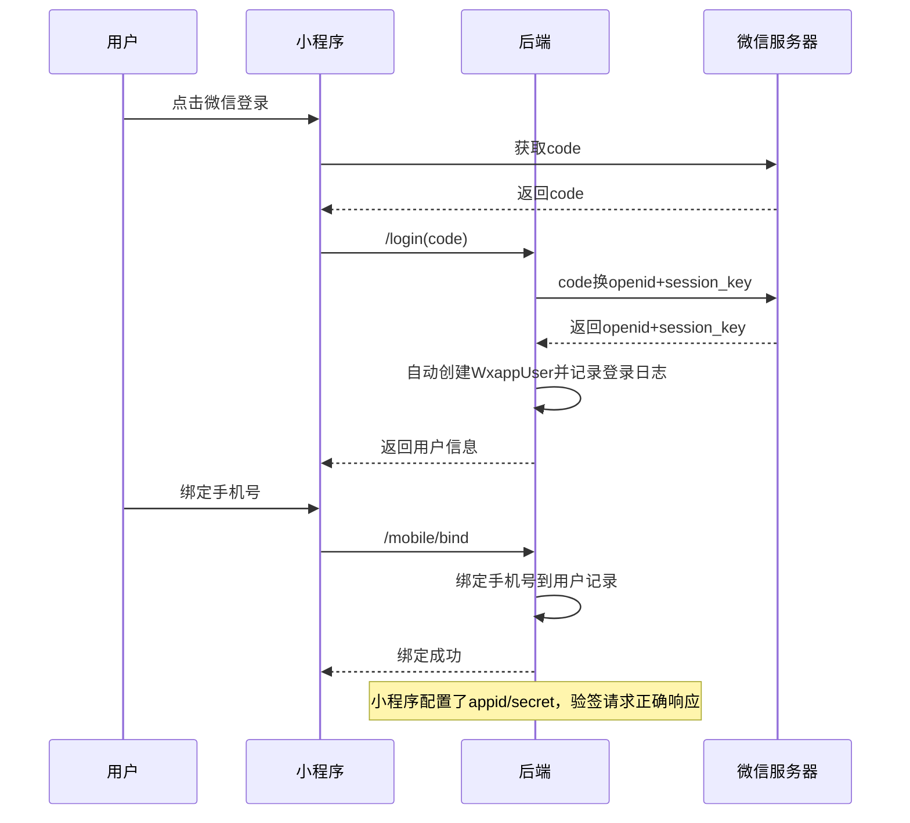

# Story: 小程序登录与用户

## 描述
作为小程序用户，通过微信授权登录并绑定手机号，使用小程序功能并接收通知。

## 参与者
| 角色 | 说明 |
|------|------|
| 小程序用户 | 微信授权登录和绑定手机号 |
| 微信服务器 | 提供code换openid |
| 系统 | 后端服务，处理登录和用户管理 |

## 流程图

## 验收标准
- [ ] 首次登录：Given 小程序用户首次登录, When 调用/login(code), Then 自动创建WxappUser并记录登录日志
- [ ] 获取用户信息：Given 用户已登录, When 获取用户信息, Then 返回昵称/头像/openid等信息
- [ ] 绑定手机号：Given 用户未绑定手机, When 调用/mobile/bind, Then 绑定手机号到用户记录
- [ ] 验签响应：Given 小程序配置了appid/secret, When 验签请求到达, Then 正确响应微信验签

## 关联模块
- micro-wxapp

## 关联 API
- `/micro-wxapp/user/login`
- `/micro-wxapp/user/info`
- `/micro-wxapp/user/mobile/bind`

## 优先级
P0

## 状态
待开发
