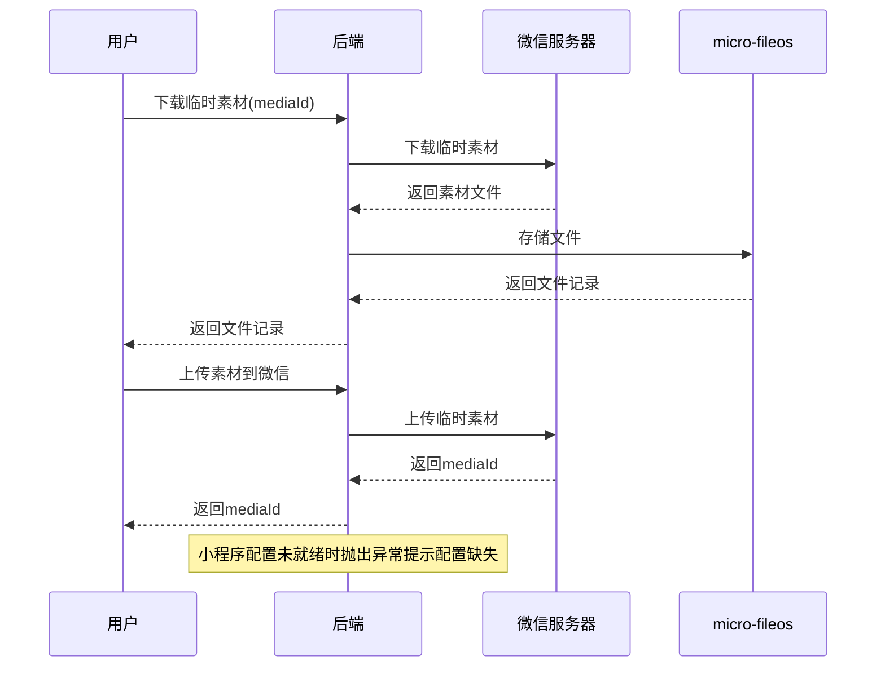

# Story: 小程序媒体管理

## 描述
作为小程序用户，上传和下载微信临时素材，在业务中使用微信媒体资源。

## 参与者
| 角色 | 说明 |
|------|------|
| 小程序用户 | 上传/下载微信媒体 |
| 微信服务器 | 提供临时素材接口 |
| 系统 | 后端服务，通过micro-fileos存储 |

## 流程图

## 验收标准
- [ ] 下载素材：Given 微信临时素材mediaId, When 调用下载接口, Then 通过micro-fileos存储并返回文件记录
- [ ] 上传素材：Given 需要上传素材到微信, When 调用上传接口, Then 上传至微信并返回mediaId
- [ ] 配置缺失：Given 小程序配置未就绪, When 操作媒体, Then 抛出异常提示配置缺失

## 关联模块
- micro-wxapp
- micro-fileos

## 关联 API
- `/micro-wxapp/media/download`
- `/micro-wxapp/media/upload`

## 优先级
P1

## 状态
待开发
