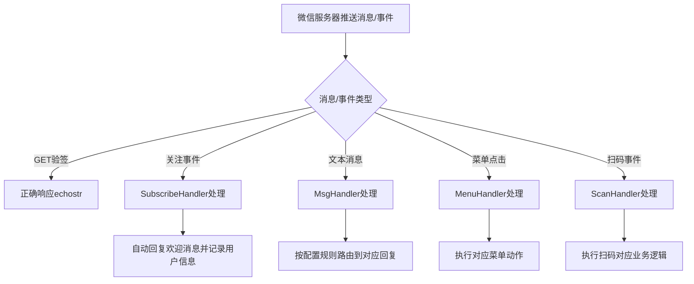

# Story: 公众号消息处理

## 描述
作为公众号运营者，系统自动路由和处理用户消息事件，实现智能客服和自动回复。

## 参与者
| 角色 | 说明 |
|------|------|
| 公众号用户 | 发送消息/触发事件 |
| 微信服务器 | 转发消息到后端 |
| 公众号运营者 | 配置消息处理规则 |
| 系统 | 后端服务，路由和处理消息 |

## 流程图

## 验收标准
- [ ] 验签响应：Given 微信服务器发送GET请求, When 验签请求到达portal, Then 正确响应echostr
- [ ] 关注处理：Given 用户关注公众号, When SubscribeHandler处理, Then 自动回复欢迎消息并记录用户信息
- [ ] 文本消息：Given 用户发送文本消息, When MsgHandler处理, Then 按配置规则路由到对应回复
- [ ] 菜单处理：Given 用户点击菜单, When MenuHandler处理, Then 执行对应菜单动作
- [ ] 扫码处理：Given 用户扫码, When ScanHandler处理, Then 执行扫码对应业务逻辑

## 关联模块
- micro-wxmp

## 关联 API
- `/micro-wxmp/portal` (验签和消息入口)

## 优先级
P0

## 状态
待开发
