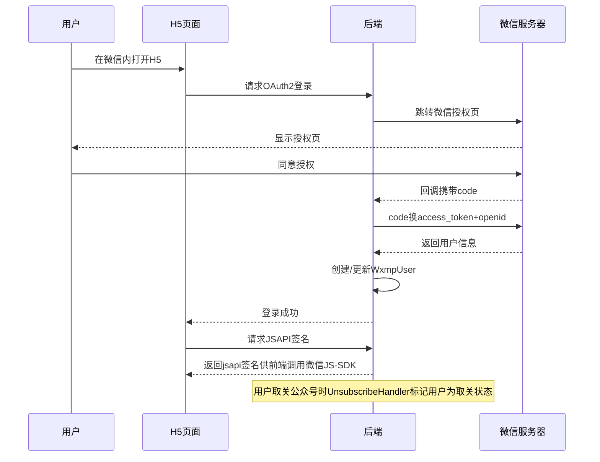

# Story: 公众号OAuth与用户

## 描述
作为公众号用户，通过OAuth2授权登录H5页面，在微信内使用业务功能。

## 参与者
| 角色 | 说明 |
|------|------|
| 公众号用户 | OAuth2授权登录 |
| 微信服务器 | 提供OAuth2授权 |
| 系统 | 后端服务，处理OAuth2和用户管理 |

## 流程图

## 验收标准
- [ ] OAuth2登录：Given 用户在微信内打开H5, When 请求OAuth2登录, Then 跳转微信授权页
- [ ] 回调处理：Given 用户同意授权, When 回调到达, Then 获取openid和用户信息并创建/更新WxmpUser
- [ ] JSAPI签名：Given H5页面需要JSAPI, When 请求签名, Then 返回jsapi签名供前端调用微信JS-SDK
- [ ] 取关处理：Given 用户取关公众号, When UnsubscribeHandler处理, Then 标记用户为取关状态

## 关联模块
- micro-wxmp

## 关联 API
- `/micro-wxmp/oauth2/authorize`
- `/micro-wxmp/oauth2/callback`
- `/micro-wxmp/jsapi/signature`

## 优先级
P1

## 状态
待开发
