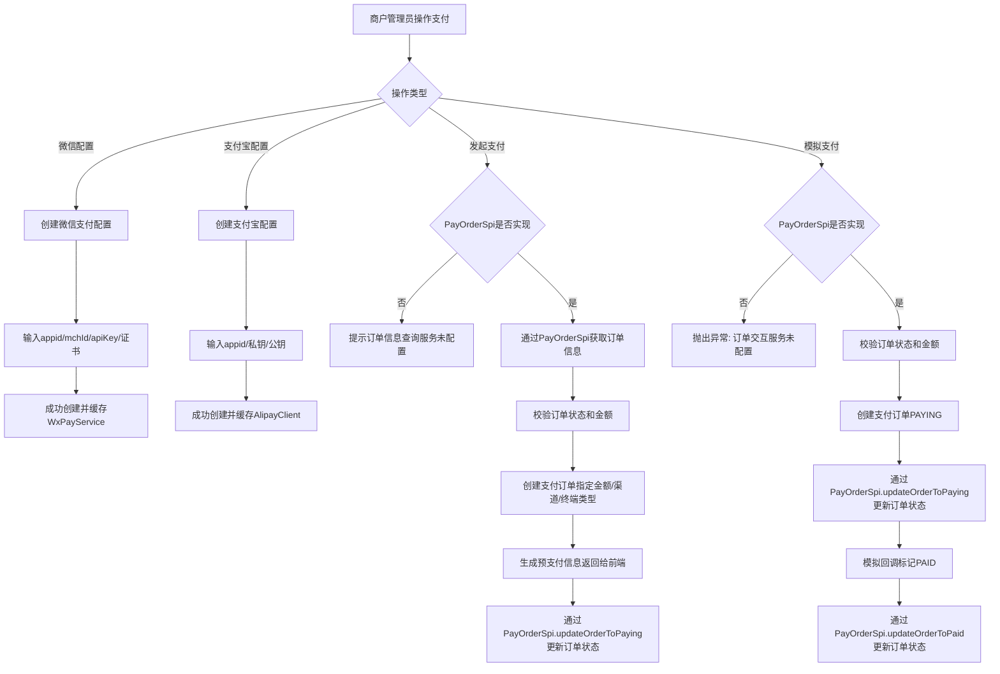

# Story: 支付配置与订单

## 描述
作为商户管理员，配置支付渠道并创建支付订单，接收用户的在线支付。通过 PayOrderSpi 与订单模块交互，获取订单信息并更新订单状态。

## 参与者
| 角色 | 说明 |
|------|------|
| 商户管理员 | 配置支付渠道和创建订单 |
| 系统 | 后端服务，管理支付配置和订单 |
| 订单模块 | 实现 PayOrderSpi，提供订单信息查询与状态更新 |

## 流程图

## 验收标准
- [ ] 微信配置：Given 微信支付配置不存在, When 创建配置(appid/mchId/apiKey/证书), Then 成功创建并缓存WxPayService
- [ ] 支付宝配置：Given 支付宝配置不存在, When 创建配置(appid/私钥/公钥), Then 成功创建并缓存AlipayClient
- [ ] 发起支付：Given PayOrderSpi已实现且订单状态可支付, When 发起支付(orderNo/payMethod/terminalType), Then 通过SPI获取订单信息、创建支付订单、更新订单状态为PAYING、返回预支付信息
- [ ] SPI未实现-发起支付：Given PayOrderSpi未实现, When 发起支付, Then 抛出ValidationException("订单交互服务未配置")
- [ ] 模拟支付：Given PayOrderSpi已实现且模拟支付模式, When 执行mockPayWithOrderInfo, Then 校验订单状态和金额、创建支付订单(PAYING)、通过SPI更新订单状态为PAYING、模拟回调标记PAID、通过SPI更新订单状态为PAID
- [ ] SPI未实现-模拟支付：Given PayOrderSpi未实现, When 执行模拟支付, Then 抛出ValidationException("订单交互服务未配置")
- [ ] 全单退款：Given 订单为PAID/FINISHED且refundAmount为空, When 申请退款, Then 调用consumeService.releaseConsume(outTradeNo)回退积分(FROZEN释放+DEDUCTED退回)、调用支付通道全单退款、refundedAmount置为paymentAmount、MOCK_PAY置REFUNDED
- [ ] 部分退款-按比例退积分：Given 订单为PAID/FINISHED且refundAmount非空且非最后一笔, When 申请退款, Then 校验不超额、按比例(refundAmount/paymentAmount)向下取整计算可退积分、调用pointsRefundService.refund(以outTradeNo为orderNo+refundNo为幂等键)、调用支付通道部分退款、累加refundedAmount
- [ ] 部分退款-最后一笔退剩余积分：Given 部分退款后refundedAmount+refundAmount>=paymentAmount, When 申请退款, Then 退全部剩余积分(points-alreadyRefunded)、避免按比例累计误差
- [ ] 部分退款-超额拦截：Given refundedAmount+refundAmount>paymentAmount, When 申请退款, Then 抛出ValidationException
- [ ] 无积分订单退款：Given PayOrder.points为0或null, When 申请退款(全单/部分), Then 跳过积分退款仅退现金

## 退款与积分退还

退款入口 `PayorderRefundRest.refund` 接收 `PayOrderRefundReq`（含 orderNo/refundAmount/refundNo/reason），由 `ShopOrderService.managerPayRefund` 编排：

- **refundAmount 为空 → 全单退款**：调用 `consumeService.releaseConsume(outTradeNo, reason)` 一次性处理 FROZEN 释放与 DEDUCTED 回退（不重复调用 pointsRefundService.refund），再调用支付通道全单退款，refundedAmount 置为 paymentAmount。
- **refundAmount 非空 → 部分退款**：
  - 超额校验：`refundedAmount + refundAmount > paymentAmount` 抛异常。
  - 最后一笔判断：`refundedAmount + refundAmount >= paymentAmount` 视为最后一笔，退全部剩余积分（points - 已退积分，由 `PointsEarnRecordMapper.sumRefundPointsBySourceNo` 查询），避免按比例累计误差。
  - 非最后一笔：按比例 `refundAmount / paymentAmount` 向下取整（RoundingMode.FLOOR）计算可退积分。
  - 积分退款：仅当 refundPoints > 0 时调用 `PointsRefundService.refund`，orderNo 用 `outTradeNo`（与消费一致），refundNo 作为部分退款幂等键（为空时自动生成 `outTradeNo-R时间戳`）。
  - 支付通道：MOCK_PAY 直接置 REFUNDED；WX_PAY 调用 `wxpayHelper.wxTradeRefund(payOrder, refundAmount, refundNo, reason)`，金额单位为分。
- **关键约束**：积分退款 orderNo 始终用 outTradeNo；比例计算用 BigDecimal + FLOOR 向下取整防超退；points 为 0/null 跳过积分退款。

## 关联模块
- micro-pay
- micro-points（退款积分回退：PointsRefundService / PointsConsumeService.releaseConsume / PointsEarnRecordMapper）

## 关联 API
- `/micro-pay/wxpay-config/insert`
- `/micro-pay/alipay-config/insert`
- `/micro-pay/common/payorder/pay`
- `/micro-pay/common/payorder/pay/mock`
- `/micro-pay/manager/payorder/refund`（退款申请：refundAmount 为空全单退、非空部分退）

## 优先级
P0

## 状态
已开发
