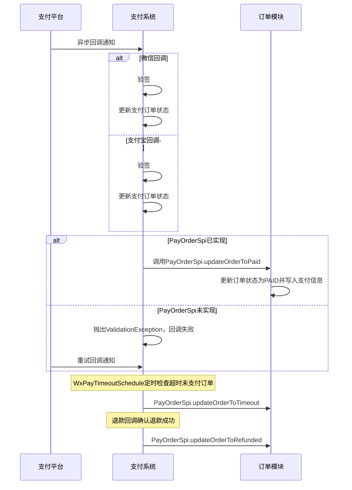

# Story: 支付-订单交互 SPI (PayOrderSpi)

## 描述
作为支付系统，通过 PayOrderSpi 与订单模块交互，在支付流程各阶段查询订单信息并更新订单状态。PayOrderSpi 合并了原 OrderInfoSpi 和 PayNoticeSpi 的功能，每个支付事件只需调用一次 SPI。

## 参与者
| 角色 | 说明 |
|------|------|
| 支付平台 | 微信/支付宝发送异步回调 |
| 支付系统 | 后端服务，处理回调通知 |
| 订单模块 | 实现 PayOrderSpi 接收支付结果并更新订单状态 |

## PayOrderSpi 接口方法

| 方法 | 说明 | 调用时机 |
|------|------|----------|
| `getOrderInfoForPay(String orderNo)` | 查询订单支付信息 | 发起支付前 |
| `updateOrderToPaying(String orderNo)` | 更新订单状态为支付中 | 支付订单创建成功后 |
| `updateOrderToPaid(OrderPayResult payResult)` | 更新订单支付成功 | 支付回调确认支付成功后 |
| `updateOrderToRefunded(String orderNo)` | 更新订单退款成功 | 退款回调确认退款成功后 |
| `updateOrderToTimeout(String orderNo)` | 更新订单支付超时 | 支付超时自动取消后 |

## 流程图

## 验收标准
- [ ] 微信回调：Given PayOrderSpi已实现且微信支付成功, When 接收异步通知(/public/wxpay/notify), Then 入口校验SPI→验签→更新支付订单状态→调用PayOrderSpi.updateOrderToPaid
- [ ] 支付宝回调：Given PayOrderSpi已实现且支付宝支付成功, When 接收异步通知(/public/alipay/notify), Then 入口校验SPI→验签→更新支付订单状态→调用PayOrderSpi.updateOrderToPaid
- [ ] 超时取消：Given PayOrderSpi已实现且订单超时未支付, When WxPayTimeoutSchedule定时执行, Then 入口校验SPI→自动关闭超时订单→调用PayOrderSpi.updateOrderToTimeout
- [ ] 退款回调：Given PayOrderSpi已实现且微信退款成功, When 接收退款回调, Then 入口校验SPI→更新支付订单状态→调用PayOrderSpi.updateOrderToRefunded
- [ ] SPI未实现-回调：Given PayOrderSpi未实现, When 支付回调触发, Then 抛出ValidationException("订单交互服务未配置")，回调失败，支付平台重试
- [ ] SPI未实现-定时任务：Given PayOrderSpi未实现, When 定时任务执行, Then 抛出ValidationException("订单交互服务未配置")，任务本次执行失败
- [ ] 单次调用：Given PayOrderSpi已实现, When 任何支付事件触发, Then 仅调用PayOrderSpi一次，不重复调用

## 关联模块
- micro-pay

## 关联 API
- `/public/wxpay/notify/{tenantCode}/{appid}`
- `/public/alipay/notify/{tenantCode}/{appid}`
- `/public/wxpay/refund/notify/{tenantCode}/{appid}`
- `/micro-pay/common/payorder/pay`
- `/micro-pay/common/payorder/pay/mock`

## 优先级
P0

## 状态
已开发
