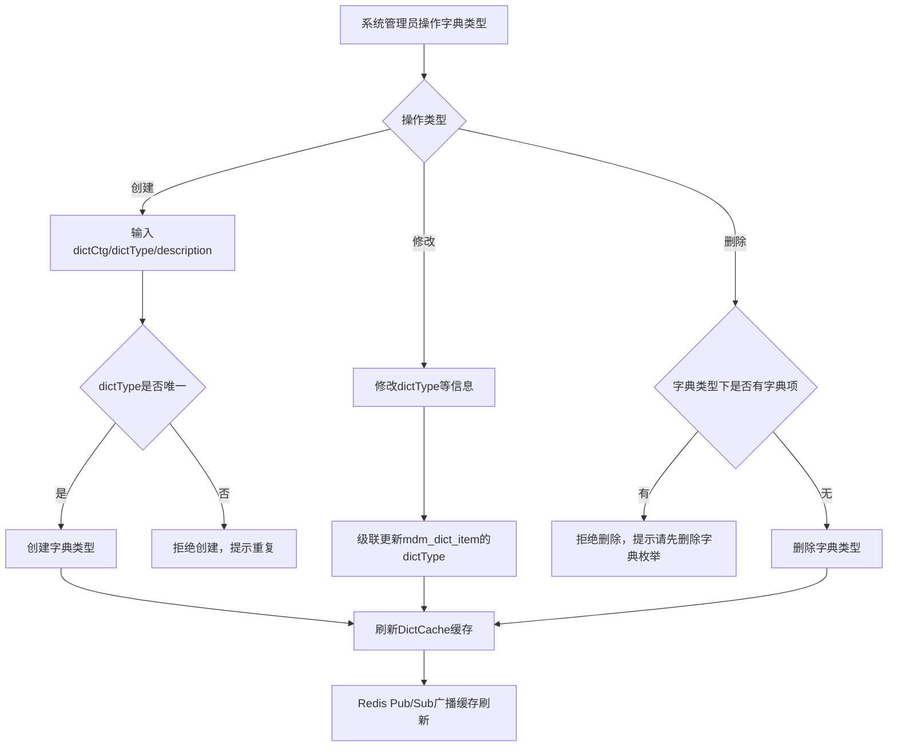

# Story: 字典类型增删改查管理

## 描述
作为系统管理员，对字典类型进行增删改查管理，统一维护系统中使用的枚举数据。

## 参与者
| 角色 | 说明 |
|------|------|
| 系统管理员 | 操作字典类型的人员 |
| 系统 | 后端服务，负责校验、缓存刷新 |

## 流程图

## 验收标准
- [ ] 创建字典类型：Given 字典类型不存在, When 创建字典类型(dictCtg/dictType/description), Then 成功创建且dictType唯一
- [ ] 修改字典类型：Given 字典类型已存在, When 修改dictType, Then 级联更新子表mdm_dict_item的dictType
- [ ] 删除字典类型：Given 字典类型下存在字典项, When 删除该字典类型, Then 拒绝删除并提示"请先删除字典枚举"
- [ ] 缓存刷新：Given 执行CUD操作, When 操作完成, Then 自动刷新DictCache缓存(Redis Pub/Sub广播)

## 关联模块
- micro-dict

## 关联 API
- `/micro-dict/dict/insert`
- `/micro-dict/dict/update`
- `/micro-dict/dict/delete`
- `/micro-dict/dict/page`

## 优先级
P0

## 状态
待开发
