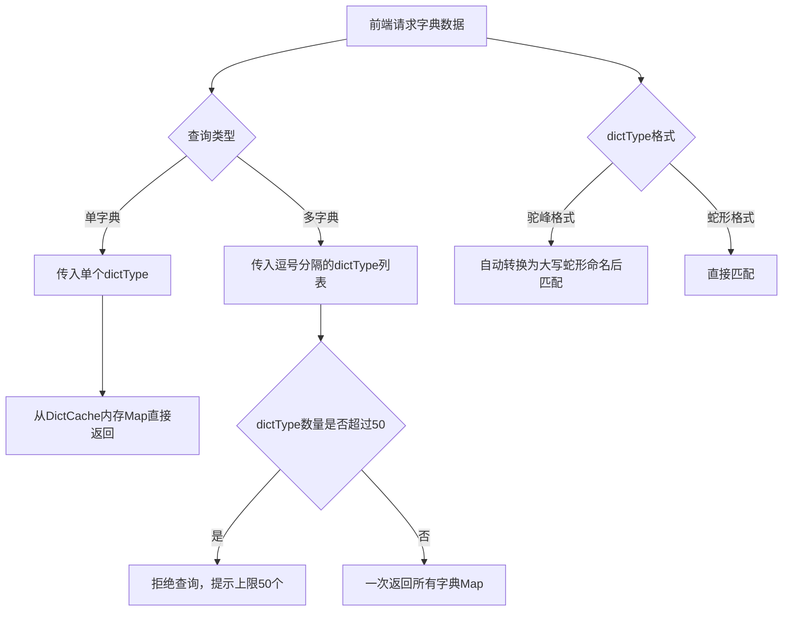

# Story: 字典通用查询

## 描述
作为前端开发者，通过公共接口一次性查询多个字典，减少请求次数提升页面加载速度。

## 参与者
| 角色 | 说明 |
|------|------|
| 前端开发者 | 调用公共查询接口 |
| 系统 | 后端服务，从缓存返回字典数据 |

## 流程图

## 验收标准
- [ ] 单字典查询：Given 字典缓存已加载, When 查询单个dictType, Then 从DictCache内存Map直接返回
- [ ] 多字典查询：Given 多个dictType, When 查询(逗号分隔), Then 一次返回所有字典Map，上限50个
- [ ] 命名转换：Given dictType为驼峰格式, When 查询, Then 自动转换为大写蛇形命名后匹配

## 关联模块
- micro-dict

## 关联 API
- `/micro-dict/common-dict/list`

## 优先级
P1

## 状态
待开发
