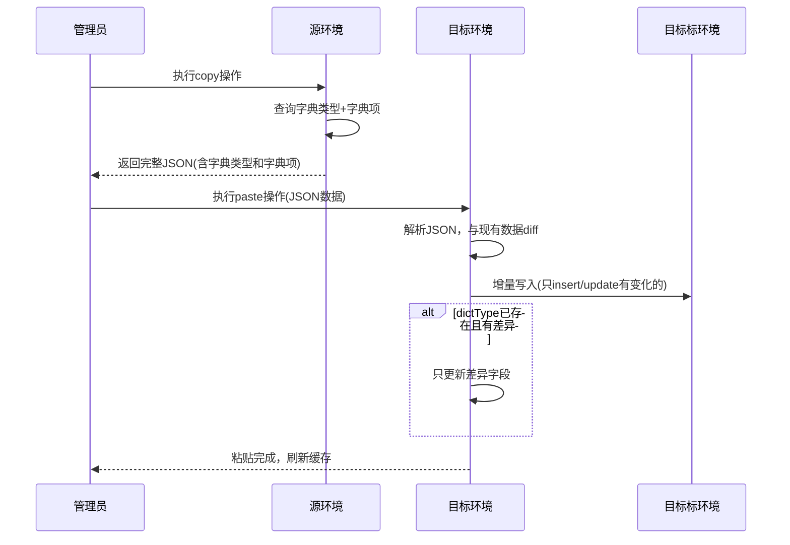

# Story: 字典跨环境复制

## 描述
作为系统管理员，跨环境复制粘贴字典数据，快速同步不同环境的字典配置。

## 参与者
| 角色 | 说明 |
|------|------|
| 系统管理员 | 执行跨环境复制粘贴操作 |
| 源环境 | 提供字典数据的系统 |
| 目标环境 | 接收字典数据的系统 |

## 流程图

## 验收标准
- [ ] 复制字典：Given 源环境存在字典, When 执行copy操作, Then 返回包含字典类型和字典项的完整JSON
- [ ] 增量粘贴：Given 目标环境已有部分字典, When 执行paste操作, Then 自动diff增量写入(只insert/update有变化的)
- [ ] 差异合并：Given paste数据中dictType在目标已存在, When 字典项有差异, Then 只更新差异字段

## 关联模块
- micro-dict

## 关联 API
- `/micro-dict/dict/copy`
- `/micro-dict/dict/paste`

## 优先级
P1

## 状态
待开发
