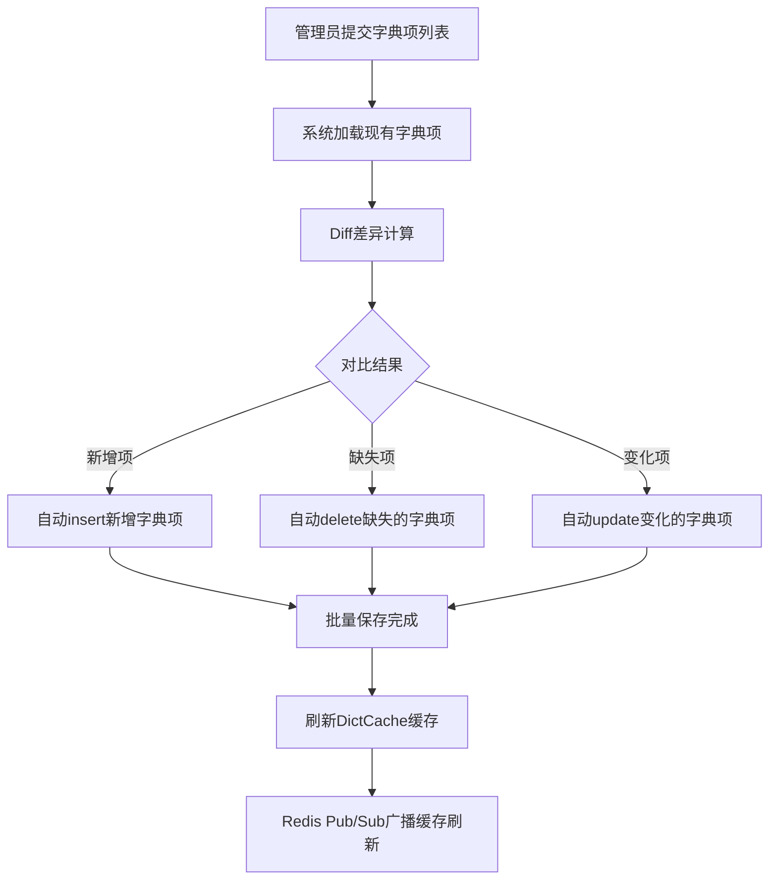

# Story: 字典项批量保存

## 描述
作为系统管理员，批量保存字典项时系统自动计算差异，高效管理字典枚举值。

## 参与者
| 角色 | 说明 |
|------|------|
| 系统管理员 | 批量编辑字典项 |
| 系统 | 后端服务，自动计算差异并执行增删改 |

## 流程图

## 验收标准
- [ ] 新增字典项：Given 字典项不存在, When 提交包含新项的列表, Then 自动insert新增项
- [ ] 删除缺失项：Given 字典项已存在, When 提交的列表中缺少某些项, Then 自动delete缺失项
- [ ] 更新变化项：Given 字典项已存在, When 提交的列表中某些项字段变化, Then 自动update变化项
- [ ] 缓存刷新：Given 批量保存完成, When 操作成功, Then 自动刷新DictCache缓存

## 关联模块
- micro-dict

## 关联 API
- `/micro-dict/dict-item/batch-save`

## 优先级
P0

## 状态
待开发
