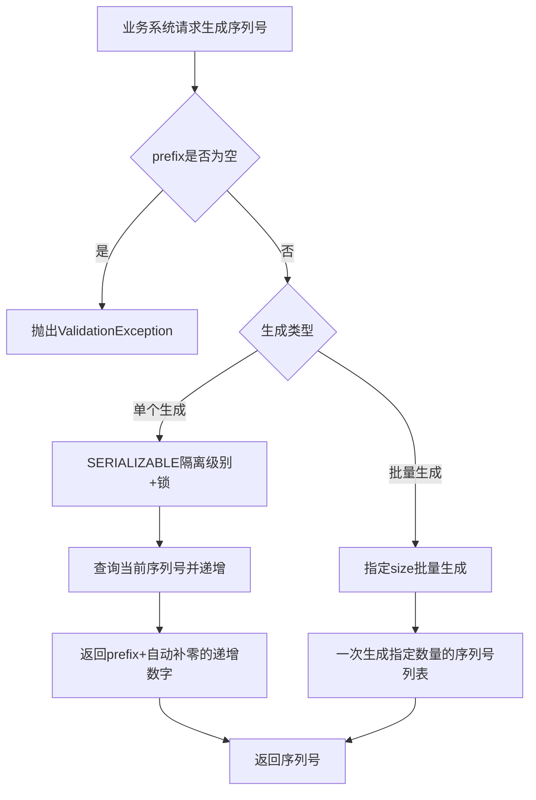

# Story: 序列号生成

## 描述
作为业务系统，按前缀生成唯一业务序列号，为订单、编码等业务场景提供不重复的标识。

## 参与者
| 角色 | 说明 |
|------|------|
| 业务系统 | 调用序列号生成接口 |
| 系统 | 后端服务，保证并发安全的序列号生成 |

## 流程图

## 验收标准
- [ ] 基本生成：Given 指定prefix, When 生成序列号, Then 返回prefix+自动补零的递增数字(默认4位)
- [ ] 并发安全：Given 并发请求, When 同时生成序列号, Then 使用SERIALIZABLE隔离级别+锁保证不重复
- [ ] 批量生成：Given 需要批量序列号, When 指定size, Then 一次生成指定数量的序列号列表
- [ ] 参数校验：Given prefix为空, When 生成序列号, Then 抛出ValidationException

## 关联模块
- micro-seq

## 关联 API
- `/micro-seq/seq/next`
- `/micro-seq/seq/next-batch`

## 优先级
P0

## 状态
待开发
