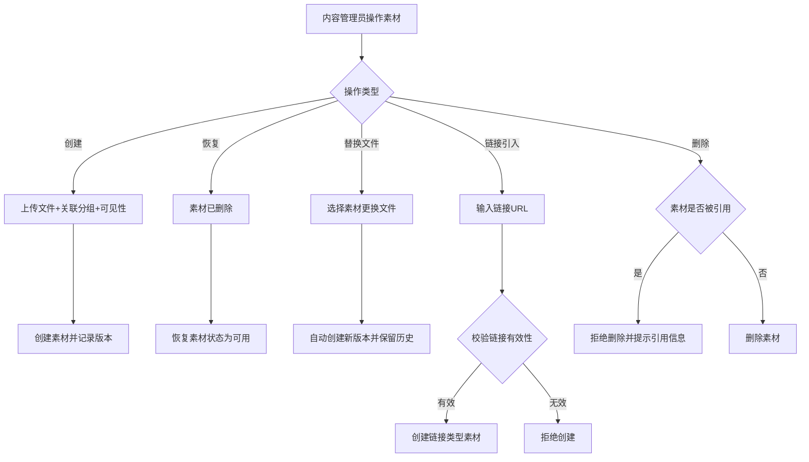

# Story: 物料增删改查

## 描述
作为内容管理员，对素材进行创建、修改、删除、恢复等全生命周期管理，统一管理企业数字资产。

## 参与者
| 角色 | 说明 |
|------|------|
| 内容管理员 | 管理素材的人员 |
| 系统 | 后端服务，负责素材生命周期管理 |

## 流程图

## 验收标准
- [ ] 创建素材：Given 素材文件已上传, When 创建素材(关联fileId+分组+可见性), Then 成功创建并记录版本
- [ ] 恢复素材：Given 素材已删除, When 执行恢复操作, Then 素材状态恢复为可用
- [ ] 替换文件：Given 素材需要更换文件, When 执行替换文件操作, Then 自动创建新版本并保留历史
- [ ] 链接引入：Given 素材为链接类型, When 执行链接引入, Then 校验链接有效性后创建
- [ ] 引用保护：Given 素材被其他业务引用, When 删除素材, Then 拒绝删除并提示引用信息

## 关联模块
- micro-material

## 关联 API
- `/micro-material/material/insert`
- `/micro-material/material/update`
- `/micro-material/material/delete`
- `/micro-material/material/page`

## 优先级
P0

## 状态
待开发
