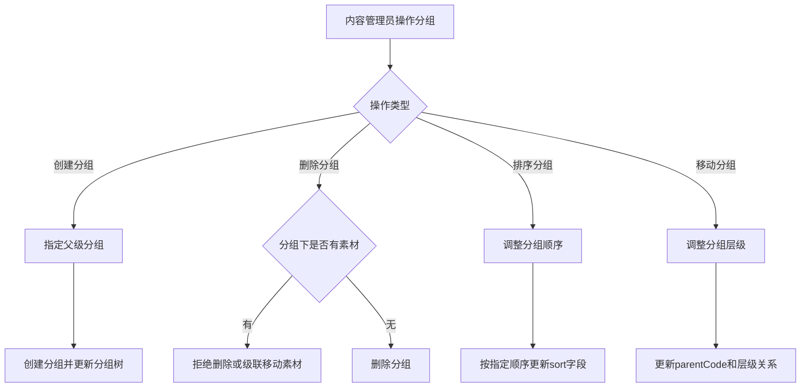

# Story: 物料分组树

## 描述
作为内容管理员，通过树形分组组织素材，按业务分类快速定位和管理素材。

## 参与者
| 角色 | 说明 |
|------|------|
| 内容管理员 | 管理素材分组 |
| 系统 | 后端服务，维护分组树结构 |

## 流程图

## 验收标准
- [ ] 创建分组：Given 分组不存在, When 创建分组(指定父级), Then 成功创建并更新分组树
- [ ] 删除分组：Given 分组下有素材, When 删除分组, Then 拒绝删除或级联移动素材
- [ ] 排序分组：Given 需要调整分组顺序, When 执行排序操作, Then 按指定顺序更新sort字段
- [ ] 移动分组：Given 需要调整分组层级, When 执行移动操作, Then 更新parentCode和层级关系

## 关联模块
- micro-material

## 关联 API
- `/micro-material/group/insert`
- `/micro-material/group/update`
- `/micro-material/group/delete`
- `/micro-material/group/tree`

## 优先级
P1

## 状态
待开发
