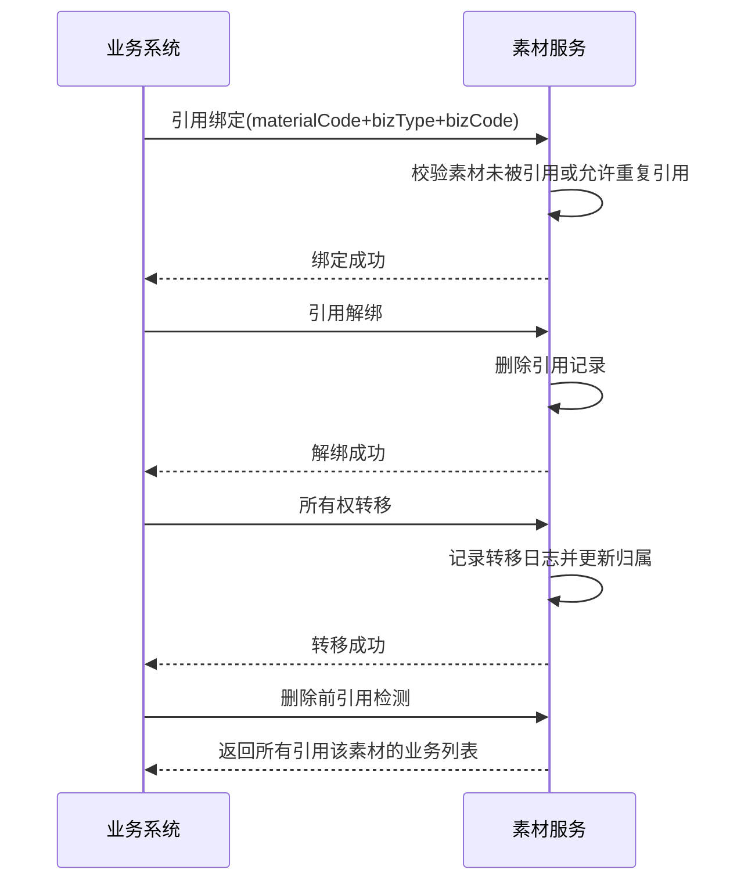

# Story: 物料引用与转移

## 描述
作为业务系统，管理素材与业务对象的引用关系并支持所有权转移，追踪素材使用情况和变更归属。

## 参与者
| 角色 | 说明 |
|------|------|
| 业务系统 | 调用引用绑定/解绑/转移API |
| 系统 | 后端服务，管理引用关系和转移日志 |

## 流程图

## 验收标准
- [ ] 引用绑定：Given 素材未被引用, When 执行引用绑定(materialCode+bizType+bizCode), Then 成功绑定
- [ ] 引用解绑：Given 素材已被某业务引用, When 执行解绑, Then 删除引用记录
- [ ] 所有权转移：Given 需要转移素材所有权, When 执行转移操作, Then 记录转移日志并更新归属
- [ ] 引用检测：Given 删除素材前, When 执行引用检测, Then 返回所有引用该素材的业务列表

## 关联模块
- micro-material

## 关联 API
- `/micro-material/ref/bind`
- `/micro-material/ref/unbind`
- `/micro-material/transfer/execute`

## 优先级
P1

## 状态
待开发
