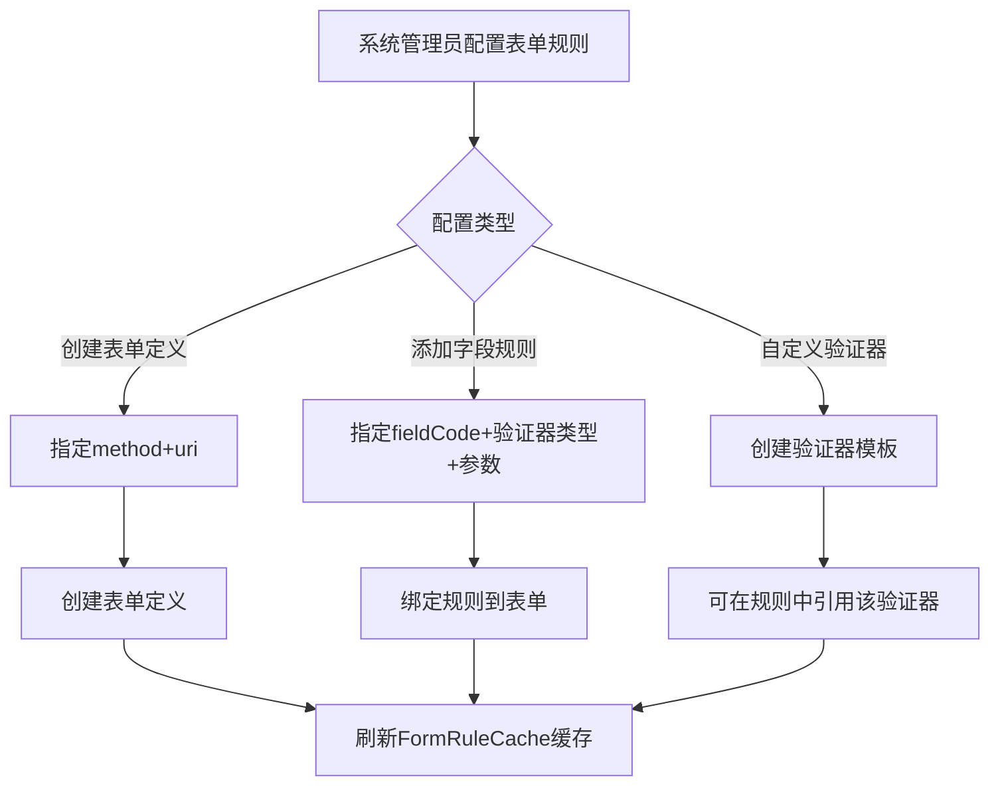

# Story: 表单规则管理

## 描述
作为系统管理员，管理表单定义、校验规则和字段验证器，灵活配置接口参数校验策略。

## 参与者
| 角色 | 说明 |
|------|------|
| 系统管理员 | 配置表单规则 |
| 系统 | 后端服务，管理表单定义和验证器 |

## 流程图

## 验收标准
- [ ] 创建表单定义：Given 表单定义不存在, When 创建表单(指定method+uri), Then 成功创建表单定义
- [ ] 添加字段规则：Given 表单已定义, When 添加字段规则(指定fieldCode+验证器类型+参数), Then 成功绑定规则
- [ ] 自定义验证器：Given 验证器模板, When 创建自定义验证器, Then 可在规则中引用该验证器
- [ ] 缓存刷新：Given 规则变更, When 更新完成, Then 自动刷新FormRuleCache缓存

## 关联模块
- micro-form

## 关联 API
- `/micro-form/form/insert`
- `/micro-form/rule/insert`
- `/micro-form/validator/insert`

## 优先级
P0

## 状态
待开发
