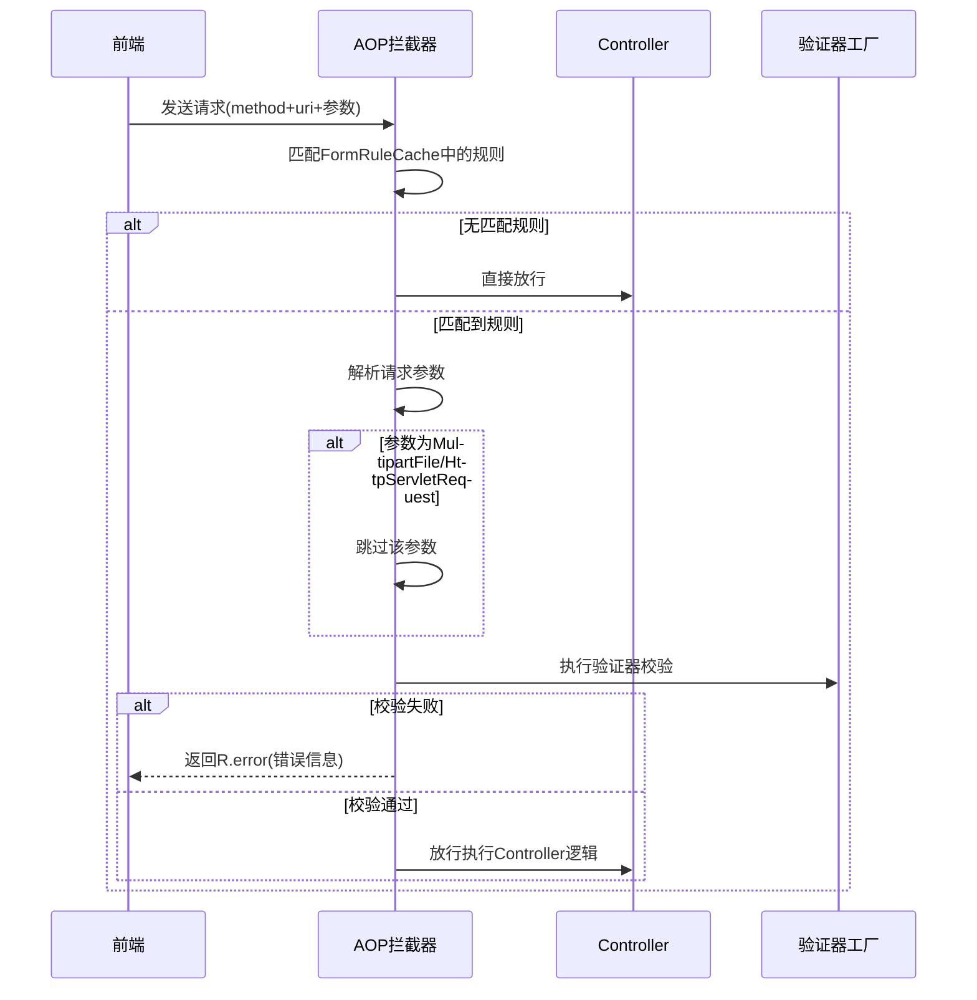

# Story: 表单AOP校验

## 描述
作为业务开发者，系统自动拦截请求并按配置的表单规则校验参数，无需硬编码即可实现接口参数校验。

## 参与者
| 角色 | 说明 |
|------|------|
| 业务开发者 | 定义接口，无需关心校验逻辑 |
| AOP拦截器 | 自动拦截请求并校验参数 |
| 系统 | 后端服务 |

## 流程图

## 验收标准
- [ ] 规则匹配拦截：Given 请求的method+uri匹配到表单规则, When 请求到达Controller, Then AOP自动拦截并校验参数
- [ ] 校验失败拦截：Given 参数不满足验证器规则, When 校验失败, Then 返回R.error(错误信息)不进入Controller
- [ ] 无规则放行：Given 请求的method+uri无匹配规则, When 请求到达, Then 直接放行执行Controller逻辑
- [ ] 特殊类型跳过：Given 请求参数为MultipartFile/HttpServletRequest, When AOP解析参数, Then 自动跳过这些类型

## 关联模块
- micro-form

## 关联 API
- (AOP自动拦截，无显式API)

## 优先级
P0

## 状态
待开发
