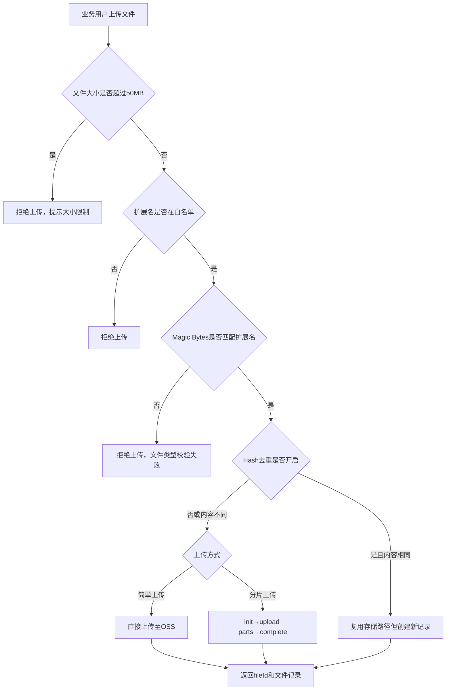

# Story: 文件上传

## 描述
作为业务用户，上传文件到OSS存储，安全持久化存储业务文件。

## 参与者
| 角色 | 说明 |
|------|------|
| 业务用户 | 上传文件的人员 |
| 系统 | 后端服务，处理文件存储和校验 |

## 流程图

## 验收标准
- [ ] 简单上传：Given 文件未超过大小限制, When 简单上传(指定category/bucket), Then 成功上传并返回fileId和记录
- [ ] 大小限制：Given 文件超过50MB, When 上传, Then 拒绝上传并提示大小限制
- [ ] 扩展名校验：Given 文件扩展名不在白名单, When 上传, Then 拒绝上传
- [ ] Magic Bytes校验：Given 文件Magic Bytes与扩展名不匹配, When 上传, Then 拒绝上传(文件类型校验失败)
- [ ] Hash去重：Given Hash去重已开启, When 上传相同内容文件, Then 复用存储路径但创建新记录
- [ ] 分片上传：Given 大文件上传, When 分片上传(init→upload parts→complete), Then 成功合并并记录

## 关联模块
- micro-fileos

## 关联 API
- `/micro-fileos/upload/simple`
- `/micro-fileos/upload/multipart/init`
- `/micro-fileos/upload/multipart/part`
- `/micro-fileos/upload/multipart/complete`

## 优先级
P0

## 状态
待开发
