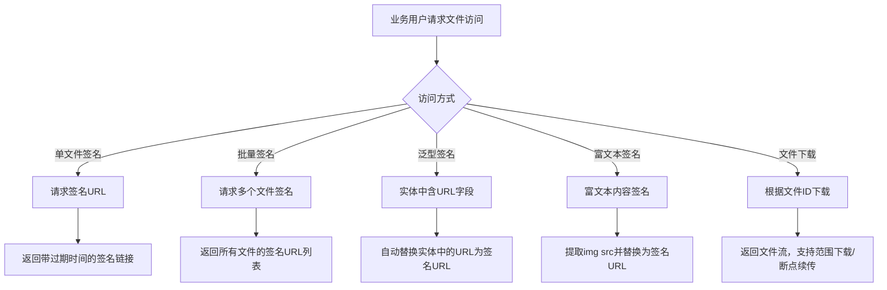

# Story: 文件签名下载

## 描述
作为业务用户，获取私有文件的签名访问链接和下载文件，安全访问受保护的文件资源。

## 参与者
| 角色 | 说明 |
|------|------|
| 业务用户 | 请求签名链接或下载文件 |
| 系统 | 后端服务，生成签名URL和提供文件流 |

## 流程图

## 验收标准
- [ ] 单文件签名：Given 私有Bucket中的文件, When 请求签名URL, Then 返回带过期时间的签名链接
- [ ] 批量签名：Given 多个文件, When 批量签名, Then 返回所有文件的签名URL列表
- [ ] 泛型签名：Given 实体中含URL字段, When 泛型签名, Then 自动替换实体中的URL为签名URL
- [ ] 富文本签名：Given 富文本内容, When 签名, Then 自动提取img src并替换为签名URL
- [ ] 文件下载：Given 文件ID, When 下载, Then 返回文件流(支持范围下载/断点续传)

## 关联模块
- micro-fileos

## 关联 API
- `/micro-fileos/sign/url`
- `/micro-fileos/sign/batch`
- `/micro-fileos/sign/generic`
- `/micro-fileos/sign/rich-text`
- `/micro-fileos/download/{fileId}`

## 优先级
P0

## 状态
待开发
