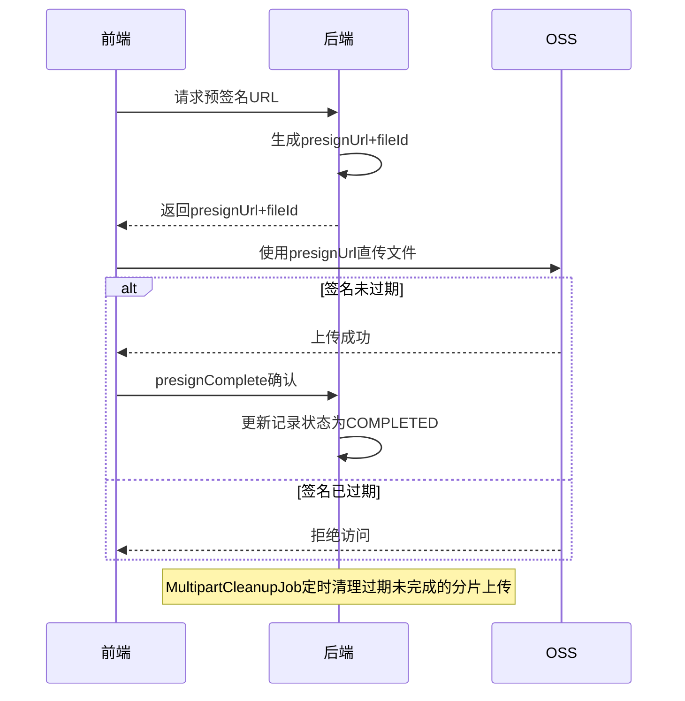

# Story: 文件预签名上传

## 描述
作为前端开发者，通过预签名URL实现前端直传OSS，减少后端流量压力提升上传速度。

## 参与者
| 角色 | 说明 |
|------|------|
| 前端开发者 | 使用预签名URL直传OSS |
| 后端服务 | 生成预签名URL |
| OSS | 对象存储服务 |

## 流程图

## 验收标准
- [ ] 预签名生成：Given 请求预签名, When 后端生成预签名URL, Then 返回presignUrl+fileId
- [ ] 直传确认：Given 前端直传完成, When 调用presignComplete确认, Then 更新记录状态为COMPLETED
- [ ] 分片直传：Given 大文件前端直传, When 预签名分片上传(init→分片上传→complete), Then 成功合并
- [ ] 签名过期：Given 预签名已过期, When 前端尝试上传, Then OSS拒绝访问
- [ ] 过期清理：Given 分片上传过期未完成, When MultipartCleanupJob定时执行, Then 清理过期记录

## 关联模块
- micro-fileos

## 关联 API
- `/micro-fileos/presign/init`
- `/micro-fileos/presign/complete`

## 优先级
P1

## 状态
待开发
