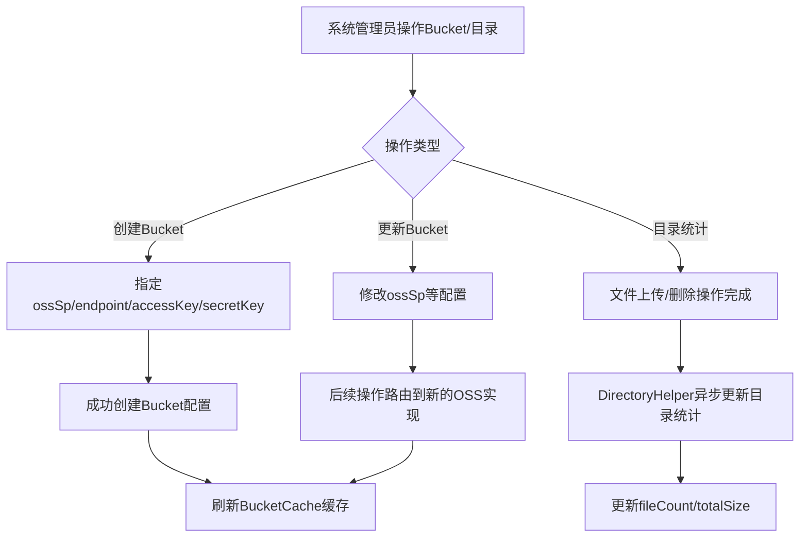

# Story: 文件桶与目录

## 描述
作为系统管理员，管理OSS Bucket配置和文件目录结构，多租户多业务隔离存储。

## 参与者
| 角色 | 说明 |
|------|------|
| 系统管理员 | 配置Bucket和目录 |
| 系统 | 后端服务，管理Bucket配置和目录统计 |

## 流程图

## 验收标准
- [ ] 创建Bucket：Given Bucket配置不存在, When 创建Bucket(指定ossSp/endpoint/accessKey/secretKey), Then 成功创建
- [ ] 更新Bucket：Given Bucket的ossSp变更, When 更新配置, Then 后续操作路由到新的OSS实现
- [ ] 目录统计：Given 文件上传/删除, When 操作完成, Then DirectoryHelper异步更新目录统计(fileCount/totalSize)
- [ ] 缓存刷新：Given Bucket配置变更, When 操作完成, Then 自动刷新BucketCache缓存

## 关联模块
- micro-fileos

## 关联 API
- `/micro-fileos/bucket/insert`
- `/micro-fileos/bucket/update`
- `/micro-fileos/directory/stats`

## 优先级
P1

## 状态
待开发
