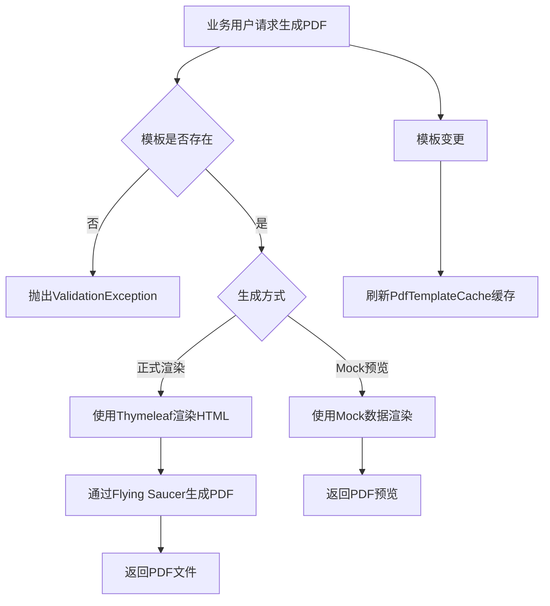

# Story: PDF模板渲染

## 描述
作为业务用户，基于模板生成PDF文档，快速产出格式统一的业务文档。

## 参与者
| 角色 | 说明 |
|------|------|
| 业务用户 | 调用PDF渲染接口 |
| 系统 | 后端服务，模板渲染和PDF生成 |

## 流程图

## 验收标准
- [ ] 模板渲染：Given PDF模板已创建(Thymeleaf模板内容), When 调用PdfApi渲染, Then 使用Thymeleaf渲染HTML后通过Flying Saucer生成PDF
- [ ] 模板不存在：Given 模板不存在, When 渲染PDF, Then 抛出ValidationException
- [ ] Mock预览：Given 需要预览, When 调用mock端点, Then 使用Mock数据渲染PDF预览
- [ ] 缓存刷新：Given 模板变更, When 更新完成, Then 自动刷新PdfTemplateCache缓存

## 关联模块
- micro-pdf

## 关联 API
- `/micro-pdf/template/render`
- `/micro-pdf/template/mock`

## 优先级
P1

## 状态
待开发
