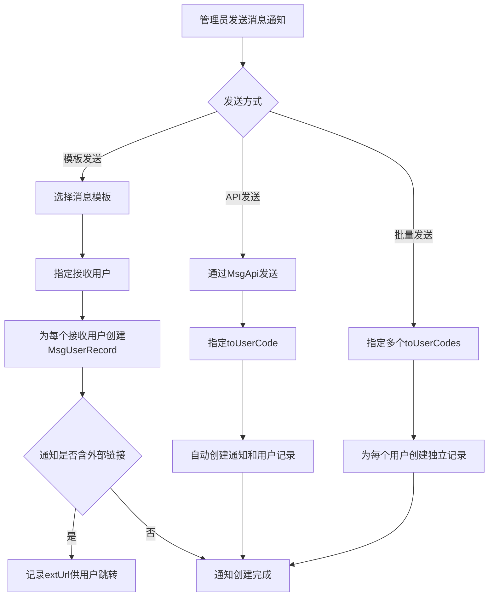

# Story: 消息通知

## 描述
作为管理员，创建消息通知并发送给指定用户，及时传达业务信息。

## 参与者
| 角色 | 说明 |
|------|------|
| 管理员 | 创建和发送通知 |
| 系统 | 后端服务，创建通知和用户记录 |

## 流程图

## 验收标准
- [ ] 模板发送：Given 消息模板已创建, When 管理员发布通知(指定接收用户), Then 为每个接收用户创建MsgUserRecord
- [ ] API发送：Given 通过MsgApi发送, When 指定toUserCode, Then 自动创建通知和用户记录
- [ ] 批量发送：Given 批量发送, When 指定多个toUserCodes, Then 为每个用户创建独立记录
- [ ] 外部链接：Given 通知含外部链接, When 发送, Then 记录extUrl供用户跳转

## 关联模块
- micro-msg

## 关联 API
- `/micro-msg/manager/notification/insert`
- `/micro-msg/manager/template/insert`

## 优先级
P0

## 状态
待开发
