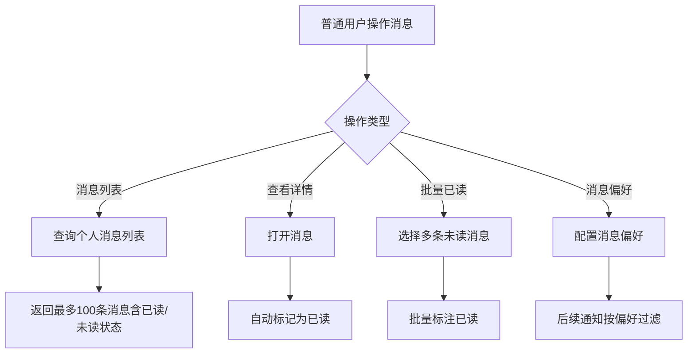

# Story: 用户消息记录

## 描述
作为普通用户，查看个人消息列表并标记已读，管理自己的消息通知。

## 参与者
| 角色 | 说明 |
|------|------|
| 普通用户 | 查看和管理个人消息 |
| 系统 | 后端服务，管理消息记录和已读状态 |

## 流程图

## 验收标准
- [ ] 消息列表：Given 用户有未读消息, When 查询个人消息列表, Then 返回最多100条消息(含已读/未读状态)
- [ ] 自动已读：Given 查看消息详情, When 打开消息, Then 自动标记为已读
- [ ] 批量已读：Given 多条未读消息, When 批量标注已读, Then 更新所有指定消息的已读状态
- [ ] 消息偏好：Given 用户配置了消息偏好, When 保存配置, Then 后续通知按偏好过滤

## 关联模块
- micro-msg

## 关联 API
- `/micro-msg/personal/record/list`
- `/micro-msg/personal/record/read`
- `/micro-msg/personal/record/batch-read`
- `/micro-msg/personal/settings/update`

## 优先级
P1

## 状态
待开发
