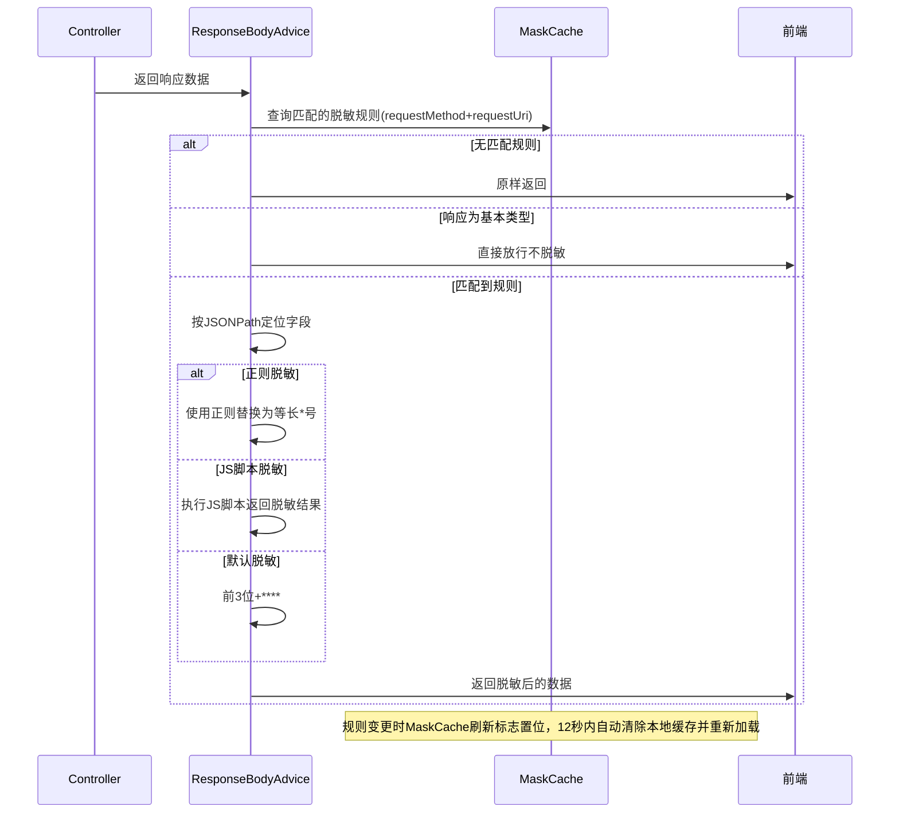

# Story: 数据脱敏自动处理

## 描述
作为系统管理员，配置脱敏规则后系统自动对响应数据脱敏，保护敏感信息不被泄露。

## 参与者
| 角色 | 说明 |
|------|------|
| 系统管理员 | 配置脱敏规则 |
| ResponseBodyAdvice | 自动拦截响应并脱敏 |
| 系统 | 后端服务 |

## 流程图

## 验收标准
- [ ] 自动脱敏：Given 配置了脱敏规则(指定requestMethod+requestUri+maskJsonPath), When 响应经过ResponseBodyAdvice, Then 自动按JSONPath脱敏
- [ ] 正则脱敏：Given 脱敏规则为正则类型, When 匹配到数据, Then 使用正则替换为等长*号
- [ ] JS脚本脱敏：Given 脱敏规则为JS脚本类型, When 匹配到数据, Then 执行JS脚本返回脱敏结果
- [ ] 默认脱敏：Given 脱敏规则无正则也无脚本, When 匹配到数据, Then 使用默认脱敏(前3位+****)
- [ ] 基本类型放行：Given 响应为基本类型(Boolean/Integer等), When 经过Advice, Then 直接放行不脱敏
- [ ] 缓存刷新：Given 规则变更, When MaskCache刷新标志置位, Then 12秒内自动清除本地缓存并重新加载

## 关联模块
- micro-mask

## 关联 API
- `/micro-mask/rule/insert`
- `/micro-mask/rule/update`
- `/micro-mask/rule/page`

## 优先级
P0

## 状态
待开发
