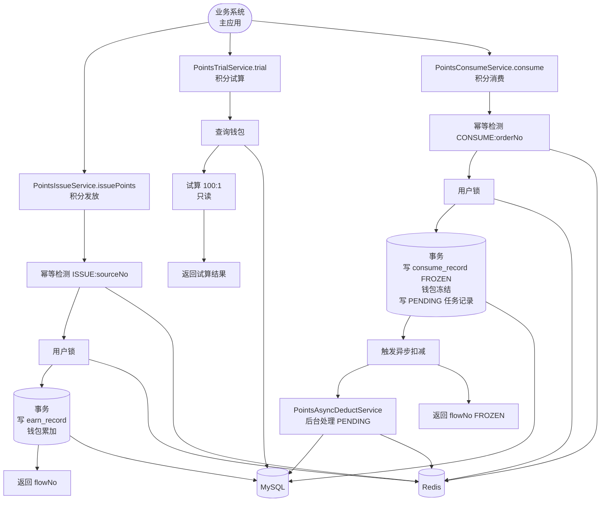
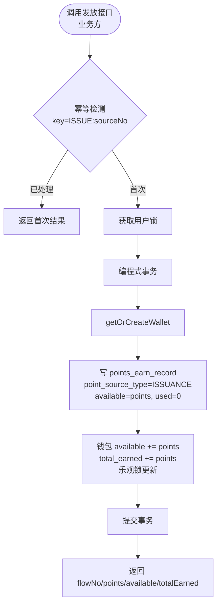
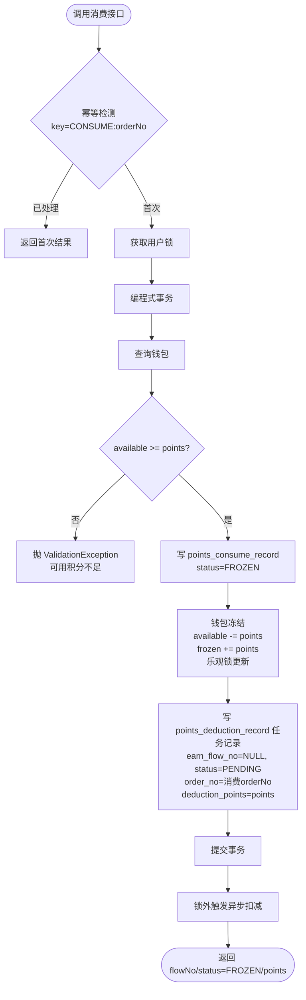
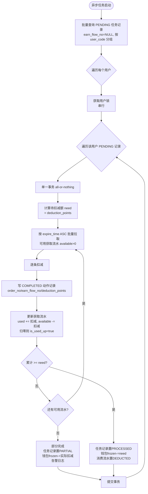
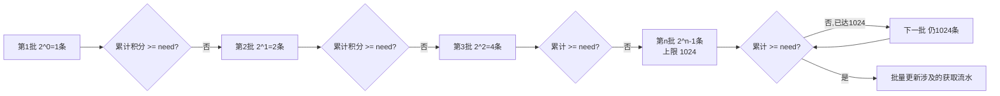

# Story: 积分发放与消费

## 描述

作为业务方，通过 micro-points 提供的对内服务接口发放积分、试算可抵扣金额、消费积分（两阶段：冻结→异步扣减）。积分与现金比例固定 100:1（100 积分 = 1 元），消费时按获取流水到期时间从近到远扣减（FIFO by expire），每个用户的积分处理串行执行（RedisLock）。

## 参与者

| 角色 | 说明 |
|------|------|
| 业务方 | 主应用业务系统，通过 4 个对内服务接口调用 micro-points |
| 系统 | micro-points 后端服务，含异步扣减任务 |
| 用户 | 钱包所有者，积分发放/消费的对象 |

## 流程图

### 整体调用链路



### 积分发放流程



### 积分试算流程

```mermaid
flowchart TD
    S([调用试算接口]) --> Q[查询钱包 available]
    Q --> CAL{available / 100<br/>对比 paymentAmount}
    CAL -->|available/100 >= 金额| F[可全额抵扣<br/>deductAmount=paymentAmount<br/>requiredPoints=paymentAmount*100]
    CAL -->|available/100 < 金额| P[部分抵扣<br/>deductAmount=floor(available/100)<br/>requiredPoints=available - available%100]
    F --> R([返回试算结果])
    P --> R
```

### 积分消费（冻结阶段）



### 异步扣减（扣减阶段）



### 批量拉取策略（指数退避）



## 验收标准

### 积分钱包
- [ ] 钱包自动初始化：Given 用户无钱包, When 首次发放/查询, Then 自动创建钱包（available=0, frozen=0, total_earned=0），与发放在同一事务内，按 (tenant_code, user_code) 唯一
- [ ] 钱包三态维护：发放/管理员发放（available += points, total_earned += points）；消费（available -= points, frozen += points）；异步扣减完成（frozen -= points）；回退（available += points, total_earned += points）；所有更新使用乐观锁

### 积分发放
- [ ] 业务方发放：Given PointsIssueReq(userCode/points/reason/sourceNo), When 调用 PointsIssueService.issuePoints, Then 写 points_earn_record（point_source_type=ISSUANCE, available=points, used=0, is_used_up=0），钱包累加 available + total_earned，expire_time 取入参或 DB 默认 2099-12-31 23:59:59，返回 flowNo/points/availablePoints/totalEarnedPoints
- [ ] 发放幂等：Given 同一 sourceNo, When 重复调用发放, Then 仅生效一次，命中已处理直接返回首次结果（幂等键 `ISSUANCE:sourceNo`，基于 Redis TTL 24h）

### 积分试算
- [ ] 全额抵扣：Given available/100 >= paymentAmount, When 调用 PointsTrialService.trial, Then deductAmount=paymentAmount, requiredPoints=paymentAmount*100
- [ ] 部分抵扣：Given available/100 < paymentAmount, When 调用 trial, Then deductAmount=floor(available/100), requiredPoints=available-available%100
- [ ] 试算只读：试算不修改任何数据，不获取用户锁，不开启事务

### 积分消费（冻结阶段）
- [ ] 消费冻结：Given PointsConsumeReq(userCode/points/reason/orderNo), When 调用 PointsConsumeService.consume, Then 校验 available >= points，写 points_consume_record（status=FROZEN, order_no 唯一），钱包冻结（available -= points, frozen += points），写 points_deduction_record 任务记录（earn_flow_no=NULL, status=PENDING, deduction_points=points），触发异步扣减，返回 flowNo/status=FROZEN/points
- [ ] 余额不足：Given available < points, When 调用 consume, Then 抛 ValidationException.of("可用积分不足")，事务回滚不写任何数据
- [ ] 消费幂等：Given 同一 orderNo, When 重复调用消费, Then 仅生效一次（幂等键 `CONSUME:orderNo`），order_no 在 points_consume_record 上有唯一索引

### 异步扣减（扣减阶段）
- [ ] 异步扣减完成：Given 一条 PENDING 任务记录, When triggerAsyncDeduct 触发, Then 按 expire_time ASC 批量拉取可用获取流水，逐条扣减（写 COMPLETED 动作记录 + 更新 earn used/available/is_used_up），累计满足 need 后任务记录置 PROCESSED，钱包 frozen -= need，消费流水置 DEDUCTED，整个处理为单一事务（all-or-nothing）
- [ ] 批量拉取策略：Given 大量获取流水, When 异步扣减, Then 批次大小按 2^(n-1) 增长（1→2→4→8→…→1024），达 1024 后保持 1024，每批按 expire_time ASC 排序，拉取够后批量更新涉及的获取流水
- [ ] 用户级串行：Given 同一用户多条 PENDING, When 异步扣减, Then 通过 RedisLock 串行处理（key=points:lock:{userCode}），不同用户可并行
- [ ] PARTIAL 处理：Given 获取流水积分不足（正常不应发生）, When 异步扣减, Then 扣减所有可用获取流水，任务记录置 PARTIAL，钱包 frozen -= 实际扣减额，告警日志
- [ ] 异步失败重试：Given 单条 PENDING 处理失败（事务回滚）, When 下次 processAllPending 扫描, Then 仍为 PENDING 可重试，不影响其他 PENDING

## 关联模块
- micro-points

## 关联 API / 服务接口
- `PointsIssueService.issuePoints(PointsIssueReq)` — 积分发放
- `PointsTrialService.trial(PointsTrialReq)` — 积分试算（只读）
- `PointsConsumeService.consume(PointsConsumeReq)` — 积分消费（冻结阶段）
- `PointsAsyncDeductService.triggerAsyncDeduct(deductionFlowNo)` — 异步扣减触发
- `PointsAsyncDeductService.processAllPending()` — 批量兜底重试
- `PointsWalletService.getOrCreateWallet()` — 钱包按需创建

## 优先级
P0

## 状态
已开发

## 关联 PRD 章节
- spec.md §5.1 积分发放
- spec.md §5.2 积分试算
- spec.md §5.3 积分消费（两阶段之第一阶段）
- spec.md §5.4 异步扣减处理（两阶段之第二阶段）
- spec.md §13.2 EP1 积分钱包
- spec.md §13.3 EP2 积分发放
- spec.md §13.4 EP3 积分试算
- spec.md §13.5 EP4 积分消费
